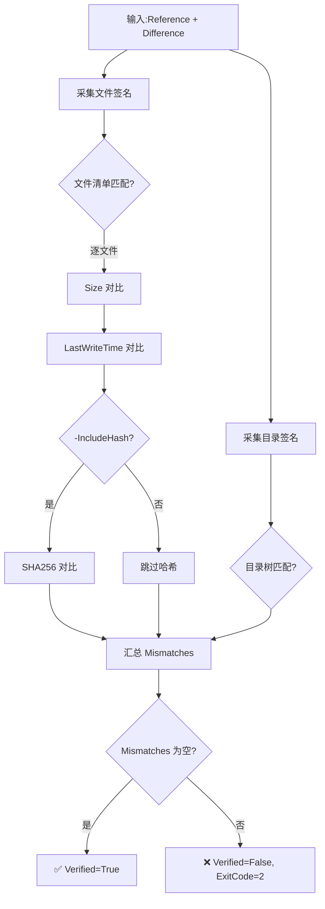

# 文件夹验证脚本模板 (File Verification Template)

> **来源**:P2 改进建议落地,从 `archive-folder` 技能验证逻辑中提取为独立可复用模板。
> **配套脚本**:[`scripts/Compare-Folder.ps1`](../../scripts/Compare-Folder.ps1)

## 1. 模板用途

本模板提供**独立的文件夹对比能力**,不涉及复制/删除,专注于"两个已有目录的一致性验证"。

### 适用场景

| 场景 | 说明 |
|---|---|
| 同步校验 | 验证 `rsync`/`robocopy` 同步结果是否完整 |
| 备份对比 | 对比备份与源是否一致 |
| 迁移验证 | 验证迁移前后内容是否完整 |
| 归档复核 | 对已归档资产做定期一致性检查 |
| 一般性文件对比 | 任意两个目录树的差异分析 |

### 与 `archive-folder` 技能的关系

| 维度 | `archive-folder` 技能 | `Compare-Folder` 模板 |
|---|---|---|
| 范围 | 完整归档流程(复制+验证+删除) | 仅验证,不修改 |
| 输入 | 源 + 目标父目录 | 两个已存在的目录 |
| 输出 | 归档结果 + 验证结果 | 验证结果 + 差异清单 |
| 复用 | 一次性归档 | 可反复执行,适合定期巡检 |

## 2. 快速开始

`{baseDir}` 指 `.agents/` 目录。

### 基础对比(Size + LastWriteTime)

```powershell
pwsh -ExecutionPolicy Bypass -File "{baseDir}/scripts/Compare-Folder.ps1" -Reference "D:\src" -Difference "D:\backup\src"
```

### 严格对比(含 SHA256 哈希校验)

```powershell
pwsh -ExecutionPolicy Bypass -File "{baseDir}/scripts/Compare-Folder.ps1" -Reference "D:\src" -Difference "D:\backup\src" -IncludeHash
```

### 在 PowerShell 脚本中调用

```powershell
$result = & "{baseDir}/scripts/Compare-Folder.ps1" -Reference $ref -Difference $diff -IncludeHash
if ($result.Verified) {
    Write-Host "一致:文件=$($result.FileCount) 目录=$($result.DirCount)"
} else {
    $result.Mismatches | Format-Table -AutoSize
}
```

## 3. 参数定义

### 输入参数

| 参数 | 类型 | 必填 | 默认值 | 说明 |
|---|---|---|---|---|
| `-Reference` | string | ✅ 是 | — | 参考目录绝对路径,作为对比基准 |
| `-Difference` | string | ✅ 是 | — | 对比目录绝对路径,被验证的目录 |
| `-IncludeHash` | switch | ❌ 否 | `$false` | 启用 SHA256 哈希校验(更严格但更慢) |

### 输出结构

脚本返回 `PSCustomObject`:

```powershell
[PSCustomObject]@{
    Reference  = "D:\src"              # 参考目录
    Difference = "D:\backup\src"        # 对比目录
    FileCount  = 14                     # Reference 中文件数
    DirCount   = 4                      # Reference 中目录数
    Verified   = $true                  # 验证是否通过
    Mismatches = @()                    # 不一致清单(空数组表示全部一致)
    Duration   = [timespan]"00:00:01.2" # 总耗时
    ExitCode   = 0                      # 0=成功, 1=错误, 2=验证失败
}
```

**Mismatches 数组元素结构**:

```powershell
[PSCustomObject]@{
    Path   = "\_shared\js\echarts.min.js"  # 相对路径
    Issue  = "SizeMismatch"                  # Missing|Extra|SizeMismatch|TimeMismatch|HashMismatch|DirMissing|DirExtra
    Detail = "Reference=1030900 Difference=1030899"
}
```

## 4. 对比维度



### Issue 类型说明

| Issue | 含义 | 严重性 |
|---|---|---|
| `Missing` | Reference 有但 Difference 无 | 🔴 高(内容丢失) |
| `Extra` | Difference 有但 Reference 无 | 🟡 中(多余内容) |
| `SizeMismatch` | 文件大小不一致 | 🔴 高(内容被改) |
| `TimeMismatch` | 修改时间不一致 | 🟡 中(属性被改) |
| `HashMismatch` | SHA256 不一致 | 🔴 高(二进制不同) |
| `DirMissing` | 目录缺失 | 🔴 高(结构破坏) |
| `DirExtra` | 目录多余 | 🟡 中(结构差异) |

## 5. 退出码

| ExitCode | 含义 | 处理建议 |
|---|---|---|
| 0 | 验证通过 | 两个目录一致 |
| 1 | 一般错误 | 参数错误、目录不存在等,查看日志 |
| 2 | 验证失败 | 发现不一致项,查看 Mismatches 清单 |

## 6. 最佳实践

### ✅ 推荐用法

1. **定期巡检**:对归档资产做周期性验证(如每月一次),及时发现位腐烂
2. **关键资产加 `-IncludeHash`**:文档资产用 Size+MTime 足够,二进制/可执行文件建议加哈希
3. **结果对象化消费**:用 `$result.Verified` 做布尔判定,而非解析日志文本
4. **批量巡检**:外层包 `foreach` 遍历多个目录对,聚合 `$result.Verified` 统计通过率

### ⚠️ 注意事项

- **Reference 是基准**:对比方向是 `Reference → Difference`,Missing/Extra 的语义基于此方向
- **路径大小写**:Windows 不区分大小写,但 Linux 区分;跨平台场景需注意
- **符号链接**:默认不跟随,如需对比链接目标需修改脚本
- **大目录性能**:`-IncludeHash` 会读取所有文件内容,大目录(>10GB)建议分批或离峰执行
- **文件占用**:被占用文件可能读取失败,确保对比前关闭相关进程

### FAQ

**Q1: 为什么用 LastWriteTime 而非 CreationTime?**
A: `LastWriteTime` 反映内容最后修改时间,是内容一致性的可靠指标。`CreationTime` 在复制时可能被重置。

**Q2: TimeMismatch 但 Size 一致,算通过吗?**
A: 默认不算通过。时间戳不一致可能意味着内容被重新写入(即使大小巧合相同)。如需容忍时间差异,可修改脚本移除 TimeMismatch 检查。

**Q3: 可以对比网络路径吗?**
A: 可以,但需确保网络稳定。网络抖动可能导致文件读取失败,建议先 `robocopy` 到本地再对比。

**Q4: 如何只对比特定文件类型?**
A: 修改 `Get-FolderSignature` 中的 `Get-ChildItem -Filter "*.md"` 或用 `-Include` 参数。

## 7. 与其他工具的关系

| 工具 | 关系 |
|---|---|
| [`archive-folder` 技能](../../skills/archive-folder/SKILL.md) | 归档三段式的验证阶段使用相同逻辑;本模板是其验证部分的独立化 |
| `robocopy /L` | robocopy 的 `/L` 参数(仅列出差异)可做类似事,但输出不可结构化消费 |
| `Get-FileHash` | PowerShell 内置 cmdlet,本模板在 `-IncludeHash` 时调用 |
| `certutil -hashfile` | Windows 内置工具,可计算哈希,但不支持目录级对比 |

## 8. 演进方向

- [ ] 支持 `-Filter` 参数按文件类型筛选
- [ ] 支持 `-IgnoreTime` 容忍时间戳差异
- [ ] 支持 `-ReportPath` 输出 HTML/CSV 报告
- [ ] 支持递归深度限制 `-Depth`
- [ ] 支持并行哈希计算加速大目录

## 9. 版本记录

| 版本 | 日期 | 变更 |
|---|---|---|
| 1.0.0 | 2026-06-22 | 初始版本:从 archive-folder 技能提取独立验证模板 |

## 10. 参考

- 源任务复盘:[task-summary-archive-migration-20260622.md](../../../docs/tech/task-summary-archive-migration-20260622.md)
- 归档技能:[`archive-folder/SKILL.md`](../../skills/archive-folder/SKILL.md)
- 技能规范:[`rules/skills.md`](../../rules/skills.md)
- PowerShell `Get-FileHash`:[Microsoft Learn](https://learn.microsoft.com/powershell/module/microsoft.powershell.utility/get-filehash)
