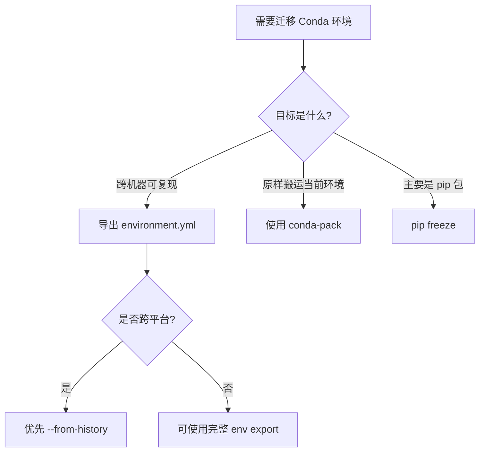

# Conda 环境迁移决策指南

## 适用范围

将 Conda 环境迁移到另一台电脑、另一个系统用户或新的开发机器时使用。

核心判断：先区分要迁移的是“依赖意图”还是“已求解结果”。

---

## 1. 决策树



---

## 2. 推荐方案：迁移依赖意图

源机器：

```bash
conda activate your_env
conda env export --from-history > environment.yml
```

目标机器：

```bash
conda env create -f environment.yml
conda activate your_env
```

优点：

- 更适合跨机器、跨平台。
- 避免把平台相关构建号和底层依赖全部写死。
- 更接近用户实际声明过的依赖。

局限：

- 目标机器需要联网重新解析依赖。
- 如果源环境包含大量隐式依赖，可能需要补充手动依赖。

---

## 3. 完整导出：迁移解析结果

源机器：

```bash
conda activate your_env
conda env export > environment.yml
```

目标机器：

```bash
conda env create -f environment.yml
```

适用场景：

- 同操作系统、同架构、同渠道配置。
- 需要尽量复现完整依赖树。

风险：

- 跨 Windows/Linux/macOS 时容易因平台包、构建号、底层库冲突失败。

---

## 4. 原样搬运：conda-pack

源机器：

```bash
conda install conda-pack -n base
conda pack -n your_env -o your_env.tar.gz
```

目标机器：

```bash
mkdir -p ~/miniconda3/envs/your_env
tar -xzf your_env.tar.gz -C ~/miniconda3/envs/your_env
conda activate your_env
```

适用场景：

- 同系统或高度相似系统之间迁移。
- 目标机器网络受限。
- 希望尽量保持当前环境结果不变。

---

## 5. pip 包迁移

源机器：

```bash
conda activate your_env
pip freeze > requirements.txt
```

目标机器：

```bash
conda create -n your_env python=3.x
conda activate your_env
pip install -r requirements.txt
```

适用场景：

- Conda 只用于 Python 版本管理。
- 主要依赖都来自 PyPI。

---

## 6. 排障原则

| 现象 | 可能原因 | 建议 |
|---|---|---|
| `conda` 命令不可用 | PATH 未配置或 shell 未初始化 | 先定位 Conda 安装入口，不要直接改用 venv |
| `env create` 解析失败 | 平台/渠道/构建号不兼容 | 改用 `--from-history` 重新导出 |
| 目标机器无网络 | 无法重新解析依赖 | 改用 `conda-pack` |
| pip 包安装失败 | 系统库或 Python 版本不一致 | 固定 Python 版本并检查原生依赖 |

---

## 7. 二阶洞察

Conda 环境迁移不是简单复制目录，而是在三种对象之间选择：

| 迁移对象 | 工具 | 本质 |
|---|---|---|
| 依赖意图 | `conda env export --from-history` | 让目标机器重新求解 |
| 求解结果 | `conda env export` | 尽量复现完整依赖图 |
| 运行产物 | `conda-pack` | 搬运已经构建好的环境 |

迁移前先问一句：

> 我想让目标机器重新理解这个环境，还是尽量不要让它重新理解？
