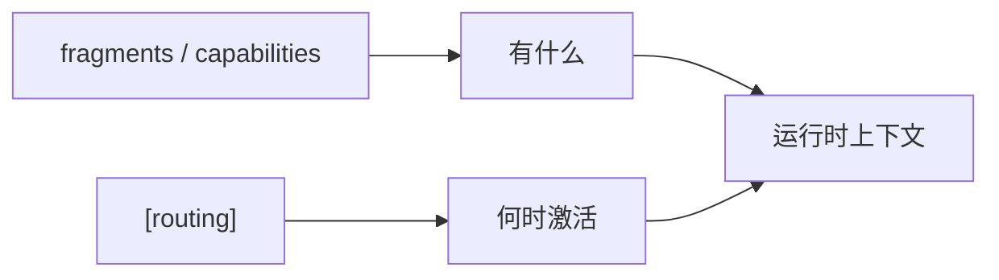

# Routing Protocol

> **状态**：Draft v0.1
> **所属层级**：`world.toml` 顶层表 `[routing]`
> **协议性质**：声明式上下文路由规则——回答"哪些资产在什么条件下被注入哪些 Agent 的上下文"

本页是 AgentForge 路由协议的稳定参考入口，作为 [`agent-collaboration-metamodel.md`](agent-collaboration-metamodel.md) 在 Knowledge 域的运行时延伸补充。

## 1. 概述

### 1.1 设计目标

面向多 Agent 运行时的**结构化上下文自动分发**：

- 将"何时把哪份知识送给哪个角色"从隐式约定升格为机器可解析的声明
- 解耦"能力声明"（fragments / capabilities）与"激活时机"（routing）
- 为后续运行时分发引擎、Session 状态机感知路由提供稳定 Schema

### 1.2 当前状态

| 项 | 值 |
|---|---|
| 协议版本 | Draft v0.1 |
| Schema 位置 | `world.toml` 顶层表 `[routing]` |
| 实现范围 | 仅声明，不含运行时分发引擎 |
| 校验机制 | 暂未引入 JSON Schema |

### 1.3 协议定位



`routing` 是 Knowledge 域的**激活策略层**，不创造新能力，也不替换 Role 或 Workflow 的语义边界。

## 2. Schema 定义

### 2.1 顶层字段

| 字段 | 类型 | 必填 | 语义 |
|---|---|---|---|
| `routing.version` | `string` (SemVer) | 是 | 路由 Schema 自身版本，独立于 `world.version` |
| `routing.conflict_resolution` | `string` | 是 | 多规则命中时的合并策略，枚举值见 §6 |
| `routing.phases.supported` | `array[string]` | 是 | 预定义 Session 阶段枚举，规则中的 `phases` 必须为此集合子集 |
| `routing.rules` | `array[Rule]` | 是 | 路由规则数组，至少一条 |

### 2.2 Rule 对象

| 字段 | 类型 | 必填 | 语义 |
|---|---|---|---|
| `id` | `string` | 是 | 规则唯一标识，全局不可重复，建议短横线命名 |
| `targets` | `array[string]` | 是 | 命中后注入的资产路径列表，相对 `.agents/` 解析 |
| `priority` | `integer` | 是 | 优先级整数，数值越大越优先（建议 1–10） |
| `roles` | `array[string]` | 是 | 适用角色 ID 列表，`"*"` 表示通配所有角色 |
| `triggers` | `Triggers` | 是 | 触发条件子表，详见 §3 |

### 2.3 Triggers 对象

| 字段 | 类型 | 必填 | 语义 |
|---|---|---|---|
| `intents` | `array[string]` | 否 | 任务意图关键词列表 |
| `file_patterns` | `array[string]` | 否 | 文件路径 glob 模式列表 |
| `phases` | `array[string]` | 否 | Session 阶段子集，必须从 `routing.phases.supported` 取值 |

> 三个维度均为可选，但单条规则的 `triggers` 至少应包含其中一个维度，否则视为永久命中（不推荐）。

## 3. 触发逻辑

### 3.1 三维触发模型

路由触发由 **intents / file_patterns / phases** 三个独立维度组成：

- **维度内**：同维度多个值之间为 **OR** 关系
- **维度间**：三个维度之间为 **OR** 关系（任一维度命中即触发）
- **triggers 与 roles**：两者之间为 **AND** 关系（必须同时满足）

### 3.2 匹配伪代码

```text
rule_matches = (
    any(intent in task.intents for intent in rule.triggers.intents)
    OR any(fnmatch(file, pat) for file in task.files for pat in rule.triggers.file_patterns)
    OR (session.phase in rule.triggers.phases)
)
AND (
    "*" in rule.roles OR agent.role in rule.roles
)
```

### 3.3 维度语义边界

| 维度 | 输入来源 | 语义 |
|---|---|---|
| `intents` | 任务描述的语义标签（人工或 NLP 抽取） | 表达"做什么类型的事" |
| `file_patterns` | 任务涉及的文件路径集合 | 表达"动哪类资产" |
| `phases` | Session 当前阶段（见 §5） | 表达"处于什么生命周期节点" |

## 4. 与现有结构的关系

### 4.1 与 kernel / fragments / capabilities 的关系

| 层 | 回答 | 例子 |
|---|---|---|
| `[kernel]` | 世界最小核 | `rules/context-economy.md` 永远生效 |
| `[fragments]` | 可装卸的领域能力 | `python-engineering` 含 `rules/python.md` |
| `[capabilities]` | 独立技能资产 | `skills/`、`templates/` |
| `[routing]` | **何时激活以上资产** | `python` 意图时注入 `rules/python.md` |

> **核心边界**：fragments 声明"有什么"，routing 声明"何时激活"。

### 4.2 与 AGENTS.md 路由表的关系

- `world.toml [routing]` —— **机器真相源**（machine source of truth），运行时唯一可信解析对象
- `AGENTS.md` 中的路由表 —— **人类友好视图**，供阅读、评审、跨项目对齐

两者必须保持一致；后续 Phase 可自动从 `[routing]` 生成 `AGENTS.md` 片段。

### 4.3 与 Role Default Bindings 的互补

| 类型 | 时机 | 例 |
|---|---|---|
| **Role Default Bindings** | always-on，角色加载即注入 | `python-dev` 默认绑定 `rules/python.md` |
| **Routing Rules** | conditional，按 triggers 评估 | `python` 意图 + `coding` 阶段才注入 |

两者互补：Default Bindings 提供角色身份基线，routing 提供任务上下文增量。

## 5. 与 World Session 的对齐

### 5.1 phases 枚举对齐

`routing.phases.supported` 与 Session 状态机的阶段枚举必须**字符串完全一致**：

| Phase | 典型动作 |
|---|---|
| `planning` | 任务拆解、目标对齐 |
| `coding` | 实施代码或文档编写 |
| `testing` | 单测、回归、文档校验 |
| `review` | 角色评审、PR 评审 |
| `deploying` | 发布、部署、归档 |

### 5.2 Session 状态推进时的重评估

运行时约定：

- Session 阶段每次推进，**重新评估**所有 routing 规则
- 上一阶段命中的 targets 不自动继承，避免上下文累积膨胀
- 跨阶段持续生效的资产应通过 Role Default Bindings 或多 phase 触发声明

## 6. 冲突解决策略

`routing.conflict_resolution` 枚举：

| 策略 | 行为 | 适用场景 |
|---|---|---|
| `merge` | 合并所有匹配规则的 `targets`，去重保留 | 资产之间互补无冲突，默认推荐 |
| `priority-first` | 仅取 `priority` 最高规则的 `targets`，并列时取 `id` 字典序最小 | 资产之间存在覆盖或替代关系 |
| `ask` | 暂停分发，交由 Agent 自主决策选择 | 复杂场景或人工治理过渡期 |

> v0.1 默认策略为 `merge`，与当前 `world.toml` 声明一致。

## 7. Phase 1 边界

本协议 Draft v0.1 **明确不实现**的能力：

- ❌ **不实现运行时路由分发引擎**：仅完成 Schema 声明，不动 Agent 加载链路
- ❌ **不修改 Role 文件格式**：Role 仍为 Markdown，bindings 暂不结构化
- ❌ **不实现 AGENTS.md 自动生成**：人类视图仍由人工维护
- ❌ **不引入 JSON Schema 校验**：暂以人工评审与 lint 脚本约束

Phase 1 的全部价值在于：**让"何时激活什么"成为可被读取与评审的声明**。

## 8. 演进路线

| 阶段 | 主要交付 |
|---|---|
| **Phase 1**（当前） | `[routing]` Schema 声明 + 参考文档 |
| **Phase 2** | Role schema TOML 化 + JSON Schema 校验工具 |
| **Phase 3** | 运行时路由分发引擎，对接 Agent 上下文加载 |
| **Phase 4** | Session state-aware 动态路由，支持阶段切换重评估与历史回放 |

演进约束：

- 每个 Phase 必须保持向后兼容，`routing.version` 跟随 SemVer 演进
- 重大语义变更（如新增维度、改变触发布尔关系）必须通过 minor 版本提示

## 9. 相关文件

- [`agent-collaboration-metamodel.md`](agent-collaboration-metamodel.md) —— 协作元模型
- [`agent-memory-dream-protocol.md`](agent-memory-dream-protocol.md) —— 认知循环协议
- [`../../world.toml`](../../world.toml) —— 当前 `[routing]` 实例
- [`../../AGENTS.md`](../../AGENTS.md) —— 人类友好路由视图入口

## 10. 状态与版本

- 协议版本：Draft v0.1
- 最近更新：随本文件首次落地
- 反馈渠道：`.agents/docs/superpowers/specs/` 下登记后续设计
