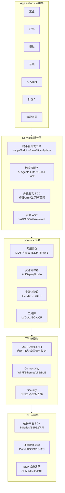
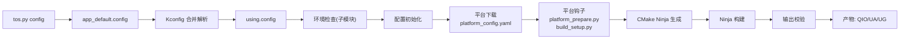
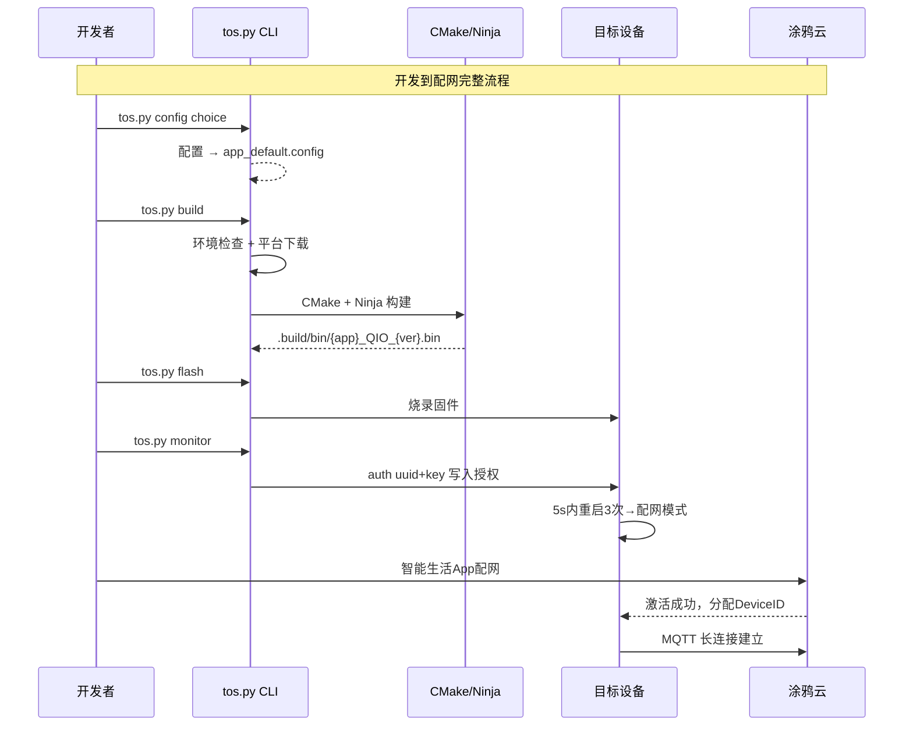
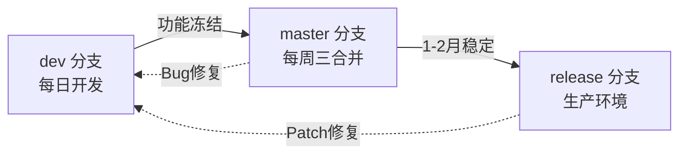
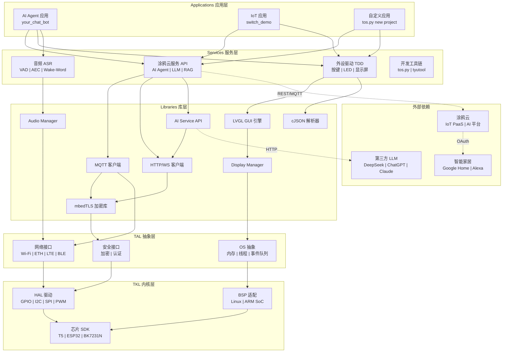
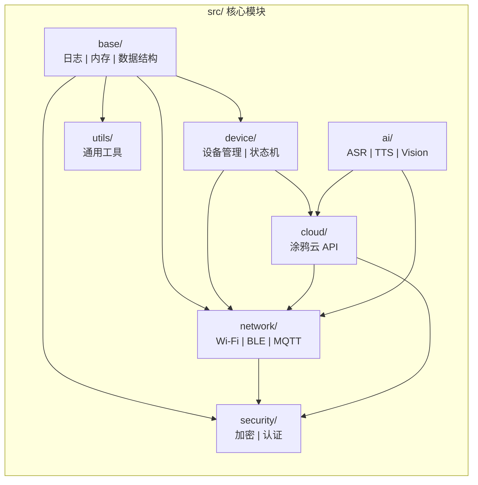
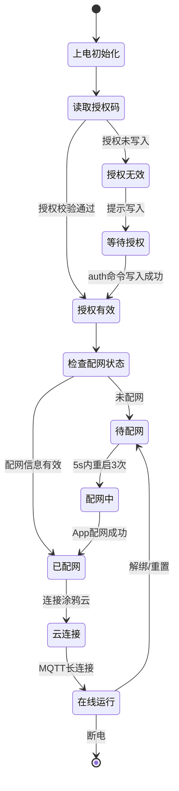
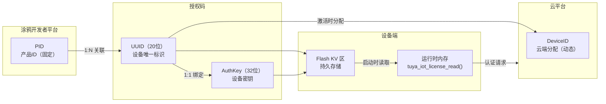
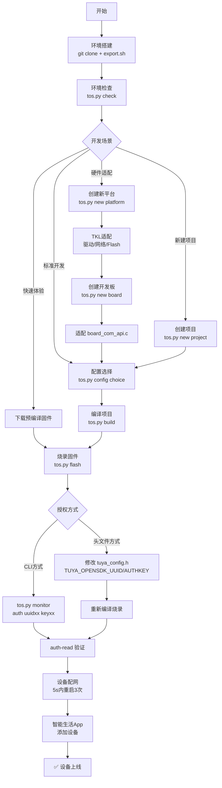
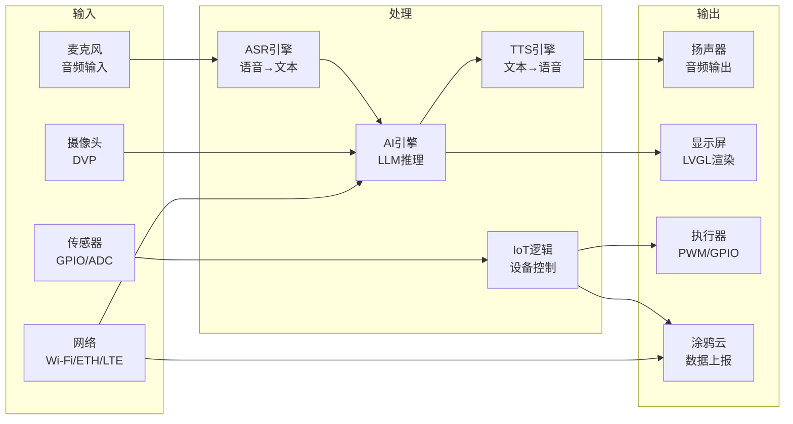

# TuyaOpen SDK 学习笔记

> **来源**：https://tuyaopen.ai/zh/docs/about-tuyaopen 及其全量子页面
> **归档日期**：2026-06-22

## 一、API 表面积概览

### 1.1 CLI 工具命令 (tos.py)

| 命令/子命令 | 签名 | 用途 | 稳定性 |
|-------------|------|------|--------|
| `tos.py version` | 无参数 → stdout 输出版本号（tag-commit 格式） | 显示当前 SDK 版本号 | public |
| `tos.py check` | 无参数 → 检查结果 + 自动下载 submodules | 校验依赖工具版本（git/cmake/make/ninja/Python）并拉取子模块 | public |
| `tos.py config choice` | 无参数 → 交互列表选择，写入 app_default.config | 列出可用开发板配置供选择 | public |
| `tos.py config menu` | 无参数 → 打开 GUI | 启动 Kconfig 可视化配置界面 | public |
| `tos.py config save` | 无参数 → 写入配置文件 | 保存当前 Kconfig 配置为固化配置 | public |
| `tos.py build` | 无参数 → 产物输出到 .build/bin/ | 完整编译项目（环境检查→平台下载→CMake/Ninja 构建） | public |
| `tos.py build -v` | `-v` → 详细编译日志 | 编译项目并显示详细构建日志 | public |
| `tos.py clean` | 无参数 → 清理编译缓存 | 清除编译中间产物 | public |
| `tos.py clean -f` | `-f` → 强制删除 .build 目录 | 强制清理所有编译产出（包括 .build 目录） | public |
| `tos.py flash` | `[-p PORT] [-b BAUD]` → 调用 tyutool_cli 烧录 | 烧录固件到目标设备 | public |
| `tos.py monitor` | `[-p PORT] [-b BAUD]` → 串口日志输出 | 显示设备串口日志，支持 auth 命令写入授权 | public |
| `tos.py update` | 无参数 → 更新子模块 | 更新所有依赖子模块到最新 | public |
| `tos.py new project` | `[--framework base\|arduino]` → 生成项目骨架 | 创建新项目（支持 base 和 arduino 框架） | public |
| `tos.py new platform` | 无参数 → 生成移植模板 | 创建新硬件平台移植模板 | public |
| `tos.py new board` | 无参数 → 生成 BSP 模板 | 创建新开发板 BSP（Board Support Package） | public |
| `tos.py dev bac` | `[-d DIST] [-o LOG_DIR]` → 批量编译结果 | 批量编译所有可用配置项 | public |
| `tos.py idf` | 透传参数给 idf.py | ESP32 平台透传 idf.py 命令 | public |

### 1.2 设备管理 API

| API | 签名 | 用途 | 稳定性 |
|-----|------|------|--------|
| `auth` | CLI: `auth uuid<20位> key<32位>` → 写入授权信息 | 通过串口 CLI 写入设备授权码（UUID + AuthKey） | public |
| `auth-read` | CLI: `auth-read` → 输出当前授权码 | 通过串口 CLI 读取已写入的授权码 | public |
| `tuya_iot_license_read()` | `void → int`（推测返回读取状态） | SDK 启动时从安全存储读取授权信息 | public |
| `TUYA_OPENSDK_UUID` | 宏，定义于 tuya_config.h，值为 20 位字符串 | 设备唯一标识符（UUID）编译期配置 | public |
| `TUYA_OPENSDK_AUTHKEY` | 宏，定义于 tuya_config.h，值为 32 位字符串 | 设备授权密钥编译期配置 | public |
| `TUYA_PRODUCT_ID` (PID) | 宏，定义于 tuya_config.h / tuya_app_config.h | 涂鸦云产品 ID，用于云端识别产品类型 | public |
| `TUYA_EVENT_BIND_START` | 事件常量 → 触发配网状态指示 | 设备开始配网绑定流程的事件通知 | public |
| 二维码配网 URL | 格式: `https://smartapp.tuya.com/s/p?p=<PID>&uuid=<UUID>&v=2.0` | 生成配网二维码 URL，供 App 扫码配网 | public |

### 1.3 硬件抽象层 (TKL) 接口

| 驱动模块 | 文件/函数 | 用途 | 稳定性 |
|----------|-----------|------|--------|
| Wi-Fi 初始化 | `tkl_init_wifi.c` / `tkl_init_wifi.h` | Wi-Fi 模块硬件初始化与驱动适配 | public |
| GPIO | GPIO 驱动接口（TKL 通用） | 通用 GPIO 输入/输出/中断控制 | public |
| UART | UART 驱动接口（TKL 通用） | 串口通信驱动 | public |
| SPI | SPI 驱动接口（TKL 通用） | SPI 总线外设通信驱动 | public |
| I2C | I2C 驱动接口（TKL 通用） | I2C 总线外设通信驱动 | public |
| PWM | PWM 驱动接口（TKL 通用） | 脉冲宽度调制输出控制 | public |
| ADC | ADC 驱动接口（TKL 通用） | 模拟-数字转换采集 | public |
| DAC | DAC 驱动接口（TKL 通用） | 数字-模拟转换输出 | public |
| 网络适配（原厂 lwip） | `tkl_network.c` | 基于原厂 lwip 协议栈的网络抽象适配 | public |
| 网络适配（TuyaOpen lwip） | `tkl_lwip.c` | 基于 TuyaOpen 内置 lwip 协议栈的网络抽象适配 | public |
| 文件系统 | `tkl_fs.c` | 文件系统操作抽象（读写/挂载/格式化） | public |
| Flash 存储 | `tkl_flash.c` | 片上 Flash 读写与分区管理 | public |
| 蜂窝网络基础 | `tkl_cellular_base.c` | LTE Cat.1 蜂窝网络基础初始化与管理 | public |
| 蜂窝网络通信 | `tkl_cellular_comm.c` | 蜂窝网络数据传输通信接口 | public |
| 蜂窝网络 MDS | `tkl_cellular_mds.c` | 蜂窝网络多数据流管理 | public |

### 1.4 构建系统接口

| 接口/变量 | 类型 | 用途 | 稳定性 |
|-----------|------|------|--------|
| `CONFIG_PROJECT_NAME` | CMake 变量 | 指定当前构建的项目名称 | public |
| `CONFIG_PLATFORM_CHOICE` | CMake 变量 | 选择目标硬件平台（如 T5AI/T2/T3/ESP32 等） | public |
| `CONFIG_CHIP_CHOICE` | CMake 变量 | 选择目标芯片型号 | public |
| `CONFIG_BOARD_CHOICE` | CMake 变量 | 选择目标开发板 | public |
| `CONFIG_FRAMEWORK_CHOICE` | CMake 变量 | 选择开发框架（base/arduino） | public |
| `.build/bin/{app_name}_QIO_{version}.bin` | 产物路径 | 编译输出的固件二进制文件路径 | public |
| `platform_prepare.py` | Python 脚本 | 平台编译前置准备脚本 | public |
| `build_setup.py` | Python 脚本 | 构建环境初始化脚本 | public |
| `build_example.py` | Python 脚本 | 示例项目构建脚本 | public |
| `toolchain_file.cmake` | CMake 工具链文件 | 交叉编译工具链配置 | public |
| `platform_config.cmake` | CMake 配置文件 | 平台级 CMake 构建参数 | public |
| `platform_config.yaml` | YAML 配置文件 | 工具链仓库 Git 信息与平台元数据 | public |
| `build_param.cmake` / `build_param.config` / `build_param.json` | 编译参数文件 | 提供 OPEN_ROOT / OPEN_HEADER_DIR / OPEN_LIBS_DIR / PLATFORM_NEED_LIBS 等编译参数 | public |
| `OPEN_ROOT` | 编译参数 | TuyaOpen SDK 根目录路径 | public |
| `OPEN_HEADER_DIR` | 编译参数 | SDK 头文件搜索路径 | public |
| `OPEN_LIBS_DIR` | 编译参数 | SDK 预编译库文件路径 | public |
| `PLATFORM_NEED_LIBS` | 编译参数 | 平台所需链接的库列表 | public |
| `app_default.config` | Kconfig 最小配置文件 | 项目默认配置项集合 | public |

### 1.5 Kconfig 配置项

| 配置项 | 作用域 | 用途 | 稳定性 |
|--------|--------|------|--------|
| `ENABLE_FLASH` | 全局（必须开启） | 启用片上 Flash 存储驱动支持 | public |
| `ENABLE_FILE_SYSTEM` | 全局 | 启用文件系统支持（依赖 Flash） | public |
| `ENABLE_CELLULAR` | 全局 | 启用蜂窝网络（LTE Cat.1）支持 | public |
| `ENABLE_AUDIO_CODECS` | 全局 | 启用音频编解码器驱动 | public |
| `ENABLE_lwip` | 全局（与 tkl_lwip.c 联动） | 启用 TuyaOpen 内置 lwip 网络协议栈 | public |
| `ENABLE_mbedtls` | 全局 | 启用 mbedTLS 加密库支持 | public |
| `boards/<platform>/<board>/Kconfig` | 板级 | 开发板 BSP 级 Kconfig 配置定义文件 | public |

### 1.6 应用开发宏定义

| 宏 | 定义位置 | 用途 | 稳定性 |
|----|----------|------|--------|
| `TUYA_PRODUCT_ID` | `tuya_app_config.h` / `tuya_config.h` | 涂鸦云产品 ID，标识产品类型 | public |
| `TUYA_OPENSDK_UUID` | `tuya_app_config.h` / `tuya_config.h` | 设备 UUID，设备唯一标识 | public |
| `TUYA_OPENSDK_AUTHKEY` | `tuya_app_config.h` / `tuya_config.h` | 设备授权密钥，用于云端认证 | public |
| `IM_SECRET_CHANNEL_MODE` | `tuya_app_config.h`（DuckyClaw 应用） | 即时通讯渠道模式选择（"feishu" / "telegram" / "discord"） | public |
| `IM_SECRET_FS_APP_ID` | `tuya_app_config.h`（DuckyClaw 应用） | 飞书应用 App ID | public |
| `IM_SECRET_FS_APP_SECRET` | `tuya_app_config.h`（DuckyClaw 应用） | 飞书应用 App Secret | public |
| `IM_SECRET_DC_TOKEN` | `tuya_app_config.h`（DuckyClaw 应用） | Discord Bot Token | public |
| `IM_SECRET_DC_CHANNEL_ID` | `tuya_app_config.h`（DuckyClaw 应用） | Discord 频道 ID | public |
| `IM_SECRET_TG_TOKEN` | `tuya_app_config.h`（DuckyClaw 应用） | Telegram Bot Token | public |
| `board_register_hardware()` | `board_com_api.h` / `board_com_api.c` | 注册板级硬件外设（KEY/LED/I2C 等），返回 `PERATE_RET` | public |

## 二、架构与设计决策

### 2.1 整体架构图



### 2.2 编译构建流程



### 2.3 关键设计决策分析

#### 决策 1：五层分层架构

- **原因**：IoT 设备碎片化严重（芯片/OS/连接方式），需要清晰的抽象层次来隔离变化
- **权衡**：
  - 优点：底层灵活适配硬件，中间层能力可复用，上层快速基于标准化服务开发，实现"一次开发，多端部署"
  - 缺点：层级多带来一定的调用开销和内存占用，对资源极受限的 MCU 有压力
- **对比**：传统 IoT SDK 通常只有 2 层（HAL+App），TuyaOpen 的 5 层设计更接近操作系统内核的分层思想

#### 决策 2：C/C++ 跨平台核心策略

- **原因**：C/C++ 是嵌入式领域的通用语言，几乎所有芯片平台都提供 C 编译器
- **权衡**：
  - 优点：跨平台能力强（MCU/SoC/Linux），性能优异，内存可控
  - 缺点：开发效率不如 Python/JS，需手工管理内存
- **补充**：同时提供 Arduino IDE/Lua/MicroPython 等高层封装降低门槛

#### 决策 3：TAL 抽象层的依赖倒置（DIP）

- **原因**：上层组件（Libraries/Services）依赖 TAL 定义的抽象接口，而非具体硬件实现
- **权衡**：
  - 优点：新增芯片平台只需实现 TKL 层，上层代码零改动
  - 缺点：抽象层接口设计需要足够的通用性和前瞻性
- **实例**：网络层可选择原厂 lwip 适配 `tkl_network.c` 或使用 TuyaOpen 内置 lwip 适配 `tkl_lwip.c`

#### 决策 4：Kconfig 驱动的模块化编译

- **原因**：不同芯片平台（MCU/SOC/Linux）能力和资源差异巨大，需按需编译
- **权衡**：
  - 优点：精确控制固件大小和功能集，通过 `select` 语句自动解决依赖
  - 缺点：配置选项多，新手可能困惑（提供 `config choice` 预设配置降低难度）
- **核心机制**：`app_default.config` 存储最小配置差量，分层 Kconfig（工程/src/boards）逐级合并

#### 决策 5：三元组（PID+UUID+AuthKey）设备认证模型

- **原因**：每台设备需要唯一身份认证才能连接涂鸦云
- **权衡**：
  - 优点：安全性高（UUID+AuthKey 强绑定），授权码与设备一一对应，支持合规审计
  - 缺点：每台设备需独立授权码，量产管理成本增加
- **安全机制**：授权码写入非应用 KV 持久区，固件升级不丢失，仅全片擦除才会清除

## 三、用法模式与最佳实践

### 3.1 典型用法模式

#### 模式 1：设备初始化与完整配网流程

**场景**：从零开始将一个开发板连接到涂鸦云

**步骤与代码**：

```bash
# 1. 克隆仓库并激活环境（每次新终端都要执行）
git clone https://github.com/tuya/TuyaOpen.git
cd TuyaOpen
. ./export.sh  # Linux/Mac

# 2. 验证环境
tos.py version
tos.py check

# 3. 进入示例项目
cd apps/tuya_cloud/switch_demo

# 4. 选择开发板配置
tos.py config choice
# 选择对应开发板（如 TUYA_T5AI_EVB）

# 5. 编译
tos.py build

# 6. 烧录固件
tos.py flash
# 选择烧录串口（T5系列：编号A为烧录口，B为日志口）

# 7. 写入授权码
tos.py monitor -b 115200
# 在交互式CLI中输入：
auth uuid9f6a6xxxxxxxxxxx cGuDnU2YxjHJldjxxxxxxxxxxxxxxxxx
auth-read  # 验证授权写入成功
# Ctrl+C 退出

# 8. 设备配网（5秒内重启设备3次进入配网模式）
# 打开智能生活App → 添加设备 → 按指引完成配网
```

**关键日志标识**：
```
[01-01 00:00:01 ty D][tuya_iot.c:774] STATE_START
[01-01 00:00:01 ty I][tuya_iot.c:792] Activation data read fail, go activation mode...
[01-01 00:00:01 ty D][tuya_main.c:143] Tuya Event ID:1(TUYA_EVENT_BIND_START)
```

**备选授权方式（头文件固化）**：
```c
// 在 tuya_config.h 中设置
#define TUYA_OPENSDK_UUID "uuidxxxxxxxxxxxxxxxx"
#define TUYA_OPENSDK_AUTHKEY "keyxxxxxxxxxxxxxxxxxxxxxxxxxxxxx"
// 重新编译烧录即可
```

---

#### 模式 2：创建自定义项目并适配新开发板

**场景**：为自定义硬件创建新项目和开发板BSP

**步骤与代码**：

```bash
# 1. 创建新项目
tos.py new project
# 输入项目名称：my_app
# 选择框架：base（或 arduino）

# 2. 创建开发板BSP
tos.py new board
# 选择平台：T5AI
# 输入开发板名：TUYA_MY_CUSTOM_V1  （命名规则：厂家_名称_功能）

# 3. 适配硬件初始化
# 编辑 boards/<platform>/<board_name>/board_com_api.c
```

```c
// board_com_api.c - 硬件初始化函数
PERATE_RET board_register_hardware(void) {
    // 注册按键
    ty_pin_t key_pin = { .gpio = GPIO_NUM_0, .active_level = 0 };
    register_button("power_key", &key_pin, 1);

    // 注册LED
    ty_pin_t led_pin = { .gpio = GPIO_NUM_2, .active_level = 1 };
    register_led("status_led", &led_pin, 1);

    // 注册I2C外设
    register_i2c_master(0, I2C_NUM_0, GPIO_NUM_4, GPIO_NUM_5);

    return OPRT_OK;
}
```

```bash
# 4. 配置和编译
tos.py config menu  # 调优功能选项
tos.py build        # 编译验证

# 5. 保存当前配置为预设
tos.py config save
# 输入名称：my_custom_board_v1.config
# 之后可用 tos.py config choice 快速选择
```

### 3.2 最佳实践清单（Do's）

| 类别 | 最佳实践 |
|------|----------|
| **环境** | 每次新终端先执行 `export.sh` 或 `export.bat` 激活 |
| **环境** | Windows 必须使用 CMD 或 PowerShell，禁用 Git Bash/MSYS2 |
| **环境** | Linux 执行 `sudo usermod -aG dialout $USER` 获取串口权限 |
| **项目** | 始终在项目目录（如 apps/tuya_cloud/switch_demo）运行 tos.py 命令 |
| **项目** | 项目路径避免空格和中文 |
| **配置** | 优先使用 `config choice` 选择预设配置，而非手动 menuconfig |
| **配置** | 切换开发板后执行 `clean -f` 强制清理再 rebuild |
| **版本** | 生产环境使用 release 分支，开发测试用 master |
| **开发** | 先编译 switch_demo 验证环境，再开发自己的项目 |
| **授权** | 开发阶段在涂鸦开发者平台免费领取 2 个 License |
| **授权** | 授权码写入后用 `auth-read` 验证 |
| **硬件** | 使用数据 USB 线（非仅充电线） |
| **硬件** | T5 系列注意区分烧录口(A)和日志口(B) |
| **Wi-Fi** | 仅使用 2.4GHz 频段，不支持 5GHz |
| **代码** | 遵循编码规范：K&R缩进、动宾函数命名、clang-format 格式化 |
| **安全** | 妥善保管 AuthKey，不要泄露或提交到公开仓库 |

### 3.3 常见反模式（Don'ts）

| 反模式 | 说明 | 为什么不应该这样做 |
|--------|------|---------------------|
| ❌ Windows 下使用 Git Bash/MSYS2 | 构建脚本与类 Linux 终端不兼容 | 依赖 Windows 原生路径处理 |
| ❌ 从 TuyaOpen 根目录运行 tos.py build | 会报错 | tos.py 必须在项目目录中运行 |
| ❌ 连接 5GHz Wi-Fi | 配网会失败 | TuyaOpen 模组仅支持 2.4GHz |
| ❌ 混用 TuyaOS 和 TuyaOpen 授权码 | 云端认证失败 | 两者授权码不可互换 |
| ❌ 项目路径含空格或中文 | 编译可能出错 | CMake/Ninja 路径解析问题 |
| ❌ 编译失败反复重试不清理 | 缓存污染 | 先执行 `tos.py clean -f` 再重试 |
| ❌ 在新终端忘记激活 export.sh | tos.py 命令不可用 | 激活设置 Python 虚拟环境和 PATH |
| ❌ 整片 Flash 擦除后不复写授权码 | 设备无法连接云端 | 授权码存储在非应用 KV 区 |
| ❌ 一个 UUID 同时用于多台设备 | 云端只会连接一台 | UUID 与设备一对一绑定 |

---

## 四、约束与边界条件

### 4.1 芯片平台兼容性矩阵

| 芯片 | Windows | Linux | macOS | 活跃度 | 适用场景 |
|------|---------|-------|-------|--------|----------|
| BK7231X | 不支持 | 支持 | 不支持 | 定期维护 | 低成本 Wi-Fi 单品（插座/灯/传感器） |
| ESP32 | 支持 | 支持 | 支持 | 定期维护 | 通用 IoT 设备，Wi-Fi/BLE 双模 |
| ESP32-C3 | 支持 | 支持 | 支持 | 定期维护 | RISC-V 低功耗 Wi-Fi/BLE 设备 |
| ESP32-S3 | 支持 | 支持 | 支持 | 定期维护 | AI 加速 + Wi-Fi/BLE，边缘推理场景 |
| LN882H | 不支持 | 支持 | 不支持 | 定期维护 | 高性价比 Wi-Fi 单品 |
| T2 | 不支持 | 支持 | 不支持 | 积极维护 | AI 文本大模型 + IoT，低功耗边缘 AI |
| T3 | 不支持 | 支持 | 不支持 | 积极维护 | AI 文本大模型 + IoT，低功耗边缘 AI |
| T5AI | 支持 | 支持 | 支持 | 高度活跃 | AI 音频/视频/文本多模态旗舰平台 |
| Ubuntu | 不支持 | 支持 | 不支持 | 积极维护 | Linux 网关/边缘服务器 |

### 4.2 系统环境要求

| 依赖 | 最低版本 | 用途 |
|------|----------|------|
| OS (Windows) | Windows 10 / 11 | 开发主机操作系统 |
| OS (Linux) | Ubuntu 20.04 / 22.04 / 24.04 LTS | 开发主机操作系统 |
| OS (macOS) | 支持 Homebrew 的版本 | 开发主机操作系统 |
| Git | >= 2.0.0 | 版本控制与子模块管理 |
| CMake | >= 3.28.0 | 跨平台构建系统生成 |
| Make | >= 3.0.0 | GNU Make 构建工具 |
| Ninja | >= 1.6.0 | 高性能增量构建引擎 |
| Python | >= 3.8.0 | CLI 工具链 (tos.py) 运行环境 |
| build-essential | 最新 | Linux 编译工具链 (gcc/g++/make) |
| ninja-build | >= 1.6.0 | Linux Ninja 包 |
| cmake-curses-gui | >= 3.28.0 | 终端 GUI 配置界面 (ccmake) |
| python3-pip / python3-venv | 随 Python | 包管理与虚拟环境 |
| USB 数据线 | - | 烧录与串口通信（非仅充电线） |
| 兼容开发板 | - | 目标硬件运行环境 |

### 4.3 版本分支约束

| 分支 | 稳定性 | 更新频率 | 适用环境 |
|------|--------|----------|----------|
| release | 稳定 | 每 1-2 月 | 生产环境，推荐大多数用户使用 |
| master | 测试 | 每周三 | 开发测试，体验较新功能 |
| dev | 不稳定 | 每日 | 功能尝鲜，最新特性但可能有 Bug |

| 语言/框架 | 更新状态 |
|-----------|----------|
| C/C++ 核心 | 高度活跃，持续更新 |
| Arduino IDE 封装 | 更新较慢，功能滞后于核心 |
| Lua 封装 | 更新较慢 |
| MicroPython | 规划中，尚未正式发布 |

### 4.4 安全与授权约束

- **设备绑定**：每个 UUID 仅绑定单台设备，同一时间只能一台在线
- **授权码存储**：授权码写入非应用 KV 区（安全持久存储），固件升级（OTA）不丢失
- **擦除风险**：全片 Flash 擦除会丢失授权码，需重新写入
- **互不兼容**：TuyaOpen 授权码与 TuyaOS 授权码**不可互换**，需分别申请
- **设备复用**：需先在云端解除原设备配对，才能将授权码复用于其他设备
- **离线场景**：仅本地/离线应用无需授权码，连接涂鸦云必须有效授权
- **License 数量**：开发阶段可在涂鸦开发者平台免费领取 2 个 License

### 4.5 网络与连接约束

- **Wi-Fi 频段**：仅支持 **2.4GHz**，不支持 5GHz（配网时务必确认路由器频段）
- **终端类型**：Windows 下 Git Bash / MSYS2 不兼容，必须使用系统原生 CMD 或 PowerShell
- **路径约束**：项目路径避免空格和非 ASCII 字符（CMake / Ninja 路径解析限制）
- **串口权限**：Linux 需将用户加入 `dialout` 组获取串口访问权限

### 4.6 常见易错点

| # | 易错点 | 现象 | 解决方法 |
|---|--------|------|----------|
| 1 | Windows 下用 Git Bash / MSYS2 运行 tos.py | 命令报错、路径解析异常 | 使用系统 CMD 或 PowerShell |
| 2 | 每次新终端忘记激活 export.sh | tos.py 命令不可用 | 每个新终端先执行 `. ./export.sh`（Linux/Mac）或 `export.bat`（Win） |
| 3 | 从 TuyaOpen 根目录运行 tos.py build | 构建失败，找不到项目 | 必须在项目目录（如 apps/tuya_cloud/switch_demo）中运行 |
| 4 | 切换开发板配置后未 clean -f | 编译产物混乱、链接错误 | 切换配置后先执行 `tos.py clean -f` 再 rebuild |
| 5 | T5 系列混淆烧录口(A)和日志口(B) | 烧录失败或无日志输出 | 烧录用端口 A，日志用端口 B，不要接反 |
| 6 | USB 线是充电线而非数据线 | 烧录失败，设备未被识别 | 更换为数据 USB 线（确认可传输数据） |
| 7 | 未安装串口驱动 | 烧录工具无法检测串口 | 安装对应芯片的 USB 转串口驱动（CP210x/CH340 等） |
| 8 | config menu 方向键失效 | 菜单界面无法用方向键导航 | 使用 h/j/k/l 键替代方向键（h← j↓ k↑ l→） |
| 9 | tyutool_gui 被 Windows Defender 误报病毒 | 烧录 GUI 工具被拦截 | 添加信任白名单或使用 CLI 版 tyutool_cli |
| 10 | 虚拟机串口映射延迟 | 烧录命令找不到串口 | 插上设备后等待约 1 分钟再操作 |

> **配网模式提醒**：设备上电后 5 秒内快速重启 3 次进入配网模式，此设计避免误触配网。

---

## 五、设计评价

### 5.1 五层架构评价

**优点**：

- **分层清晰，职责单一**：App → Services → Libs → TAL → TKL 五层各自承担明确定义的职责，符合软件工程的关注点分离原则（Separation of Concerns），代码可读性和可维护性强
- **TAL 抽象层实现硬件无关性**：通过依赖倒置（DIP），上层组件仅依赖 TAL 定义的抽象接口，新增芯片平台只需实现 TKL 层，上层代码零改动，移植成本低
- **Kconfig 模块化编译**：按需裁剪固件体积，通过 `select` 语句自动解决模块间依赖，精确控制功能集，从极简 MCU 到旗舰 AI SoC 均可覆盖
- **跨平台能力强**：MCU / SoC / Linux 统一框架，C/C++ 核心保证最大可移植性，同时提供 Arduino / Lua / MicroPython 高层封装
- **云端服务集成度高**：AI Agent / LLM / RAG / ASR / TTS / Vision 多模态能力开箱即用，IoT PaaS 后端基础设施免运维
- **社区生态友好**：Apache 2.0 开源协议，GitHub / Discord / WX / QQ 多渠道技术支持

**缺点**：

- **分层多带来开销**：五层调用栈在极低端 MCU（< 256KB RAM）上 ROM/RAM 占用偏高，不如扁平的裸机 SDK 轻量
- **对极低功耗场景不够轻量**：完整协议栈（lwip + mbedTLS + MQTT）和事件驱动框架的功耗基线较高，不适合纽扣电池供电器件
- **学习曲线较陡**：开发者需同时掌握 Kconfig / CMake / Ninja / Python CLI / 芯片工具链 多层构建体系，新手上手门槛高于 Arduino / MicroPython
- **依赖涂鸦云生态**：核心连接、AI、设备管理能力依赖于涂鸦云服务，纯离线或私有云场景价值大幅缩水
- **非 C/C++ 生态滞后**：Arduino / Lua 封装更新明显慢于 C/C++ 核心，MicroPython 仍在规划阶段

### 5.2 适用场景

| 场景 | 匹配度 | 原因 |
|------|--------|------|
| AI Agent 硬件 | ⭐⭐⭐⭐⭐ | 原生集成 LLM / ASR / TTS / Vision 多模态，DuckyClaw 参考应用可直接运行 |
| 智能家居 | ⭐⭐⭐⭐⭐ | IoT PaaS 成熟，Google / Alexa 兼容，配网流程标准化，量产经验丰富 |
| 工业 IoT | ⭐⭐⭐⭐ | 多连接协议（Wi-Fi / Ethernet / LTE），安全认证完善，支持批量编译与自动化产测 |
| 机器人 | ⭐⭐⭐⭐ | AI 能力 + 传感器外设生态 + 实时事件驱动框架，适合语音交互机器人 |
| 音视频设备 | ⭐⭐⭐⭐ | P2P / RTSP / RTP 协议栈 + 音频 ASR（VAD / AEC / Wake-Word），IPC / 对讲门铃直接受益 |
| 纯离线低功耗传感器 | ⭐⭐ | 架构偏重，协议栈开销大；离线场景无法利用涂鸦云 AI 能力，ROI 低 |
| 非涂鸦云生态设备 | ⭐⭐ | 核心价值依赖涂鸦云服务（设备管理 / AI / 数据），私有云需自行对接 |

### 5.3 开发者体验评估

**入门路径**：

| 路径 | 耗时 | 描述 |
|------|------|------|
| 快速通道 | ~30 分钟 | 预编译固件烧录 → 修改头文件授权 → App 配网体验 |
| 标准通道 | 2-4 小时 | 完整环境搭建 → switch_demo 编译 → 自定义项目创建 |
| 深度通道 | 1-2 周 | TKL 硬件适配 → 新芯片移植 → 定制 AI 应用开发 |

**优势**：

- CLI 工具链统一（`tos.py` 一站式操作），支持 version / check / config / build / flash / monitor 完整流程
- 文档结构清晰，FAQ 覆盖编译、配网、授权、硬件等常见问题，降低摸索成本
- DuckyClaw 等参考应用可直接编译运行，提供端到端的 AI Agent 硬件落地范例
- 社区支持渠道多（GitHub Issues / Discord / 微信群 / QQ 群），问题响应较快
- `config choice` 预设配置降低新手面对 Kconfig 的决策负担

**不足**：

- 构建系统复杂度较高（Kconfig + CMake + Ninja + Python 脚本 + 芯片工具链），排查构建问题需跨层理解
- Windows 开发体验略差于 Linux（部分工具兼容性、性能），macOS 仅覆盖 T5AI / ESP32 系列
- Arduino / Lua / MicroPython 生态更新滞后，对于偏好脚本语言的开发者不够友好
- 部分高端功能（DOA 声源定位 / Beam-forming 波束成形）仍在规划中，尚未就绪
- 量产授权管理（每台设备独立 UUID + AuthKey）的自动化方案文档覆盖不足

### 5.4 对比业界方案

| 维度 | TuyaOpen | ESP-IDF | Arduino | MicroPython | Zephyr RTOS |
|------|----------|---------|---------|-------------|-------------|
| 架构层次 | 5 层 | 2 层（HAL + App） | 1 层（API 平铺） | 1 层（解释器） | 3 层（Kernel + HAL + App） |
| 核心语言 | C/C++ | C | C++ | C（解释器）+ Python | C |
| 跨芯片能力 | 强（MCU/SOC/Linux） | 仅 ESP32 系列 | 多平台但能力不均 | 有限（需移植） | 强（广适配） |
| AI 能力 | 原生多模态 | 需自行集成 | 需自行集成 | 需自行集成 | 需自行集成 |
| 云服务 | 涂鸦云一体化 | 需自行搭建 | 无 | 无 | 无 |
| 学习曲线 | 中高 | 中 | 低 | 低 | 高 |
| 开源协议 | Apache 2.0 | Apache 2.0 | LGPL/GPL | MIT | Apache 2.0 |
| 最佳场景 | 联网 + AI + 涂鸦云 | ESP32 通用开发 | 快速原型/教育 | 快速原型/Python 偏好 | 通用嵌入式 RTOS |

**关键差异总结**：
- **vs ESP-IDF**：TuyaOpen 跨芯片能力和 AI 集成度远超，但 ESP-IDF 在 ESP32 单平台优化更深
- **vs Arduino**：TuyaOpen 功能和架构复杂度碾压，但 Arduino 的学习门槛和上手速度无可匹敌
- **vs MicroPython**：TuyaOpen 性能和功能远胜，但 MicroPython 的交互式开发体验对原型验证更友好
- **vs Zephyr**：两者架构理念相似（多层抽象），但 TuyaOpen 的差异化在于涂鸦云 + AI 的垂直整合，Zephyr 胜在通用性和社区规模

## 六、快速参考卡（Cheatsheet）

### 6.1 tos.py 命令速查

| 命令 | 用途 | 常用选项 |
|------|------|----------|
| `tos.py version` | 查看 SDK 版本 | -d 显示调试信息 |
| `tos.py check` | 环境工具检查 | 自动下载子模块 |
| `tos.py config choice` | 选择预设开发板配置 | 显示所有可用配置 |
| `tos.py config menu` | 图形化配置（Kconfig） | 用 h/j/k/l 替代方向键 |
| `tos.py config save` | 保存当前配置为预设 | 输入文件名保存到 config/ |
| `tos.py build` | 编译项目 | -v 显示详细日志 |
| `tos.py clean` | 清理编译缓存 | -f 强制清理（删除 .build） |
| `tos.py flash` | 烧录固件 | -p PORT -b BAUD |
| `tos.py monitor` | 查看串口日志 | -p PORT -b BAUD，可 auth 写入授权 |
| `tos.py update` | 更新依赖子模块 | 根据 platform_config.yaml |
| `tos.py new project` | 创建新项目 | --framework base\|arduino |
| `tos.py new board` | 创建新开发板 BSP | 交互式选择平台和名称 |
| `tos.py new platform` | 创建新硬件平台模板 | 生成 Kconfig/TKL/工具链模板 |
| `tos.py dev bac` | 批量编译所有配置 | -d DIST -o LOG_DIR |
| `tos.py idf <cmd>` | ESP32 idf.py 透传 | 仅 ESP32 平台有效 |

### 6.2 芯片支持矩阵速查

| 芯片 | Linux | Windows | macOS | 活跃度 | 特色场景 |
|------|-------|---------|-------|--------|----------|
| T5AI | ✅ | ✅ | ✅ | 🔥高 | AI 多模态（音/视/文） |
| T2/T3 | ✅ | ❌ | ❌ | 🟢积极 | AI 文本+IoT 低功耗 |
| ESP32 | ✅ | ✅ | ✅ | 🟡定期 | 通用 Wi-Fi/BLE IoT |
| ESP32-C3 | ✅ | ✅ | ✅ | 🟡定期 | RISC-V 低功耗 |
| ESP32-S3 | ✅ | ✅ | ✅ | 🟡定期 | AI 加速+显示 |
| BK7231N | ✅ | ❌ | ❌ | 🟡定期 | 低成本 Wi-Fi |
| LN882H | ✅ | ❌ | ❌ | 🟡定期 | 低成本 Wi-Fi |
| ARM Cortex-A | ✅ | ❌ | ❌ | 🧪测试 | Linux SoC 云连接 |
| 树莓派5 | ✅ | ❌ | ❌ | 🧪测试 | Linux SBC 云连接 |
| Ubuntu | ✅ | ❌ | ❌ | 🟢积极 | 桌面/服务器开发验证 |

### 6.3 版本分支选择速查

| 分支 | 稳定性 | 更新频率 | 适用 |
|------|--------|----------|------|
| release | 稳定 | 1-2月/版 | 生产环境 |
| master | 测试 | 每周三 | 开发测试 |
| dev | 不稳定 | 每日 | 功能尝鲜 |

### 6.4 关键配置项速查

| 配置项 | 作用 | 默认 | 注意 |
|--------|------|------|------|
| ENABLE_FLASH | Flash 存储支持 | 需开启 | 必须打开，需预留未使用Flash区 |
| ENABLE_FILE_SYSTEM | 文件系统选择 | - | 关闭用littlefs，开启用原厂fs |
| ENABLE_CELLULAR | 蜂窝网络 | 关闭 | 需适配 tkl_cellular_*.c |
| ENABLE_AUDIO_CODECS | 音频编解码 | 关闭 | 需开发板 Kconfig 支持 |
| ENABLE_lwip | TuyaOpen lwip | - | 关闭用原厂lwip(适配tkl_network.c)，开启用内置(适配tkl_lwip.c) |
| TUYA_OPENSDK_UUID | 设备 UUID | 占位符 | 20位，必须替换真实值 |
| TUYA_OPENSDK_AUTHKEY | 设备 AuthKey | 占位符 | 32位，必须替换真实值 |
| TUYA_PRODUCT_ID | 产品 PID | 占位符 | 涂鸦开发者平台创建产品获取 |

### 6.5 设备授权流程速查

| 步骤 | 命令/操作 | 说明 |
|------|-----------|------|
| 获取授权码 | 涂鸦开发者平台 → 免费领取 2个 | platform.tuya.com |
| 写入（CLI方式） | `tos.py monitor` → `auth uuid<20> key<32>` | 需先编译烧录固件 |
| 验证 | `auth-read` | 确认UUID/AuthKey非xxxxxxxx |
| 写入（头文件方式） | 修改 tuya_config.h 中的宏 | 重新编译烧录 |
| 进入配网 | 5秒内重启设备 3次 | 日志显示 TUYA_EVENT_BIND_START |
| App配网 | 智能生活 App → 添加设备 | 仅2.4GHz Wi-Fi |

### 6.6 构建产物速查

| 产物类型 | 文件名格式 | 说明 |
|----------|-----------|------|
| QIO 固件 | `{app}_QIO_{version}.bin` | Bootload + 用户区 |
| UA 固件 | `{app}_UA_{version}.bin` | 仅用户区 |
| UG 固件 | `{app}_UG_{version}.bin` | 升级固件 |
| 静态库 | `.build/lib/` | libtuyaapp.a + libtuyaos.a |

### 6.7 关键调用链



### 6.8 版本发布生命周期



### 6.9 最小开发环境验证命令序列

```bash
# 1. 克隆 + 激活
git clone https://github.com/tuya/TuyaOpen.git && cd TuyaOpen
. ./export.sh  # 每次新终端都要执行

# 2. 验证环境
tos.py version && tos.py check

# 3. 编译示例
cd apps/tuya_cloud/switch_demo
tos.py config choice  # 选开发板
tos.py build          # 编译

# 4. 烧录运行
tos.py flash          # 烧录
tos.py monitor -b 115200  # 查看日志
```

---

## 七、API 地图/组件关系图

### 7.1 五层依赖关系图（谁调用谁）



### 7.2 SDK 源码模块关系图



### 7.3 设备生命周期状态流转



### 7.4 授权码三元组绑定关系



### 7.5 开发流程全景图



### 7.6 组件间数据流


