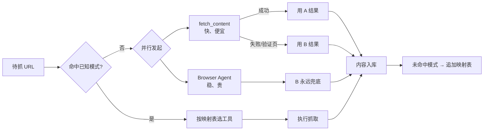

# 网页内容抓取模式（Web Content Extraction Patterns）

> **类型**：操作层级参考资料 · 面向 AI Agent
>
> **缘起**：2026-05-27 抓取微信公众号文章时，`fetch_content` 返回"环境异常"验证页，切换 Browser Agent 后直接成功。沉淀为可复用的工具选择策略。
>
> **关联**：[`design-meta-insights.md`](./design-meta-insights.md) §3「真难点不在协议在边界」的操作层延伸 · [`routing-protocol.md`](./routing-protocol.md)

---

## 0. 核心断言

> **抓不到的本质多半是"我用的工具进不去"，不是"内容不让看"。**

**反爬场景的成本不是工具开销，是延迟与重试。**

---

## 1. 工具能力差谱

| 工具 | UA | JS | Cookie | 成本 | 适用 |
|------|----|----|--------|------|------|
| `fetch_content` | 简陋 | ✗ | ✗ | 极低 | 公开静态页、API 文档、GitHub 原始文件 |
| `search_web` | — | — | — | 低 | 仅取摘要、确定 URL 是否存在 |
| `defuddle parse` | 浏览器级 | ✓ | ✓ | 中 | 已知 URL 提取干净 Markdown |
| **Browser Agent** | 完整 | ✓ | ✓ | 中-高 | **反爬兜底 / 验证页绕过 / 动态渲染** |

---

## 2. URL 模式 → 推荐工具映射

> **核心思路**：把"URL 模式 → 工具选择"作为路由表，避免每次重复试错。

| URL 模式 | 默认工具 | 备注 |
|----------|----------|------|
| `mp.weixin.qq.com/s/<token>` | **Browser Agent** | 微信公众号；fetch_content 必返回验证页 |
| `zhuanlan.zhihu.com/p/<id>` | **Browser Agent** | 知乎专栏；fetch_content 返回 403 |
| `www.zhihu.com/question/<id>` | **Browser Agent** | 知乎问答 |
| `medium.com/<author>/<slug>` | Browser Agent | 付费墙边缘内容 |
| `*.notion.site/<id>` | Browser Agent | Notion 公开页（动态渲染） |
| `github.com/.../raw/<file>` | `fetch_content` | 原始文件直接拿 |
| `raw.githubusercontent.com/...` | `fetch_content` | 同上 |
| `docs.python.org/...` | `fetch_content` | 静态文档 |
| `arxiv.org/abs/<id>` | `fetch_content` 或 `arxiv-watcher` skill | 摘要静态可拿 |
| `*.readthedocs.io/...` | `fetch_content` | 静态文档 |
| Cloudflare 弱挑战页 | Browser Agent | 任何 5xx + cf-ray header |
| 未知域名 | **并行试探**（见 §3） | — |

> **维护原则**：每次发现新模式立即追加，**不删除**——沉淀粒度决定复利。

---

## 3. 抓取降级链：并行而非串行



### 反模式

- ❌ 串行回退：`fetch_content` 失败 → `search_web` 失败 → `Browser Agent` 成功（浪费 2 轮）
- ❌ 看到验证页就喊用户人工抓
- ❌ 经验只留在会话里，下次再从 `fetch_content` 开始

### 正确姿势

- ✅ 命中映射表 → 直接用对应工具，零试错
- ✅ 未命中 → fetch_content + Browser Agent **并行发起**，谁先成功用谁
- ✅ Browser Agent 永远兜底，不做"最后一搏"而是"并行保底"

---

## 4. 微信公众号专项观察

| 维度 | 观察 |
|------|------|
| URL 模式 | `mp.weixin.qq.com/s/<token>?scene=<n>` |
| `fetch_content` 行为 | 100% 返回"环境异常 - 完成验证后即可继续访问" |
| Browser Agent 行为 | 直接加载，无任何挑战 |
| 触发反爬的特征 | 无 referer / 无 cookie / 无 JS / 客户端指纹异常 |
| 是否有真实硬墙 | **几乎没有**——公众号文章是开放引流内容 |
| 关键认知 | "环境异常"页是**低信誉访客拒绝响应**，**不是**用户必须验证 |

---

## 5. 知乎专项观察

| 维度 | 观察 |
|------|------|
| URL 模式 | `zhuanlan.zhihu.com/p/<id>` / `www.zhihu.com/question/<id>` |
| `fetch_content` 行为 | 直接 HTTP **403** |
| Browser Agent 行为 | 大多数情况成功；少数需登录态文章会跳引导 |
| 备选 | `search_web` 可拿摘要 + 用户粘贴全文 |

> 详见 [`task-summary-zhihu-integration-20260526.md`](../superpowers/retrospectives/task-summary-zhihu-integration-20260526.md)。

---

## 6. defuddle 与 Browser Agent 的配合

`defuddle` 是 Markdown 提取工具，但其 HTTP 客户端能力有限。**最佳实践**：

```
Browser Agent 抓 HTML → 写入 .temp/<slug>.html → defuddle parse <file> --md -o <out>
```

而非：

```
defuddle parse <反爬 URL> --md  ❌ 同样会被拒
```

---

## 7. 应用守则

| 触发场景 | 直接行动 |
|----------|----------|
| 拿到 URL 准备抓取 | **先查映射表**（§2） |
| URL 命中已知模式 | 按映射表执行，零试错 |
| URL 未命中 | 并行发起 fetch + Browser，谁先成功用谁 |
| 看到"验证页 / 403 / 5xx + cf-ray" | 不要放弃，换 Browser Agent |
| 抓取成功 | **若是新模式，立即追加 §2 表** |

---

## 8. 反爬应对策略矩阵

| 反爬类型 | 表现 | 应对 |
|----------|------|------|
| UA/Cookie 指纹反爬 | 验证页 / 403 | Browser Agent |
| Cloudflare 弱挑战 | 5s 等待页 / cf-ray | Browser Agent |
| Cloudflare 强挑战（Turnstile） | 人机验证 | 用户协助 / 跳过 |
| 登录墙 | 跳登录页 | 用户协助 / 跳过 |
| 付费硬墙 | 截断正文 | 跳过 / 用户提供 |
| Geo 限制 | 451 | 跳过 |

> 边界：**Browser Agent 能处理"指纹与挑战"，处理不了"硬身份与硬地理"**。

---

## 9. 关联资料

- [`design-meta-insights.md`](./design-meta-insights.md) — 元层级判断框架（道）
- [`routing-protocol.md`](./routing-protocol.md) — 上下文路由协议
- [`../superpowers/retrospectives/task-summary-zhihu-integration-20260526.md`](../superpowers/retrospectives/task-summary-zhihu-integration-20260526.md) — 知乎抓取经验
- [`../superpowers/retrospectives/task-summary-world-multi-surface-exploration-20260527.md`](../superpowers/retrospectives/task-summary-world-multi-surface-exploration-20260527.md) — 微信公众号抓取（本文档触发场景）

---

*版本：v1.0 · 2026-05-27 沉淀 · 后续遇到新 URL 模式增量追加 §2 表*
