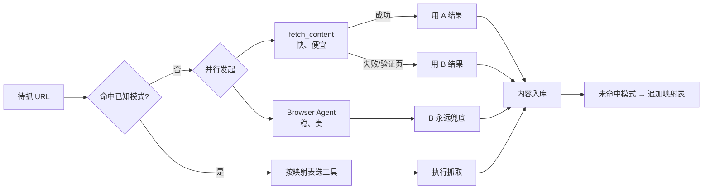
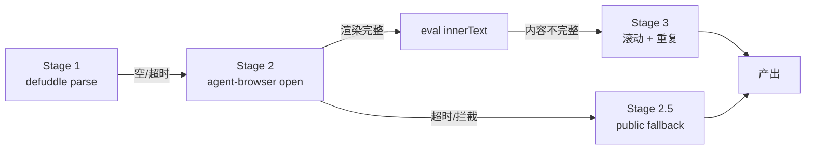

# 网页内容抓取模式（Web Content Extraction Patterns）

> **类型**：操作层级参考资料 · 面向 AI Agent
>
> **缘起**：2026-05-27 抓取微信公众号文章时，`fetch_content` 返回"环境异常"验证页，切换 Browser Agent 后直接成功。沉淀为可复用的工具选择策略。
>
> **关联**：[`design-meta-insights.md`](./design-meta-insights.md) §3「真难点不在协议在边界」的操作层延伸 · [`routing-protocol.md`](./routing-protocol.md)

---

## 0. 核心断言

> **抓不到的本质多半是"我用的工具进不去"，不是"内容不让看"。**

**反爬场景的成本不是工具开销，是延迟与重试。**

---

## 1. 工具能力差谱

| 工具 | UA | JS | Cookie | 成本 | 适用 |
|------|----|----|--------|------|------|
| `fetch_content` | 简陋 | ✗ | ✗ | 极低 | 公开静态页、API 文档、GitHub 原始文件 |
| `search_web` | — | — | — | 低 | 仅取摘要、确定 URL 是否存在 |
| `defuddle parse` | 浏览器级 | ✓ | ✓ | 中 | 已知 URL 提取干净 Markdown |
| **Browser Agent** | 完整 | ✓ | ✓ | 中-高 | **反爬兜底 / 验证页绕过 / 动态渲染** |

---

## 2. URL 模式 → 推荐工具映射

> **核心思路**：把"URL 模式 → 工具选择"作为路由表，避免每次重复试错。

| URL 模式 | 默认工具 | 备注 |
|----------|----------|------|
| `mp.weixin.qq.com/s/<token>` | **Browser Agent** | 微信公众号；fetch_content 必返回验证页 |
| `zhuanlan.zhihu.com/p/<id>` | **Browser Agent** | 知乎专栏；fetch_content 返回 403 |
| `www.zhihu.com/question/<id>` | **Browser Agent** | 知乎问答 |
| `medium.com/<author>/<slug>` | Browser Agent | 付费墙边缘内容 |
| `*.notion.site/<id>` | Browser Agent | Notion 公开页（动态渲染） |
| `github.com/.../raw/<file>` | `fetch_content` | 原始文件直接拿 |
| `raw.githubusercontent.com/...` | `fetch_content` | 同上 |
| `docs.python.org/...` | `fetch_content` | 静态文档 |
| `arxiv.org/abs/<id>` | `fetch_content` 或 `arxiv-watcher` skill | 摘要静态可拿 |
| `*.readthedocs.io/...` | `fetch_content` | 静态文档 |
| Cloudflare 弱挑战页 | Browser Agent | 任何 5xx + cf-ray header |
| 未知域名 | **并行试探**（见 §3） | — |
| `trae.cn/*` | **并行试探**（defuddle + Browser Agent） | 字节 SPA；innerText 优于 snapshot |
| `cursor.com/*` | Browser Agent | Next.js SPA；定价页 + 主页并行抓 |
| `bolt.new/*` | **`defuddle parse` 优先** | 静态即成功；浏览器反复 timeout |
| `replit.com/*` | **必失败兜底公开资料** | Cloudflare 强拦截；Browser Agent 也会被拦 |

> **维护原则**：每次发现新模式立即追加，**不删除**——沉淀粒度决定复利。

---

## 3. 抓取降级链：并行而非串行


```mermaid
flowchart LR
    URL["待抓 URL"] --> Match{"命中已知模式?"}
    Match -- 是 --> Mapped["按映射表选工具"]
    Match -- 否 --> Fork{"并行发起"}
    Fork --> A["fetch_content<br/>快、便宜"]
    Fork --> B["Browser Agent<br/>稳、贵"]
    A -->|成功| UseA["用 A 结果"]
    A -->|失败/验证页| FallB["用 B 结果"]
    B --> UseB["B 永远兜底"]
    Mapped --> UseM["执行抓取"]
    UseA --> Sink["内容入库"]
    FallB --> Sink
    UseB --> Sink
    UseM --> Sink
    Sink --> Update["未命中模式 → 追加映射表"]
```

### 反模式

- ❌ 串行回退：`fetch_content` 失败 → `search_web` 失败 → `Browser Agent` 成功（浪费 2 轮）
- ❌ 看到验证页就喊用户人工抓
- ❌ 经验只留在会话里，下次再从 `fetch_content` 开始

### 正确姿势

- ✅ 命中映射表 → 直接用对应工具，零试错
- ✅ 未命中 → fetch_content + Browser Agent **并行发起**，谁先成功用谁
- ✅ Browser Agent 永远兜底，不做"最后一搏"而是"并行保底"

---

## 4. 微信公众号专项观察

| 维度 | 观察 |
|------|------|
| URL 模式 | `mp.weixin.qq.com/s/<token>?scene=<n>` |
| `fetch_content` 行为 | 100% 返回"环境异常 - 完成验证后即可继续访问" |
| Browser Agent 行为 | 直接加载，无任何挑战 |
| 触发反爬的特征 | 无 referer / 无 cookie / 无 JS / 客户端指纹异常 |
| 是否有真实硬墙 | **几乎没有**——公众号文章是开放引流内容 |
| 关键认知 | "环境异常"页是**低信誉访客拒绝响应**，**不是**用户必须验证 |

---

## 5. 知乎专项观察

| 维度 | 观察 |
|------|------|
| URL 模式 | `zhuanlan.zhihu.com/p/<id>` / `www.zhihu.com/question/<id>` |
| `fetch_content` 行为 | 直接 HTTP **403** |
| Browser Agent 行为 | 大多数情况成功；少数需登录态文章会跳引导 |
| 备选 | `search_web` 可拿摘要 + 用户粘贴全文 |

> 详见 [`task-summary-zhihu-integration-20260526.md`](../superpowers/retrospectives/task-summaries/misc/task-summary-zhihu-integration-20260526.md)。

---

## 6. defuddle 与 Browser Agent 的配合

`defuddle` 是 Markdown 提取工具，但其 HTTP 客户端能力有限。**最佳实践**：

```
Browser Agent 抓 HTML → 写入 .temp/<slug>.html → defuddle parse <file> --md -o <out>
```

而非：

```
defuddle parse <反爬 URL> --md  ❌ 同样会被拒
```

---

## 7. 应用守则

| 触发场景 | 直接行动 |
|----------|----------|
| 拿到 URL 准备抓取 | **先查映射表**（§2） |
| URL 命中已知模式 | 按映射表执行，零试错 |
| URL 未命中 | 并行发起 fetch + Browser，谁先成功用谁 |
| 看到"验证页 / 403 / 5xx + cf-ray" | 不要放弃，换 Browser Agent |
| 抓取成功 | **若是新模式，立即追加 §2 表** |

---

## 8. 反爬应对策略矩阵

| 反爬类型 | 表现 | 应对 |
|----------|------|------|
| UA/Cookie 指纹反爬 | 验证页 / 403 | Browser Agent |
| Cloudflare 弱挑战 | 5s 等待页 / cf-ray | Browser Agent |
| Cloudflare 强挑战（Turnstile） | 人机验证 | 用户协助 / 跳过 |
| 登录墙 | 跳登录页 | 用户协助 / 跳过 |
| 付费硬墙 | 截断正文 | 跳过 / 用户提供 |
| Geo 限制 | 451 | 跳过 |

> 边界：**Browser Agent 能处理"指纹与挑战"，处理不了"硬身份与硬地理"**。

---

## 9. 关联资料

- [`design-meta-insights.md`](./design-meta-insights.md) — 元层级判断框架（道）
- [`routing-protocol.md`](./routing-protocol.md) — 上下文路由协议
- [`../superpowers/retrospectives/task-summaries/misc/task-summary-zhihu-integration-20260526.md`](../superpowers/retrospectives/task-summaries/misc/task-summary-zhihu-integration-20260526.md) — 知乎抓取经验
- [`../superpowers/retrospectives/task-summaries/world-cli/task-summary-world-multi-surface-exploration-20260527.md`](../superpowers/retrospectives/task-summaries/world-cli/task-summary-world-multi-surface-exploration-20260527.md) — 微信公众号抓取（本文档触发场景）
- [`../superpowers/retrospectives/task-summaries/exploration/task-summary-spa-content-extraction-20260621.md`](../superpowers/retrospectives/task-summaries/exploration/task-summary-spa-content-extraction-20260621.md) — SPA 三阶段抓取法（TRAE / Cursor / Bolt / Replit 四案例）

---

## 10. SPA 三阶段抓取法（2026-06-21 增量）

> **缘起**：本项目自建 skill `spa-content-extractor` 的实战沉淀。该 skill 已配置在 `.trae/settings.json` 的 `default_skills` 中。

### 10.1 抓取三阶段


```mermaid
flowchart LR
    A["Stage 1<br/>defuddle parse"] -->|空/超时| B["Stage 2<br/>agent-browser open"]
    B -->|渲染完整| D["eval innerText"]
    B -->|超时/拦截| C["Stage 2.5<br/>public fallback"]
    D -->|内容不完整| E["Stage 3<br/>滚动 + 重复"]
    E --> F["产出"]
    C --> F
```

| 阶段 | 工具 | 何时跳过 |
|------|------|----------|
| Stage 1 静态尝试 | `defuddle parse <url> --md` | 内容 > 500 字节且有效 |
| Stage 2 浏览器 | `agent-browser open + eval 'document.body.innerText'` | 静态已成功 / Cloudflare 拦截 |
| Stage 3 懒加载 | `eval scrollTo + wait + eval` | Stage 2 已完整 |

### 10.2 关键工程经验

| 经验 | 教训 |
|------|------|
| `snapshot -i` 不适合内容提取 | 轮播/虚拟列表会导致同一节点重复 5+ 次 |
| **优先 `eval 'document.body.innerText'`** | 浏览器去重后的人类可读文本 |
| 浏览器路径对 SSR 良好的网站反而 timeout | `bolt.new` 就是反例——`defuddle` 一次成功 |
| PowerShell 中文编码问题 | 用 `eval > file` 重定向，不要 `print` 到终端 |
| Cloudflare 强拦截 = 必失败 | `replit.com` 是典型，提前打 fallback |

### 10.3 4 个真实案例速查

| 案例 | URL | 静态 | 浏览器 | 结果 |
|------|-----|------|--------|------|
| TRAE 创造力大赛 | `trae.cn/ai-creativity` | ❌ 空 | ✅ 完整 | ✅ 7 个板块全部抓取 |
| Cursor 官网 | `cursor.com` | ❌ 空 | ✅ 完整 | ✅ KOL 证言 + 功能 |
| Bolt.new | `bolt.new` | ✅ 完整 | ⏱ timeout | ✅ 静态足够 |
| Replit Agent | `replit.com/ai` | ❌ Cloudflare | ❌ 拦截 | ❌ 改用公开资料 |

### 10.4 工具选择决策树

```
看到 URL
  │
  ├─ 命中映射表 (§2) → 按表执行
  │
  └─ 未命中
       │
       ├─ 是技术文档/GitHub/raw? → fetch_content
       │
       ├─ 是反爬已知模式? → Browser Agent 直接上
       │
       └─ 都不确定
            │
            ├─ defuddle 试 5 秒 ──┐
            │                     │
            └─ Browser Agent 试 ──┴──→ 谁先成用谁
```

### 10.5 反模式清单

- ❌ 看到 SPA 默认用 `snapshot -i` —— 节点爆炸
- ❌ 串行回退：defuddle → fetch → browser —— 浪费 2 轮
- ❌ 看到 Cloudflare 验证页还硬试 —— 直接换工具或 fallback
- ❌ 把 agent-browser 结果直接 print —— Windows 中文乱码
- ❌ 抓完不 `agent-browser close` —— 进程泄漏

---

## 11. 复盘 → 沉淀工作流

> 七步骨架（单点研究 → 横向对比 → 洞察 → 封装 → 配置 → 校验 → 归档）见 [`../../../docs/topics/retrospective-to-asset-workflow.md`](../../../docs/topics/retrospective-to-asset-workflow.md)。本文档是该工作流在"网页抓取"主题下的具象化。

---

## 12. Skill 级降级链（2026-06-24 增量）

> **缘起**：使用 `content-parser` skill 提取微信文章时，API 超时 + `shared/` 配置缺失，降级到 `defuddle` 成功。补充 skill 级降级路径。

### 12.1 三级降级链

```
URL 内容提取
│
├─ Tier 1：content-parser skill（API 级，支持摘要/评分/多模态）
│  ├─ 依赖：LISTENHUB_API_KEY 环境变量 + shared/ 配置文件
│  ├─ 可用 → POST /v1/content/extract → 轮询 → 保存
│  └─ 不可用（API 超时/依赖缺失）→ 降级
│
├─ Tier 2：defuddle CLI（本地提取，无需 API Key）
│  ├─ 依赖：npm install -g defuddle
│  ├─ 可用 → defuddle parse <url> --md -o <file>
│  │  └─ 后处理：清理微信尾部噪声（见 §12.3）
│  └─ 未安装 → 降级
│
└─ Tier 3：WebFetch / Browser Agent（兜底）
```

### 12.2 与 §3 降级链的关系

| 维度 | §3 抓取降级链 | §12 Skill 级降级链 |
|------|-------------|-------------------|
| 层级 | 工具级（fetch_content / Browser Agent） | Skill 级（content-parser / defuddle / WebFetch） |
| 场景 | 反爬绕过、动态渲染 | API 不可用、依赖缺失 |
| 策略 | 并行试探 | 串行降级（依赖检查失败 → 立即降级） |
| 共性 | 降级不卡在报错上 | 同左 |

### 12.3 微信尾部噪声清理

`defuddle` 提取微信公众号文章后，末尾包含 UI 噪声文本：

```
微信扫一扫
使用小程序

： ， ， ， ， ， ， ， ， ， ， ， 。 视频 小程序 赞 ，轻点两下取消赞 在看 ，轻点两下取消在看 分享 留言 收藏 听过
```

清理规则（PowerShell）：

```powershell
$content = Get-Content $file -Raw
$cleaned = $content -replace '(?ms)(微信扫一扫.*$)', ''
Set-Content $file -Value $cleaned.TrimEnd() -Encoding UTF8
```

### 12.4 当前工具状态（2026-06-24）

| 工具 | 状态 | 备注 |
|------|------|------|
| content-parser | ⚠️ API 超时 | API Key 存在但 `api.marswave.ai` 响应超时，`shared/` 配置缺失 |
| defuddle | ✅ v0.18.1 | 稳定，微信文章提取效果极佳 |
| WebFetch | ✅ 可用 | 内置兜底 |

---

## 13. URL → 学习摘要 SOP（2026-06-24 增量）

> **缘起**：本次微信文章提取任务复盘后固化的 8 步标准流程。

```
Step 0: 读 AGENTS.md → 确认产物路径和命名规范
Step 1: 确认报告格式（默认 Markdown，除非用户明确指定其他）
Step 2: 技能选择（按 §12 降级链）
Step 3: 工具验证（--version / --help）
Step 4: 预览提取（stdout 先看质量）
Step 5: 持久化（-o 保存到 .temp/）
Step 6: 后处理（清理尾部噪声，见 §12.3）
Step 7: 结构化总结（分板块 + 表格 + 洞察）
Step 8: 洞察提炼（2-4 个可迁移洞察 + 原文依据）
```

> **关联**：[`../../../docs/tech/task-summary-force-conf-recap-20260624.md`](../../../docs/tech/task-summary-force-conf-recap-20260624.md) · [`../../../docs/topics/session-recap-force-conf-20260624.md`](../../../docs/topics/session-recap-force-conf-20260624.md)

---

*版本：v1.3 · 2026-05-27 初版 · 2026-06-21 增量：TRAE/Cursor/Bolt/Replit 四案例 + SPA 三阶段法 + 工作流骨架 · 2026-06-24 增量：Skill 级降级链 + 微信噪声清理 + URL→学习摘要 SOP*
