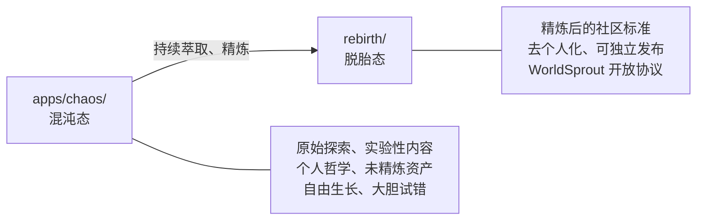

# 仓库结构

本文档描述 AgentForge 仓库的物理目录结构与层级关系，是理解项目组织方式的入口参考。

## 目录树

```
AgentForge/                            ← 本仓库（github.com/xinetzone/AgentForge）
├── AGENTS.md                          ← 全局路由与契约声明（最高优先级）
├── README.md                          ← 人类开发者入口
├── LICENSE                            ← Apache 2.0
├── docs/                              ← 人类文档（tech/ + general/ 双轨）
├── .github/workflows/                 ← CI/CD 流水线
│
├── apps/                              ← 应用层
│   ├── .agents/                       ← 仓库级 AI 配置骨架（world.toml + constraints.toml + registry.toml）
│   └── chaos/                         ← 混沌态：原始孵化器——自由探索、未精炼的一切
│       ├── AGENTS.md                  ← chaos 子项目路由（嵌套优先）
│       ├── .agents/                   ← 规则/技能/工作流/角色/知识库（Layer 1/2/3 完整）
│       ├── specs/                     ← AgentForge Spec v0.2 规范文档
│       ├── src/taolib/                ← world CLI + 约束校验器 + 参考实现
│       ├── tests/                     ← 测试套件
│       └── pyproject.toml             ← Python 项目配置（pdm-backend + SCM 动态版本）
│
└── rebirth/                           ← 脱胎态：从 chaos 萃取精炼后的社区标准（git submodule）
    ├── worldsprout/ (submodule)       → github.com/worldsprout/worldsprout（参考实现）
    ├── spec/        (submodule)       → github.com/worldsprout/spec（WorldSprout Spec v1.0）
    ├── .github/     (submodule)       → github.com/worldsprout/.github（组织首页）
    ├── README.md                      ← 脱胎说明与日常管理指南（AgentForge 跟踪）
    └── RETROSPECTIVE.md               ← AgentForge → WorldSprout 全面复盘（AgentForge 跟踪）
```

## 混沌 → 脱胎 信息流转模型

本仓库遵循 **混沌 → 萃取 → 脱胎** 的信息流转模型：



| 角色 | 路径 | 定位 |
|------|------|------|
| **混沌态 (Chaos)** | `apps/chaos/` | 原始孵化器——承载一切未精炼的探索：哲学内核（Ψ=Ψ(Ψ)、道德经）、实验性代码、个人知识库、技能生态。信息在此自由生长，经持续萃取后同步至 rebirth |
| **脱胎态 (Rebirth)** | `rebirth/` | 精炼后的产出——从 chaos 中萃取、去个人化、去哲学化后的社区开放标准，以 git submodule 形式链接到 `github.com/worldsprout/*` 仓库 |

## 嵌套 AGENTS.md 规则

AGENTS.md 标准支持嵌套，"就近优先"——子项目 AGENTS.md 覆盖根级 AGENTS.md。当你在 `apps/chaos/` 内工作时，优先遵循 `apps/chaos/AGENTS.md`。

## 相关文档

- 任务路由规则见 [`.agents/rules/context-routing.md`](../rules/context-routing.md)
- 治理与规范说明见 [`.agents/docs/governance-and-specs.md`](governance-and-specs.md)
- AGENTS.md 标准与 AgentForge 的关系：AGENTS.md 标准 ≈ Markdown；AgentForge / WorldSprout ≈ CommonMark + GFM 扩展。两者独立但互操作。
