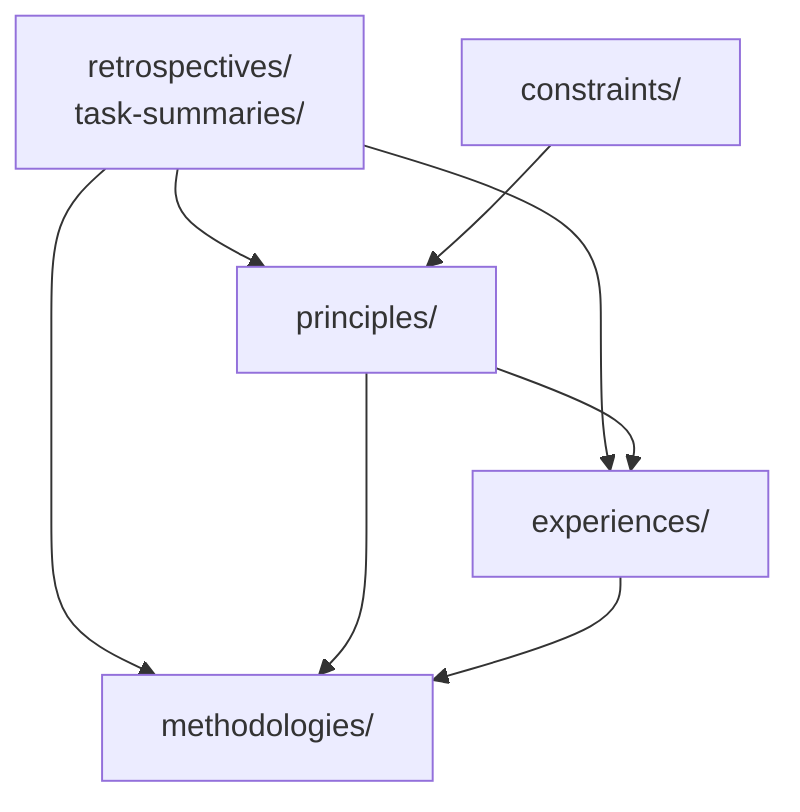

# 依赖关系图谱

> **生成日期**：2026-06-23
> **维护责任人**：Leader Agent

## 模块间依赖关系

| 模块 | 引用其他模块 | 被其他模块引用 |
|------|-------------|---------------|
| `principles/` | `experiences/`（作为原则落地场景）、`methodologies/`（作为方法论基础） | `experiences/`、`methodologies/` |
| `experiences/` | `principles/`（作为经验总结的理论基础） | `principles/`、`methodologies/` |
| `constraints/` | 无 | `principles/`（可能作为设计边界） |
| `methodologies/` | `principles/`、`experiences/` | 无 |

## 文档间引用关系

### memories 内部引用

当前各记忆条目之间无直接 markdown 链接引用。

### memories 外部引用（被其他文档引用）

| 引用方 | 被引用文档 | 引用路径 |
|--------|-----------|---------|
| `apps/chaos/.agents/docs/superpowers/retrospectives/task-summaries/documentation/task-summary-psi-philosophy-docs-20260525.md` | 2026-05-25-concept-first-documentation-second-principle.md | `../memories/2026-05-25-concept-first-documentation-second-principle.md` |
| `apps/chaos/.agents/docs/superpowers/retrospectives/task-summaries/documentation/task-summary-doc-governance-closure-20260525.md` | 2026-05-25-doc-maintenance-5-steps-experience.md | `../memories/2026-05-25-doc-maintenance-5-steps-experience.md` |
| `apps/chaos/.agents/docs/superpowers/retrospectives/task-summaries/documentation/task-summary-psi-philosophy-docs-20260525.md` | 2026-05-25-network-linking-knowledge-graph-experience.md | `../memories/2026-05-25-network-linking-knowledge-graph-experience.md` |
| `apps/chaos/.agents/docs/superpowers/retrospectives/task-summaries/exploration/task-summary-hello-agents-knowledge-extraction-20260602.md` | 2026-06-02-external-knowledge-ingestion-principle.md | `../memories/2026-06-02-external-knowledge-ingestion-principle.md` |
| `apps/chaos/.agents/docs/superpowers/retrospectives/task-summaries/exploration/task-summary-deepagents-overview-extraction-20260602.md` | 2026-06-02-knowledge-ingestion-task-boundary-principle.md | `../memories/2026-06-02-knowledge-ingestion-task-boundary-principle.md` |
| `apps/chaos/.agents/docs/superpowers/retrospectives/task-summaries/documentation/task-summary-memory-debt-governance-full-cycle-20260611.md` | 2026-06-11-document-debt-governance-three-phase-methodology.md | `../memories/2026-06-11-document-debt-governance-three-phase-methodology.md` |

> **注意**：以上引用路径需在 Task 4 中更新为模块化新路径。

## 关键依赖链可视化

