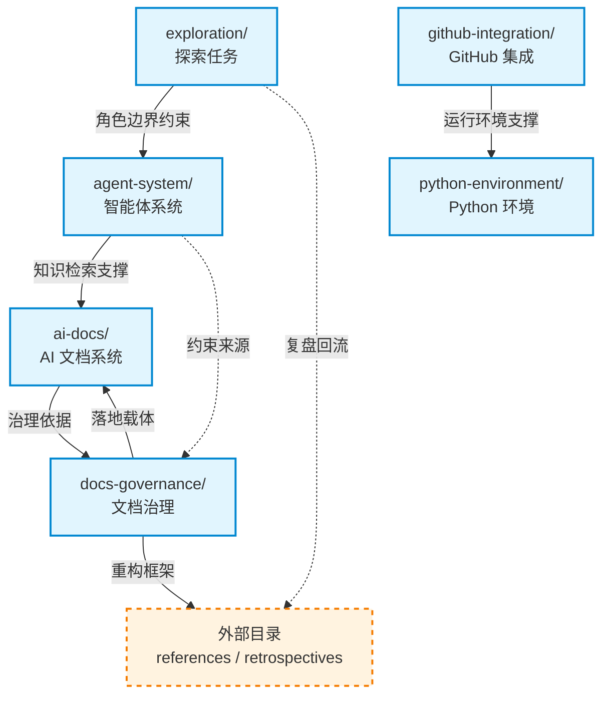
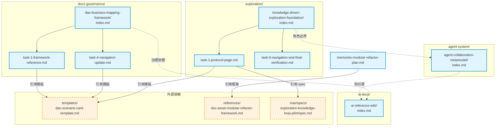

# 依赖关系图谱

> **维护责任人**：Leader Agent
> **更新日期**：2026-06-23
> **适用范围**：`plans/` 全目录

本文件记录 `plans/` 目录下文档间的引用关系（正向与反向依赖）及模块间依赖关系，并使用 Mermaid 流程图可视化关键依赖链。

## 1. 模块间依赖关系

基于各模块 README.md 的"依赖关系"声明与文档内引用扫描结果，6 个模块间的依赖关系如下：

| 引用方（模块） | 被引用方（模块） | 依赖类型 | 说明 |
|---------------|-----------------|---------|------|
| `agent-system/` | `ai-docs/` | 引用外部 | AI 参考维基为智能体提供知识检索支撑 |
| `exploration/` | `agent-system/` | 引用外部 | 协作元模型为探索任务提供角色边界约束 |
| `ai-docs/` | `docs-governance/` | 引用外部 | 文档治理框架为 AI 文档系统提供治理依据 |
| `docs-governance/` | `ai-docs/` | 引用外部 | AI 文档系统为治理框架提供落地载体 |
| `agent-system/` | `docs-governance/` | 被引用 | 协作元模型常引用治理框架作为约束来源 |
| `github-integration/` | `python-environment/` | 引用外部 | 环境管理为 GitHub 集成提供依赖与运行环境支撑 |
| `exploration/` | `../../retrospectives/` | 被引用 | 复盘报告常回流至复盘目录 |
| `docs-governance/` | `../../references/` | 引用外部 | 记忆重构计划引用文档资产模块化重构框架 |

### 模块依赖 Mermaid 图

## 2. 文档间引用关系（正向依赖）

以下为 `plans/` 目录下各 .md 文件中的相对路径引用（`[text](path.md)`）扫描结果，按模块组织。

### 2.1 ai-docs 模块

| 引用方 | 被引用文件 | 引用类型 |
|--------|-----------|---------|
| `ai-reference-wiki/index.md` | `task-1-top-level-directories.md` | 模块内（同目录） |
| `ai-reference-wiki/index.md` | `task-2-python-podman-references.md` | 模块内（同目录） |
| `ai-reference-wiki/index.md` | `task-3-issue-patterns-integrations.md` | 模块内（同目录） |
| `ai-reference-wiki/index.md` | `task-4-raw-sources-validation.md` | 模块内（同目录） |
| `ai-reference-wiki/index.md` | `task-5-optional-seed-pages.md` | 模块内（同目录） |
| `ai-reference-wiki/task-1-top-level-directories.md` | `./python/README.md` | 计划产出（待创建） |
| `ai-reference-wiki/task-1-top-level-directories.md` | `./podman/README.md` | 计划产出（待创建） |
| `ai-reference-wiki/task-2-python-podman-references.md` | `./package-index.md` | 计划产出（待创建） |
| `ai-reference-wiki/task-2-python-podman-references.md` | `./command-cheatsheet.md` | 计划产出（待创建） |
| `ai-docs-navigation.md` | `./integrations/python-in-agentforge.md` | 计划产出（待创建） |
| `ai-docs-navigation.md` | `./issue-patterns/python-errors.md` | 计划产出（待创建） |
| `ai-docs-navigation.md` | `./references/python/package-index.md` | 计划产出（待创建） |
| `ai-docs-navigation.md` | `./integrations/podman-in-agentforge.md` | 计划产出（待创建） |
| `ai-docs-navigation.md` | `./issue-patterns/podman-errors.md` | 计划产出（待创建） |

### 2.2 agent-system 模块

| 引用方 | 被引用文件 | 引用类型 |
|--------|-----------|---------|
| `agent-collaboration-metamodel/index.md` | `task-1-reference-page.md` | 模块内（同目录） |
| `agent-collaboration-metamodel/index.md` | `task-2-global-entry-navigation.md` | 模块内（同目录） |
| `agent-collaboration-metamodel/index.md` | `task-3-roles-pilot-directory.md` | 模块内（同目录） |
| `agent-collaboration-metamodel/index.md` | `task-4-backfill-and-acceptance.md` | 模块内（同目录） |
| `agent-memory-dream-protocol/index.md` | `task-1-verify-protocol-quartet.md` | 模块内（同目录） |
| `agent-memory-dream-protocol/index.md` | `task-2-documentation-navigation.md` | 模块内（同目录） |
| `agent-memory-dream-protocol/index.md` | `task-3-pilot-workbench.md` | 模块内（同目录） |
| `agent-memory-dream-protocol/index.md` | `task-4-validation-retrospective.md` | 模块内（同目录） |
| `role-review-workflow/index.md` | `task-1-workflow-and-template.md` | 模块内（同目录） |
| `role-review-workflow/index.md` | `task-2-gate-records.md` | 模块内（同目录） |
| `role-review-workflow/index.md` | `task-3-roles-readme.md` | 模块内（同目录） |
| `role-review-workflow/index.md` | `task-4-metamodel-mapping.md` | 模块内（同目录） |
| `role-review-workflow/index.md` | `task-5-verification.md` | 模块内（同目录） |
| `role-review-workflow/task-1-workflow-and-template.md` | `role-review/templates/proposal.md` | 计划产出（待创建） |

### 2.3 exploration 模块

| 引用方 | 被引用文件 | 引用类型 |
|--------|-----------|---------|
| `knowledge-driven-exploration-foundation/index.md` | `task-1-protocol-page.md` | 模块内（同目录） |
| `knowledge-driven-exploration-foundation/index.md` | `task-2-scenario-card-template.md` | 模块内（同目录） |
| `knowledge-driven-exploration-foundation/index.md` | `task-3-spec-and-retrospective-templates.md` | 模块内（同目录） |
| `knowledge-driven-exploration-foundation/index.md` | `task-4-workbench-template-and-pilot-workspace.md` | 模块内（同目录） |
| `knowledge-driven-exploration-foundation/index.md` | `task-5-pilot-scenario-catalog-registration.md` | 模块内（同目录） |
| `knowledge-driven-exploration-foundation/index.md` | `task-6-navigation-and-final-verification.md` | 模块内（同目录） |
| `knowledge-driven-exploration-foundation/task-1-protocol-page.md` | `../templates/dao-scenario-card-template.md` | 跨目录（templates/） |
| `knowledge-driven-exploration-foundation/task-1-protocol-page.md` | `../templates/knowledge-driven-exploration-spec-template.md` | 跨目录（templates/） |
| `knowledge-driven-exploration-foundation/task-1-protocol-page.md` | `../templates/knowledge-driven-exploration-retrospective-template.md` | 跨目录（templates/） |
| `knowledge-driven-exploration-foundation/task-1-protocol-page.md` | `../../../../.trae/specs/exploration-knowledge-loop-pilot/spec.md` | 外部（specs/） |
| `knowledge-driven-exploration-foundation/task-6-navigation-and-final-verification.md` | `./references/dao-tech-foundation.md` | 计划产出（待创建） |
| `knowledge-driven-exploration-foundation/task-6-navigation-and-final-verification.md` | `./references/dao-business-mapping-framework.md` | 计划产出（待创建） |
| `knowledge-driven-exploration-foundation/task-6-navigation-and-final-verification.md` | `./references/knowledge-driven-exploration-protocol.md` | 计划产出（待创建） |
| `knowledge-driven-exploration-foundation/task-6-navigation-and-final-verification.md` | `./references/dao-scenario-catalog.md` | 计划产出（待创建） |

### 2.4 github-integration 模块

| 引用方 | 被引用文件 | 引用类型 |
|--------|-----------|---------|
| `github-app-installation-token-override/index.md` | `file-structure.md` | 模块内（同目录） |
| `github-app-installation-token-override/index.md` | `task-1-config-layer.md` | 模块内（同目录） |
| `github-app-installation-token-override/index.md` | `task-2-github-client.md` | 模块内（同目录） |
| `github-app-installation-token-override/index.md` | `task-3-cache-token-manager.md` | 模块内（同目录） |
| `github-app-installation-token-override/index.md` | `task-4-single-flight-fallback.md` | 模块内（同目录） |
| `github-app-installation-token-override/index.md` | `task-5-cli-diagnosis.md` | 模块内（同目录） |
| `github-app-installation-token-override/index.md` | `task-6-docs-ci-report.md` | 模块内（同目录） |
| `github-app-installation-token-override/index.md` | `metrics-comparison.md` | 模块内（同目录） |
| `github-app-installation-token-override/index.md` | `plan-self-review.md` | 模块内（同目录） |
| `github-app-installation-token-override/task-6-docs-ci-report.md` | `metrics-comparison.md` | 模块内（同目录） |
| `pygithub-adapter/index.md` | `task-1-update-dependencies.md` | 模块内（同目录） |
| `pygithub-adapter/index.md` | `task-2-implement-pygithub-adapter.md` | 模块内（同目录） |
| `pygithub-adapter/index.md` | `task-3-expose-interfaces.md` | 模块内（同目录） |

### 2.5 docs-governance 模块

| 引用方 | 被引用文件 | 引用类型 |
|--------|-----------|---------|
| `dao-business-mapping-framework/index.md` | `task-1-framework-reference.md` | 模块内（同目录） |
| `dao-business-mapping-framework/index.md` | `task-2-scenario-card-template.md` | 模块内（同目录） |
| `dao-business-mapping-framework/index.md` | `task-3-scenario-catalog.md` | 模块内（同目录） |
| `dao-business-mapping-framework/index.md` | `task-4-navigation-update.md` | 模块内（同目录） |
| `dao-business-mapping-framework/index.md` | `task-5-final-verification.md` | 模块内（同目录） |
| `dao-business-mapping-framework/task-1-framework-reference.md` | `./dao-tech-foundation.md` | 计划产出（待创建） |
| `dao-business-mapping-framework/task-1-framework-reference.md` | `./dao-scenario-catalog.md` | 计划产出（待创建） |
| `dao-business-mapping-framework/task-1-framework-reference.md` | `../templates/dao-scenario-card-template.md` | 跨目录（templates/） |
| `dao-business-mapping-framework/task-3-scenario-catalog.md` | `./dao-business-mapping-framework.md` | 计划产出（待创建） |
| `dao-business-mapping-framework/task-3-scenario-catalog.md` | `../templates/dao-scenario-card-template.md` | 跨目录（templates/） |
| `dao-business-mapping-framework/task-4-navigation-update.md` | `./references/dao-tech-foundation.md` | 计划产出（待创建） |
| `dao-business-mapping-framework/task-4-navigation-update.md` | `./references/dao-business-mapping-framework.md` | 计划产出（待创建） |
| `dao-business-mapping-framework/task-4-navigation-update.md` | `./references/dao-scenario-catalog.md` | 计划产出（待创建） |
| `dao-business-mapping-framework/task-4-navigation-update.md` | `../templates/dao-scenario-card-template.md` | 跨目录（templates/） |
| `memories-modular-refactor-plan.md` | `../../references/doc-asset-modular-refactor-framework.md` | 外部（references/） |

### 2.6 python-environment 模块

| 引用方 | 被引用文件 | 引用类型 |
|--------|-----------|---------|
| `mise-single-source-foundation/index.md` | `file-structure.md` | 模块内（同目录） |
| `mise-single-source-foundation/index.md` | `task-1-fix-env-check-script.md` | 模块内（同目录） |
| `mise-single-source-foundation/index.md` | `task-2-read-tool-versions-from-mise-toml.md` | 模块内（同目录） |
| `mise-single-source-foundation/index.md` | `task-3-align-recommended-entrypoint-docs.md` | 模块内（同目录） |
| `mise-single-source-foundation/index.md` | `task-4-end-to-end-verification-and-wrap-up.md` | 模块内（同目录） |
| `mise-single-source-foundation/index.md` | `plan-self-review.md` | 模块内（同目录） |

## 3. 反向依赖（被引用关系）

以下列出被其他文档引用的关键文件（即反向依赖）：

| 被引用文件 | 引用方（数量） | 说明 |
|-----------|---------------|------|
| `../templates/dao-scenario-card-template.md` | 3 份（dao-business-mapping-framework 的 task-1、task-3、task-4 + knowledge-driven-exploration-foundation 的 task-1） | 场景卡模板，跨模块共享 |
| `metrics-comparison.md`（github-app） | 2 份（index.md + task-6-docs-ci-report.md） | 指标对比，被索引与任务同时引用 |
| 各原子化目录的 `index.md` | 被对应模块 README 引用 | 模块入口 |
| 各原子化目录的 `task-*.md` | 被对应 `index.md` 引用 | 任务单元 |

## 4. 关键依赖链 Mermaid 图

以下流程图展示 `plans/` 目录中最关键的依赖链路：

## 5. 引用类型统计

| 引用类型 | 数量 | 说明 |
|---------|------|------|
| 模块内（同目录） | 56 | index.md → task-*.md 等同目录引用 |
| 计划产出（待创建） | 22 | 计划中描述将创建但尚未落地的文件 |
| 跨目录（templates/） | 5 | 引用 `../templates/` 下的共享模板 |
| 外部（references/） | 1 | 引用 `../../references/` 下的参考框架 |
| 外部（specs/） | 1 | 引用 `.trae/specs/` 下的 spec 文件 |
| 跨模块（README 声明） | 7 | 模块 README 中声明的模块间依赖 |

## 6. 维护说明

- 本图谱基于 Grep 扫描 `\]\([^)]*\.md\)` 模式生成，覆盖 `plans/` 下全部 .md 文件
- 当新增或删除文档时，须同步更新本图谱
- 跨模块引用变更时，须同步更新对应模块 README.md 的"依赖关系"部分
