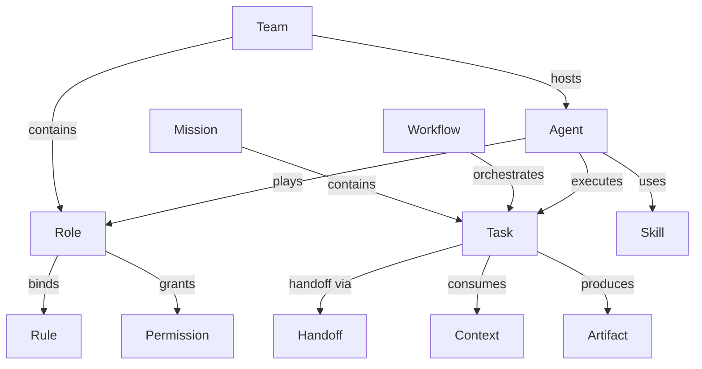

### Task 1: 收敛 Spec 与稳定参考页

**Files:**
- Modify: `.agents/docs/superpowers/specs/agent-system/2026-05-24-agent-collaboration-metamodel-design/index.md`
- Create: `.agents/docs/references/agent-collaboration-metamodel.md`

- [ ] **Step 1: 将 `.agents/roles/` 明确为第一批试点目录**

将 spec 中关于目录演进的表述统一为“首批引入 `roles/`，其余目录后续评估”，确保设计结论与用户确认一致。目标段落应包含如下语义：

```md
## Semantic Directories Evolution

在当前映射层稳定之后，第一批优先引入 `.agents/roles/`，并将其他语义实例目录保留为后续扩展选项。
```

- [ ] **Step 2: 生成稳定参考页骨架**

在 `.agents/docs/references/agent-collaboration-metamodel.md` 中沉淀一份面向长期复用的参考页，内容至少包含以下章节：

```md
# Agent Collaboration Metamodel

## 1. 定位
- 说明本页是协作元模型的稳定参考入口。

## 2. 双层结构
- MetaModel Layer
- Governance Layer

## 3. 五大领域
- Organization
- Execution
- Knowledge
- Governance
- Runtime State

## 4. 核心实体
- Team / Role / Agent
- Mission / Task / Workflow / Handoff
- Memory / Context / Rule / Skill / Artifact
- Policy / Permission / Session

## 5. 目录映射
- AGENTS.md
- .agents/rules/
- .agents/workflows/
- .agents/skills/
- .agents/docs/
- .agents/roles/
- .trae/
```

- [ ] **Step 3: 将参考页补齐为可独立阅读版本**

补充关键关系图、强约束、软约束和目录演进说明。主图建议直接使用以下 Mermaid：



- [ ] **Step 4: 自检 spec 与参考页是否一致**

Run:

```bash
git diff -- .agents/docs/superpowers/specs/agent-system/2026-05-24-agent-collaboration-metamodel-design/index.md .agents/docs/references/agent-collaboration-metamodel.md
```

Expected: diff 只包含 “`.agents/roles/` 为首批试点目录” 的收敛，以及新参考页内容；不出现与运行时实现相关的新增承诺。

- [ ] **Step 5: Commit**

```bash
git add .agents/docs/superpowers/specs/agent-system/2026-05-24-agent-collaboration-metamodel-design/index.md .agents/docs/references/agent-collaboration-metamodel.md
git commit -m "docs(agent): add collaboration metamodel reference"
```
