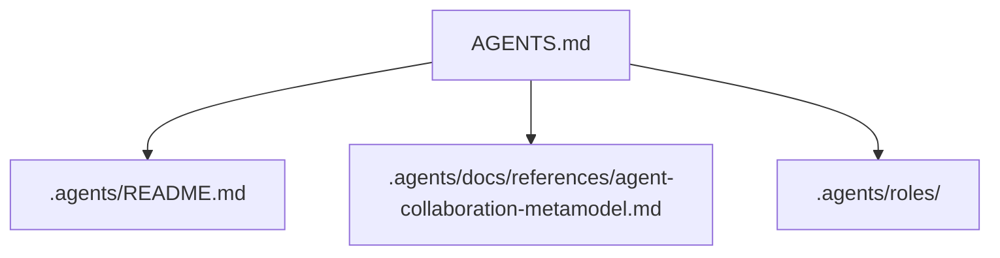

### Task 2: 更新全局入口与目录导航

**Files:**
- Modify: `AGENTS.md`
- Modify: `.agents/README.md`

- [ ] **Step 1: 为 `AGENTS.md` 增加协作元模型导航**

在“项目结构入口”或“上下文路由”附近补充协作语义入口，至少表达以下信息：

```md
- 协作元模型参考：阅读 `.agents/docs/references/agent-collaboration-metamodel.md`
- Role 语义实例目录：优先参考 `.agents/roles/`
```

若补图，保持 Mermaid 基础语法，例如：



- [ ] **Step 2: 为 `.agents/README.md` 增加目录语义映射**

在阅读导航或目录定位部分补充 `roles/` 的定位，并说明其与现有目录的关系：

```md
| [`roles/`](./roles/) | 需要查看职责模板的读者 | 查看角色定义、默认规则绑定与权限边界。 |
```

同时补一段短说明，强调：

```md
- `.agents/roles/` 是协作元模型的首个语义实例目录试点。
- `.agents/skills/` 继续承载能力资产，`roles/` 不替代 `skills/`。
```

- [ ] **Step 3: 检查入口文档没有把目录职责写混**

逐项确认：

```text
AGENTS.md = 治理入口
.agents/README.md = 目录说明入口
.agents/docs/references/agent-collaboration-metamodel.md = 稳定参考页
.agents/roles/ = Role 实例承载目录
```

- [ ] **Step 4: 验证相对路径与导航一致性**

Run:

```bash
git diff -- AGENTS.md .agents/README.md
```

Expected: 只出现新增导航、目录说明和轻量 Mermaid 调整；不出现对现有规则入口的大规模改写。

- [ ] **Step 5: Commit**

```bash
git add AGENTS.md .agents/README.md
git commit -m "docs(agent): wire collaboration model navigation"
```
