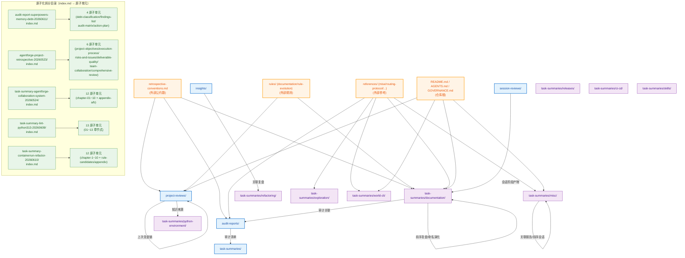
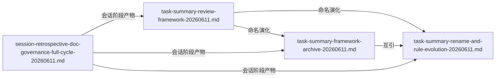
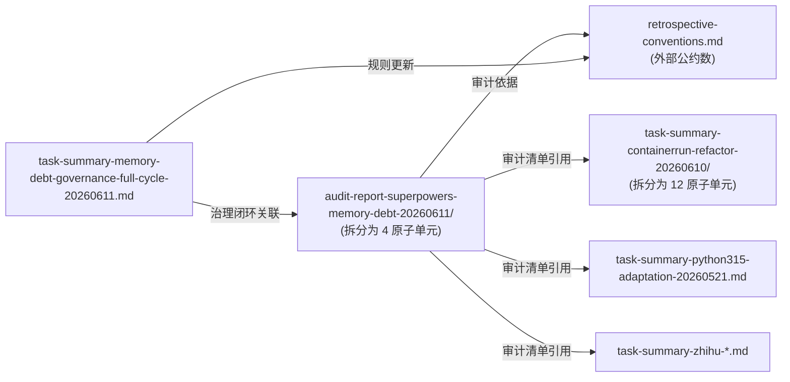
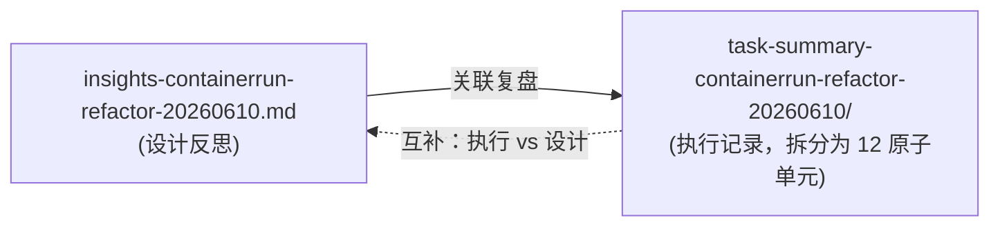

# 依赖关系图谱

> **生成日期**：2026-06-23
> **维护责任人**：Leader Agent
> **扫描范围**：`retrospectives/` 全目录及子模块
> **扫描方法**：正则匹配 `](xxx.md)` 形式的相对路径引用 + 反引号包裹的文件名引用

## 模块间依赖关系

> 说明：本表刻画一级模块/二级子模块之间的依赖方向。`A → B` 表示 A 模块内文档引用了 B 模块内文档。

| 引用方模块 | 被引用方模块 | 依赖方向 | 引用次数 | 关键引用文件 |
|---|---|---|---|---|
| project-reviews | project-reviews | 自引用（同模块历史复盘链） | 2 | retrospective-agentforge-project-20260601.md → agentforge-project-retrospective-20260523/ |
| project-reviews | task-summaries/python-environment | 跨模块 | 1 | project-retrospective-governance-assets-20260609.md → task-summary-lint-python313-20260609/ |
| insights | task-summaries/refactoring | 跨模块 | 2 | insights-containerrun-refactor-20260610.md → task-summary-containerrun-refactor-20260610/ |
| task-summaries/documentation | task-summaries/documentation | 自引用（前序复盘链） | 2 | task-summary-autoapi-action-items-closure-20260523.md → task-summary-sphinx-autoapi-warnings-clearance-20260523.md；task-summary-doc-governance-closure-20260525.md → task-summary-readme-changelog-sync-20260525.md |
| task-summaries/misc | task-summaries/misc | 自引用（关联报告） | 2 | task-summary-pdf-tools-full-evaluation-20260527.md ↔ task-summary-laozi-boshu-pdf-to-markdown-20260526.md |
| task-summaries/misc | task-summaries/misc | 自引用（前序会话） | 1 | task-summary-zhihu-full-session-20260526.md → task-summary-zhihu-integration-20260526.md |
| task-summaries/documentation | task-summaries/documentation | 自引用（命名演化链） | 3 | task-summary-framework-archive-20260611.md、task-summary-rename-and-rule-evolution-20260611.md、session-retrospective-doc-governance-full-cycle-20260611.md 三者互引 |
| session-reviews | task-summaries/documentation | 跨模块 | 3 | session-retrospective-doc-governance-full-cycle-20260611.md → task-summary-review-framework-20260611.md / task-summary-framework-archive-20260611.md / task-summary-rename-and-rule-evolution-20260611.md |
| task-summaries/documentation | audit-reports | 跨模块 | 1 | task-summary-memory-debt-governance-full-cycle-20260611.md → audit-report-superpowers-memory-debt-20260611/ |
| audit-reports | task-summaries（多子模块） | 跨模块（审计清单） | 5+ | audit-report-superpowers-memory-debt-20260611/findings-list.md 引用 task-summary-python315-adaptation、task-summary-containerrun-refactor、task-summary-taolib-v040-improvements、task-summary-taolib-v040-v060-full-sprint、task-summary-zhihu-integration、task-summary-zhihu-full-session 等 |
| audit-reports | references/mise | 跨模块（外部 references） | 7 | mise-knowledge-base-quality-audit-20260518.md → references/mise/03-基础使用.md、04-进阶功能.md、05-配置详解.md、07-常见问题.md |
| task-summaries/misc | references | 跨模块（外部 references） | 1 | task-summary-routing-system-20260528.md → references/routing-protocol.md |
| task-summaries/exploration | references | 跨模块（外部 references） | 1 | task-summary-spa-content-extraction-20260621.md → references/web-content-extraction-patterns.md |
| task-summaries/world-cli | references | 跨模块（外部 references） | 1 | task-summary-world-multi-surface-exploration-20260527.md → references/agent-collaboration-metamodel.md |
| task-summaries/documentation | references | 跨模块（外部 references） | 2 | task-summary-doc-governance-closure-20260525.md → references/doc-maintenance-workflow.md；task-summary-sphinx-autoapi-warnings-clearance-20260523.md → references/autoapi-docstring-style.md |
| 多模块 | rules/ | 跨模块（外部 rules） | 4 | retrospective-agentforge-project-20260601.md → rules/rule-evolution.md；task-summary-doc-governance-closure-20260525.md、task-summary-readme-changelog-sync-20260525.md → rules/documentation.md；task-summary-docs-strict-test-chain-20260523.md → rules/ |
| 多模块 | retrospective-conventions.md | 跨模块（外部公约数） | 5+ | retrospective-agentforge-project-20260601.md、audit-report-superpowers-memory-debt-20260611/index.md、task-summary-memory-debt-governance-full-cycle-20260611.md 等引用 |
| 多模块 | AGENTS.md / README.md / CHANGELOG.md | 跨模块（仓库根） | 5+ | task-summary-doc-governance-closure、task-summary-readme-changelog-sync、task-summary-routing-system 等引用 |

## 文档间引用关系

> 说明：仅列出 retrospectives/ 目录内文档之间的引用，以及对外部规范/规则/根目录文件的关键引用。原子化目录内 index.md → 原子单元的引用单独成段。

### 2.1 原子化目录内引用（index.md → 原子单元）

| 引用方（index.md 所在目录） | 被引用方（原子单元） | 引用路径 |
|---|---|---|
| audit-reports/audit-report-superpowers-memory-debt-20260611/ | debt-classification.md | `./debt-classification.md` |
| audit-reports/audit-report-superpowers-memory-debt-20260611/ | findings-list.md | `./findings-list.md` |
| audit-reports/audit-report-superpowers-memory-debt-20260611/ | audit-matrix.md | `./audit-matrix.md` |
| audit-reports/audit-report-superpowers-memory-debt-20260611/ | action-plan.md | `./action-plan.md` |
| project-reviews/agentforge-project-retrospective-20260523/ | project-objectives-review.md | `./project-objectives-review.md` |
| project-reviews/agentforge-project-retrospective-20260523/ | execution-process-review.md | `./execution-process-review.md` |
| project-reviews/agentforge-project-retrospective-20260523/ | risks-and-issues-review.md | `./risks-and-issues-review.md` |
| project-reviews/agentforge-project-retrospective-20260523/ | deliverable-quality-review.md | `./deliverable-quality-review.md` |
| project-reviews/agentforge-project-retrospective-20260523/ | team-collaboration-review.md | `./team-collaboration-review.md` |
| project-reviews/agentforge-project-retrospective-20260523/ | comprehensive-review-summary.md | `./comprehensive-review-summary.md` |
| task-summaries/misc/task-summary-agentforge-collaboration-system-20260524/ | chapter-01-execution-overview.md | `./chapter-01-execution-overview.md` |
| task-summaries/misc/task-summary-agentforge-collaboration-system-20260524/ | chapter-02-goals-and-background.md | `./chapter-02-goals-and-background.md` |
| task-summaries/misc/task-summary-agentforge-collaboration-system-20260524/ | chapter-03-execution-process.md | `./chapter-03-execution-process.md` |
| task-summaries/misc/task-summary-agentforge-collaboration-system-20260524/ | chapter-04-key-decisions.md | `./chapter-04-key-decisions.md` |
| task-summaries/misc/task-summary-agentforge-collaboration-system-20260524/ | chapter-05-problems-and-solutions.md | `./chapter-05-problems-and-solutions.md` |
| task-summaries/misc/task-summary-agentforge-collaboration-system-20260524/ | chapter-06-resource-usage.md | `./chapter-06-resource-usage.md` |
| task-summaries/misc/task-summary-agentforge-collaboration-system-20260524/ | chapter-07-team-collaboration.md | `./chapter-07-team-collaboration.md` |
| task-summaries/misc/task-summary-agentforge-collaboration-system-20260524/ | chapter-08-multi-dimensional-analysis.md | `./chapter-08-multi-dimensional-analysis.md` |
| task-summaries/misc/task-summary-agentforge-collaboration-system-20260524/ | chapter-09-experience-and-methods.md | `./chapter-09-experience-and-methods.md` |
| task-summaries/misc/task-summary-agentforge-collaboration-system-20260524/ | chapter-10-improvement-and-action.md | `./chapter-10-improvement-and-action.md` |
| task-summaries/misc/task-summary-agentforge-collaboration-system-20260524/ | appendix-a-deliverables-list.md | `./appendix-a-deliverables-list.md` |
| task-summaries/misc/task-summary-agentforge-collaboration-system-20260524/ | appendix-b-navigation-map.md | `./appendix-b-navigation-map.md` |
| task-summaries/python-environment/task-summary-lint-python313-20260609/ | 01-execution-overview.md | `./01-execution-overview.md` |
| task-summaries/python-environment/task-summary-lint-python313-20260609/ | 02-target-background.md | `./02-target-background.md` |
| task-summaries/python-environment/task-summary-lint-python313-20260609/ | 03-execution-process.md | `./03-execution-process.md` |
| task-summaries/python-environment/task-summary-lint-python313-20260609/ | 04-key-modifications.md | `./04-key-modifications.md` |
| task-summaries/python-environment/task-summary-lint-python313-20260609/ | 05-key-decisions.md | `./05-key-decisions.md` |
| task-summaries/python-environment/task-summary-lint-python313-20260609/ | 06-problems-and-solutions.md | `./06-problems-and-solutions.md` |
| task-summaries/python-environment/task-summary-lint-python313-20260609/ | 07-verification-records.md | `./07-verification-records.md` |
| task-summaries/python-environment/task-summary-lint-python313-20260609/ | 08-impact-analysis.md | `./08-impact-analysis.md` |
| task-summaries/python-environment/task-summary-lint-python313-20260609/ | 09-experience-summary.md | `./09-experience-summary.md` |
| task-summaries/python-environment/task-summary-lint-python313-20260609/ | 10-improvement-suggestions.md | `./10-improvement-suggestions.md` |
| task-summaries/python-environment/task-summary-lint-python313-20260609/ | 11-secondary-execution.md | `./11-secondary-execution.md` |
| task-summaries/python-environment/task-summary-lint-python313-20260609/ | 12-insight-report.md | `./12-insight-report.md` |
| task-summaries/python-environment/task-summary-lint-python313-20260609/ | 13-final-conclusion.md | `./13-final-conclusion.md` |
| task-summaries/refactoring/task-summary-containerrun-refactor-20260610/ | chapter-1-execution-overview.md | `./chapter-1-execution-overview.md` |
| task-summaries/refactoring/task-summary-containerrun-refactor-20260610/ | chapter-2-background-and-goals.md | `./chapter-2-background-and-goals.md` |
| task-summaries/refactoring/task-summary-containerrun-refactor-20260610/ | chapter-3-execution-process.md | `./chapter-3-execution-process.md` |
| task-summaries/refactoring/task-summary-containerrun-refactor-20260610/ | chapter-4-key-decisions.md | `./chapter-4-key-decisions.md` |
| task-summaries/refactoring/task-summary-containerrun-refactor-20260610/ | chapter-5-problems-and-solutions.md | `./chapter-5-problems-and-solutions.md` |
| task-summaries/refactoring/task-summary-containerrun-refactor-20260610/ | chapter-6-resource-usage.md | `./chapter-6-resource-usage.md` |
| task-summaries/refactoring/task-summary-containerrun-refactor-20260610/ | chapter-7-field-changes.md | `./chapter-7-field-changes.md` |
| task-summaries/refactoring/task-summary-containerrun-refactor-20260610/ | chapter-8-multi-dimensional-analysis.md | `./chapter-8-multi-dimensional-analysis.md` |
| task-summaries/refactoring/task-summary-containerrun-refactor-20260610/ | chapter-9-experience-and-methodology.md | `./chapter-9-experience-and-methodology.md` |
| task-summaries/refactoring/task-summary-containerrun-refactor-20260610/ | chapter-10-improvement-suggestions.md | `./chapter-10-improvement-suggestions.md` |
| task-summaries/refactoring/task-summary-containerrun-refactor-20260610/ | rule-candidates.md | `./rule-candidates.md` |
| task-summaries/refactoring/task-summary-containerrun-refactor-20260610/ | appendix.md | `./appendix.md` |

### 2.2 跨文件引用（retrospectives 内部）

| 引用方 | 被引用方 | 引用路径 | 引用类型 |
|---|---|---|---|
| project-reviews/retrospective-agentforge-project-20260601.md | project-reviews/agentforge-project-retrospective-20260523/ | `./agentforge-project-retrospective-20260523.md` | 上次复盘 |
| project-reviews/project-retrospective-governance-assets-20260609.md | task-summaries/python-environment/task-summary-lint-python313-20260609/ | `task-summary-lint-python313-20260609.md` | 历史复盘（知识来源） |
| insights/insights-containerrun-refactor-20260610.md | task-summaries/refactoring/task-summary-containerrun-refactor-20260610/ | `task-summary-containerrun-refactor-20260610.md` | 关联复盘 |
| task-summaries/documentation/task-summary-autoapi-action-items-closure-20260523.md | task-summaries/documentation/task-summary-sphinx-autoapi-warnings-clearance-20260523.md | `task-summary-sphinx-autoapi-warnings-clearance-20260523.md` | 关联前序复盘 |
| task-summaries/documentation/task-summary-autoapi-action-items-closure-20260523.md | task-summaries/documentation/task-summary-docs-strict-test-chain-20260523.md | `task-summary-docs-strict-test-chain-20260523.md` | 未跟踪复盘警示 |
| task-summaries/documentation/task-summary-doc-governance-closure-20260525.md | task-summaries/documentation/task-summary-readme-changelog-sync-20260525.md | `./task-summary-readme-changelog-sync-20260525.md` | 上一份原型复盘 |
| task-summaries/misc/task-summary-pdf-tools-full-evaluation-20260527.md | task-summaries/misc/task-summary-laozi-boshu-pdf-to-markdown-20260526.md | `task-summary-laozi-boshu-pdf-to-markdown-20260526.md` | 关联报告 |
| task-summaries/misc/task-summary-laozi-boshu-pdf-to-markdown-20260526.md | task-summaries/misc/task-summary-pdf-tools-full-evaluation-20260527.md | `task-summary-pdf-tools-full-evaluation-20260527.md` | 关联报告 |
| task-summaries/misc/task-summary-zhihu-full-session-20260526.md | task-summaries/misc/task-summary-zhihu-integration-20260526.md | `task-summary-zhihu-integration-20260526.md` | 前一会话复盘 |
| task-summaries/documentation/task-summary-framework-archive-20260611.md | task-summaries/documentation/task-summary-review-framework-20260611.md | `task-summary-review-framework-20260611.md` | 命名演化前序 |
| task-summaries/documentation/task-summary-rename-and-rule-evolution-20260611.md | task-summaries/documentation/task-summary-review-framework-20260611.md | `task-summary-review-framework-20260611.md` | 命名演化前序 |
| task-summaries/documentation/task-summary-rename-and-rule-evolution-20260611.md | task-summaries/documentation/task-summary-framework-archive-20260611.md | `task-summary-framework-archive-20260611.md` | 命名演化前序 |
| session-reviews/session-retrospective-doc-governance-full-cycle-20260611.md | task-summaries/documentation/task-summary-review-framework-20260611.md | `task-summary-review-framework` | 会话阶段产物 |
| session-reviews/session-retrospective-doc-governance-full-cycle-20260611.md | task-summaries/documentation/task-summary-framework-archive-20260611.md | `task-summary-framework-archive-20260611.md` | 会话阶段产物 |
| session-reviews/session-retrospective-doc-governance-full-cycle-20260611.md | task-summaries/documentation/task-summary-rename-and-rule-evolution-20260611.md | `task-summary-rename-and-rule-evolution-20260611.md` | 会话阶段产物 |
| task-summaries/documentation/task-summary-memory-debt-governance-full-cycle-20260611.md | audit-reports/audit-report-superpowers-memory-debt-20260611/ | `audit-report-superpowers-memory-debt-20260611.md` | 审计报告关联 |
| audit-reports/audit-report-superpowers-memory-debt-20260611/findings-list.md | task-summaries/python-environment/task-summary-python315-adaptation-20260521.md | 文件名引用 | 审计清单 |
| audit-reports/audit-report-superpowers-memory-debt-20260611/findings-list.md | task-summaries/refactoring/task-summary-containerrun-refactor-20260610/ | 文件名引用 | 审计清单 |
| audit-reports/audit-report-superpowers-memory-debt-20260611/findings-list.md | task-summaries/releases/task-summary-taolib-v040-improvements-20260523.md | 文件名引用 | 审计清单 |
| audit-reports/audit-report-superpowers-memory-debt-20260611/findings-list.md | task-summaries/releases/task-summary-taolib-v040-v060-full-sprint-20260524.md | 文件名引用 | 审计清单 |
| audit-reports/audit-report-superpowers-memory-debt-20260611/findings-list.md | task-summaries/misc/task-summary-zhihu-integration-20260526.md | 文件名引用 | 审计清单 |
| audit-reports/audit-report-superpowers-memory-debt-20260611/findings-list.md | task-summaries/misc/task-summary-zhihu-full-session-20260526.md | 文件名引用 | 审计清单 |

### 2.3 外部引用（retrospectives → 仓库其他位置）

| 引用方 | 被引用方 | 引用路径 | 引用类型 |
|---|---|---|---|
| project-reviews/retrospective-agentforge-project-20260601.md | retrospective-conventions.md | `../../retrospective-conventions.md` | 规范依据 |
| project-reviews/retrospective-agentforge-project-20260601.md | rules/rule-evolution.md | `../../rules/rule-evolution.md` | 五维准入标准 |
| project-reviews/retrospective-agentforge-project-20260601.md | specs/agentforge-spec-v0.2.md | `../../../specs/agentforge-spec-v0.2.md` | 架构规范 |
| project-reviews/retrospective-agentforge-project-20260601.md | GOVERNANCE.md | `../../../../../GOVERNANCE.md` | 治理文件 |
| project-reviews/retrospective-agentforge-project-20260601.md | AGENTS.md | `../../../../AGENTS.md` | 路由表 |
| audit-reports/audit-report-superpowers-memory-debt-20260611/index.md | retrospective-conventions.md | 反引号引用 | 审计依据 |
| audit-reports/audit-report-superpowers-memory-debt-20260611/index.md | documentation.md | 反引号引用 | 审计依据 |
| audit-reports/audit-report-superpowers-memory-debt-20260611/index.md | rule-evolution.md | 反引号引用 | 审计依据 |
| audit-reports/audit-report-superpowers-memory-debt-20260611/index.md | agent-memory-dream-protocol.md | 反引号引用 | 审计依据 |
| audit-reports/audit-report-superpowers-memory-debt-20260611/index.md | superpowers/README.md | 反引号引用 | 审计依据 |
| audit-reports/mise-knowledge-base-quality-audit-20260518.md | references/mise/03-基础使用.md | `../../references/mise/03-基础使用.md` | 审计对象 |
| audit-reports/mise-knowledge-base-quality-audit-20260518.md | references/mise/04-进阶功能.md | `../../references/mise/04-进阶功能.md` | 审计对象 |
| audit-reports/mise-knowledge-base-quality-audit-20260518.md | references/mise/05-配置详解.md | `../../references/mise/05-配置详解.md` | 审计对象 |
| audit-reports/mise-knowledge-base-quality-audit-20260518.md | references/mise/07-常见问题.md | `../../references/mise/07-常见问题.md` | 审计对象 |
| task-summaries/documentation/task-summary-doc-governance-closure-20260525.md | README.md | `../../../../README.md` | 治理对象 |
| task-summaries/documentation/task-summary-doc-governance-closure-20260525.md | CHANGELOG.md | `../../../../CHANGELOG.md` | 治理对象 |
| task-summaries/documentation/task-summary-doc-governance-closure-20260525.md | rules/documentation.md | `../../../rules/documentation.md` | 规范依据 |
| task-summaries/documentation/task-summary-doc-governance-closure-20260525.md | references/doc-maintenance-workflow.md | `../../references/doc-maintenance-workflow.md` | 工作流参考 |
| task-summaries/documentation/task-summary-readme-changelog-sync-20260525.md | README.md | `../../../../README.md` | 治理对象 |
| task-summaries/documentation/task-summary-readme-changelog-sync-20260525.md | CHANGELOG.md | `../../../../CHANGELOG.md` | 治理对象 |
| task-summaries/documentation/task-summary-readme-changelog-sync-20260525.md | rules/documentation.md | `../../../rules/documentation.md` | 规范依据 |
| task-summaries/documentation/task-summary-sphinx-autoapi-warnings-clearance-20260523.md | docs/contributing.md | `../../../../docs/contributing.md` | 贡献者入口 |
| task-summaries/documentation/task-summary-sphinx-autoapi-warnings-clearance-20260523.md | references/autoapi-docstring-style.md | `../../references/autoapi-docstring-style.md` | 详细参考 |
| task-summaries/documentation/task-summary-docs-strict-test-chain-20260523.md | mise.toml | `../../../../mise.toml` | 配置文件 |
| task-summaries/documentation/task-summary-docs-strict-test-chain-20260523.md | src/taolib/github_app/config.py | `../../../../src/taolib/github_app/config.py` | 源码 |
| task-summaries/documentation/task-summary-docs-strict-test-chain-20260523.md | tests/test_tasks.py | `../../../../tests/test_tasks.py` | 测试文件 |
| task-summaries/documentation/task-summary-memory-debt-governance-full-cycle-20260611.md | retrospective-conventions.md | 反引号引用 | 规范依据 |
| task-summaries/misc/task-summary-routing-system-20260528.md | references/routing-protocol.md | `../../references/routing-protocol.md` | 路由协议草案 |
| task-summaries/misc/task-summary-routing-system-20260528.md | AGENTS.md | `../../../../AGENTS.md` | 路由表登记 |
| task-summaries/exploration/task-summary-spa-content-extraction-20260621.md | references/web-content-extraction-patterns.md | `../references/web-content-extraction-patterns.md` | 方法论文档 |
| task-summaries/exploration/task-summary-spa-content-extraction-20260621.md | .trae/skills/spa-content-extractor/SKILL.md | `../../../.trae/skills/spa-content-extractor/SKILL.md` | 技能定义 |
| task-summaries/exploration/task-summary-spa-content-extraction-20260621.md | .trae/skills/spa-content-extractor/prompt-template.md | `../../../.trae/skills/spa-content-extractor/prompt-template.md` | 可复用 Prompt |
| task-summaries/world-cli/task-summary-world-multi-surface-exploration-20260527.md | references/agent-collaboration-metamodel.md | `../../references/agent-collaboration-metamodel.md` | 协作元模型 |
| task-summaries/world-cli/task-summary-world-multi-surface-exploration-20260527.md | docs/tech/world-session-spec.md | `../../../../../docs/tech/world-session-spec.md` | 规约草案 |
| task-summaries/world-cli/task-summary-world-multi-surface-exploration-20260527.md | world.toml | `../../../../world.toml` | World 定义 |
| task-summaries/python-environment/task-summary-mise-dev-environment-20260522.md | .trae/specs/adopt-mise-dev-environment/spec.md | `file:///...spec.md` | 需求定义（绝对路径） |
| task-summaries/python-environment/task-summary-mise-dev-environment-20260522.md | .trae/specs/adopt-mise-dev-environment/checklist.md | `file:///...checklist.md` | 验收标准（绝对路径） |
| task-summaries/documentation/task-summary-invoke-docs-workflows-release-20260522.md | README.md / docs/changelogs/*.md | `file:///...` | 治理对象（绝对路径） |

## 关键依赖链可视化

## 关键依赖链说明

### 1. 项目复盘时间链（project-reviews 自引用）

### 2. 文档治理命名演化链（task-summaries/documentation 自引用）

### 3. 记忆债务治理闭环（跨模块 audit-reports ↔ task-summaries）

### 4. insights ↔ task-summary 互补关系

## 统计摘要

| 指标 | 数值 |
|---|---|
| 扫描 .md 文件总数 | 91（含原子单元） |
| 原始文件总数（迁移前） | 72 |
| 原子化拆分目录数 | 5 |
| 拆分产生的原子单元总数 | 47（4+6+12+13+12） |
| 模块间内部引用数 | 22 |
| 外部引用数（→ rules/refs/root） | 35+ |
| 原子化目录内 index→单元引用数 | 47 |
| 关键外部公约数 | retrospective-conventions.md（被 5+ 文件引用） |
| 关键外部规则 | rules/documentation.md、rules/rule-evolution.md |
