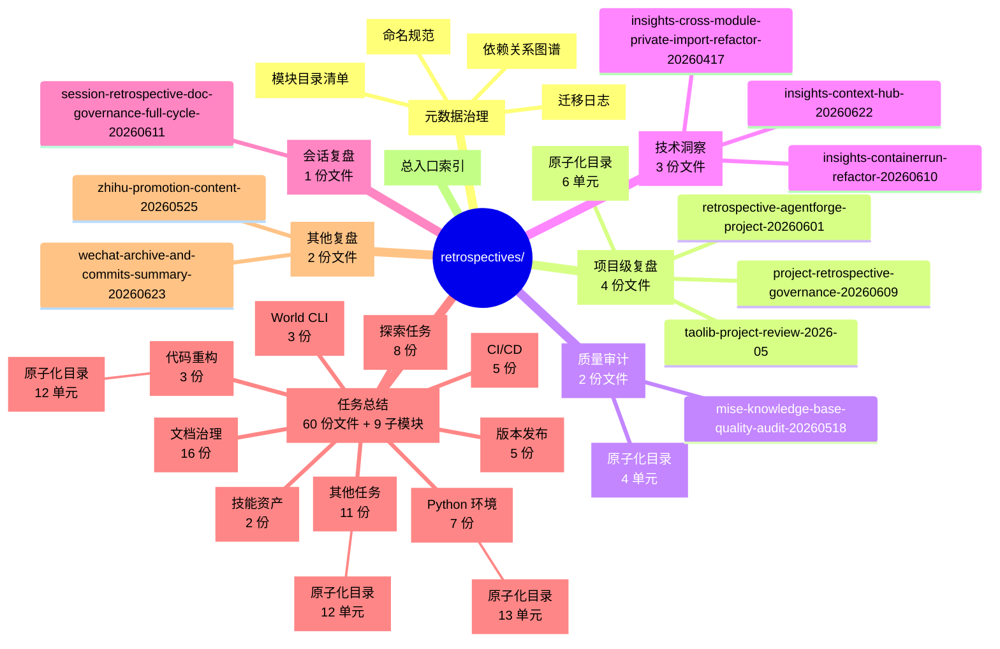
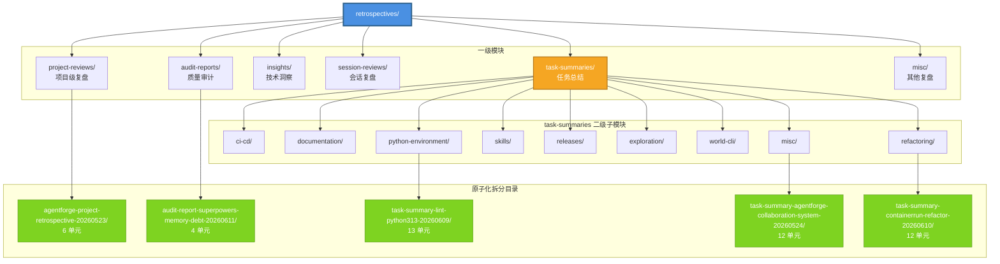

# Retrospectives 模块化结构思维导图

> **生成日期**：2026-06-23
> **用途**：帮助团队快速理解 retrospectives 模块化重构后的目录划分与层级关系
> **配套文档**：[module-catalog.md](./module-catalog.md)、[dependency-graph.md](./dependency-graph.md)

## 可视化思维导图

## 模块层级关系图

## 统计摘要

| 维度 | 数量 |
|------|------|
| 一级模块 | 6 |
| 二级子模块（task-summaries 下） | 9 |
| 原子化拆分目录 | 5 |
| 原子单元文件总数 | 47 |
| 模块 README 总数 | 15 |
| 元数据文档 | 4 |
| 原始文件迁移完成率 | 100% (72/72) |

## 模块功能速查

| 模块 | 核心用途 | 典型场景 |
|------|---------|---------|
| `project-reviews/` | 项目级阶段性全面复盘 | 季度回顾、里程碑总结 |
| `audit-reports/` | 质量审计与债务评估 | 技术债盘点、知识库质量审计 |
| `insights/` | 技术洞察与设计反思 | 架构反思、设计模式洞察 |
| `session-reviews/` | 单次会话复盘 | 重要会话过程记录 |
| `task-summaries/` | 任务执行总结（按主题分类） | 查找特定任务的执行记录 |
| `misc/` | 其他复盘 | 微信归档、知乎推广等 |

## 原子化拆分说明

5 份大型多主题文档（>500 行）已拆分为原子化目录，每个目录含：

- `index.md` — 索引文件，提供导航与章节映射
- 多个原子单元文件 — 每个专注单一主题，可独立阅读

| 原子化目录 | 所属模块 | 原始行数 | 原子单元数 |
|-----------|---------|---------|-----------|
| `agentforge-project-retrospective-20260523/` | project-reviews | 575 | 6 |
| `audit-report-superpowers-memory-debt-20260611/` | audit-reports | 398 | 4 |
| `task-summary-lint-python313-20260609/` | python-environment | 878 | 13 |
| `task-summary-agentforge-collaboration-system-20260524/` | misc | 777 | 12 |
| `task-summary-containerrun-refactor-20260610/` | refactoring | 546 | 12 |

## 使用指南

1. **快速浏览全局**：从上方思维导图入手，理解模块层级关系
2. **定位特定主题**：根据模块功能速查表，进入对应一级模块的 README
3. **深入大型文档**：进入原子化目录的 `index.md`，按章节导航
4. **理解依赖关系**：查看 [dependency-graph.md](./dependency-graph.md)
5. **验证迁移完整性**：查看 [migration-log.md](./migration-log.md)
