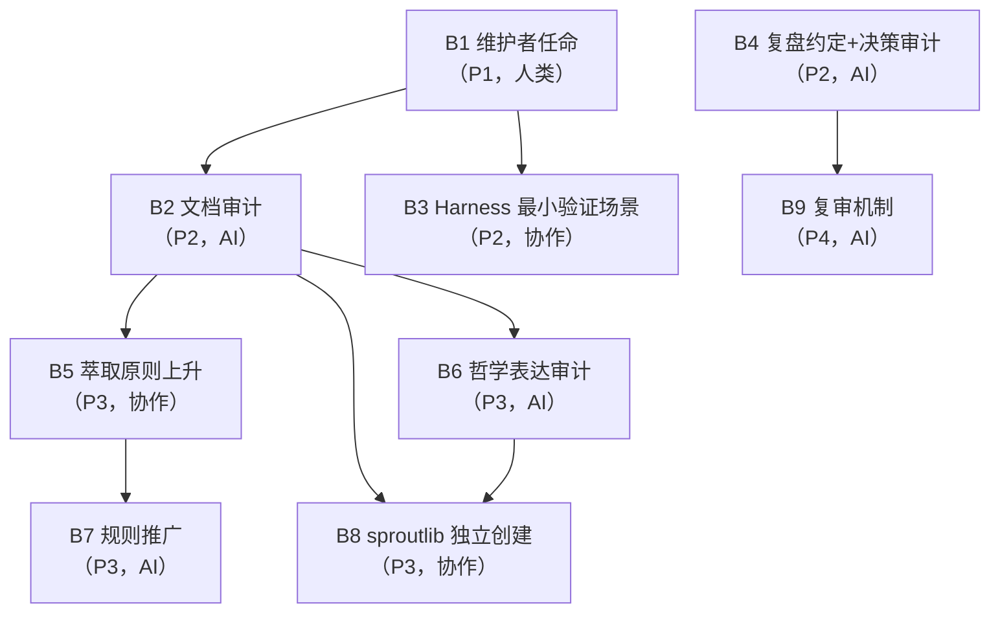

# 行动项追踪文档

> **来源**：[retrospective-agentforge-comprehensive-20260623.md](retrospective-agentforge-comprehensive-20260623.md) 综合复盘报告 + 7 条深层洞察
> **创建日期**：2026-06-23
> **维护者**：xinetzone（人类）+ AI 协作者
> **更新规则**：每次状态变更时追加进度日志；AI 可独立更新执行类行动项，决策类行动项需人类审批后更新

## 1. 状态定义

| 状态 | 含义 | 颜色标记 |
|------|------|---------|
| ⬜ 未开始 | 尚未启动 | — |
| 🔄 进行中 | 正在执行 | — |
| ✅ 已完成 | 验收通过 | — |
| ⛔ 阻塞 | 被依赖项卡住或需人类决策 | — |
| ❌ 取消 | 经重新评估后取消 | — |

## 2. 优先级定义

| 优先级 | 含义 | 期望完成时间 |
|--------|------|------------|
| P1 | 阻塞性，必须立即启动 | 本周 |
| P2 | 高优先级，本迭代内完成 | 2 周内 |
| P3 | 中等优先级，下个迭代完成 | 1 个月内 |
| P4 | 低优先级，技术债务 | 季度内 |

## 3. 行动项总表

| # | 行动项 | 来源洞察 | 责任方 | 优先级 | 触发条件 | 验收方式 | 状态 | 进度 |
|---|--------|---------|--------|--------|---------|---------|------|------|
| B1 | 启动维护者正式任命流程 | 洞察 3 | 人类 | P1 | 立即 | GOVERNANCE.md 中维护者名单不再为空；至少 1 名 Layer 2 维护者任命完成 | ⬜ | 0% |
| B2 | 审计 rebirth/worldsprout/ 文档中对未实现资产的引用 | 洞察 2 | AI | P2 | B1 完成后 | 所有引用 `sproutlib` 的位置标注 `[planned]` 或 `[TODO]`；审计报告归档至 `.temp/` | ⬜ | 0% |
| B3 | 为 Harness 系统设计最小可验证场景 | 洞察 6 | 协作 | P2 | B1 完成后 | 1 个端到端场景通过 Phase 0 兼容性测试；测试报告含通过/失败项明细 | ⬜ | 0% |
| B4 | 在复盘约定中增加"决策审计"环节 | 洞察 7 | AI | P2 | 立即（不依赖 B1） | `retrospective-conventions.md` 新增决策审计章节；含审计清单模板 | ⬜ | 0% |
| B5 | 将"脱胎 = 萃取 + 独立创建"上升为脱胎态原则 | 洞察 4 | 协作 | P3 | B2 完成后 | `rebirth-extraction.md` 规则从 Draft 转 Active；或写入 AgentForge Spec v0.3 | ⬜ | 0% |
| B6 | 审计脱胎态文档中哲学表达的显性程度 | 洞察 5 | AI | P3 | B2 完成后 | 审计报告列出所有显性哲学引用；建议哪些转为隐性约束；归档至 `.temp/` | ⬜ | 0% |
| B7 | 推广 rebirth-extraction.md 规则至实际工作流 | 洞察 1 | AI | P3 | B5 完成后 | 规则被 ≥ 3 次实际引用；`usage_feedback` 字段开始记录 | ⬜ | 0% |
| B8 | rebirth/worldsprout/ 独立创建 sproutlib 包 | 洞察 4 | 协作 | P3 | B2、B6 完成后 | `rebirth/worldsprout/src/sproutlib/` 目录创建；从 taolib 萃取 world CLI；apps/chaos/ 无变更 | ⬜ | 0% |
| B9 | 建立"未执行决策"定期复审机制 | 洞察 7 | AI | P4 | B4 完成后 | 每次复盘自动审计"待执行"决策项；≥ 30 天未执行的决策触发重新评估 | ⬜ | 0% |

## 4. 依赖关系图

## 5. 执行阶段划分

### 第一阶段（立即，P1-P2）

| 行动项 | 责任方 | 备注 |
|--------|--------|------|
| B1 维护者任命 | 人类 | 所有协作行动项的前置条件 |
| B4 复盘约定+决策审计 | AI | 不依赖 B1，可立即执行 |

### 第二阶段（B1 完成后，P2）

| 行动项 | 责任方 | 备注 |
|--------|--------|------|
| B2 文档审计 | AI | 产出审计报告，人类 review 结论 |
| B3 Harness 最小验证场景 | 协作 | 需人类界定场景范围 |

### 第三阶段（B2 完成后，P3）

| 行动项 | 责任方 | 备注 |
|--------|--------|------|
| B5 萃取原则上升 | 协作 | 涉及标准变更，需人类决策 |
| B6 哲学表达审计 | AI | 产出审计报告，人类 review 建议 |
| B8 sproutlib 独立创建 | 协作 | 依赖 B2 + B6 |

### 第四阶段（持续，P3-P4）

| 行动项 | 责任方 | 备注 |
|--------|--------|------|
| B7 规则推广 | AI | 累积频率至 ≥ 3 次 |
| B9 复审机制 | AI | 依赖 B4 |

## 6. 人机协作分工

| 分工类型 | 行动项 | 说明 |
|---------|--------|------|
| **AI 可独立完成** | B2、B4、B6、B9 | 产出草案/报告，人类只需 review 结论或批准合入 |
| **必须人类决策** | B1、B3、B5、B8 | 涉及人事/战略/标准/架构判断 |

## 7. 进度更新日志

> 每次状态变更时在此追加记录。格式：`| 日期 | 行动项 | 变更内容 | 更新人 |`

| 日期 | 行动项 | 变更内容 | 更新人 |
|------|--------|---------|--------|
| 2026-06-23 | B1-B9 | 初始创建，全部状态为 ⬜ 未开始 | AI 协作者 |

## 8. 关键瓶颈与缓解

**瓶颈**：B1（维护者任命）是单点阻塞——B2、B3、B5、B6、B8 都依赖它。

**缓解方案**：
1. B4 不依赖 B1，可立即由 AI 执行——先建立"决策审计"机制
2. B2 的文档审计可由 AI 先行产出草案，待 B1 完成后人类快速审批
3. 若 B1 短期内无法完成，可定义"临时维护者授权"——xinetzone 以"发起人"身份临时行使 Layer 2 维护者职权，待正式任命后转正

## 9. 关联文档

- [综合复盘报告](retrospective-agentforge-comprehensive-20260623.md) — 行动项来源
- [脱胎萃取规则](../../../rules/rebirth-extraction.md) — B5、B7、B8 的规则依据
- [规则演化与生长通道](../../../rules/rule-evolution.md) — B5、B7 的准入标准
- [复盘约定](../../retrospective-conventions.md) — B4 的更新目标
- [脱胎复盘](../../../../../../rebirth/RETROSPECTIVE.md) — B2 的审计对象之一
