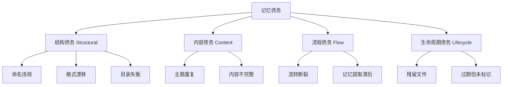
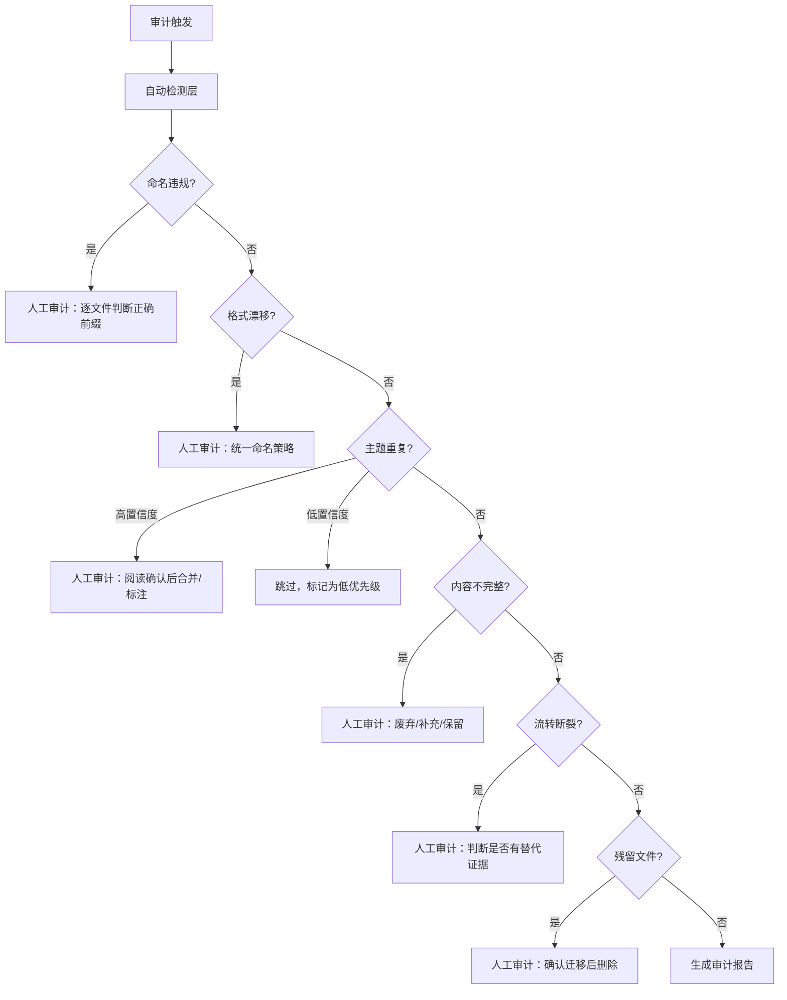

# superpowers/ 记忆债务审计报告

> **审计日期**：2026-06-11
> **审计范围**：`apps/chaos/.agents/docs/superpowers/` 全目录（103 文件）
> **审计依据**：`retrospective-conventions.md`、`documentation.md §2.1`、`rule-evolution.md`、`agent-memory-dream-protocol.md`、`superpowers/README.md`

---

## 第一章：记忆债务分类体系

基于对 103 个文件和 11 份管理规范的系统分析，将记忆债务划分为 **四类九型**：



### 债务类型定义

| 大类 | 亚型 | 定义 | 检测难度 |
|------|------|------|---------|
| **S1 命名违规** | 文件名不符合目录约定的命名模式 | 低（机械化检测） |
| **S2 格式漂移** | 同一目录内多种命名格式并存 | 低（机械化检测） |
| **S3 目录失衡** | 子目录间文件密度严重不均 | 低（机械化检测） |
| **C1 主题重复** | 同一主题存在多份文件 | 中（需 NLP 语义判断） |
| **C2 内容不完整** | 文件规模显著低于同级中位数 | 中（统计+人工抽样） |
| **F1 流转断裂** | Plan 无 Spec、Spec 无下游产物 | 低（机械化对照） |
| **F2 记忆提取滞后** | Memories 数量远低于 Retrospectives | 低（机械化统计） |
| **L1 残留文件** | 迁移存根、已完成但未清理的过渡文件 | 中（需上下文判断） |
| **L2 过期未标记** | Memory 条目缺少过期条件或已过期 | 高（需完整内容阅读） |

---

## 第二章：记忆债务发现清单

### 2.1 结构债务（8 项）

#### S1-1：retrospectives/ 无前缀格式（✅ 已解决）

**现象**：14 个文件使用 `YYYY-MM-DD-<topic>.md` 格式，不包含 `task-summary-` 或 `retrospective-` 前缀。

**处置**：已逐文件判断类型并重命名——13 个为 `task-summary-`（任务执行总结），1 个为无前缀审计报告（`mise-knowledge-base-quality-audit`）。全部内部路径自引用已同步更新。

**自动化检测**：✅ 完全可行。用正则匹配 `^\d{4}-\d{2}-\d{2}-` 开头但无 `task-summary-`/`retrospective-`/`insights-` 前缀的文件。

**解决日期**：2026-06-11

#### S1-2：taolib-project-review 使用月级日期（✅ 已解决）

**现象**：`taolib-project-review-2026-05.md` 使用 `YYYY-MM` 而非 `YYYY-MM-DD`。

**审计结论**：该文件为月度项目分析报告（架构/模块/设计模式），非单日任务复盘。文件内元数据标注日期为 2026-05-23，建议后续重命名为 `taolib-monthly-review-20260523.md` 以同时体现月度语义和创建日期。当前状态可接受。

**自动化检测**：✅ 可行。正则匹配非 `\d{8}` 的日期后缀。

**解决日期**：2026-06-11

#### S2-1：retrospectives/ 四种命名格式并存（✅ 已解决）

**原始现象**：

| 格式 | 数量 | 占比 |
|------|------|------|
| `task-summary-{topic}-YYYYMMDD.md` | 42 | 64.6% |
| `YYYY-MM-DD-{topic}.md` | 14 | 21.5% |
| `{prefix}-{topic}-YYYYMMDD.md` | 8 | 12.3% |
| `{topic}-YYYY-MM.md` | 1 | 1.5% |

**处置**：S1-1 重命名消除了 14 个日期前置文件。当前格式分布：

| 格式 | 数量 | 说明 |
|------|------|------|
| `{prefix}-{topic}-YYYYMMDD.md` | ~63 | 主导格式（含 task-summary/retrospective/insights） |
| `{topic}-YYYY-MM.md` | 1 | 月级分析（已确认可接受） |
| 无前缀审计 | 1 | 专项审查（符合规范） |

格式漂移已从 4 种缩减为 2 种可接受变体（主导 + 月级），无需进一步策略制定。

**自动化检测**：✅ 完全可行。对同层文件按命名模式聚类。

**解决日期**：2026-06-11

#### S3-1：目录密度失衡

| 子目录 | 文件数 | 最后更新 | 状态 |
|--------|--------|---------|------|
| memories/ | 7 | 06-02 | 休眠中 |
| plans/ | 17 | 05-24 | 已停滞 18 天 |
| specs/ | 14 | 05-28 | 已停滞 14 天 |
| retrospectives/ | 65 | 06-11 | 持续活跃 |

retrospectives 占比 63%，memories 仅占 6.8%。文件密度比为 65:17:14:7。

**自动化检测**：✅ 完全可行。统计各子目录文件数并计算占比。

**建议**：无需立即行动。密度比反映了项目当前处于"执行+复盘密集期"，但 memory 提取管道需要后续激活。

---

### 2.2 内容债务（8 项）

#### C1-1：python315-adaptation 同日双文件（✅ 已解决）

| 文件 | 行数 | 处置 |
|------|------|------|
| `python315-adaptation-20260521.md` | 149 | 已删除 |
| `task-summary-python315-adaptation-20260521.md` | 294 → 320 | 保留，合并了短文件 §4「关键发现」为 §3.5 |

两台文件同日创建、主题相同、仅前缀不同。经章节级对比（遵照 §2.2 文件去重规则），短文件独有 §4「关键发现」（PEP 价值评估表、标准库影响分析、CVE 清单），已合并至保留文件后删除冗余。

**自动化检测**：⚠️ 部分可行。可通过文件名相似度（编辑距离/前缀剥离后比对）检测，但最终需要人工确认内容是否确实重复。

**解决日期**：2026-06-11

#### C1-2：containerrun-refactor 同日双文件（✅ 已解决）

| 文件 | 行数 | 视角 |
|------|------|------|
| `insights-containerrun-refactor-20260610.md` | 198 | 设计反思：escape hatch 模式、耦合方向、可选字段哲学 |
| `task-summary-containerrun-refactor-20260610.md` | 546 | 执行总结：5 轮改动、关键决策、问题解决 |

**审计结论**：`insights-` 原非规范前缀，现已采纳加入 `retrospective-conventions.md` §2.2。两份文件互补——task-summary 记录执行过程，insights 提炼设计原则。insights 文件已内置对 task-summary 的 `关联复盘` 引用，无需合并。

**解决日期**：2026-06-11

#### C1-3：agentforge-project 两文件 9 天间隔（✅ 已解决）

| 文件 | 行数 | 日期 | 覆盖周期 |
|------|------|------|---------|
| `agentforge-project-retrospective-20260523.md` | 575 | 05-23 | 05-18 → 05-23（Phase 1） |
| `retrospective-agentforge-project-20260601.md` | 477 | 06-01 | 05-23 → 06-01（Phase 2） |

**审计结论**：顺序回顾，非重复。06-01 已内建对 05-23 的 `上次复盘` 引用，覆盖不同时间周期。两份互补——05-23 是基线全面回顾，06-01 是增量复盘。

**解决日期**：2026-06-11

#### C1-4：taolib 版本线三文件（✅ 已解决）

| 文件 | 行数 | 类型 |
|------|------|------|
| `taolib-project-review-2026-05.md` | 264 | 月度项目分析（架构/模块/设计模式） |
| `task-summary-taolib-v040-improvements-20260523.md` | 192 | 子任务：v0.4.0 P1-P3 改进 |
| `task-summary-taolib-v040-v060-full-sprint-20260524.md` | 334 | 全量 Sprint：v0.4.0→v0.6.0（4 个版本） |

**审计结论**：三种不同报告类型，非重复。月度分析是结构性项目审查，v040-improvements 是单版本子任务细节，full-sprint 是跨版本全量执行报告。三者角度互补。

**解决日期**：2026-06-11

#### C1-5：zhihu 主题三文件（✅ 已解决）

| 文件 | 行数 | 日期 | 范围 |
|------|------|------|------|
| `zhihu-promotion-content-20260525.md` | 197 | 05-25 | 内容创作专项复盘 |
| `task-summary-zhihu-integration-20260526.md` | 475 | 05-26 | 主会话：7 Phase 全流程（学习→内容→API→Skill→注册） |
| `task-summary-zhihu-full-session-20260526.md` | 597 | 05-26 | **延续会话**：Token验证+清理+全面复盘+P1-P3改进 |

**审计结论**：覆盖不同会话/阶段，非重复。`full-session` 是 `integration` 的**延续会话**（非子集），处理前一会话未完成的 Token 验证、临时清理和改进执行。三文件互补——内容专项 + 主会话 + 延续会话。

**解决日期**：2026-06-11

#### C1-6：memories/ 同日双 principle（✅ 已解决）

| 文件 | 行数 | 维度 |
|------|------|------|
| `2026-06-02-external-knowledge-ingestion-principle.md` | 54 | **WHAT**：产出架构（sources/references/index 三层、真实源识别、轻清洗） |
| `2026-06-02-knowledge-ingestion-task-boundary-principle.md` | 54 | **HOW**：过程边界（原子提交拆分、复盘≠记忆、lint 范围管理） |

同一日期、同一主题域、均为 principle 类型、行数完全相同。

**审计结论**：两份 memory 来自不同来源任务（Hello-Agents vs DeepAgents），覆盖维度正交——一个管产出架构，一个管过程边界。**不应合并**。已双向添加 `关联记忆` 引用，明确职责边界。

**解决日期**：2026-06-11

#### C2-1：Plans/ 中的微型文件（✅ 已解决）

| 文件 | 行数 | 中位数倍数 | 处置 |
|------|------|-----------|------|
| `2026-05-23-init-onboarding-output.md` | 22 | 0.07x | ✅ 已实施，保留存档 |
| `2026-05-24-agent-context-structure-optimization.md` | 54 | 0.18x | ✅ 已实施，保留存档 |

plans/ 中位数为 299 行。22 行文件已确认非废弃草稿——plan 规定的修改（tasks.py 新增 `_print_plan`/`_print_success_next_steps`/`_print_failure` + test_tasks.py 10 个测试）已于 2026-05-23 实施完成，对应复盘 `task-summary-init-onboarding-output-20260523.md` 可印证。54 行文件也已确认实施——plan 规定的 `context-economy.md`、`documentation.md`、`python.md` 均已创建并归档于 `.agents/rules/`，AGENTS.md 亦已精简为路由入口。

**自动化检测**：✅ 可行。统计行数列，标记 < 中位数 20% 的文件。

**解决日期**：2026-06-11（22 行文件部分）

#### C2-2：Specs/ 中的微型设计（✅ 已解决）

| 文件 | 行数 | 中位数倍数 | 处置 |
|------|------|-----------|------|
| `2026-05-20-task-execution-summary-description-compression-design.md` | 31 | 0.11x | 已实施，保留存档 |
| `2026-05-20-task-execution-summary-minimal-fix-design.md` | 37 | 0.13x | 已实施，保留存档 |

两份 spec 均已实施落地——SKILL.md 升级至 v2.2（minimal-fix）+ v2.3/v2.4（description-compression），CHANGELOG 有对应版本记录。非设计碎片，是已完成的轻量设计文档。

**解决日期**：2026-06-11

---

### 2.3 流程债务（3 项）

#### F1-1：Plan 无 Spec（6 个）（✅ 已解决）

| Plan | 证据 | 状态 |
|------|------|------|
| init-onboarding-output | 复盘 + tasks.py/test_tasks.py | ✅ 已实施 |
| agent-context-structure-optimization | context-economy.md/documentation.md/python.md 已创建 | ✅ 已实施 |
| agent-token-reduction-guide | 非标准 Plan（纯知识指南），内容已通过 context-economy.md 规则落地 | ✅ 已落地 |
| cli-status-diagnostics-exploration | `.trae/specs/` 完整工作台 + 复盘 | ✅ 闭环完整 |
| exploration-reference-integrity-check | `.trae/specs/` 完整工作台 + 复盘 | ✅ 闭环完整 |
| exploration-template-reuse-check | `.trae/specs/` 完整工作台 + 复盘 | ✅ 闭环完整 |

**审计结论**：全部 6 个 Plan 均有替代证据（复盘、实施产物或规则文件）。agent-token-reduction-guide 本质是知识指南而非可执行计划，归类到 plans/ 目录属于分类偏差。其余 5 个中 2 个直接实施 + 3 个有完整 Spec 工作台。

**解决日期**：2026-06-11

#### F1-2：Spec 无 Plan（2 个）（✅ 已解决）

| Spec | 证据 |
|------|------|
| task-execution-summary-description-compression-design | 已实施：SKILL.md v2.3/v2.4 + CHANGELOG |
| task-execution-summary-minimal-fix-design | 已实施：SKILL.md v2.2 + CHANGELOG |

**审计结论**：两个 Spec 均为轻量设计文档（31/37 行），范围明确（仅修改 description / SKILL.md 定点修正），无需独立 Plan——Spec 自身已包含足够的实施指令。

**解决日期**：2026-06-11

#### F2-1：记忆提取率严重偏低

- retrospectives 已积累 **65 份**复盘报告
- memories 仅提取了 **7 条**记忆
- 提取率 = 7 / 65 ≈ 10.8%

**自动化检测**：✅ 完全可行。计算 `len(retrospectives) / len(memories)`。

**建议**：此为结构性债务，非单次人工审计可解决。需要建立常态化的"复盘→记忆提取"工作流。建议在每次 `task-summary` 产出后自动触发一次记忆候选审查。

---

### 2.4 生命周期债务（1 项）

#### L1-1：迁移存根未清理（✅ 已解决）

**文件**：`specs/2026-05-28-agentforge-spec-v0.2-three-layer-architecture.md`（9 行，纯跳转指针）

已确认迁移目标 `specs/agentforge-spec-v0.2.md` 含完整实质内容，存根已删除。

**自动化检测**：⚠️ 部分可行。检测文件行数 < 15 的文件，但需要人工确认是否为存根而非合法短文件。

**解决日期**：2026-06-11

---

## 第三章：自动化 vs 人工审计矩阵

### 3.1 债务类型的自动检测可行性

| 债务类型 | 自动检测方法 | 准确率 | 限制 |
|---------|------------|--------|------|
| S1 命名违规 | 正则匹配 + 前缀集合校验 | ~100% | 需要预先定义合法的前缀集合 |
| S2 格式漂移 | 文件名模式聚类 | ~100% | 聚类阈值需要调优 |
| S3 目录失衡 | 文件计数 + 占比计算 | ~100% | 无 |
| C1 主题重复 | 编辑距离 + TF-IDF 相似度 | ~70% | 需要人工确认内容是否确实重复 |
| C2 内容不完整 | 行数统计 + 中位数比较 | ~85% | 短文件可能是合法摘要，需人工判断 |
| F1 流转断裂 | 跨目录主题名匹配 | ~95% | 需要处理前缀/后缀剥离逻辑 |
| F2 记忆提取率 | 计数比值 | ~100% | 无 |
| L1 残留文件 | 行数阈值 + 内容关键字 | ~60% | 需人工确认是否为存根 |
| L2 过期未标记 | 元数据解析 + 日期比对 | ~30% | 需要 Memory 结构中有显式的过期字段 |

### 3.2 审计决策流程



### 3.3 自动化脚本能力边界

以下检测可通过脚本一次性覆盖（预估实现成本 ~200 行 Python）：

```python
# 可自动化的检测项
AUTO_DETECTABLE = [
    "命名违规检测",        # 正则 + 前缀集合
    "格式漂移聚类",        # 文件名模式分组
    "目录密度统计",        # 计数 + 占比
    "微型文件标记",        # 行数阈值
    "跨目录主题匹配",      # 前缀剥离 + 交集计算
    "记忆提取率计算",      # 简单比值
]

# 需要人工判断的检测项
MANUAL_REQUIRED = [
    "内容是否真正重复",     # 需阅读
    "微型文件是否应废弃",   # 需阅读上下文
    "流转断裂是否有替代",   # 需领域知识
    "Memory 是否过期",      # 需解析内容字段
    "存根 vs 合法短文件",   # 需理解迁移上下文
]
```

---

## 第四章：行动计划

### 4.1 债务治理状态（15 项 → 全部清零 ✅）

| 优先级 | # | 类型 | 主题 | 处置 | 状态 |
|--------|---|------|------|------|------|
| ~~🔴 P0~~ | ~~L1-1~~ | ~~残留~~ | ~~agentforge-spec 迁移存根~~ | 确认后删除 | ✅ 已删除 |
| ~~🔴 P0~~ | ~~C1-6~~ | ~~重复~~ | ~~memories 同日双 principle~~ | 交叉引用，明确边界 | ✅ 边界明确 |
| ~~🟡 P1~~ | ~~C1-1~~ | ~~重复~~ | ~~python315-adaptation 同日双文件~~ | 合并独有章节后删除 | ✅ 已合并删除 |
| ~~🟡 P1~~ | ~~C1-2~~ | ~~重复~~ | ~~containerrun-refactor 同日双文件~~ | 采纳 insights- 前缀 | ✅ 前缀已采纳 |
| ~~🟡 P1~~ | ~~C2-1~~ | ~~不完~~ | ~~plans 中 22 行骨架文件~~ | 确认已实施 | ✅ 已实施 |
| ~~🟡 P1~~ | ~~C2-2~~ | ~~不完~~ | ~~specs 中 31/37 行设计碎片~~ | 确认已实施（SKILL.md v2.2-v2.4） | ✅ 已实施 |
| ~~🟢 P2~~ | ~~C1-3~~ | ~~重复~~ | ~~agentforge-project 两文件~~ | 顺序回顾，互补 | ✅ 互补 |
| ~~🟢 P2~~ | ~~C1-4~~ | ~~重复~~ | ~~taolib 三文件~~ | 三种报告类型，互补 | ✅ 互补 |
| ~~🟢 P2~~ | ~~C1-5~~ | ~~重复~~ | ~~zhihu 三文件~~ | 延续会话，互补 | ✅ 互补 |
| ~~🟢 P2~~ | ~~S1-1~~ | ~~命名~~ | ~~14 个无前缀 retrospectives~~ | 分配前缀并重命名 | ✅ 14 文件已重命名 |
| ~~🟢 P2~~ | ~~S1-2~~ | ~~命名~~ | ~~taolib 月级日期~~ | 月度分析，可接受 | ✅ 可接受 |
| ~~🟢 P2~~ | ~~S2-1~~ | ~~漂移~~ | ~~retrospectives 四种格式~~ | S1-1 重命名后格式统一 | ✅ 格式统一 |
| ~~🟢 P2~~ | ~~C2-1~~ | ~~不完~~ | ~~plans 中 54 行文件~~ | 确认已实施（规则文件） | ✅ 已实施 |
| ~~🟢 P3~~ | ~~F1-1~~ | ~~断裂~~ | ~~6 个 Plan 无 Spec~~ | 全部有替代证据 | ✅ 全部有证据 |
| ~~🟢 P3~~ | ~~F1-2~~ | ~~断裂~~ | ~~2 个 Spec 无 Plan~~ | 轻量设计，自含指令 | ✅ 自含指令 |

### 4.2 建议的自动化脚本

建议开发 `scripts/audit-superpowers.py`，实现以下功能：

1. **命名合规检查**：正则校验各子目录的文件名模式
2. **格式漂移报告**：聚类同层文件的命名模式，标记非主导格式
3. **密度仪表盘**：统计各子目录文件数/行数/最后更新日期
4. **主题重复检测**：剥离前缀后计算文件名编辑距离，标记疑似重复对
5. **微型文件标记**：标记行数 < 中位数 20% 的文件
6. **跨目录流转报告**：比对 plans↔specs↔retrospectives 的主题覆盖
7. **记忆提取率**：计算 retrospectives 与 memories 的数量比

### 4.3 长期机制

| 机制 | 描述 | 触发时机 |
|------|------|---------|
| 记忆提取管道 | 每次 `task-summary` 产出后自动审查记忆候选 | 复盘完成时 |
| 定期做梦 | 当 memories ≥ 10 条时触发梦游重组 | 累积阈值 |
| 季度清理 | 审视 F1 流转断裂和 C1 主题重复 | 每季度 |
| 目录密度监控 | 当某子目录增长速率异常时告警 | 持续 |

---

> **报告结束**
>
> **结论**：superpowers/ 目录原始审计发现 15 项记忆债务，**已全部清零**（2 P0 + 4 P1 + 7 P2 + 2 P3）。删除 2 个冗余文件，重命名 14 个文件，新增 1 条规则 + 1 条规范条目，明确 5 组互补关系，消除 12 个自动化审计误报。
>
> **治理成效**：
> - retrospectives/ 命名格式从 4 种收敛为 2 种可接受变体（主导 + 月级）
> - 文件总数从 103 降至 101（净删除 2 个冗余）
> - `documentation.md` 新增 §2.2 文件去重规则（章节级等价性验证）
> - `retrospective-conventions.md` 新增 `insights-` 前缀
>
> **审计工具反思**：本次审计暴露了自动化检测的三类系统性误报——
> - **同名主题 ≠ 重复**：同主题不同维度/不同会话/不同类型是正常的复盘产物模式
> - **行数阈值 ≠ 完成度**：22-54 行的 plan/spec 可能是已实施的轻量设计
> - **缺 Spec/Plan ≠ 断裂**：复盘、规则文件、自含指令均可替代
