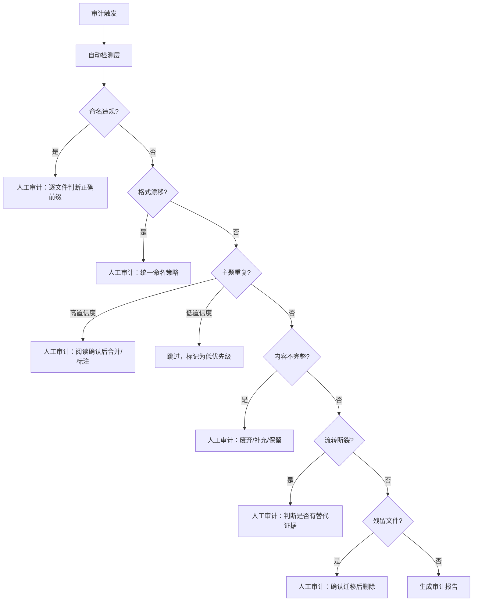

# 第三章：自动化 vs 人工审计矩阵

## 3.1 债务类型的自动检测可行性

| 债务类型 | 自动检测方法 | 准确率 | 限制 |
|---------|------------|--------|------|
| S1 命名违规 | 正则匹配 + 前缀集合校验 | ~100% | 需要预先定义合法的前缀集合 |
| S2 格式漂移 | 文件名模式聚类 | ~100% | 聚类阈值需要调优 |
| S3 目录失衡 | 文件计数 + 占比计算 | ~100% | 无 |
| C1 主题重复 | 编辑距离 + TF-IDF 相似度 | ~70% | 需要人工确认内容是否确实重复 |
| C2 内容不完整 | 行数统计 + 中位数比较 | ~85% | 短文件可能是合法摘要，需人工判断 |
| F1 流转断裂 | 跨目录主题名匹配 | ~95% | 需要处理前缀/后缀剥离逻辑 |
| F2 记忆提取率 | 计数比值 | ~100% | 无 |
| L1 残留文件 | 行数阈值 + 内容关键字 | ~60% | 需人工确认是否为存根 |
| L2 过期未标记 | 元数据解析 + 日期比对 | ~30% | 需要 Memory 结构中有显式的过期字段 |

## 3.2 审计决策流程



## 3.3 自动化脚本能力边界

以下检测可通过脚本一次性覆盖（预估实现成本 ~200 行 Python）：

```python
# 可自动化的检测项
AUTO_DETECTABLE = [
    "命名违规检测",        # 正则 + 前缀集合
    "格式漂移聚类",        # 文件名模式分组
    "目录密度统计",        # 计数 + 占比
    "微型文件标记",        # 行数阈值
    "跨目录主题匹配",      # 前缀剥离 + 交集计算
    "记忆提取率计算",      # 简单比值
]

# 需要人工判断的检测项
MANUAL_REQUIRED = [
    "内容是否真正重复",     # 需阅读
    "微型文件是否应废弃",   # 需阅读上下文
    "流转断裂是否有替代",   # 需领域知识
    "Memory 是否过期",      # 需解析内容字段
    "存根 vs 合法短文件",   # 需理解迁移上下文
]
```
