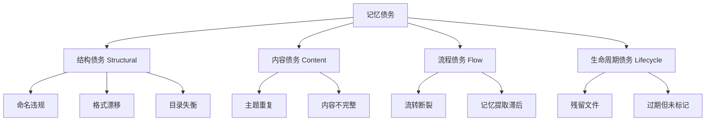

# 第一章：记忆债务分类体系

基于对 103 个文件和 11 份管理规范的系统分析，将记忆债务划分为 **四类九型**：

### 债务类型定义

| 大类 | 亚型 | 定义 | 检测难度 |
|------|------|------|---------|
| **S1 命名违规** | 文件名不符合目录约定的命名模式 | 低（机械化检测） |
| **S2 格式漂移** | 同一目录内多种命名格式并存 | 低（机械化检测） |
| **S3 目录失衡** | 子目录间文件密度严重不均 | 低（机械化检测） |
| **C1 主题重复** | 同一主题存在多份文件 | 中（需 NLP 语义判断） |
| **C2 内容不完整** | 文件规模显著低于同级中位数 | 中（统计+人工抽样） |
| **F1 流转断裂** | Plan 无 Spec、Spec 无下游产物 | 低（机械化对照） |
| **F2 记忆提取滞后** | Memories 数量远低于 Retrospectives | 低（机械化统计） |
| **L1 残留文件** | 迁移存根、已完成但未清理的过渡文件 | 中（需上下文判断） |
| **L2 过期未标记** | Memory 条目缺少过期条件或已过期 | 高（需完整内容阅读） |
