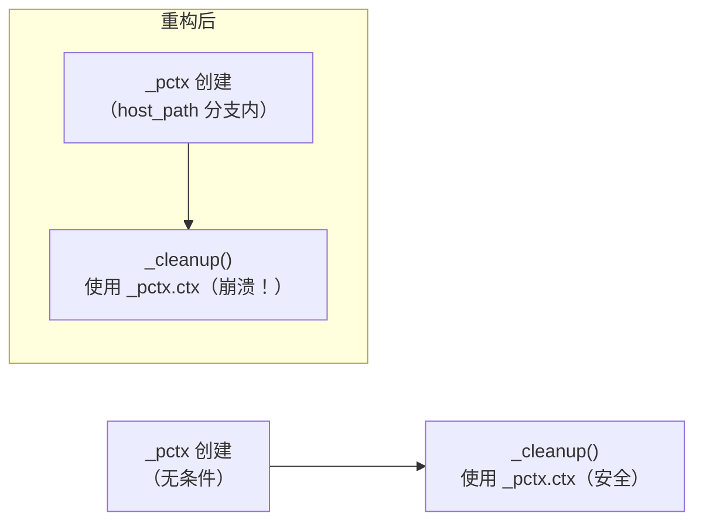
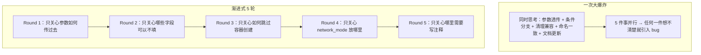

# ContainerRun 重构 — 深度洞察报告

> **报告类型**：技术洞察 / 设计反思
> **生成日期**：2026-06-10
> **关联文件**：`apps/chaos/src/taolib/flowkit/podman_context.py`
> **关联复盘**：`task-summary-containerrun-refactor-20260610.md`

---

## 一、硬编码的对手不是"更多参数"，而是"未知的未来"

### 现象

最初的设计者并非不知道 `environment`、`ports`、`privileged` 这些参数存在，而是做了一个隐含假设："ContainerRun 只需要挂载 → 执行 → 退出的场景"。这个假设在 SSH 远程连接、网络模式切换、特权容器等场景面前迅速失效——`_start()` 中 7 行写死的参数，就是这种失效的直接证据。

### 洞察

SDK 包装类如果不留透传后门，就等同于替用户宣告"我比你更了解你的使用场景"。而实际上，包装类永远不可能穷举底层 SDK 的全部能力。`run_kwargs` 的本质不是"加了一个参数"，而是**承认了自身认知的有限性**——把不确定的未来交给一个确定的 escape hatch。

| 反例 | 正例 |
|------|------|
| 设计时枚举所有需要的参数，每次新需求加字段 | 预留一个 `**kwargs` 或 `xxx_kwargs` dict，承认"不可能穷举" |
| `containers.run(tty=True, detach=True)` — 7 个写死的参数 | `run_params.update(self.run_kwargs)` — 一个透传门 |

### 设计原则

> 任何 SDK 包装类都应预留透传机制。因为 SDK 参数集会随着版本演进而变化，而你无法预测用户的下一个需求。

---

## 二、必填字段的本质是"强制耦合"，而耦合的方向错了

### 现象

`host_path`、`target`、`working_dir`、`name` 这四个字段全部标记为必填。用户只是想通过 SSH 探活，却被强制要求指定一个本地目录和挂载点。这四个字段描述的是一种特定的使用模式——"我有一台本地机器，需要把目录挂进容器里执行任务"——却被当成了所有使用场景的前提。

### 洞察

API 设计中的默认值策略应该是"收敛到最少假设"而非"收敛到最常见场景"。

```
None 的语义：我不假设你需要这个 → 开放
必填的语义：你必须给我这个     → 封闭
```

设计者往往不自觉地把自己最熟悉的场景设为默认，而忽略了一个规律：**最常见的场景会随时间迁移**。你今天需要的挂载模式，三个月后可能被 SSH 远程执行模式取代。把最常见场景写死为约束，就是在预判未来，而这种预判几乎总是错的。

| 变更前 | 变更后 |
|--------|--------|
| 5 个必填字段：image + host_path + target + name + working_dir | 1 个必填字段：image |
| "你必须挂载目录" | "你可以挂载目录，也可以不挂载" |
| 一个类 = 一种用法 | 一个类 = N 种用法 |

### 设计原则

> 默认值应指向"最少假设"，而非"最常见场景"。`None` 是谦逊的设计，必填是傲慢的预判。

---

## 三、`start_container` 开关揭示了"生命周期管理 ≠ 容器管理"

### 现象

用户发现 `ContainerRun` 比直接用 `PodmanClient` + `ping()` 慢很多。排查后确认：`_start()` 一定会执行 `containers.run()`——这不是连接慢，是容器创建慢。`containers.run()` 涉及镜像检查、容器进程创建、`sleep infinity` 命令执行，比 `ping()` 重几个数量级。

### 洞察

`ContainerRun` 的名字暗示它管理的是容器，但它实际上管理的是**三样东西**：

```
┌─────────────────────────────────────┐
│         ContainerRun                │
│                                     │
│  ┌─────────┐ ┌──────────┐ ┌───────┐│
│  │ 客户端  │ │ 容器实例 │ │SSH隧道││
│  │ 连接    │ │ 生命周期 │ │(Win)  ││
│  └─────────┘ └──────────┘ └───────┘│
└─────────────────────────────────────┘
```

`start_container=False` 的本质是把"容器运行器"重新定义为"Podman 客户端生命周期管理器"，容器运行只是其中一个可选环节。

**当用户说"这个东西太慢了"时，真正的问题往往不是性能，而是你替用户做了不该做的事。** `start_container` 开关表面上解决的是性能问题，深层上纠正的是"创建连接就一定创建容器"这个错误的前提假设。

| 场景 | 需要客户端连接 | 需要容器 | 重操作 |
|------|:---:|:---:|:---:|
| SSH 探活 | ✓ | ✗ | 无 |
| 执行单条命令 | ✓ | ✓ | 创建容器 |
| 挂载目录执行任务 | ✓ | ✓ | 创建容器 + bind mount |

如果只有一种模式，所有场景都要承受最重的那一档代价。

### 设计原则

> 一个类分离 N 种职责时，应提供独立的开关来控制每种职责的启停。不要假设"需要 A 就一定需要 B"。

---

## 四、`_pctx` 从"必定存在"到"条件存在"的崩溃：隐性契约才是重构中最危险的盲区

### 现象

Round 2 中将 `_pctx` 的创建从无条件执行移入 `host_path is not None` 分支内部，完全符合业务逻辑——没有宿主机路径，为什么要创建 `PodmanContext`？

但 `_cleanup()` 中这行代码爆炸了：

```python
self._pctx.ctx._tunnel.stop()  # _pctx 现在是 None → AttributeError
```

### 洞察

**隐性契约**：一段代码依赖一个前提（`_pctx` 一定不为 None），但这个前提没有被显式表达——既没有类型注解约束，也没有 `assert`，只是在运行时"碰巧成立"。



重构时最危险的不是你改了什么，而是那些**依赖旧契约但未被显式表达的代码**。一个变量从"必定非 None"变为"可能为 None"，影响的远不止定义它的那个 `if` 分支，而是所有读取它的消费者。

在 `Any` 泛滥的动态区域（如 `_client: Any`、`_pctx: PodmanContext | None`），这种风险被放大——因为编译器不会替你检查，只有运行时才会爆炸。

| 隐性契约 | 显式契约 |
|---------|---------|
| `self._pctx.ctx._tunnel.stop()` — 假设 _pctx 非 None | `if self._pctx is not None and hasattr(...):` — 三重防御 |
| 依赖"碰巧成立"的运行时条件 | 依赖编译器可验证的类型约束 |

### 设计原则

> 将必走流程改为条件流程时，必须扫描所有下游消费者，逐一检查是否需要增加空值保护。任何 `Any` 类型的字段都是高风险区域——编译器不会帮你，只能靠自己。

---

## 五、5 轮渐进式重构 vs 1 次大爆炸：认知负载才是真正的成本

### 现象

5 轮改动的每轮代码量都不大，总变更约 30 行新增代码。如果一次性做完，代码行数是一样的，所需的字符输入也是一样的。

但两者的**认知负载**完全不同。

### 洞察



每一轮都是一个封闭的因果链：**问题 → 方案 → 改动 → 验证**，无需跨轮次的心智切换。

这也是为什么 Round 2 中能立即发现 `_pctx` 为空的问题——因为那一轮的眼界只聚焦在字段可选化带来的条件分支上，清理逻辑刚好在视野边缘，一瞥即见。如果在大爆炸中同时处理 5 件事，`_cleanup()` 那行代码大概率会被视觉遗失。

| 大爆炸 | 渐进式 |
|--------|--------|
| 认知负载：5 件事并行 | 认知负载：1 件事 / 轮 |
| 验证范围：所有改动的组合 | 验证范围：单轮改动 |
| Bug 定位：需要排除 4 个无关变量 | Bug 定位：就是本轮引入的 |
| 回滚成本：全部回滚 | 回滚成本：仅回滚当轮 |

### 设计原则

> 渐进式重构的价值不在"分批交付"，而在**每一轮的认知负载可控**。当一轮改动的因果关系可以在一分钟内推理完整时，bug 很难藏身。

---

## 六条原则总结

| # | 原则 | 一句话 |
|---|------|--------|
| 1 | Escape Hatch 优先 | 任何 SDK wrapper 都该留一个"不确定未来"的后门 |
| 2 | 默认值收敛到最少假设 | `None` 是谦逊的设计，必填是傲慢的预判 |
| 3 | 职责独立开关 | 不要假设"需要 A 就一定需要 B" |
| 4 | 显式化隐性契约 | 把"碰巧成立"变成"编译器可验证" |
| 5 | 单轮认知负载 | 每次只改一个因果关系链 |
| （推论） | 对称命名是低成本高收益的设计惯例 | `client_kwargs` ↔ `run_kwargs` |

---

> **洞察报告结束**
>
> 本报告是对 ContainerRun 重构全过程的技术反思与第一性原理推演，可与 `task-summary-containerrun-refactor-20260610.md` 中的事实记录交叉参考阅读。
