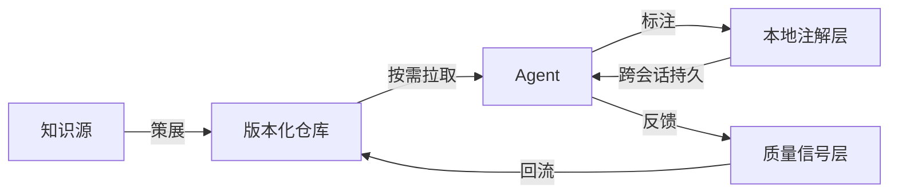

# Context Hub — 复盘 · 洞察 · 萃取

> **报告类型**:外部知识萃取 / 设计洞察
> **生成日期**:2026-06-22
> **萃取来源**:吴恩达 LangChain Interrupt 大会对谈 + Context Hub (Chub) 开源项目
> **来源文档**:`.archive/wechat-article-20260622/wechat-article-polished.md`
> **关联外部**:[Context Hub GitHub](https://github.com/andrewyng/context-hub)、[LangSmith Context Hub](https://docs.langchain.com/langsmith/use-the-context-hub)

---

## 一、复盘:Context Hub 是什么,解决什么

### 1.1 一句话定位

Context Hub(昵称 Chub)是吴恩达于 2025 年 3 月发起的开源项目,定位为**面向 AI Agent 的 Stack Overflow**——一个为编程智能体提供策展、版本化、可标注、可反馈文档的外部记忆层。

### 1.2 它要解决的两个结构性痛点

| 痛点 | 表现 | 根因 |
|------|------|------|
| **API 幻觉** | Agent 自信地写出不存在的 API 调用(如 `client.chat.create()` 实际应为 `client.messages.create()`) | 模型训练数据有时效性,API/SDK 变化速度快于模型知识更新 |
| **会话知识丢失** | 上次踩过的坑、发现的 workaround,下次会话又得重新踩 | Agent 默认无跨会话持久记忆,经验无法累积 |

### 1.3 核心机制:四要素构成自我改进闭环

```
┌─────────────────────────────────────────────────┐
│              Context Hub 闭环                    │
│                                                  │
│  策展文档  ──→  Agent 拉取  ──→  写对代码        │
│     ↑                              ↓             │
│     │                              │             │
│  反馈回流  ←──  标注注解  ←──  发现缺口          │
│                                                  │
└─────────────────────────────────────────────────┘
```

| 要素 | 机制 | 价值 |
|------|------|------|
| **策展 (Curated)** | 人工筛选 + Markdown 维护 | 降低搜索噪声,提高准确率 |
| **版本化 (Versioned)** | 文档带版本号,可追溯 | 解决"旧文档误导新 Agent"问题 |
| **语言相关 (Lang-specific)** | Python/JS 各自变体 | 避免语言混淆,节省 token |
| **标注 (Annotation)** | Agent 给文档挂本地注解,跨会话持久 | 把"个人手艺"变成"组织记忆" |
| **反馈 (Feedback)** | thumbs up/down 投票回流给维护者 | 形成数据飞轮,持续改进 |

### 1.4 CLI 接口

```bash
npm install -g @aisuite/chub

chub search openai                          # 搜索文档
chub get openai/chat --lang py              # 拉取 Python 版本
chub annotate openai/chat "rate limit 60/min"  # 加注解
chub feedback openai/chat up                # 投票反馈
```

---

## 二、洞察:从 Context Hub 提炼出的五条深层规律

### 2.1 洞察一:模型知识滞后是结构性问题,不是临时问题

#### 现象

API、SDK、框架的迭代速度远快于模型训练周期。即使是最先进的编程 Agent,其底座模型的知识截止时间也早于许多关键 API 的发布时间。

#### 洞察

很多人把"Agent 用错 API"当作"模型还不够强"的临时问题,期待下一代模型会解决。但这是一个**结构性错配**:

```
模型训练周期:月级 ~ 年级
API 变化速度:周级 ~ 日级
```

两者数量级不匹配,意味着**靠提升模型能力永远追不上 API 演进**。Context Hub 的本质不是"补模型的不足",而是承认"模型不可能全知",于是把"最新知识"从模型内部迁移到模型外部。

#### 设计原则

> 当一个问题的根因是"周期不匹配"时,解决方案不是加快慢的一方,而是在两者之间引入缓冲层。Context Hub 就是模型与 API 之间的缓冲层。

---

### 2.2 洞察二:上下文工程 > 提示工程

#### 现象

Context Hub 不修改模型、不优化 prompt,只是给 Agent 喂更准确、更新鲜的上下文,就能显著降低 API 幻觉。

#### 洞察

这标志着 AI 工程重心的迁移:

```
2023:Prompt Engineering — 怎么问
2024:RAG / Fine-tuning  — 怎么补
2025:Context Engineering — 怎么管
```

Prompt 工程关注"单次交互的质量",上下文工程关注"整个上下文供应链的质量"。后者包括:

- 上下文的**来源**(权威文档 vs 网页抓取)
- 上下文的**时效**(版本化 vs 无版本)
- 上下文的**形态**(语言相关 vs 语言无关)
- 上下文的**累积**(跨会话持久 vs 一次性)
- 上下文的**反馈**(质量信号回流 vs 无回流)

#### 设计原则

> 未来 Agent 系统的竞争力,不在于 prompt 写得多精巧,而在于上下文供应链设计得多扎实。Prompt 是点,上下文是面。

---

### 2.3 洞察三:标注机制把"个人手艺"变成"组织记忆"

#### 现象

Context Hub 的 `chub annotate` 命令允许 Agent 给文档挂本地注解,这些注解跨会话持久化,下次任何 Agent 拉取同一文档时自动看到。

#### 洞察

这是最被低估的设计。它解决了一个长期痛点:**Agent 的经验无法累积**。

传统模式下,即使一个 Agent 在某次任务中发现了文档没覆盖的 workaround,下次会话重启后,这个发现就消失了。资深工程师和新人之间的差距,正是这种"未成文的经验"。Context Hub 的标注机制,本质上是在为 Agent 群体建立**组织记忆**:

```
没有标注:每个 Agent 都从零开始,经验无法传承
有了标注:第一个 Agent 的发现,自动惠及后续所有 Agent
```

这背后是一个更深的判断:**未来组织的 AI 资产,不只是模型和 prompt,还包括累积下来的上下文注解**。

#### 设计原则

> 任何想让 Agent "越用越聪明"的系统,都必须解决"经验持久化"问题。标注机制是最轻量的实现,但效果最深远。

---

### 2.4 洞察四:反馈闭环让生态自我进化

#### 现象

Context Hub 的 `chub feedback` 命令让 Agent 给文档投赞成/反对票,反馈回流给文档维护者。

#### 洞察

这构成了一个**数据飞轮**:

```
Agent 用文档 → 文档好,Agent 写对代码 → 投赞成票
            → 文档差,Agent 写错代码 → 投反对票
                                    ↓
                            维护者改进文档
                                    ↓
                            下次 Agent 拉取更好文档
```

关键在于:**反馈来自实际使用者(Agent),而非人工评审**。这意味着反馈数据反映的是"Agent 实际能不能用",而不是"人类觉得写得好不好"。这两者并不等同——人类觉得清晰的文档,Agent 可能因为缺少某个关键字段而无法解析。

#### 设计原则

> 文档质量评估的最终裁判应该是消费者(Agent),而不是作者(人)。Agent 反馈数据是未来文档治理的核心资产。

---

### 2.5 洞察五:开放协作降低贡献门槛,是生态扩张的前提

#### 现象

Context Hub 全部内容用 Markdown 维护,MIT 许可证,任何人可通过 PR 贡献文档。一周内获得 10K+ GitHub stars。

#### 洞察

这不是偶然。对比两种可能的形态:

| 形态 | 贡献门槛 | 扩张速度 | 生态健康度 |
|------|----------|----------|------------|
| 闭源 + 专有格式 + 审核制 | 高 | 慢 | 易垄断 |
| 开源 + Markdown + PR 制 | 低 | 快 | 易繁荣 |

Context Hub 选择后者,意味着它把自己定位为**基础设施**而非**产品**。基础设施的价值取决于生态规模,而生态规模取决于贡献门槛。Markdown 是最低门槛——任何开发者都能写,任何工具都能读,任何 Git 平台都能托管。

#### 设计原则

> 想做成基础设施的项目,必须把贡献门槛压到最低。格式开放(Markdown)、协议开放(MIT)、流程开放(PR)是三件套,缺一不可。

---

## 三、萃取:可复用资产

### 3.1 设计模式萃取:Context Hub 模式

提炼出一个可复用的架构模式,适用于任何"为 Agent 提供外部知识"的系统:



**模式名称**:Context Hub Pattern(策展-版本-标注-反馈闭环)

**适用场景**:
- 为编程 Agent 提供 API 文档
- 为业务 Agent 提供内部知识库
- 为多 Agent 系统提供共享记忆层

**核心要素**:
1. **策展层**:人工筛选高质量内容,降低噪声
2. **版本层**:内容带版本号,可追溯
3. **语言/场景变体层**:针对不同消费者提供定制化内容
4. **标注层**:Agent 可挂注解,跨会话持久
5. **反馈层**:Agent 可投票,信号回流给维护者

### 3.2 检查清单:评估 Agent 知识系统的质量

以下清单可用于评估任何"为 Agent 提供上下文"的系统:

```markdown
## Agent 知识系统质量检查清单

### 知识来源
- [ ] 是否有明确的策展机制,而非全量抓取?
- [ ] 是否区分"权威源"和"辅助源"?
- [ ] 是否有人工审核或社区审核流程?

### 版本管理
- [ ] 内容是否带版本号?
- [ ] 是否支持版本回滚?
- [ ] 是否能追溯某条建议的来源版本?

### 场景适配
- [ ] 是否针对不同语言/框架提供变体?
- [ ] 是否支持按需拉取(而非全量加载)?
- [ ] 是否考虑了 token 预算?

### 经验累积
- [ ] Agent 是否能给内容挂注解?
- [ ] 注解是否跨会话持久?
- [ ] 注解是否能在团队/组织内共享?

### 反馈闭环
- [ ] Agent 是否能对内容质量投票?
- [ ] 反馈是否回流给维护者?
- [ ] 是否有数据驱动的改进机制?

### 开放性
- [ ] 内容格式是否开放(Markdown/JSON)?
- [ ] 是否支持社区贡献?
- [ ] 许可证是否友好(MIT/Apache)?
```

### 3.3 反模式萃取:应该避免的做法

| 反模式 | 表现 | 后果 | 正确做法 |
|--------|------|------|----------|
| **全量注入** | 把所有文档一次性塞给 Agent | token 爆炸,注意力分散 | 按需拉取,只给相关片段 |
| **无版本管理** | 文档随时更新但不留版本 | Agent 行为不可复现 | 强制版本化,可追溯 |
| **语言无关** | 一份文档服务所有语言 | 代码示例混淆,Agent 困惑 | 提供语言相关变体 |
| **无反馈通道** | Agent 用了文档但无法反馈 | 质量无法改进,问题重复 | 提供 up/down 投票机制 |
| **无标注能力** | Agent 发现文档缺口但无法记录 | 经验无法累积,每次从零开始 | 支持本地注解,跨会话持久 |
| **闭源专有格式** | 用专有格式 + 审核制 | 生态无法扩张 | Markdown + MIT + PR 制 |

### 3.4 对 AgentForge 的启示

将 Context Hub 的设计理念映射到 AgentForge 体系:

| Context Hub 要素 | AgentForge 对应位置 | 现状 | 建议 |
|------------------|---------------------|------|------|
| 策展文档 | `.agents/docs/references/` | ✅ 已有 | 维持,持续筛选高质量内容 |
| 版本化 | Git 版本控制 | ✅ 已有 | 维持 |
| 语言/场景变体 | `.agents/rules/` 下的领域规则 | ✅ 已有 | 维持 |
| 标注机制 | `.agents/docs/superpowers/memories/` | ✅ 已有 | 强化"经验持久化"意识 |
| 反馈闭环 | 复盘报告 + 规则演化 | ⚠️ 部分 | 可考虑给规则加"使用反馈"字段 |
| 开放协作 | GitHub + MIT | ✅ 已有 | 维持 |

**关键启示**:AgentForge 已具备 Context Hub 的大部分要素,但在"反馈闭环"上偏弱。当前规则和文档的改进主要靠人工复盘,缺少"Agent 实际使用后的自动反馈信号"。未来可考虑在规则文件 frontmatter 中加入 `usage_feedback:` 字段,记录 Agent 使用该规则时的成功率/失败原因。

---

## 四、金句萃取

可复用于未来讨论或文档的提炼句:

1. **模型知识滞后是结构性问题,不是临时问题。靠提升模型永远追不上 API 演进。**
2. **上下文工程比提示工程更重要。Prompt 是点,上下文是面。**
3. **标注机制把"个人手艺"变成"组织记忆"。任何想让 Agent 越用越聪明的系统,都必须解决经验持久化问题。**
4. **文档质量评估的最终裁判应该是消费者(Agent),而不是作者(人)。**
5. **想做成基础设施的项目,必须把贡献门槛压到最低。格式开放、协议开放、流程开放是三件套。**
6. **当一个问题的根因是"周期不匹配"时,解决方案不是加快慢的一方,而是在两者之间引入缓冲层。**

---

## 五、行动建议

### 短期(本月)

- [ ] 试用 Context Hub:`npm install -g @aisuite/chub`,在 AgentForge 开发中实测效果
- [ ] 评估是否将 Context Hub 接入 AgentForge 的开发工作流(作为外部 references 的补充)

### 中期(本季度)

- [ ] 在 `.agents/rules/` 中试点"使用反馈"字段,记录 Agent 使用规则时的成功率
- [ ] 梳理 `.agents/docs/references/` 现有内容,按 Context Hub 的策展标准做一次质量审计

### 长期(本年)

- [ ] 评估是否为 AgentForge 设计类似的"标注层",让 Agent 能给 references 挂注解
- [ ] 跟踪 Context Hub 生态发展,评估是否贡献 AgentForge 相关文档到 Chub 仓库

---

## 六、来源与延伸阅读

- **吴恩达 LangChain Interrupt 对谈**:[YouTube](https://www.youtube.com/watch?v=OaRhpwz_TGM)
- **Context Hub GitHub**:[andrewyng/context-hub](https://github.com/andrewyng/context-hub)
- **LangSmith Context Hub 文档**:[docs.langchain.com/langsmith/use-the-context-hub](https://docs.langchain.com/langsmith/use-the-context-hub)
- **中文分析文章**:[虎嗅:Agent狂奔之后](http://finance.sina.cn/2026-06-21/detail-inieetnk9482825.d.html)
- **本报告源文件**:`.archive/wechat-article-20260622/wechat-article-polished.md`
