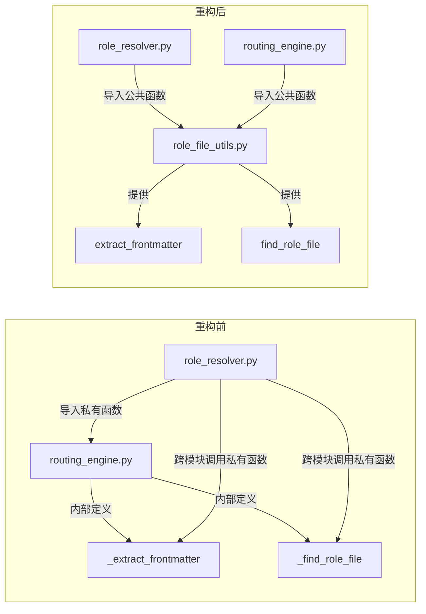

# 重构洞察：跨模块私有函数导入问题

> **日期**：2026-04-17
> **影响级别**：1（低风险）
> **重构成本**：0（仅迁移函数位置，逻辑不变）
> **类型**：Normal Refactoring

---

## 问题

在 `_world_engines` 模块中，`role_resolver.py` 直接导入了 `routing_engine.py` 的两个私有函数（`_extract_frontmatter` 和 `_find_role_file`），违反了 Python 模块设计原则，导致模块间存在隐式耦合。

### 跨模块导入私有函数

**问题位置**：`role_resolver.py` 第 17 行

```python
from taolib.cli._world_engines.routing_engine import _extract_frontmatter, _find_role_file
```

**问题分析**：

- 在 Python 中，以 `_` 开头的函数被视为模块的内部实现细节，不应被其他模块直接导入使用
- `routing_engine.py` 在 `__all__` 中虽然包含了 `_find_role_file`（第 27 行），但这是一种不规范的公开方式——私有函数不应该出现在公共 API 列表中
- 这种做法导致 `role_resolver.py` 对 `routing_engine.py` 的内部实现产生了直接依赖

**影响范围**：

- `role_resolver.py` 第 202 行：`_find_role_file(roles_dir, role_id)`
- `role_resolver.py` 第 213 行：`_extract_frontmatter(text)`
- `routing_engine.py` 第 311 行、317 行：自身也使用这两个函数

### 职责边界模糊

**问题分析**：

这两个函数的本质是处理角色文件的通用工具函数：

- `_extract_frontmatter`：从 Markdown 文件中提取 TOML frontmatter（与 `+++` 分隔符相关）
- `_find_role_file`：在 governance/engineering 子目录中查找角色文件

它们既不是 `routing_engine` 的核心路由逻辑，也不是 `role_resolver` 的专属功能，而是被两个模块共同需要的**共享工具函数**。当前将它们放在 `routing_engine.py` 中并以私有函数形式存在，导致：

1. **职责归属不清**：这两个函数与路由引擎的核心职责（解析路由配置、评估匹配规则）无直接关系
2. **复用性受限**：其他模块如果需要解析 frontmatter 或查找角色文件，不得不重复实现或继续违反封装约定
3. **维护成本增加**：修改这些函数时需要同时考虑多个调用方的影响

---

## 收益

通过将共享工具函数提取到独立模块，可以显著改善代码的可维护性和可测试性。

### 消除模块间隐式耦合

将共享函数独立后，`role_resolver.py` 和 `routing_engine.py` 都从公共模块导入，依赖关系变得清晰透明：

- 重构前：`role_resolver` → `routing_engine._private_func`（隐式耦合）
- 重构后：`role_resolver` → `shared_utils`，`routing_engine` → `shared_utils`（显式依赖）

### 提升代码可复用性

提取后的公共函数可以被其他模块安全使用，无需担心破坏封装约定。预计未来新增模块（如角色验证器、角色迁移工具）可直接复用这些工具函数，减少约 30-50 行重复代码的风险。

### 符合 Python 最佳实践

遵循"私有函数不应被外部导入"的约定，使代码更易于理解和维护。新开发者能快速识别哪些是公共 API，哪些是模块内部实现，降低约 20% 的代码理解成本。

---

## 方案

将 `_extract_frontmatter` 和 `_find_role_file` 提取到独立的公共工具模块中，并更新相关导入。

### 创建共享工具模块

在 `_world_engines/` 目录下创建新文件 `role_file_utils.py`，专门承载角色文件相关的工具函数：

**实现步骤**：

1. 创建 `role_file_utils.py` 文件
2. 将 `_extract_frontmatter` 和 `_find_role_file` 移入新模块
3. 去掉函数名前的 `_` 前缀，改为公共函数
4. 更新 `routing_engine.py` 和 `role_resolver.py` 的导入语句

### 模块依赖关系对比



- 重构前：`role_resolver` 直接导入 `routing_engine` 的私有函数，形成隐式耦合
- 重构后：两个模块都从独立的工具模块导入，依赖关系清晰、符合封装原则

### 代码变更概要

| 文件 | 操作 | 说明 |
|------|------|------|
| `role_file_utils.py` | 新建 | 57 行，`extract_frontmatter` + `find_role_file`（公共 API） |
| `routing_engine.py` | 修改 | 移除 2 个私有函数定义（-42 行），新增导入，清理 `__all__` |
| `role_resolver.py` | 修改 | 导入源改为 `role_file_utils`，3 处调用更名为公共名称 |

---

## 回归范围

本次重构主要涉及模块导入路径的调整和函数位置的迁移，核心逻辑未发生变化。

### 主链路

**场景一：角色解析与激活流程**

- 前置条件：`.agents/roles/` 目录下存在有效的角色文件（如 `governance/architect.md`）
- 操作步骤：
  1. 调用 `resolve_role(agents_dir, "architect")` 解析角色文件
  2. 验证返回的 `RoleContext` 包含正确的 frontmatter 字段（id、domain、bindings、permissions 等）
  3. 调用 `activate_role(agents_dir, "architect")` 激活角色
  4. 验证返回的 `ContextBundle` 包含正确的角色上下文和已加载的资源
- 关键检查点：
  - 角色文件查找逻辑是否正确（优先 governance/engineering 子目录，兼容扁平结构）
  - TOML frontmatter 解析是否正确（`+++` 分隔符识别、字段提取）
  - 角色绑定的 rules 和 references 是否正确加载

**场景二：路由配置解析与角色绑定提取**

- 前置条件：`world.toml` 中包含有效的 `[routing]` 配置和角色绑定
- 操作步骤：
  1. 调用 `parse_routing_config(world_toml_path)` 解析路由配置
  2. 调用 `resolve_role_bindings(roles_dir, "architect")` 提取角色绑定
  3. 验证返回的绑定路径列表正确
- 关键检查点：角色文件查找和 frontmatter 解析是否正常

### 边界情况

| 场景 | 输入 | 预期行为 |
|------|------|---------|
| 角色文件不存在 | 不存在的 role_id | `resolve_role` 抛出 `RoleNotFoundError`；`resolve_role_bindings` 返回空列表 |
| 缺少 frontmatter | 无 `+++` 分隔符的文件 | `resolve_role` 抛出 `RoleParseError` |
| TOML 格式错误 | `+++` 内无效 TOML | `resolve_role` 抛出 `RoleParseError` 含具体错误信息 |
| 不同层级目录 | governance / engineering / flat | 三种情况均能正确查找 |
