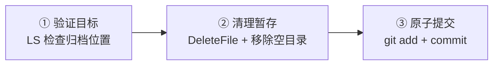
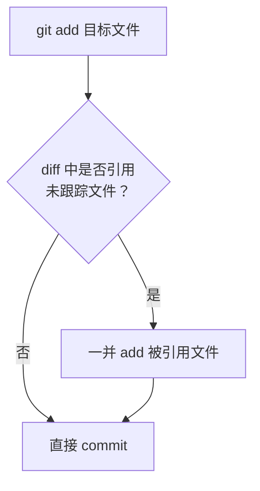

# 微信文章归档与原子提交 · 复盘+洞察+萃取

> **报告类型**: 任务执行复盘 / 洞察萃取
> **生成日期**: 2026-06-23
> **任务范围**: `.archive/wechat-article-20260622/` 归档清理 + 3 次原子提交

---

## 一、复盘：执行过程

### 1.1 任务目标

将 `.archive/wechat-article-20260622/` 暂存的微信文章归档至正式目录 `apps/chaos/docs/agent-insight/`，清理暂存中间产物，并以原子提交方式记录变更。

### 1.2 执行时间线

| 阶段 | 动作 | 结果 |
|------|------|------|
| ① 确认归档位置 | LS 检查目标目录，发现文章+配图已在目标位置 | 文件已迁移，仅需清理暂存 |
| ② 清理暂存目录 | DeleteFile 批量删除 14 个文件 | 首次失败（wechat-article.md 已不在源目录） |
| ②' 重试删除 | 排除已迁移文件，删除剩余 13 个文件 + 空目录 | 成功 |
| ③ 原子提交 1 | `git add` + `git commit` 归档文章 | heredoc 语法错误（PowerShell 不支持） |
| ③' 重试提交 1 | 改用多 `-m` 参数 | 成功 `ed44534` |
| ④ 原子提交 2 | 提交 CHANGELOG + python.md + 3 个被引用文件 | 成功 `9fbcfbd` |
| ⑤ 原子提交 3 | 提交 rule-evolution + insights + template | 成功 `eba7760` |

### 1.3 产出物

| 提交 | Hash | 文件数 | 行数 | 内容 |
|------|------|--------|------|------|
| 1 | `ed44534` | 1 | +126 | 归档微信文章 |
| 2 | `9fbcfbd` | 5 | +186 | CHANGELOG 索引 + python usage_feedback |
| 3 | `eba7760` | 3 | +540 | rule-evolution 反馈闭环 + Context Hub 洞察 |
| **合计** | — | **9** | **+852** | — |

### 1.4 问题记录

| # | 问题 | 根因 | 解决方式 |
|---|------|------|----------|
| P1 | DeleteFile 批量删除失败 | 列表含已不存在的 `wechat-article.md`（已被迁移），导致整批失败 | 排除已迁移文件后重新批量删除 |
| P2 | git commit heredoc 语法错误 | PowerShell 不支持 `<<'EOF'` heredoc 语法 | 改用多个 `-m` 参数传递多行消息 |

---

## 二、洞察：关键发现

### 洞察 1：原子提交的引用完整性原则

**现象**：CHANGELOG.md 修改后引用了 3 个未跟踪文件（两个技能 CHANGELOG + 月度变更日志），rule-evolution.md 引用了未跟踪的 `rule-frontmatter-template.md`。

**洞察**：提交修改文件时，必须检查其引用的未跟踪文件是否一并提交，否则会产生断链。这不仅是文档问题，更是提交原子性的延伸——一个自洽的提交应包含所有使其引用有效的依赖文件。

**量化**：本次 3 次提交中，2 次涉及引用完整性补充（提交 2 补充 3 文件，提交 3 补充 1 文件），占比 67%。

### 洞察 2：PowerShell 与 Bash 的语法鸿沟

**现象**：heredoc 语法在 PowerShell 中直接报 `ParserError`。

**洞察**：跨 shell 环境的命令编写存在隐性兼容性陷阱。PowerShell 的 `$(cat <<'EOF')` 会被解析为重定向操作而非 heredoc。在 Windows 环境下，多 `-m` 参数是 git commit 多行消息的最可靠方式。

### 洞察 3：DeleteFile 的"全有或全无"语义

**现象**：批量删除 14 个文件时，因其中 1 个不存在导致整批失败，其余 13 个也未被删除。

**洞察**：DeleteFile 工具采用"全有或全无"事务语义——列表中任一文件不存在则整批回滚。这与直觉不符（预期"跳过不存在的，删除存在的"）。使用前应先 LS 验证文件存在性，或分批删除。

---

## 三、萃取：可复用模式

### 模式 1：归档工作流三步法

**适用场景**：将 `.archive/` 或 `.temp/` 中的暂存内容归档至正式目录。

**检查清单**：
- [ ] 目标位置已包含完整内容（文件 + 资源）
- [ ] 暂存目录的中间产物已全部删除
- [ ] 空目录已移除
- [ ] git status 确认无遗漏

### 模式 2：原子提交引用完整性检查

**操作步骤**：
1. `git diff` 检查修改内容
2. 搜索 diff 中的路径引用（相对路径、链接）
3. `git status` 确认被引用文件是否未跟踪
4. 若未跟踪 → 一并 `git add` 后提交

**本次实例**：

| 提交 | 修改文件 | 引用的未跟踪文件 |
|------|----------|------------------|
| `9fbcfbd` | CHANGELOG.md | archive-folder/CHANGELOG.md, asset-redundancy-analyzer/CHANGELOG.md, CHANGELOG_2026-06.md |
| `eba7760` | rule-evolution.md | rule-frontmatter-template.md |

### 模式 3：Windows 环境下 git commit 多行消息

| 方式 | Bash | PowerShell |
|------|------|------------|
| heredoc | `git commit -m "$(cat <<'EOF' ... EOF)"` | ❌ ParserError |
| 多 -m | `git commit -m "标题" -m "正文"` | ✅ 推荐 |
| 文件 | `git commit -F message.txt` | ✅ 适用于长消息 |

**推荐**：Windows 环境统一使用多 `-m` 参数，每个 `-m` 成为独立段落。

---

## 四、改进建议

| 优先级 | 建议 | 触发洞察 |
|--------|------|----------|
| P1 | 新增 `.agents/rules/` 规则：原子提交前必须执行引用完整性检查 | 洞察 1 |
| P2 | 在 `documentation.md` 归档规则中补充"归档工作流三步法"检查清单 | 模式 1 |
| P3 | 考虑为 DeleteFile 工具编写使用注意事项（全有或全无语义） | 洞察 3 |

---

## 五、多维分析

| 维度 | 评分 | 说明 |
|------|------|------|
| 目标达成度 | ★★★★★ | 文章归档 + 暂存清理 + 3 次原子提交全部完成 |
| 时间效能 | ★★★★☆ | 2 次重试（DeleteFile + heredoc），但均在同一轮内修正 |
| 问题处理 | ★★★★☆ | 2 个问题均快速定位根因并解决 |
| 知识沉淀 | ★★★★★ | 萃取 3 个可复用模式，可转化为规则 |

---

*来源：2026-06-23 微信文章归档与原子提交会话*
