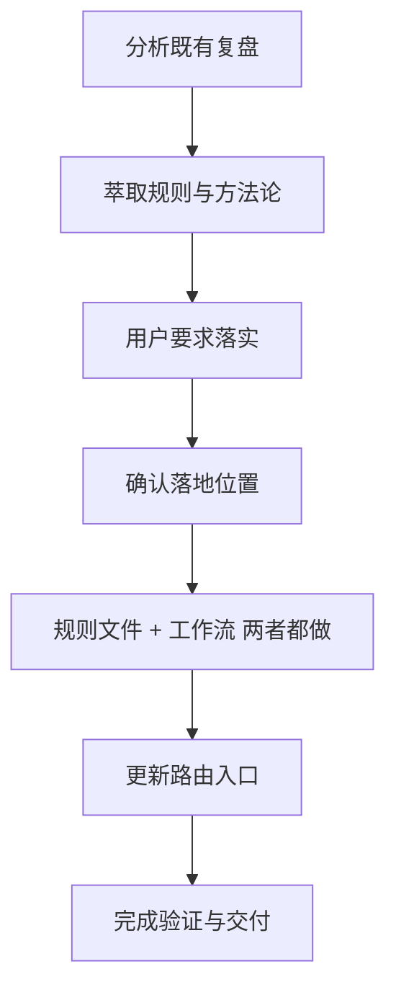

# 项目复盘报告：复盘洞察到治理资产落地

> 报告日期：2026-06-09  
> 复盘对象：`apps/chaos` 中“从 lint / Python 3.13+ 复盘洞察提炼规则并落地为治理资产”的任务闭环  
> 报告范围：需求定义、资源规划、进度管控、执行落地、风险应对与最终交付成果  
> 报告性质：项目复盘与方法论沉淀  

## 1. 项目核心概况

### 1.1 项目背景

本次任务起点是对既有复盘文档 `.agents/docs/superpowers/retrospectives/task-summary-lint-python313-20260609.md` 进行洞察提炼，识别其中可复用的规则、方法论与流程资产。用户随后要求“落实”，并在方案确认后授权将洞察沉淀到项目治理结构中。

项目核心目标从“阅读并总结复盘内容”升级为“将复盘洞察转化为可持续复用的项目规则与工作流”。

### 1.2 项目目标

| 目标 | 完成情况 | 说明 |
|---|---:|---|
| 提炼 Python 3.13+ 与 lint 修复经验 | 已完成 | 已从既有复盘中提炼注解策略、targeted check、全局搜索收口等方法 |
| 更新高频执行规则 | 已完成 | 已更新 `.agents/rules/python.md` 与 `.agents/rules/documentation.md` |
| 新增流程化工作流 | 已完成 | 已创建 `.agents/workflows/diagnostics-fix.md` |
| 更新任务路由入口 | 已完成 | 已更新 `AGENTS.md` 上下文路由表 |
| 完成基础验证 | 已完成 | 已执行 `git diff --check`，结果通过 |
| 同步至所有 stakeholder 存档 | 部分完成 | 已归档到项目复盘目录；外部 stakeholder 同步记录待补充 |

### 1.3 核心产出物

| 类型 | 文件 | 产出说明 |
|---|---|---|
| Python 规则 | `.agents/rules/python.md` | 新增 diagnostics / lint 修复流程，强化 Python 3.13+ 与 Ruff 验证策略 |
| 文档治理规则 | `.agents/rules/documentation.md` | 新增复盘闭环规则，要求复盘产出可复用资产 |
| 工作流 | `.agents/workflows/diagnostics-fix.md` | 新增 diagnostics 修复标准流程与验证方法 |
| 路由入口 | `AGENTS.md` | 将 IDE diagnostics、lint、format、CI 问题修复路由到新工作流和 Python 规则 |
| 本复盘报告 | `.agents/docs/superpowers/retrospectives/project-retrospective-governance-assets-20260609.md` | 对本次治理资产落地过程进行系统复盘 |

## 2. 复盘全维度数据

### 2.1 生命周期阶段台账

| 阶段 | 实际活动 | 关键产出 | 偏差 / 问题 | 状态 |
|---|---|---|---|---|
| 需求定义 | 用户要求从既有复盘中萃取规则或方法论 | 初始分析范围明确 | 初始需求偏分析，后续升级为落地实施 | 已完成 |
| 资源规划 | 读取项目入口、文档治理规则、Python 规则、既有复盘内容 | 明确规则与工作流归档位置 | 未提供外部 stakeholder 名单与业务指标 | 已完成 |
| 方案设计 | 提出规则文件与新工作流两类落地方式 | 用户选择“两者都做”并确认 | 需要在实施前获得确认，避免擅自改动治理资产 | 已完成 |
| 执行落地 | 修改规则、创建工作流、更新路由 | 4 个治理资产变更 | 文档章节编号需同步调整 | 已完成 |
| 风险应对 | 避免业务代码改动、避免无关重构、验证 diff 清洁度 | `git diff --check` 通过 | 未执行完整文档构建，因本次变更为治理 Markdown 文档 | 已完成 |
| 最终交付 | 汇总变更和验证结果 | 用户获得可复用规则与工作流 | 是否提交 commit 待用户明确要求 | 已完成 |

### 2.2 需求与范围变化



范围变化是合理且可控的：从知识提炼扩展到治理资产落地，但始终限定在 `.agents/` 与 `AGENTS.md` 范围内，未触碰业务代码。

### 2.3 资源使用情况

| 资源类型 | 使用情况 | 评价 |
|---|---|---|
| 项目文档 | `AGENTS.md`、`.agents/rules/documentation.md`、`.agents/rules/python.md` | 使用充分，符合按需读取原则 |
| 历史复盘 | `task-summary-lint-python313-20260609.md` | 作为主要知识来源，成功转化为规则与工作流 |
| 工具验证 | `git diff --check` | 覆盖 Markdown diff 基础质量 |
| 用户反馈 | 用户确认“两者都做” | 关键决策得到授权 |
| stakeholder 反馈 | 待补充 | 当前上下文未提供其他 stakeholder 反馈 |

### 2.4 交付质量数据

| 指标 | 结果 |
|---|---|
| 修改文件数量 | 3 个既有文件修改 + 1 个新工作流文件 + 1 个本复盘报告 |
| 业务代码改动 | 0 |
| 新增规则模块 | 2 处：Python diagnostics 流程、文档复盘闭环 |
| 新增工作流 | 1 个：diagnostics-fix |
| 路由同步 | 已同步到 `AGENTS.md` |
| 基础校验 | `git diff --check` 通过 |
| 未提交 commit | 是，等待用户明确要求 |

## 3. 问题根因分析

### 3.1 问题清单

| 问题 | 表现 | 影响 | 处理结果 |
|---|---|---|---|
| 复盘洞察可能停留在报告层 | 原复盘中有经验，但未必进入执行规则 | 后续任务可能重复踩坑 | 已沉淀到规则与工作流 |
| diagnostics 修复缺少标准流程入口 | 原有规则有命令，但流程化不足 | 执行者可能不知道如何分层验证和区分历史问题 | 已新增 diagnostics 工作流 |
| 文档复盘缺少闭环约束 | 复盘报告可能只记录事实 | 经验无法转化为组织资产 | 已新增“复盘闭环”规则 |
| 新增章节导致编号偏移 | 插入新章节后后续编号需要调整 | 文档结构可能混乱 | 已统一重编号 |
| stakeholder 信息不完整 | 当前仅有用户反馈 | 正式项目级复盘数据不完整 | 本报告标记为待补充项 |

### 3.2 5Why 根因分析

#### 问题 A：为什么需要把复盘洞察落实为规则和工作流？

1. 为什么？因为仅有复盘报告时，未来任务不一定会主动读取并应用其中经验。  
2. 为什么？因为复盘报告位于 retrospective 归档目录，天然偏长期记录，不是高频执行入口。  
3. 为什么？因为高频执行规则与流程化指南分别由 `.agents/rules/` 和 `.agents/workflows/` 承载。  
4. 为什么？因为项目治理结构要求不同生命周期和使用频率的文档分层存放。  
5. 根因：经验沉淀需要从“记录型文档”转化为“执行型资产”，否则复盘价值无法稳定复用。

#### 问题 B：为什么 diagnostics 修复需要单独工作流？

1. 为什么？因为 diagnostics / lint / format / CI 问题通常涉及工具、范围、历史问题与验证降级。  
2. 为什么？因为直接修复容易混入无关重构或格式化。  
3. 为什么？因为没有流程约束时，执行者可能跳过问题来源确认、配置读取和全局搜索收口。  
4. 为什么？因为 lint 修复常被误认为简单格式问题，而忽略项目版本策略和工具链约束。  
5. 根因：diagnostics 修复是一个包含输入确认、范围界定、分层验证和风险说明的流程型任务，不应只靠零散规则约束。

#### 问题 C：为什么需要更新 `AGENTS.md` 路由？

1. 为什么？因为新增工作流如果没有入口路由，后续任务不一定会加载。  
2. 为什么？因为 `AGENTS.md` 是本项目智能体任务上下文的最高优先级入口。  
3. 为什么？因为项目采用按任务类型读取最小必要规范的策略。  
4. 为什么？因为上下文节省要求避免无差别读取全部规则。  
5. 根因：治理资产不仅要存在，还必须被任务路由发现并在正确场景触发。

### 3.3 SWOT 分析

| 维度 | 内容 |
|---|---|
| Strengths 优势 | 项目已有清晰的 `.agents/` 分层结构；规则、工作流、复盘目录职责明确；用户确认机制降低误改风险 |
| Weaknesses 劣势 | 部分项目级数据缺失，如 stakeholder 名单、外部反馈、量化进度指标；文档验证主要停留在 diff 层 |
| Opportunities 机会 | 可将更多复盘转化为规则、工作流、检查清单；可建立复盘状态字段区分“建议 / 已完成 / 待跟踪” |
| Threats 威胁 | 如果缺少路由或验证，新增治理文档可能变成孤岛；如果后续不维护，规则可能与实际工具链漂移 |

## 4. 核心洞察总结

### 4.1 可复制的成功实践

1. **先提炼，再落地**  
   先从历史复盘中提取稳定经验，再决定写入规则、工作流或路由，避免为了写文档而写文档。

2. **规则与工作流分层沉淀**  
   高频约束进入 `.agents/rules/`，操作步骤进入 `.agents/workflows/`，案例留在 retrospectives。该分层能兼顾执行效率与知识完整性。

3. **用户确认作为治理变更门禁**  
   修改规则和工作流会影响未来智能体行为，应先向用户确认范围和落地方式。

4. **路由同步保证资产可发现**  
   新增工作流后同步更新 `AGENTS.md`，避免资产存在但不可触发。

5. **验证命令与验证边界要显式化**  
   即使是 Markdown 治理变更，也应至少执行 `git diff --check`，并说明未执行更重验证的原因。

### 4.2 关键瓶颈

| 瓶颈 | 说明 | 影响 |
|---|---|---|
| 项目级量化数据不足 | 当前复盘主要基于对话和文件变更，不含真实排期、人力、成本、会议反馈 | 难以进行严格项目管理指标分析 |
| stakeholder 反馈缺失 | 当前只有用户确认，缺少其他角色反馈 | 无法评估跨角色接受度 |
| 文档资产状态未结构化 | 复盘建议是否已落实仍主要靠文本描述 | 后续追踪成本较高 |
| 自动化验证覆盖有限 | Markdown 文档未执行完整文档站构建 | 可能遗漏渲染层问题 |

### 4.3 深度洞察结论

- 本次任务的核心价值不在于新增了多少文本，而在于完成了从“经验记录”到“执行机制”的转换。
- 复盘报告应被视为知识资产的中间态，而非终点；高价值复盘必须进一步沉淀为规则、工作流、命令或检查清单。
- 对 AI 协作型项目而言，`AGENTS.md` 的路由比普通目录索引更关键，因为它决定未来任务是否会读取正确上下文。
- diagnostics / lint 修复类任务应被当作治理流程处理，而不是单纯技术修补；关键在于范围控制、验证降级说明和全局约束收口。

## 5. 落地性优化方案

### 5.1 短期优化

| 优先级 | 建议 | 落地方式 | 状态 |
|---|---|---|---|
| P0 | 每次复盘结束检查是否需要沉淀规则或工作流 | 遵循 `.agents/rules/documentation.md` 的“复盘闭环”规则 | 已落地 |
| P0 | diagnostics / lint 任务统一读取工作流 | 通过 `AGENTS.md` 路由到 `.agents/workflows/diagnostics-fix.md` | 已落地 |
| P1 | 复盘报告中明确区分“已完成 / 待补充 / 待跟踪” | 在后续复盘模板中固化状态字段 | 建议 |
| P1 | 对 Markdown 文档变更增加链接与渲染验证 | 视变更范围运行 docs 构建或 markdown lint | 待评估 |

### 5.2 中期优化

1. **建立复盘资产登记表**  
   记录每份 retrospective 是否已沉淀为规则、工作流、命令或检查清单。

2. **补充 stakeholder 反馈机制**  
   对涉及治理规则的变更，记录至少三类反馈：执行者反馈、维护者反馈、使用者反馈。

3. **引入复盘状态字段**  
   建议在复盘报告顶部增加：`status`、`actions_completed`、`actions_pending`、`owners` 等元数据。

4. **治理资产漂移检查**  
   定期检查 `.agents/rules/`、`.agents/workflows/` 与 `AGENTS.md` 路由是否一致。

### 5.3 风险与应对

| 风险 | 可能后果 | 应对措施 |
|---|---|---|
| 规则过多导致读取负担 | 智能体上下文膨胀 | 坚持 `AGENTS.md` 按任务路由加载 |
| 工作流与实际命令漂移 | 后续执行失败 | 将验证命令集中维护在规则文件中 |
| 复盘建议无人跟踪 | 问题重复发生 | 在复盘报告中增加状态与负责人字段 |
| 文档变更未构建验证 | 渲染或链接问题滞后暴露 | 对影响 docs 的变更运行文档构建命令 |

### 5.4 后续行动清单

| 行动 | 建议负责人 | 触发条件 | 状态 |
|---|---|---|---|
| 确认是否提交本次治理资产变更 | 用户 / 维护者 | 用户明确要求 commit | 待确认 |
| 补充 stakeholder 反馈 | 项目相关方 | 正式归档前 | 待补充 |
| 将复盘状态字段纳入模板 | 文档治理维护者 | 下一次复盘模板更新 | 建议 |
| 定期审查规则与工作流路由一致性 | AI 治理维护者 | 后续新增规则或工作流时 | 建议 |

## 6. 报告审核与归档说明

### 6.1 已审核内容

- 报告结构包含用户要求的五大核心模块：项目核心概况、复盘全维度数据、问题根因分析、核心洞察总结、落地性优化方案。
- 报告事实基于当前任务上下文、实际修改文件和已执行验证结果。
- 对当前上下文未提供的数据已标注为“待补充”，未虚构 stakeholder 反馈、成本、人力或外部归档结果。

### 6.2 存档位置

本报告作为 AI 智能体任务复盘，归档于：

```text
.agents/docs/superpowers/retrospectives/project-retrospective-governance-assets-20260609.md
```

### 6.3 同步说明

当前已完成项目内归档。若需要“同步至项目所有相关方”，建议由维护者确认相关方名单与目标渠道后再分发，避免将内部治理细节发送到错误范围。
