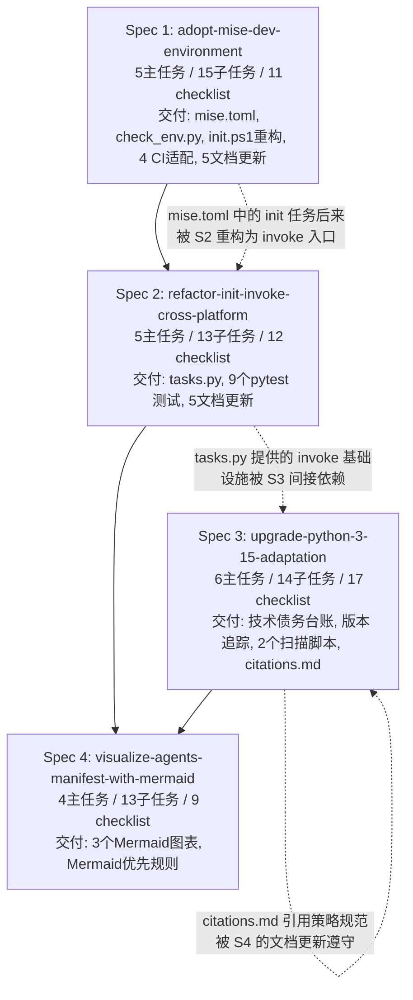

# 二、执行过程复盘

### 2.1 四份 Spec 执行路径总览

### 2.2 里程碑与时间线

| 日期 | 里程碑 | 关键交付 |
|------|--------|---------|
| 2026-05-20 | 技能稳定性修复 | skill-creator Windows 兼容、task-execution-summary v2.4 |
| 2026-05-21 | 文档架构重塑 | AGENTS.md 契约确立、模块化 CHANGELOG、Python 3.15 追踪 |
| 2026-05-22 | 工程化基建交付 | Spec 1 (mise) + Spec 2 (invoke) + Spec 4 (Mermaid) 完成 |
| 2026-05-23 | 全面复盘 | 本报告 |

**量化成果**：
- 4 个 spec 全部完成，完成率 **100%**
- 20 个主任务全部完成
- 55 个子任务全部完成
- 49 个 checklist 全部通过

### 2.3 依赖链设计评估

四份 spec 之间存在**隐性但合理的依赖关系**：

1. **Spec 1 → Spec 2**：Spec 1 交付的 `mise.toml` 中定义了 `init` 和 `init-check` 任务入口，但此时实现仍是 `scripts/init.ps1`（PowerShell 锁定）。Spec 2 将这些任务重路由到 `uv run invoke init`（Python invoke 包），实现了跨平台。依赖链设计合理——先统一声明（mise.toml），再改进实现（invoke）。

2. **Spec 2 → Spec 3**：Spec 2 交付的 `tasks.py` (invoke) 和跨平台基础能力，为 Spec 3 中 `defuddle` 预装集成和脚本执行提供了稳定的命令执行环境。依赖链合理但不是强依赖。

3. **Spec 3 → Spec 4**：Spec 3 引入的 `citations.md` 引用策略规范，为 Spec 4 中 Mermaid 图表的生成与文档引用确定了规则框架。属于**规范性依赖**而非技术依赖，合理。

**评估结论**：依赖链设计整体合理，未出现循环依赖或瓶颈阻塞。唯一可以优化的是 Spec 2 和 Spec 3 在时间上可以**并行推进**（两者无强依赖），但当前串行执行导致总周期稍长。

### 2.4 进度延误与资源错配

- **进度延误**：未发现明显延误。四个 spec 均在单日内完成闭环，从 speccing 到实现到验收的全链路高效。
- **资源错配**：无明显错配。单开发者 + AI 智能体的协作模式下，主要瓶颈在于人类决策时间（架构评审、优先级排序），而非 AI 执行速度。

### 2.5 中间产物管理（.temp/ 使用）

`.temp/` 当前内容：

| 文件/目录 | 类别 | 是否合规 | 状态 |
|-----------|------|---------|------|
| `mermaid-validation/` | Mermaid 验证渲染产物（6 SVG + 1 MD） | ✅ 合规 | 验证完成后可清理 |
| `aiforce-app-page.html` | 临时页面 | ✅ 合规 | 可清理 |
| `temp_page.md` | 临时页面 | ✅ 合规 | 可清理 |
| `error.log` | 空文件 | ⚠️ 建议清理 | 空文件无留存价值 |

**评估**：`.temp/` 使用遵循了 `AGENTS.md §1.4` 的规定，所有中间产物均放入 `.temp/`，未污染根目录。当前 3 个文件/目录均为可清理对象，建议在本次复盘后执行清理。
