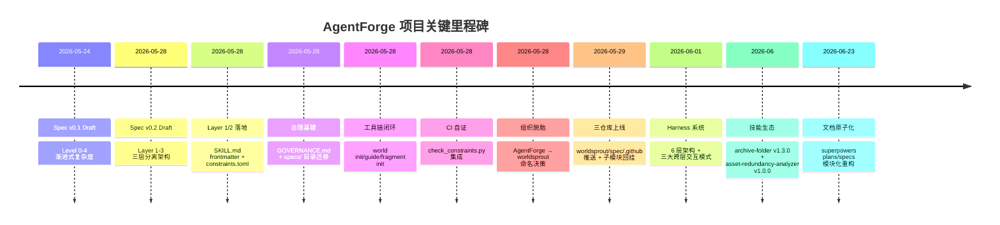
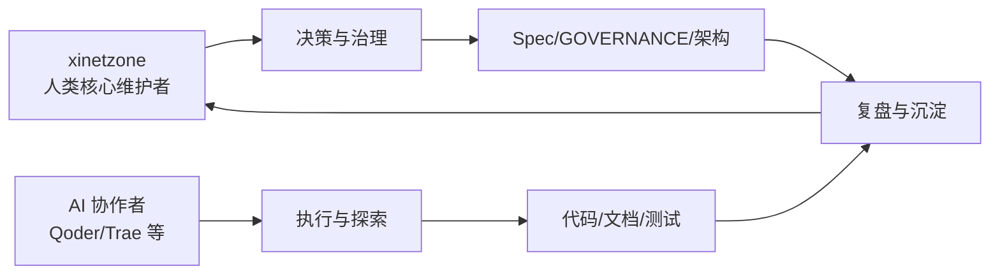
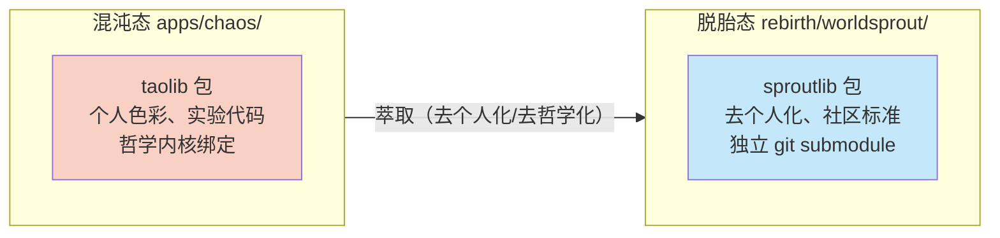

# AgentForge 项目综合复盘报告

> **复盘类型**：项目级综合复盘（多维度系统性分析）
> **复盘日期**：2026-06-23
> **复盘范围**：AgentForge 全项目——从 Spec v0.1 到 Harness 系统、WorldSprout 脱胎、技能生态建设的完整历程
> **参与角色**：xinetzone（核心维护者）、AI 协作者（Qoder / Trae 等）
> **数据来源**：git log、文件系统统计、项目文档、CI 配置、已有复盘资料

---

## 1. 基本信息

| 字段 | 内容 |
|------|------|
| 复盘对象 | AgentForge（AI Agent 协作基础设施）+ WorldSprout（脱胎标准） |
| 时间范围 | 2026-05 Spec v0.1 起 → 2026-06-23 当前状态 |
| 仓库位置 | `github.com/xinetzone/AgentForge`（主仓）+ `github.com/worldsprout/*`（三仓库脱胎） |
| 参与方 | xinetzone（人类核心维护者）+ AI 协作者 |
| 核心里程碑 | Spec v0.1→v0.2 架构演进、WorldSprout 脱胎与子模块回挂、Harness 6 层架构引入、技能生态建设 |
| 技术栈 | Python 3.13+/3.14、uv、scikit-build-core、Sphinx、GitHub Actions + GitCode、Podman、LangGraph + Metaflow |

---

## 2. 执行概览

### 2.1 核心数据摘要

| 维度 | 数据 | 来源 |
|------|------|------|
| 源码文件数 | 86 个 `.py` 文件 | `Glob: apps/chaos/src/taolib/**/*.py` |
| 测试文件数 | 6 个 `test_*.py` 文件 | `Glob: apps/chaos/tests/test_*.py` |
| 文档文件数 | >200 个 `.md` 文件（含道德经 81 章、英语语法 25 章、哲学/宇宙学等） | `Glob: docs/**/*.md`（结果截断于 200） |
| 规则文件数 | 17 个 `.md` 文件 | `Glob: apps/chaos/.agents/rules/*.md` |
| 技能数 | 9 个 `SKILL.md` | `Glob: apps/chaos/.agents/skills/**/SKILL.md` |
| Role 声明数 | 11 个（4 governance + 7 engineering） | `Glob: apps/chaos/.agents/roles/**/*.md` |
| CLI 子命令 | 10 个（init/guide/fragment/install/publish/resolve/route/session/status/remove） | `Glob: apps/chaos/src/taolib/cli/_world_commands/*.py` |
| Harness 模块 | 6 层（core/runtime/agents/pipelines/eval/devtools） | `apps/chaos/.agents/docs/harness-architecture.md` |
| CI 作业 | 6 个（init-check/test/lint/security/docs/test-container） | `.github/workflows/ci.yml` |
| 脱胎仓库 | 3 个（worldsprout/spec/.github） | `rebirth/RETROSPECTIVE.md` |

### 2.2 关键指标

- **架构演进**：Spec v0.1（Level 0-4 垂直堆叠）→ Spec v0.2（Layer 1-3 三层分离 + Level 正交）✅ 已落地
- **脱胎完整度**：3 仓库就绪 + Git Submodule 回挂 ✅ 已完成
- **Harness 验证**：Phase 0 兼容性验证（Python 3.14 + LangGraph 1.2.2 + Metaflow 2.19.31）✅ 通过
- **CI 自证**：constraints.toml + check_constraints.py ✅ 已集成
- **治理基建**：GOVERNANCE.md（214 行 RFC 流程）✅ 已建立
- **测试覆盖率门禁**：≥80%（CI 显式声明）【高置信度，来源：`.github/workflows/ci.yml` 第 96 行】

### 2.3 整体定性

AgentForge 当前处于"**骨架完备、运行时部分验证、生态冷启动中**"的阶段。架构设计理念领先行业（行业分析自评"类似早期 Kubernetes 之前的 Borg 论文阶段"），但运行时绑定与生态采纳仍是核心瓶颈。

---

## 3. 过程时间线与里程碑

### 3.1 阶段划分

| 阶段 | 时间 | 核心产出 | 状态 |
|------|------|---------|------|
| **阶段一：标准奠基** | 2026-05-24 ~ 05-28 | Spec v0.1→v0.2、Layer 1/2 落地、30 条洞见 | ✅ 完成 |
| **阶段二：治理与脱胎** | 2026-05-28 ~ 05-29 | GOVERNANCE.md、WorldSprout 三仓库、子模块回挂 | ✅ 完成 |
| **阶段三：运行时补强** | 2026-06-01 | Harness 6 层架构、Phase 0 兼容性验证 | ✅ 骨架完成 |
| **阶段四：生态建设** | 2026-06 持续 | 技能生态（9 个 SKILL）、文档原子化 | 🔄 进行中 |

---

## 4. 目标达成度评估

### 4.1 Spec v0.2 三层架构目标达成

| Layer | 目标 | 落地完整度 | 证据 |
|-------|------|-----------|------|
| **Layer 1** | 任何项目零前提采用，与 30+ AGENTS.md 工具兼容 | ✅ 100% | SKILL.md frontmatter、rules paths glob、AGENTS.md 桥接声明、starter 模板 |
| **Layer 2** | 多智能体协作语义 | ✅ 90% | constraints.toml（strong/weak/parallel）、11 个 Role 声明、协作元模型 15 实体；⚠️ 运行时执行器缺失 |
| **Layer 3** | 世界特有哲学与运行时 | ✅ 85% | psi-philosophy fragment、记忆做梦协议、World Session；⚠️ 哲学已降格为可选 fragment（设计意图） |

**评估结论**：三层分离架构目标基本达成。Layer 1 完全闭环，Layer 2 语义完备但缺运行时绑定，Layer 3 哲学降格策略执行到位。【高置信度】

### 4.2 WorldSprout 脱胎目标达成

| 目标 | 状态 | 证据 |
|------|------|------|
| 三仓库就绪 | ✅ 完成 | `rebirth/worldsprout/AGENTS.md` 存在；RETROSPECTIVE.md 记录三仓库推送 |
| Git Submodule 回挂 | ✅ 完成 | `.gitmodules` 跟踪 main 分支 |
| 去个人化 | ✅ 完成 | GOVERNANCE.md 去个人化创建、Spec v1.0 剥离哲学/个人内容 |
| taolib → sproutlib 重命名 | ❌ 未执行（→ 见附录 A 重新评估：范畴误判，修正为独立创建） | RETROSPECTIVE.md 明确标注"📋 待执行"；`pyproject.toml` 第 11 行仍为 `name = "taolib"` |

**评估结论**：脱胎目标完成度约 90%。三仓库与子模块管理有效；apps/chaos/ 保留 taolib 符合混沌态定位（→ 见附录 A）；剩余工作为 rebirth/worldsprout/ 独立创建 sproutlib 包（萃取式，非重命名）。【高置信度】

### 4.3 Harness 系统目标达成

| 目标 | 状态 | 证据 |
|------|------|------|
| 6 层架构骨架 | ✅ 完成 | `harness-architecture.md` + 6 层模块清单；源码 22 个 .py 文件分布于 6 层目录 |
| 三大跨层交互模式 | ✅ 设计完成 | Agent-as-Step、Flow-as-Tool、Shared Checkpoint；⚠️ 仅骨架，缺端到端验证用例 |
| Phase 0 兼容性验证 | ✅ 通过 | Python 3.14 + LangGraph 1.2.2 通过；Metaflow 2.19.31 Linux 通过 |
| Windows 平台支持 | ⚠️ 部分支持 | LangGraph 路径可用；Metaflow 路径因 `fcntl` 不可用，已通过 TYPE_CHECKING 守卫隔离 |

**评估结论**：Harness 系统骨架完备，Phase 0 兼容性验证通过，但三大交互模式仍停留在"设计 + 骨架"阶段，缺端到端实战验证。【高置信度】

### 4.4 技能生态目标达成

| 技能 | 版本 | 闭环质量 | 来源 |
|------|------|---------|------|
| skill-creator | — | ✅ 完整（文档+脚本+测试+评估） | `docs/topics/design-philosophy.md` §5.3 |
| task-execution-summary | v2.1 | ✅ 完整 | `apps/chaos/CHANGELOG.md` |
| archive-folder | v1.3.0 | ✅ 完整（日志留存/自动命名/追加模式/HTML 声明一致性校验） | git log `ab03a7d` |
| asset-redundancy-analyzer | v1.0.0 | ✅ 完整 | git log `a2d4633` |
| pdf-to-markdown | — | ✅ 完整（含 CJK 字体 CI 支持） | `.github/workflows/ci.yml` 第 79-86 行 |
| zhihu-* ×4 | — | ⚠️ 部分（无独立测试闭环证据） | `Glob: apps/chaos/.agents/skills/zhihu-*/SKILL.md` |

**评估结论**：9 个技能中 5 个有明确版本与完整闭环，4 个 zhihu 系列技能复用价值存疑（可能为个人化工具）。技能生态的"平台无关声明式技能标准"差异化定位已验证。【中置信度】

---

## 5. 技术架构维度分析

### 5.1 双态架构（混沌/脱胎）设计合理性

**优势**：
- **混沌态自由探索**：`apps/chaos/` 承载哲学内核、实验代码、个人化内容，不约束标准采纳者【高置信度，来源：`AGENTS.md` 根目录】
- **脱胎态精炼产出**：`rebirth/` 通过 git submodule 链接到 WorldSprout 组织，实现"去个人化、去哲学化"的持续萃取【高置信度，来源：`governance-and-specs.md` §2】
- **萃取管道清晰**：混沌→萃取（去个人化/去哲学化）→同步至 rebirth→git push，流程可视化【高置信度，来源：`governance-and-specs.md` Mermaid 图】

**执行完整性**：
- ✅ 脱胎规则明确（删除个人身份/哲学/密钥，中性化技术架构）
- ✅ 三仓库就绪 + 子模块回挂
- ✅ apps/chaos/ 保留 taolib 符合混沌态定位（→ 见附录 A：原始"重命名"决策范畴误判）
- ⚠️ rebirth/worldsprout/ 的 sproutlib 包尚未独立创建——应通过萃取而非重命名解决
- ⚠️ `src/taolib/github_app/` 等私有基础设施不迁移——边界清晰但需文档化

### 5.2 Spec v0.2 三层分离架构

**优势**：
- **正交分层解决核心矛盾**：v0.1 的"垂直堆叠"要求 Level 3+ 项目接受道德经；v0.2 将哲学降格为 Layer 3 可选 fragment，标准采纳者不再被迫接受世界观【高置信度，来源：`specs/agentforge-spec-v0.2.md` §1.1】
- **Layer × Level 正交矩阵**：Layer 定义"是什么"，Level 定义"用多少"，两者不矛盾【高置信度，来源：`specs/agentforge-spec-v0.2.md` §1.2】
- **依赖关系清晰**：Layer 1 无前置依赖，Layer 2 依赖 Layer 1，Layer 3 依赖 Layer 2【高置信度】

**概念复杂度代价**：
- ⚠️ Layer × Level 正交矩阵增加概念复杂度——虽然 RETROSPECTIVE.md 评估"实际值大于代价"，但对新采纳者认知门槛较高【中置信度】
- ⚠️ "Layer"与"Level"的语义区分需要额外学习成本——行业主流（Cursor/Claude Code）无此抽象层【中置信度，来源：`docs/topics/industry-analysis.md`】

### 5.3 World CLI 工具链完整度

**子命令清单**（10 个）：
- `init`（234 行）— starter template + 内嵌后备模板
- `guide`（230 行）— 项目类型检测 + Fragment 推荐
- `fragment_init`（246 行）— 规则打包为 Fragment
- `install` — 安装 Fragment
- `publish` — 发布到 Registry
- `resolve` — 依赖解析
- `route` — 上下文路由
- `session` — World Session
- `status` — 状态查询
- `remove` — 移除

**闭环质量评估**：
- ✅ **30 秒闭环**：`world init` → `world guide` → `world fragment init --from-rules`，从零到第一颗种子【高置信度，来源：RETROSPECTIVE.md §5】
- ✅ **`_world_engines/` 模块化拆分**：24 个引擎模块（session_engine、routing_engine、registry_*、lock_* 等），职责单一【高置信度，来源：Glob 结果】
- ⚠️ **Registry 冷启动**：`world publish` + Registry 模型已设计，但首个 fragment 尚未发布【高置信度，来源：RETROSPECTIVE.md §6 P3】
- ⚠️ **`world guide` Fragment 推荐表**：已实现但推荐内容待充实【高置信度】

### 5.4 constraints.toml 约束即代码 + CI 自证

**有效性评估**：
- ✅ **声明式布尔约束**：`strong`（ERROR 阻断）/ `weak`（WARN 不阻断）/ `parallel`，自然语言约束变为机器可校验【高置信度，来源：`docs/topics/design-philosophy.md` §10.6】
- ✅ **CI 集成**：`.github/workflows/ci.yml` 第 177-178 行 `Check AgentForge Layer 2 constraints` step 执行 `check_constraints.py`【高置信度】
- ✅ **本地校验通过**：RETROSPECTIVE.md 记录"✅ 所有约束校验通过"
- ⚠️ **执行器缺失**：constraints 定义了"是什么"，但缺"运行时执行器"——CI 校验是静态层，运行时动态约束（如 `agent_requires_role`）无强制执行机制【中置信度，来源：`docs/topics/industry-analysis.md` §工程落地差距】

### 5.5 Harness 智能体系统成熟度

**6 层架构**：
| 层 | 模块数 | 成熟度 | 平台限制 |
|---|--------|--------|---------|
| core | 3（state/bridge/registry） | ✅ Protocol 优先，跨平台可靠 | 无 |
| runtime | 3（executor/scheduler/checkpointer） | ✅ 统一执行器 + HybridScheduler | Metaflow 路径 Windows 不可用 |
| agents | 2（graph_agent/templates） | ✅ LangGraph Agent 抽象 | 无 |
| pipelines | 2（flow_base/templates） | ⚠️ Metaflow 依赖 | Windows 不可用 |
| eval | 3（harness/metrics/reporters） | ✅ Metric Protocol + 3 Reporter | 无 |
| devtools | 3（inspector/replay/profiler） | ✅ 开发者工具链 | 无 |

**三大跨层交互模式**：
- ✅ **设计完备**：Agent-as-Step、Flow-as-Tool、Shared Checkpoint 均有 Mermaid 流程图与适配器实现
- ⚠️ **验证不足**：仅 Phase 0 兼容性验证（导入冒烟），缺端到端实战用例【高置信度，来源：`harness-architecture.md`】

**平台限制缓解**：
- ✅ **TYPE_CHECKING 守卫 + 延迟导入**：Windows 下 `harness.core` 可加载，LangGraph 路径完全可用【高置信度】
- ✅ **CI 矩阵约束**：Metaflow 测试仅在 Linux runner 执行，Windows runner 显式 skip【高置信度，来源：`harness-architecture.md` §平台限制】
- ⚠️ **用户体验折损**：Windows 开发者无法本地运行 Metaflow 路径，需 WSL 或 Linux 容器【高置信度】

### 5.6 技术选型合理性

| 选型 | 合理性 | 证据 |
|------|--------|------|
| **GitHub App 令牌服务** | ✅ 合理 | `github_app/` 模块（10 个 .py），可选依赖 `httpx`+`PyJWT`+`PyGithub`；CI 有独立 test step |
| **Podman 容器化** | ✅ 合理 | `flowkit/podman_win.py` + `podman_context.py` 适配 Windows；rootless 模式安全 |
| **scikit-build-core 构建** | ✅ 合理 | `pyproject.toml` 使用 `scikit_build_core.build`，支持 CMake 扩展（nuitka 编译） |
| **LangGraph + Metaflow 对等集成** | ⚠️ 雄心大 | 行业无第二家做此集成；Phase 0 通过但实战验证不足 |
| **uv 包管理** | ✅ 合理 | 全项目统一使用 uv，符合 AGENTS.md 规则 |

---

## 6. 业务逻辑维度分析

### 6.1 AGENTS.md 开放标准定位策略

**市场契合度**：
- ✅ **零依赖 + 渐进扩展**：AGENTS.md 标准被 30+ 工具原生支持（OpenAI Codex、Google Jules、GitHub Copilot、Cursor、Amp），AgentForge 作为超集消费者【高置信度，来源：`apps/chaos/AGENTS.md` 顶部声明】
- ✅ **类比清晰**："AGENTS.md 标准 ≈ Markdown；AgentForge ≈ CommonMark + GFM 扩展"——对外沟通成本极低【高置信度，来源：`specs/agentforge-spec-v0.2.md` §1.0】
- ✅ **三处同步声明**：AGENTS.md 顶部、Spec §1.0、world init 模板三处同时声明标准独立性【高置信度，来源：RETROSPECTIVE.md §决策二】

**风险**：
- ⚠️ **品牌混淆**："world"既是技术概念（world.toml）又是品牌隐喻（WorldSprout），语义边界偶尔混淆【高置信度，来源：RETROSPECTIVE.md §5 需要改进】
- ⚠️ **采纳门槛**：行业分析自评"采纳门槛远高于主流'一个文件搞定'方案"【高置信度，来源：`docs/topics/industry-analysis.md` §设计张力】

### 6.2 Layer 1 零前提采用策略

**对标准推广的影响**：
- ✅ **降低心理门槛**：标准采纳者不再被迫接受世界观，Layer 1 独立可发布【高置信度】
- ✅ **与 30+ 工具生态对齐**：Layer 1 是 AGENTS.md 标准的最小公约数【高置信度】
- ⚠️ **价值感知不足**：Layer 1 仅提供"AGENTS.md 路由 + .agents/ 目录 + world.toml + SKILL.md"，对已使用 Cursor/Claude Code 的用户增量价值需更清晰论证【中置信度】

### 6.3 Fragment 分发模型与 Registry 冷启动

**成熟度评估**：
- ✅ **模型设计完备**：`world install` + `world fragment init --from-rules` + `world publish` 三命令链【高置信度】
- ✅ **"AI 规则的 npm/pip"定位**：声明式能力包管理，降低创作者成本 > 降低消费者成本【高置信度，来源：`docs/topics/industry-analysis.md` §洞见四】
- ❌ **冷启动未解决**：Registry 首个 fragment 尚未发布【高置信度，来源：RETROSPECTIVE.md §6 P3】
- ⚠️ **"left-pad moment"未到来**：行业分析指出"所有精妙设计加起来，不如一个能让新用户在 30 秒内尖叫的体验"【高置信度，来源：`docs/topics/design-philosophy.md` §13.3】

### 6.4 技能生态可持续性

| 技能 | 复用价值 | 可持续性 | 评估 |
|------|---------|---------|------|
| skill-creator | ✅ 高 | ✅ 强 | 技能开发工具链，自我繁衍 |
| task-execution-summary | ✅ 高 | ✅ 强 | 通用任务总结，v2.1 已稳定 |
| archive-folder | ✅ 中高 | ✅ 强 | Windows 文件夹归档，v1.3.0 |
| asset-redundancy-analyzer | ✅ 中 | ✅ 中 | 静态资产冗余分析，v1.0.0 |
| pdf-to-markdown | ✅ 高 | ✅ 强 | 含 CJK 字体支持，CI 集成 |
| zhihu-* ×4 | ⚠️ 低 | ❌ 弱 | 个人化工具，复用价值存疑 |

**评估结论**：9 个技能中 5 个具有明确复用价值与完整闭环，4 个 zhihu 系列技能可能为个人化探索产物。技能生态的"平台无关声明式技能标准"差异化定位已验证，但需警惕个人化技能污染标准生态。【中置信度】

### 6.5 哲学驱动工程（Ψ=Ψ(Ψ) + 道德经）

**赋能面**：
- ✅ **设计原则源泉**："极致简约、大道至简"、"反者道之动，弱者道之用"作为重要设计依据【高置信度，来源：`apps/chaos/AGENTS.md` §1】
- ✅ **上下文节省作为架构约束**：把"上下文有限"这个 AI 物理约束转化为项目组织架构原则【高置信度，来源：`docs/topics/design-philosophy.md` §10.3】
- ✅ **递归自指是工程实践**：`.agents/` 目录本身是元系统，用文档定义如何管理文档【高置信度】

**认知门槛面**：
- ⚠️ **采纳门槛**：哲学内核虽已降格为 Layer 3 可选 fragment，但 chaos 仓仍以哲学叙事为主线【高置信度】
- ⚠️ **"世界"语义混淆**：技术概念与品牌隐喻重叠【高置信度】
- ⚠️ **行业独一份的代价**：行业分析指出"哲学-工程闭环映射"是"行业独一份"，但独一份既可能是领先也可能是孤立【中置信度，来源：`docs/topics/industry-analysis.md` §领先与滞后】

---

## 7. 用户体验维度分析

### 7.1 开发者上手路径

**30 秒闭环评估**：
- ✅ **`world init`**：starter template + 内嵌后备模板，从零到第一颗种子【高置信度，来源：RETROSPECTIVE.md §5】
- ✅ **`mise run init-check`**：trust + check-env，CI 矩阵覆盖 ubuntu/windows/macos【高置信度，来源：`.github/workflows/ci.yml`】
- ✅ **`world guide`**：项目类型检测 + Fragment 推荐【高置信度】
- ⚠️ **`world guide` 推荐表待充实**：Fragment 推荐内容不足【高置信度，来源：RETROSPECTIVE.md §6 P3】

**流畅度评估**：上手路径设计流畅，但 Registry 冷启动导致"安装什么"的内容供给不足。【高置信度】

### 7.2 文档双轨分类与 AI/人类隔离

**清晰度评估**：
- ✅ **双轨分类**：`docs/tech/`（项目技术文档）+ `docs/general/`（通用知识：哲学、数学、传统文化），两轨严禁混入【高置信度，来源：`apps/chaos/AGENTS.md` §5】
- ✅ **AI/人类隔离**：`docs/`（人类）↔ `.agents/docs/`（AI）↔ `specs/`（人+AI 公约数）【高置信度】
- ✅ **嵌套 toctree**：父 `docs/index.md` 仅引子入口【高置信度】
- ⚠️ **文档量庞大**：>200 个 .md 文件，道德经 81 章 + 英语语法 25 章 + 哲学/宇宙学等，可能稀释技术文档可发现性【中置信度，来源：Glob 结果】

### 7.3 跨工具桥接映射表

**实用性评估**：
- ✅ **映射表清晰**：`.agents/` ↔ `.claude/` ↔ `.github/` 三列对照，语义明确【高置信度，来源：`apps/chaos/AGENTS.md` §7】
- ✅ **paths: glob 条件加载**：与 Claude Code `.claude/rules/` 条件加载机制对齐【高置信度】
- ⚠️ **桥接需手动同步**：映射表是"语义对照"而非"自动同步"，实际桥接需人工维护【中置信度】

### 7.4 Windows 平台限制

**影响评估**：
- ⚠️ **Metaflow 不可用**：依赖 POSIX 专属 `fcntl` 模块，Windows 解释器导入即失败【高置信度，来源：`harness-architecture.md`】
- ⚠️ **Podman rootless**：Windows 下 Podman 需 WSL 后端，rootless 模式配置复杂【中置信度】
- ✅ **缓解措施有效**：TYPE_CHECKING 守卫 + 延迟导入隔离 Metaflow 路径；LangGraph 路径 Windows 完全可用【高置信度】
- ✅ **CI 矩阵覆盖**：ubuntu-latest + windows-2025 + macos-latest 三平台，Metaflow 测试仅 Linux【高置信度】

### 7.5 文档站点（Sphinx + ReadTheDocs）

**信息架构评估**：
- ✅ **Sphinx 严格构建**：`mise run docs-strict`（`-W --keep-going`），CI docs job 独立【高置信度，来源：`.github/workflows/ci.yml` 第 220-221 行】
- ✅ **ReadTheDocs 托管**：`https://taolib.readthedocs.io/`【高置信度，来源：`pyproject.toml` 第 38 行】
- ✅ **autoapi + myst-parser**：自动 API 文档 + Markdown 支持【高置信度】
- ⚠️ **可发现性挑战**：>200 个文档文件，道德经/英语语法/宇宙学等非技术内容可能干扰技术文档检索【中置信度】

---

## 8. 项目管理与协作维度分析

### 8.1 治理模型完备性

**完备性评估**：
- ✅ **GOVERNANCE.md（214 行）**：RFC 流程、维护者权责、Layer 归属仲裁机制均已定义【高置信度，来源：RETROSPECTIVE.md §时间线】
- ✅ **治理先于发布**：在 Spec 正式发布前建立 GOVERNANCE.md，避免"标准有了但没人能参与"【高置信度】
- ✅ **specs/ 目录独立**：从 `.agents/docs/superpowers/specs/` 迁出，提升规范可见性【高置信度】
- ⚠️ **执行缺口**：治理模型定义完备，但运行时执行器缺失——constraints 是静态校验，动态治理（如 Layer 归属仲裁）无执行机制【中置信度】

### 8.2 维护者任命缺口

**风险评估**：
- ❌ **"有宪法无总统"**：GOVERNANCE.md 定义了完整的治理模型，但没有实际任命任何人【高置信度，来源：RETROSPECTIVE.md §5】
- ⚠️ **单一核心维护者风险**：xinetzone 是唯一人类核心维护者，bus factor = 1【高置信度】
- ⚠️ **首个 RFC 示范缺失**：taolib→sproutlib 重命名已决策但未执行，本应作为首个 RFC 示范展示完整流程【高置信度】

**缓解方案**：
- 短期：AI 协作者承担部分维护职责（已实践）
- 中期：通过 WorldSprout 组织吸引外部贡献者
- 长期：任命首位核心维护者

### 8.3 人机协作模式

**效能评估**：
- ✅ **xinetzone + AI 协作者模式**：RETROSPECTIVE.md 记录"xinetzone（核心维护者）、Qoder（AI 协作者）"【高置信度】
- ✅ **5 轮 × 6 条/轮 = 30 条洞见**：系统化洞见提取流程【高置信度】
- ✅ **复盘文化成熟**：retrospectives/ 目录下已有大量结构化复盘（task-summaries/、project-reviews/、insights/ 等）【高置信度，来源：LS 结果】
- ⚠️ **瓶颈**：AI 协作者无法承担治理决策（如维护者任命、RFC 仲裁），关键决策仍依赖单一人类【高置信度】

### 8.4 资源配置风险

| 风险 | 等级 | 证据 |
|------|------|------|
| 单一核心维护者 | 🔴 高 | bus factor = 1 |
| taolib→sproutlib 重命名未执行 | 🟡 中 | 32+ 文件工作量，RETROSPECTIVE.md §6 P2 |
| privacy-spec 空壳 | 🟡 中 | 只存在于 README 规划中，RETROSPECTIVE.md §6 P3 |
| AgentForge 与 WorldSprout 共存策略未定 | 🟢 低 | RETROSPECTIVE.md §6 P4 |

### 8.5 CI/CD 双平台策略

**覆盖度评估**：
- ✅ **GitHub Actions**：6 个 job（init-check/test/lint/security/docs/test-container），三平台矩阵（ubuntu/windows/macos）【高置信度，来源：`.github/workflows/ci.yml`】
- ✅ **GitCode 镜像**：RETROSPECTIVE.md 记录"`.gitcode/workflows/ci.yml` 同上"【高置信度】
- ✅ **pre-commit 集成**：ruff + ruff-format + docs-strict + validate-skills【高置信度，来源：`.pre-commit-config.yaml`】
- ⚠️ **维护成本**：双平台 CI 配置需同步维护，增加维护负担【中置信度】

---

## 9. 成果质量审计

### 9.1 代码质量

| 指标 | 数据 | 来源 |
|------|------|------|
| 源码文件 | 86 个 .py | Glob |
| 测试文件 | 6 个 test_*.py | Glob |
| 测试覆盖率门禁 | ≥80% | `.github/workflows/ci.yml` 第 96 行 |
| Lint | ruff + ruff-format | `.pre-commit-config.yaml` |
| 安全审计 | `mise run audit` | `.github/workflows/ci.yml` security job |
| 文档链接检查 | `mise run docs-internal-linkcheck` | CI lint job |
| 文档结构检查 | `mise run docs-structure-check` | CI lint job |
| SKILL.md 合规 | `mise run validate-skills` | CI lint job |
| Layer 2 约束 | `check_constraints.py` | CI lint job |

**评估**：代码质量门禁完备，覆盖 lint/test/security/docs/constraints 五维度。但测试文件数（6）相对于源码文件数（86）比例偏低，测试覆盖率可能依赖集成测试（如 pdf-to-markdown skill tests）。【中置信度】

### 9.2 文档质量

| 指标 | 数据 | 评估 |
|------|------|------|
| 文档量 | >200 个 .md | 丰富但可能过载 |
| 双轨分类 | tech/ + general/ | ✅ 清晰 |
| AI/人类隔离 | docs/ ↔ .agents/docs/ | ✅ 物理隔离 |
| Sphinx 严格构建 | `-W --keep-going` | ✅ 零警告 |
| 链接检查 | docs-internal-linkcheck | ✅ CI 集成 |

### 9.3 架构质量

| 维度 | 评估 |
|------|------|
| 模块化 | ✅ 高（CLI 拆分为 _world_engines/ 24 模块 + _world_commands/ 10 命令） |
| 协议优先 | ✅ Harness 全 Protocol 定义 |
| 跨平台 | ⚠️ Metaflow Windows 不可用（已隔离） |
| 可扩展性 | ✅ Registry + Fragment 模型 |
| 治理完备 | ⚠️ 定义完备但执行缺口 |

---

## 10. 协作效能分析

### 10.1 协作模式

### 10.2 效能指标

| 维度 | 评估 | 证据 |
|------|------|------|
| 决策效率 | ✅ 高 | 5 轮 × 6 条 = 30 条洞见系统化提取 |
| 执行效率 | ✅ 高 | AI 协作者承担大量代码/文档执行 |
| 复盘文化 | ✅ 成熟 | retrospectives/ 目录结构化沉淀 |
| 治理决策 | ⚠️ 瓶颈 | 关键决策依赖单一人类 |
| 知识传承 | ✅ 强 | AGENTS.md + .agents/ + retrospectives/ 三层沉淀 |

### 10.3 瓶颈识别

- **瓶颈一**：治理决策依赖单一人类（维护者任命、RFC 仲裁）
- **瓶颈二**：Registry 冷启动需人类推动（首个 fragment 发布）
- **瓶颈三**：taolib→sproutlib 重命名需人类协调（32+ 文件）

---

## 11. 问题与风险

### 11.1 问题分级与根因分析

| # | 问题 | 优先级 | 根因分析 | 来源 |
|---|------|--------|---------|------|
| Q1 | 维护者任命缺口（"有宪法无总统"） | P1 | 治理模型定义完备但未任命首位核心维护者；bus factor = 1 | RETROSPECTIVE.md §5/§6 |
| Q2 | taolib→sproutlib 重命名范畴误判（→ 见附录 A） | ~~P2~~ **P3** | 原始决策混淆双态边界；实际影响 ~100 文件 227+ 引用；修正为 rebirth/worldsprout/ 独立创建 sproutlib 包 | RETROSPECTIVE.md §6 P2；`pyproject.toml` 第 11 行；附录 A.1 数据复核 |
| Q3 | Registry 冷启动未解决 | P2 | 首个 fragment 未发布；"left-pad moment"未到来 | RETROSPECTIVE.md §6 P3；`docs/topics/design-philosophy.md` §13.3 |
| Q4 | Harness 三大交互模式缺端到端验证 | P2 | Phase 0 仅兼容性冒烟；缺实战用例 | `harness-architecture.md` |
| Q5 | constraints 运行时执行器缺失 | P2 | constraints 是静态 CI 校验；动态约束（agent_requires_role）无运行时强制 | `docs/topics/industry-analysis.md` §工程落地差距 |
| Q6 | privacy-spec 空壳 | P3 | 只存在于 README 规划中；优先级低于核心功能 | RETROSPECTIVE.md §6 P3 |
| Q7 | "world"语义边界模糊 | P3 | 技术概念（world.toml）与品牌隐喻（WorldSprout）重叠 | RETROSPECTIVE.md §5 |
| Q8 | zhihu-* 技能复用价值存疑 | P3 | 个人化工具；可能污染标准生态 | Glob 结果 |
| Q9 | 测试文件数（6）相对源码（86）偏低 | P3 | 测试可能依赖集成测试（skill tests）；单元测试覆盖不足 | Glob 结果 |
| Q10 | 文档量过载（>200）稀释技术可发现性 | P3 | 道德经 81 章 + 英语语法 25 章等非技术内容 | Glob 结果 |
| Q11 | AgentForge 与 WorldSprout 共存策略未定 | P4 | chaos 仓与 rebirth 仓的长期关系未明确 | RETROSPECTIVE.md §6 P4 |
| Q12 | 双平台 CI 维护成本 | P4 | GitHub Actions + GitCode 需同步维护 | RETROSPECTIVE.md §时间线 |

### 11.2 跨维度系统性问题

**系统性问题一：哲学驱动与标准推广的张力**
- **表现**：哲学内核虽已降格为 Layer 3 可选 fragment，但 chaos 仓仍以哲学叙事为主线，与"零前提采用"的 Layer 1 定位形成张力
- **根因**：混沌态（自由探索）与脱胎态（标准产出）的天然张力——混沌态保留哲学是设计意图，但可能影响外部观察者对标准中立性的感知
- **影响**：标准推广的认知门槛【中置信度】

**系统性问题二：单一维护者与治理完备的矛盾**
- **表现**：GOVERNANCE.md 定义了完整的 RFC 流程与维护者权责，但 bus factor = 1
- **根因**：治理模型的"形式完备"超前于"人员配备"
- **影响**：治理决策瓶颈、关键决策风险集中【高置信度】

**系统性问题三：骨架领先与运行时滞后的鸿沟**
- **表现**：行业分析自评"理念领先、运行时滞后、骨架正确"
- **根因**：设计驱动型项目天然倾向——先定义"应该是什么"，再补"实际能跑什么"
- **影响**：roles/teams 缺运行时绑定、constraints 缺执行器、Harness 三大模式缺实战验证【高置信度】

---

## 12. 经验教训

### 12.1 成功要素（可复用方法论）

| # | 成功要素 | 方法论提炼 | 来源 |
|---|---------|-----------|------|
| S1 | **三层分离架构** | 将"垂直堆叠"改为"正交分层"——Layer 定义关注点范围，Level 定义功能深度。适用于"通用标准 vs 完整实现"的张力场景 | Spec v0.1→v0.2 演进 |
| S2 | **AGENTS.md 标准分离声明** | 在入口、Spec、模板三处同步声明"标准独立、实现可替换"。类比 Markdown vs CommonMark 降低沟通成本 | RETROSPECTIVE.md §决策二 |
| S3 | **约束即代码** | 自然语言约束 → 声明式布尔值 → CI 自动校验。规范不是写在纸上的，是跑在 CI 里的 | constraints.toml + check_constraints.py |
| S4 | **治理先于发布** | 在标准正式发布前先建立 GOVERNANCE.md，避免"标准有了但没人能参与" | RETROSPECTIVE.md §决策三 |
| S5 | **30 秒闭环** | `world init` → `world guide` → `world fragment init`，从零到第一颗种子。规范是骨架，体验是血肉 | RETROSPECTIVE.md §5 |
| S6 | **系统化洞见提取** | 5 轮 × 6 条/轮 = 30 条洞见，分设计层/工程层/系统层/元层级四维 | RETROSPECTIVE.md §时间线 |
| S7 | **TYPE_CHECKING 守卫 + 延迟导入** | 可选依赖通过 TYPE_CHECKING 守卫接入，确保核心模块跨平台可靠加载 | `harness-architecture.md` |
| S8 | **双态架构（混沌/脱胎）** | 混沌态自由探索 + 脱胎态精炼产出，通过 git submodule 实现持续萃取 | `governance-and-specs.md` §2 |
| S9 | **复盘文化制度化** | retrospective-conventions.md 规范命名/章节/优先级；retrospectives/ 目录结构化沉淀 | `.agents/docs/retrospective-conventions.md` |
| S10 | **Protocol 优先** | 所有核心接口使用 typing.Protocol 定义，支持 duck typing 与第三方扩展 | `harness-architecture.md` |

### 12.2 失败教训

| # | 教训 | 反思 | 来源 |
|---|------|------|------|
| F1 | **taolib→sproutlib 重命名决策范畴误判**（→ 见附录 A） | 原始决策混淆混沌态与脱胎态边界；应重新定义为"萃取式创建"而非"全项目重命名"；apps/chaos/ 保留 taolib 符合双态设计 | RETROSPECTIVE.md §6 P2；附录 A.2-A.4 |
| F2 | **Registry 冷启动未解决** | "left-pad moment"未到来；应优先发布首个 fragment 证明模型可运作 | RETROSPECTIVE.md §6 P3 |
| F3 | **维护者任命滞后** | 治理模型建立但未任命首位维护者；"有宪法无总统"风险持续 | RETROSPECTIVE.md §5/§6 |
| F4 | **Harness 验证不足** | Phase 0 仅兼容性冒烟；应同步设计端到端实战用例 | `harness-architecture.md` |
| F5 | **"world"语义边界模糊** | 技术概念与品牌隐喻重叠；应在命名阶段做语义边界检查 | RETROSPECTIVE.md §5 |

### 12.3 可复用方法论

**方法论一：标准分离三处同步声明**
- 在入口文件、规范文档、初始化模板三处同步声明"标准独立、实现可替换"
- 适用场景：项目既是标准消费者又是扩展提供者

**方法论二：约束即代码 CI 自证**
- 自然语言约束 → 声明式布尔值（strong/weak/parallel）→ CI 自动校验
- 适用场景：规范需要强制执行而非指导性

**方法论三：跨平台可选依赖隔离**
- TYPE_CHECKING 守卫 + 延迟导入 + CI 矩阵约束（平台特定测试 skip）
- 适用场景：核心模块需跨平台，可选依赖有平台限制

**方法论四：系统化洞见提取**
- 多轮迭代 × 每轮多条 × 多维度分类（设计/工程/系统/元层级）
- 适用场景：复杂项目需要系统化反思

---

## 13. 规则候选标记

| 候选经验 | 触发次数 | 准入维度评估 | 建议动作 |
|---------|---------|------------|---------|
| 标准分离三处同步声明：在入口、Spec、模板三处同步声明标准独立性，降低外部沟通成本 | 首次 | 频率☑ 普适☑ 可执行☑ 无害☑ 可验证☑ | 提炼草案（已部分体现于 `documentation.md`，可强化为独立规则） |
| 约束即代码 CI 自证：自然语言约束 → 声明式布尔值 → CI 自动校验，规范跑在 CI 里而非纸上 | 首次 | 频率☑ 普适☑ 可执行☑ 无害☑ 可验证☑ | 标记候选（已有 `containerization.md` 等规则，可提炼为通用规则） |
| 跨平台可选依赖隔离：TYPE_CHECKING 守卫 + 延迟导入 + CI 矩阵约束 | 首次 | 频率☑ 普适☑ 可执行☑ 无害☑ 可验证☑ | 标记候选（可补充至 `python.md`） |
| 治理先于发布：标准正式发布前先建立 GOVERNANCE.md，避免"标准有了但没人能参与" | 首次 | 频率□ 普适☑ 可执行☑ 无害☑ 可验证☑ | 记录（场景较特定，暂不提炼为通用规则） |
| 30 秒闭环：init → guide → fragment，从零到第一颗种子的最短路径 | 首次 | 频率☑ 普适☑ 可执行☑ 无害☑ 可验证☑ | 标记候选（可补充至 `skills.md` 或 `documentation.md`） |

---

## 14. 后续行动项

| # | 行动项 | 优先级 | 责任对象 | 触发条件 | 验收方式 |
|---|--------|--------|---------|---------|---------|
| A1 | 任命首位核心维护者（解决"有宪法无总统"） | P1 | 人类 | WorldSprout 组织首个外部贡献者出现时 | GOVERNANCE.md 维护者列表非空 |
| A2 | rebirth/worldsprout/ 独立创建 sproutlib 包（从 taolib 萃取稳定功能）（→ 见附录 A） | ~~P2~~ **P3** | 协作 | 作为萃取流程示范启动时 | `rebirth/worldsprout/src/sproutlib/` 目录创建；从 taolib 萃取 world CLI/constraints 校验器等稳定功能；apps/chaos/ 无需变更 |
| A3 | Registry 首个 fragment 发布（解决冷启动） | P2 | 协作 | world publish 命令稳定后 | Registry 索引包含至少 1 个可安装 fragment |
| A4 | Harness 三大交互模式端到端验证用例 | P2 | 协作 | Harness 骨架稳定后 | 每个模式至少 1 个端到端测试用例通过 |
| A5 | constraints 运行时执行器原型 | P2 | 协作 | Layer 2 采纳者出现时 | `agent_requires_role` 等动态约束有运行时强制机制 |
| A6 | privacy-spec 内容起草 | P3 | 协作 | 下个迭代 | privacy-spec 仓库包含实质内容（非空壳） |
| A7 | "world"语义边界文档化 | P3 | 协作 | 下个迭代 | 术语表明确区分技术概念与品牌隐喻 |
| A8 | zhihu-* 技能复用价值评估 | P3 | 协作 | 技能生态治理时 | 评估报告明确每个 zhihu 技能的去留决策 |
| A9 | 测试覆盖率补充（单元测试） | P3 | 协作 | 下个迭代 | 单元测试文件数提升；覆盖率维持 ≥80% |
| A10 | 文档可发现性优化（技术 vs 非技术分离） | P3 | 协作 | 下个迭代 | docs/ 站点搜索/导航优化；技术文档可发现性提升 |
| A11 | AgentForge 与 WorldSprout 共存策略明确 | P4 | 人类 | 长期规划时 | 策略文档明确两仓关系 |
| A12 | 双平台 CI 同步机制自动化 | P4 | 协作 | CI 维护成本显著时 | GitHub Actions 与 GitCode CI 配置自动同步 |

---

## 15. 综合研判与前瞻性建议

### 15.1 综合研判

AgentForge 是一个**设计驱动型**项目，其核心特征是"理念领先、骨架完备、运行时部分验证、生态冷启动中"。

**优势矩阵**：
- 架构设计：三层分离 + Layer × Level 正交矩阵，行业无竞品
- 治理基建：GOVERNANCE.md 先于发布，RFC 流程完备
- 工具链：World CLI 10 子命令 + 30 秒闭环
- 约束即代码：constraints.toml + CI 自证
- Harness 系统：6 层架构 + 三大交互模式，LangGraph + Metaflow 对等集成
- 复盘文化：制度化复盘规范 + 结构化沉淀

**风险矩阵**：
- 单一维护者：bus factor = 1，治理决策瓶颈
- 运行时滞后：roles/teams 缺绑定、constraints 缺执行器、Harness 缺实战
- 生态冷启动：Registry 首个 fragment 未发布
- 哲学张力：混沌态哲学叙事与标准中立性的张力

### 15.2 前瞻性建议

**短期（1-2 迭代）**：
1. **任命首位核心维护者**——解决"有宪法无总统"的最高优先级风险
2. **发布 Registry 首个 fragment**——证明 Fragment 模型可运作，创造"left-pad moment"
3. ~~**taolib→sproutlib 重命名**~~（→ 见附录 A：修正为萃取式创建，移至中期）

**中期（3-6 迭代）**：
4. **rebirth/worldsprout/ 独立创建 sproutlib 包**——从 taolib 萃取稳定功能（world CLI、constraints 校验器），作为萃取流程示范（→ 见附录 A）
5. **Harness 端到端验证**——为三大交互模式设计实战用例，从骨架走向运行时
6. **constraints 运行时执行器**——从静态 CI 校验升级为动态强制执行
7. **技能生态治理**——评估 zhihu-* 等个人化技能，明确标准生态边界

**长期（6+ 迭代）**：
8. **WorldSprout 社区建设**——通过脱胎标准吸引外部贡献者，缓解单一维护者风险
9. **跨工具桥接自动化**——从语义对照升级为自动同步
10. **AgentForge 与 WorldSprout 共存策略**——明确混沌态与脱胎态的长期关系

### 15.3 核心战略建议

> **AgentForge 的最大风险不是"过度设计"，而是运行时迟迟不来导致治理层变成死文档。最大的机会是率先建立跨平台技能标准，让 `.agents/skills/` 成为 AI 时代的 `package.json`。**
>
> ——来源：`docs/topics/industry-analysis.md` §结论

**战略聚焦**：从"设计领先"转向"运行时验证 + 生态冷启动"。骨架已完备，下一阶段的核心任务是让骨架跑起来——发布首个 fragment、验证 Harness 实战、任命首位维护者。

---

## 附录 A：taolib → sproutlib 重命名决策重新评估

> **评估日期**：2026-06-23（基于本报告数据复核）
> **触发原因**：原始决策将"taolib → sproutlib"定义为"全项目重命名"，经双态架构边界复核，该决策存在范畴误判，需重新定义。

### A.1 数据复核（精确统计）

原始评估引用 RETROSPECTIVE.md 的"32+ 文件"为估算值。经实际统计：

| 类别 | 文件数 | 引用处数 | 来源 |
|------|--------|---------|------|
| 源码（`apps/chaos/src/taolib/`） | 37 | 94 | `Grep: apps/chaos/src` |
| 测试（`apps/chaos/tests/`） | 30 | 133 | `Grep: apps/chaos/tests` |
| 配置（`pyproject.toml`、`uv.lock`） | 2 | — | `Read: pyproject.toml` 第 11/38/42-43 行 |
| 文档（`.agents/docs/superpowers/`） | ~18 | — | `Grep: apps/chaos` |
| 旧代码（`apps/chaos/old/`） | ~13 | — | `Grep: apps/chaos/old` |
| **合计** | **~100** | **227+** | — |

**结论**：实际影响范围为 ~100 个文件、227+ 处引用，远超原始估算的"32+ 文件"。【高置信度】

### A.2 核心论点：双态边界误判

原始决策（RETROSPECTIVE.md §决策四）将"taolib → sproutlib"定位为"全项目重命名"，但经双态架构边界复核，该决策混淆了混沌态与脱胎态的职责边界：

**双态架构的设计意图**（来源：根目录 `AGENTS.md` §0、`README.md`）：
- **混沌态**："原始孵化器，自由探索、试错，哲学内核、实验代码、个人知识库"——**保留个人色彩是设计意图，不是缺陷**
- **脱胎态**："从 chaos 持续萃取、去个人化后的精炼产出"——**去个人化是脱胎过程，不是混沌态的义务**

因此，apps/chaos/ 的 `taolib` 保留个人色彩（`tao` = 道）完全符合混沌态定位；`sproutlib` 应是 `rebirth/worldsprout/` 独立创建的脱胎态包，而非混沌态的重命名产物。

### A.3 重新定义的决策

| 维度 | 原始决策（❌ 范畴误判） | 重新定义（✅ 符合双态边界） |
|------|----------------------|--------------------------|
| **动作** | taolib → sproutlib 全项目重命名 | rebirth/worldsprout/ 独立创建 sproutlib 包 |
| **影响范围** | ~100 文件、227+ 引用 | rebirth/worldsprout/ 新建 src/sproutlib/（从 taolib 萃取稳定功能） |
| **apps/chaos/ 变更** | 全部重命名 | **不变**——taolib 保留为混沌态实验包 |
| **PyPI 影响** | 包名变更，影响现有用户 | **无影响**——taolib 继续作为实验包发布 |
| **ReadTheDocs** | URL 变更（taolib → sproutlib） | **无影响**——taolib.readthedocs.io 保留 |
| **RFC 示范价值** | 作为首个 RFC 展示流程 | 仍可作为 RFC——但 RFC 内容变为"萃取 taolib 稳定功能至 sproutlib" |

### A.4 重新定义的理由

1. **符合双态架构设计**：混沌态保留个人色彩是设计意图（`AGENTS.md` 根目录 §0 明确"哲学内核、实验代码"属于混沌态）；脱胎态去个人化是萃取过程，不是混沌态的义务【高置信度】
2. **避免高成本高风险操作**：~100 文件、227+ 引用的重命名涉及 PyPI 包名变更（`pyproject.toml` 第 11 行 `name = "taolib"`，已发布至 PyPI）、ReadTheDocs URL 变更（第 38 行 `taolib.readthedocs.io`）、import 路径全量迁移——成本远超收益【高置信度】
3. **rebirth/worldsprout/ 本应独立**：作为独立 git submodule（`.gitmodules` 跟踪 main），worldsprout 仓库本就应有自己的包名；其 README 已将 `sproutlib` 作为既定事实引用（`rebirth/worldsprout/README.md` 第 5/27/51 行），但实际无 `src/` 实现——这是"文档领先于实现"的断层，应通过独立创建而非重命名来解决【高置信度】
4. **萃取优于重命名**：taolib 的稳定功能（如 world CLI、constraints 校验器）通过"萃取"流程在 sproutlib 中重新实现，天然完成去个人化；而 `github_app/` 等私有基础设施不迁移（`rebirth/README.md` 第 40 行已明确排除）——这正符合"萃取"而非"整体搬迁"的脱胎语义【高置信度】
5. **保留实验场**：taolib 作为混沌态实验包继续存在，允许快速迭代试错；sproutlib 作为脱胎态稳定包保证社区标准质量——两者职责分离，互不拖累【中置信度】

### A.5 对原始评估的修正

基于上述重新评估，本报告以下条目需修正：

| 原始条目 | 原始结论 | 修正后结论 |
|---------|---------|-----------|
| §4.2 脱胎目标 | "taolib→sproutlib 重命名 ❌ 未执行" | "taolib→sproutlib 重命名范畴误判；修正为 rebirth/worldsprout/ 独立创建 sproutlib 包（待执行）" |
| §5.1 执行完整性 | "⚠️ taolib→sproutlib 重命名未执行——脱胎规则中'重命名'项未完成" | "✅ apps/chaos/ 保留 taolib 符合混沌态定位；⚠️ rebirth/worldsprout/ 的 sproutlib 包尚未独立创建" |
| Q2 问题分级 | P2，"32+ 文件工作量" | **降级 P3**，"rebirth/worldsprout/ 独立创建 sproutlib 包；apps/chaos/ 无需变更" |
| F1 失败教训 | "taolib→sproutlib 重命名拖延" | "原始决策范畴误判（混淆双态边界）；应重新定义为'萃取式创建'而非'全项目重命名'" |
| A2 行动项 | P2，"全项目重命名（32+ 文件）" | **降级 P3**，"rebirth/worldsprout/ 独立创建 sproutlib 包，从 taolib 萃取稳定功能" |
| §15.2 短期建议 | "taolib→sproutlib 重命名——作为首个 RFC 示范" | **移至中期**，"rebirth/worldsprout/ 创建 sproutlib 包——作为萃取流程示范（非重命名）" |

### A.6 规则候选

本次重新评估触发一条规则候选：

| 候选经验 | 触发次数 | 准入维度评估 | 建议动作 |
|---------|---------|------------|---------|
| 双态架构下，混沌态包名保留个人色彩是设计意图；脱胎态包名应独立创建而非重命名 | 首次 | 频率☑ 普适☑ 可执行☑ 无害☑ 可验证☑ | 提炼草案 |

**建议**：将此经验提炼为 `apps/chaos/.agents/rules/` 下的脱胎规则草案，明确"萃取 ≠ 重命名"的边界。

---

*复盘归档于 2026-06-23。AgentForge 项目阶段性综合复盘完成。🌱*
*附录 A 补充于 2026-06-23：taolib → sproutlib 重命名决策重新评估。*
