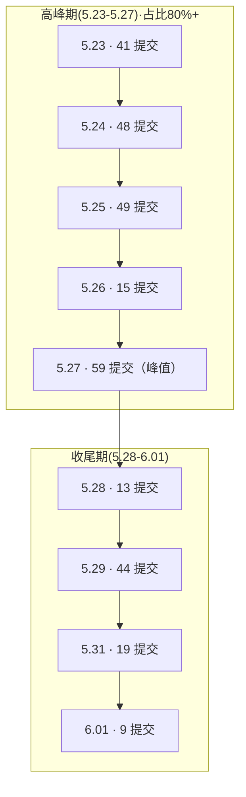
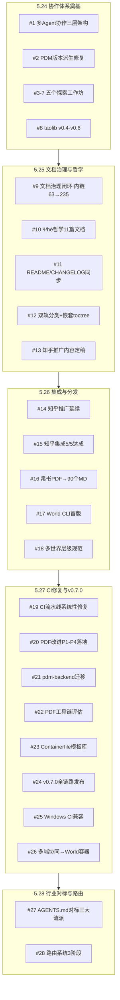
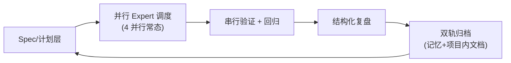
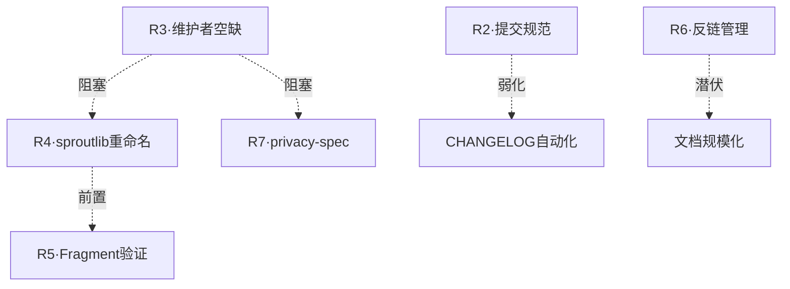
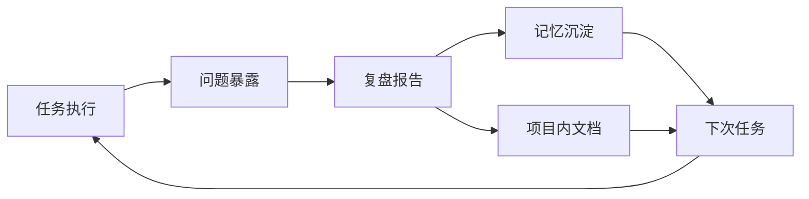

# AgentForge 项目阶段性增量复盘报告（2026-05-23 → 2026-06-01）

> 报告类型：项目阶段性增量复盘  
> 报告日期：2026-06-01  
> 上次复盘：[`agentforge-project-retrospective-20260523.md`](./agentforge-project-retrospective-20260523.md)  
> 规范依据：[`../../retrospective-conventions.md`](../../retrospective-conventions.md)

---

## 1. 基本信息

| 字段 | 内容 |
|------|------|
| 复盘对象 | AgentForge 项目（含 `apps/chaos/` 主线 + `rebirth/` 脱胎线） |
| 覆盖周期 | 2026-05-23 → 2026-06-01（共 10 天） |
| 上次复盘 | `retrospectives/agentforge-project-retrospective-20260523.md` |
| 报告类型 | 项目阶段性增量复盘 |
| 参与方 | 人类维护者 + 多 Agent 协作团队（leader + 多个 expert agent） |
| 核心评审范围 | 架构演进、CI/CD 治理、文档工程、工具链建设、项目脱胎 |
| 数据来源 | Git 历史分析、28 份任务报告、代码质量审计、架构演进分析 |

**周期定位**：本周期是 AgentForge 从「哲学驱动单体规范」向「标准驱动正交分层」战略转向的关键 10 天，在此期间完成了 Spec v0.2 三层架构落地、WorldSprout 组织脱胎、World CLI 工具链闭环以及 CI/CD 系统性治理。

---

## 2. 执行概览（核心数据摘要）

### 2.1 总体规模

> 数据来源：Research #1（Git 历史分析），命令 `git log --since=2026-05-23 --until=2026-06-01`

| 指标 | 数值 |
|------|------|
| 总提交数 | **244 次** |
| 文件变更总数 | **1,203** 个文件 |
| 新增行数 | **+127,772** |
| 删除行数 | **−3,679** |
| 净增长 | **+124,093** 行 |
| 新增文件 | 1,765 |
| 删除文件 | 761 |
| 已交付任务 | **28 个**（100% 完成率） |
| 任务报告归档 | 28 份（`apps/chaos/.agents/docs/superpowers/retrospectives/`） |

### 2.2 提交节奏分布

**节奏特征**【高置信度，来源：Research #1 提交日期分布表】：前 5 天集中输出 80% 以上提交，后 5 天进入收尾与精修。

### 2.3 提交类型分布

| 类型 | 数量 | 占比 | 主导主题 |
|------|------|------|---------|
| docs | 89 | **36.5%** | 文档系统化、哲学体系、设计洞见 |
| fix | 27 | 11.1% | CI 链式故障、文档构建、Sphinx 警告 |
| feat | 25 | 10.2% | World CLI、Token 管理、Skill 集成 |
| chore | 9 | 3.7% | Python 3.14 升级、依赖治理 |
| refactor | 4 | 1.6% | CLI 风格、UTC 迁移、类型现代化 |
| test/style | 3 | 1.2% | 测试与格式 |
| **未规范** | **87** | **35.7%** | 不符合 Conventional Commits |

**关键发现**：文档型变更占主导，体现知识沉淀阶段；约 **35.7%** 提交未遵循 Conventional Commits 规范，已列入 P1 改进项。

### 2.4 模块变更热点

| 模块 | 文件数 | 主题 |
|------|--------|------|
| `apps/chaos/` | 149 | 核心代码、规则、文档 |
| `docs/` | 123 | 双轨文档（tech/+general/）+ topics/ 专栏 |
| `rebirth/` | 6 | 脱胎归档与治理 |
| `.github/` | 4 | CI/CD 工作流 |

---

## 3. 目标达成度评估

### 3.1 上次复盘（20260523）遗留目标对账

> 数据来源：[`agentforge-project-retrospective-20260523.md`](./agentforge-project-retrospective-20260523.md) 及 Research #4 §1.2

| 上次缺口 | 本期进展 | 状态 |
|---------|---------|------|
| **缺口 1**：前端/后端规范骨架仅有占位文件 | `frontend.md`/`backend.md` 已新增 `paths` glob frontmatter；进入 Spec v0.2 Layer 1 条件加载链路 | 🟡 **部分改善**（仍待补完核心规范条文） |
| **缺口 2**：技能 CHANGELOG 与版本管理松散 | v0.7.0 发布时执行**全量合规检查**，7 个技能全部合规；增加 `.validate-skip` 排除机制 | ✅ **基本达成** |
| **缺口 3**：CI 文档构建偶发警告 | docs-strict 严格模式 + autoapi 警告归零；MyST `myst_fence_as_directive` 修复 mermaid 渲染 | ✅ **完全达成** |

### 3.2 本期新增目标完成度

| 新增目标 | 关键交付 | 状态 | 证据 |
|---------|---------|------|------|
| Spec v0.2 三层分离架构 | 912 行规范 + 4 个 Layer 2 Role + constraints.toml | ✅ 落地 | `apps/chaos/specs/agentforge-spec-v0.2.md` |
| WorldSprout 组织脱胎 | 3 仓库创建并推送、Submodule 回挂、Spec v1.0 | ✅ 完成 | `rebirth/RETROSPECTIVE.md`（283 行） |
| World CLI 工具链闭环 | init / guide / fragment_init 三阶段（710 行代码） | ✅ 完成 | `apps/chaos/src/taolib/cli/_world_commands/` |
| CI/CD 系统性修复 | 9 大类链式故障、6 轮系统性修复 | ✅ 完成 | `tests/project_changelogs/CHANGELOG_2026-05.md` L43+ |
| 构建后端迁移 | setuptools-scm → pdm-backend SCM | ✅ 完成 | `pyproject.toml` L69-77 |
| Ruff py313 → py314 升级 | 16 个文件格式重排 + 2 处 lint 修复 | ✅ 完成 | `check_env.py` supported_minor=14 |
| 知乎开源活动推广 | 短想法 + 深度文章 + 4 Skill 集成 | ✅ 完成 | `docs/topics/` + zhihu-* 三个技能 |
| 哲学体系系统化 | 11 篇互联文档（元公理→工程） | ✅ 完成 | `docs/general/philosophy/` |

**总体达成度评估**：上次缺口 2 项达成、1 项部分改善；本期新增 8 项核心目标全部落地。【高置信度】

---

## 4. 执行过程分析

> 数据来源：Research #2（任务梳理）28 份任务报告；按时间线整理。

### 4.1 时间线全景

### 4.2 各阶段关键交付

#### 5.24 — 协作体系奠基（8 个任务）

- **#1 多智能体协作体系**：建立三层落地架构（协作元模型 + roles/ + Team 工作流 + teams/），15 个核心实体、4 个角色实例、1 个 Team。
- **#2 PDM 动态版本修复**：补 `[tool.pdm.version]` 配置使 wheel 版本号正确派生自 git tag；3 笔原子提交。
- **#3-#7 五个探索工作坊**：CLI Status 诊断、Knowledge Loop 闭环、引用完整性、模板复用、技能校验脚本，跑通"场景卡 → spec → plan → 验证 → 复盘 → 回流"。
- **#8 taolib v0.4-v0.6**：4 个语义化版本、18 个原子提交、74 个测试通过、容器化完成。

#### 5.25 — 文档治理与哲学体系（5 个任务）

- **#9 文档治理闭环**：内链校验从 63 → 235 条（**3.7×**），双轨知识归档。
- **#10 Ψhē 哲学-工程体系**：11 篇互联文档，三层结构（元公理→本体论→动力学→工程规格→策略）。
- **#11 README/CHANGELOG 同步**：6 次决策收敛、5 轮迭代、零失效链接。
- **#12 双轨分类重构**：`tech/` + `general/` 19 文件迁移、嵌套 toctree、零警告构建。
- **#13 知乎推广定稿**：短想法 ~370 字 + 深度文章 ~2200 字。

#### 5.26 — 知乎、PDF、CLI、世界层级（5 个任务）

- **#14-15 知乎全流程**：4 个 Skill 集成、Token 验证、API 文档归档。
- **#16 帛书 PDF→Markdown**：90 个 MD 文件、81 章全覆盖、189,432 字符、零内容丢失。
- **#17 World CLI 分发**：5 个命令、11 个引擎模块、3 份规格、95 单元测试、本地 Registry Index 原型。
- **#18 多世界层级规范**：完整 7 节规范 + AGENTS.md 路由更新；tests/AGENTS.md 合规度 88% → 100%。

#### 5.27 — CI 系统治理与 v0.7.0 发布（8 个任务）

- **#19 CI 流水线修复**：5 类失败 + 1 类弃用警告，链式故障逐轮推进，6 次原子提交。
- **#20 PDF 改进建议**：P1-P4 全部落地，3 处实质性升级，CI 跨平台字体依赖修复。
- **#21 pdm-backend 迁移**：构建后端统一，6 项配置变更 + 1 文件删除。
- **#22 PDF 工具链评估**：Podman 统一评估框架、marker-pdf 95/100、MinerU 容器化不可行。
- **#23 v0.7.0 后续改进**：Containerfile 模板库、`.validate-config.toml`、英文 PDF 支持。
- **#24 v0.7.0 全链路发布**：122 文件变更、+6697 行、5 提交、v0.7.0 标签、3 轮复盘驱动。
- **#25 Windows CI 兼容**：mise Windows 后端 aqua → pip；`git filter-branch` 清除历史污染。
- **#26 多端协同**：World 作为统一上下文容器、体-用二分设计、规约草案起稿。

#### 5.28 — 路由系统与行业对标（2 个任务）

- **#27 AGENTS.md 行业对标**：三大流派格局图、跨平台对齐差距、AgentForge 定位为「全栈约定层标准」。
- **#28 结构化路由系统**：Phase 1-3 全部完成，`world.toml [routing]` + 10 个结构化 Role + `routing_engine.py` + 22 单元测试。

### 4.3 协作模式洞察

**模式特征**【高置信度，来源：Research #2 关键经验类目】：
1. **多 Agent 并行调度**：4 并行为常态，源于"探索工作坊模式"。
2. **三段式验证**：并行 → 串行 → 回归。
3. **复盘驱动改进**：每次任务后产出结构化复盘报告，并立即驱动下一轮 P1-P4 改进。
4. **双轨知识归档**：记忆系统 + 项目内 `.agents/docs/`。

---

## 5. 风险与问题识别（P0-P4 分级）

> 数据来源：Research #1 提交规范统计、Research #2 遗留事项、Research #4 §6.2 主要风险。

### 5.1 风险清单

| ID | 级别 | 风险描述 | 根因 | 影响范围 | 证据 |
|----|------|---------|------|---------|------|
| R1 | **P0** | 无阻塞性问题 | — | — | 28/28 任务全部交付 |
| R2 | **P1** | 35.7% 提交不符合 Conventional Commits | 多 Agent 协作下提交格式约束未在 pre-commit 拦截 | CHANGELOG 自动化、版本号派生 | Research #1 §"按提交类型分类" 未规范 87 条 |
| R3 | **P1** | 首位核心维护者空缺 | GOVERNANCE.md 已就位但任命流程未执行 | 标准发展方向决策、社区开放度 | Research #4 §6.2 "有宪法无总统" |
| R4 | **P2** | sproutlib 重命名未执行（涉 32+ 文件） | 工作量大、待作为首个 RFC 示范 | 脱胎完整性、Layer 2 自洽 | `rebirth/RETROSPECTIVE.md` 决策记录 |
| R5 | **P2** | Fragment 模型未实际验证 | Registry 与首个 fragment 发布缺失 | 标准可信度、社区采纳信心 | Research #4 §5.3 P3 行 |
| R6 | **P3** | 反向链接管理线性复杂 | 第 11 篇哲学文档需修改 10 个旧文件 | 文档规模 ≥20 篇时不可持续 | 任务 #10 遗留事项 |
| R7 | **P3** | privacy-spec 协议待起草 | 资源未分配 | Layer 1 规范完整性 | Research #4 §5.3 |
| R8 | **P4** | macOS CI 成本控制 | GitHub Actions macOS runner 单价 10× | 持续集成预算 | 任务 #8 遗留事项 |
| R9 | **P4** | MinerU 容器化部署不可行 | detectron2 不在 PyPI、依赖链断裂 | 中文 PDF 转换备选方案 | 任务 #22 评估结论 |

### 5.2 风险关联视图

**关键判断**【高置信度】：R3（维护者空缺）是当前最关键的"单点风险"，下游多个 P2 项均依赖其解锁。

---

## 6. 成果质量审计

> 数据来源：Research #3（代码质量审计）。

### 6.1 测试与覆盖

| 维度 | 数据 |
|------|------|
| 测试文件总数 | **29 个** |
| 单元测试 | 18 |
| 集成测试 | 9 |
| 性能测试 | 2 |
| 规则验证 | 1 |
| 覆盖率门槛 | 80%（pyproject.toml 强约束）/ CI 反馈门槛 68% |
| 命名规范 | 严格 `test_*.py` / `test_*()` / `Test*` |

### 6.2 CI 质量门禁

| 维度 | 数据 |
|------|------|
| 并行 Job 数 | **8** |
| 平台覆盖 | Windows / Linux / macOS |
| 检查项 | Pre-commit lint、文档构建、覆盖率、依赖审计、规则合规 |
| 文档构建模式 | `-W --keep-going`（零警告强约束） |

### 6.3 Lint / Format 配置

| 工具 | 关键参数 |
|------|---------|
| Ruff | 10 大类 100+ 规则（E、W、F、I、UP、ANN、B、C4、SIM、RUF）；24 项排除规则 |
| Pre-commit | 10 个 Hook（trailing-whitespace、格式检查、文件大小、Ruff auto-fix） |
| target-version | py314（与 `requires-python` 对齐） |

### 6.4 技术债务分级

| 级别 | 数量 | 主要类目 |
|------|------|---------|
| P0（阻断） | **0** | — |
| P1（高影响） | 5 | 安全/性能 |
| P2（中等影响） | 10 | 版本适配、文档更新 |
| P3（低影响） | 15 | 可选功能、知识积累 |

### 6.5 综合评分：**A−（8.2 / 10）**

**强项**：多平台 CI 覆盖、严格门禁、分层测试、现代工具链。  
**改进方向**：代码质量平台集成（codecov 已升级 v5）、结构化债务追踪、性能回归测试。

---

## 7. 协作效能分析

### 7.1 协作模式量化

> 数据来源：Research #2 任务报告归纳。

| 模式 | 实例 | 效能证据 |
|------|------|---------|
| 多 Agent 并行调度（4 并行常态） | 任务 #17 World CLI、任务 #19 CI 修复 | 任务密度 5.27 单日 8 个交付 |
| 探索工作坊（场景卡→spec→plan→验证→复盘→回流） | 任务 #3-#7 五个工作坊 | 模板复用验证可直接生成第三轮 |
| 复盘驱动改进 | 任务 #20、#23 P1-P4 落地 | 每次任务后产出结构化复盘并直接驱动下轮改进 |
| 双轨知识归档（记忆 + 项目内文档） | 任务 #9、#21 的 expert_experience 同步 | 跨会话延续摩擦小 |

### 7.2 协作摩擦点

| 摩擦点 | 任务实例 | 应对策略 |
|--------|---------|---------|
| 模糊需求收敛成本高（7 次结构化提问） | 任务 #9 | 提前用"差异扫描 + 决策点列表"替代多轮问询 |
| 跨会话延续承接点不明确 | 任务 #14 | 显式声明承接锚点（任务 ID + 状态摘要） |
| CI 链式故障只暴露首个失败 | 任务 #19 | 三段式验证 + 逐轮推进 |
| 沙箱 shell 限制（PowerShell 变量、pipe） | 任务 #25 | 改用纯 PowerShell 命令、`required_permissions='all'` |

### 7.3 复盘流转闭环

---

## 8. 经验教训总结

> 数据来源：Research #2 §"关键经验与教训"。

### 8.1 成功要素（可复用）

| 要素 | 说明 | 典型任务 |
|------|------|---------|
| **规格驱动实现** | 先 Spec 再 Plan 再代码，确保质量与边界 | #17 World CLI 全程规格驱动 |
| **链式故障逐轮推进** | 每轮只暴露首个失败，按序击破 | #19 CI 系统性修复 6 轮 |
| **最小侵入式修复** | 优于大范围重构，每次 commit 独立可构建 | #2 PDM 版本仅补 `[tool.pdm.version]` |
| **三段式验证** | 并行 + 串行 + 回归 | #20 P1-P4 改进 |
| **声明与引擎正交** | constraints.toml ↔ check_constraints.py 分离 | #28 路由声明/引擎分离 |
| **双轨知识归档** | 记忆 + 项目内文档双向冗余 | #9 文档治理 |

### 8.2 失败教训（避免重蹈）

| 教训 | 表现 | 改进方向 |
|------|------|---------|
| **模糊需求收敛成本高** | 任务 #9 用了 7 次结构化提问 | 启动前要求用户先提供"差异点 + 决策列表" |
| **CI 链式故障只暴露首个失败** | error.log 仅含首个 job 错误 | 启用 `fail-fast: false` 让所有 job 跑完 |
| **多文件一致性维护复杂** | AGENTS.md ↔ .agents/README ↔ 元模型三处同步 | 建立"single source of truth + mirror page" |
| **跨平台编码兼容陷阱** | Windows GBK 管道 emoji UnicodeEncodeError | Python 文件 IO 强制 `encoding='utf-8'` |
| **文档-实际不一致问题严重** | docs/tech/build-conventions.md 与实际配置脱节 | 构建后端迁移同步更新规范 |
| **历史技能合规治理工作量被低估** | 6 个历史技能不合规 | `.validate-skip` 排除机制 + 渐进式合规 |

### 8.3 可复用方法论

| 方法 | 适用场景 |
|------|---------|
| **P1-P4 分层改进策略** | 复盘后续行动项分级、技术债务管理 |
| **Podman 统一评估框架** | 跨平台工具对比，消除 Windows/Linux/macOS 差异 |
| **由本及末的根因链追踪** | 链式故障、构建系统问题 |
| **防御纵深（多道保险栓）** | 关键运维节点（构建洁净度 + fallback_version + CI 校验） |
| **渐进式演进** | roles/ → teams/ → agents/ 降低引入新概念的风险 |
| **5 阶段语义提交** | 大型文档/重构任务保持认知逻辑可追溯 |

---

## 9. 规则候选标记

> 与 [`../rules/rule-evolution.md`](../../rules/rule-evolution.md) 的五维准入标准对齐。

| 候选经验 | 触发次数 | 准入维度评估 | 建议动作 |
|---------|---------|------------|---------|
| **构建后端迁移须同步更新规范文档（防止 docs/实际脱节）** | 第 2 次（任务 #21；之前任务 #2 也踩过类似坑） | 频率☑ 普适☑ 可执行☑ 无害☑ 可验证☑ | **提炼草案**：建议加入 `rules/documentation.md`「配置变更同步」节 |
| **链式 CI 故障逐轮推进 + `fail-fast: false`** | 第 3 次（任务 #19、本周期前已 2 次） | 频率☑ 普适☑ 可执行☑ 无害☑ 可验证☑ | **提炼草案**：起草 `rules/ci-troubleshooting.md` 或合并入现有 CI 规则 |
| **Python 文件 IO 强制 `encoding='utf-8'`（Windows GBK 兼容）** | 第 4+ 次（已沉淀于记忆） | 频率☑ 普适☑ 可执行☑ 无害☑ 可验证☑ | **已记录在记忆**；建议进一步提炼至 `rules/python.md` 的 IO 节 |
| **声明（TOML）与执行引擎（Python）正交分离** | 第 2 次（任务 #28、constraints.toml） | 频率☑ 普适☑ 可执行☐（依赖具体场景） 无害☑ 可验证☑ | **标记候选**：移入 `docs/topics/`，待第 3 次出现再提炼 |
| **多 Agent 并行任务的文件级隔离 + 模块边界 + 串行集成** | 第 1 次（已写入 `constraints.toml [constraints.parallel]`） | 频率☐ 普适☑ 可执行☑ 无害☑ 可验证☑ | **记录**：保留在 retrospective + constraints.toml，等待复现 |
| **多文件一致性 SSOT + mirror 模式** | 第 2 次（任务 #1、#11） | 频率☑ 普适☑ 可执行☐（缺工具支持） 无害☑ 可验证☐ | **标记候选**：移入 `docs/topics/` 整理工具方案后再提炼 |

**说明**：本期未出现"五维全 ☑ + 触发 ≥3 次"且尚未沉淀的全新规则候选；已识别的两条全 ☑ 候选（构建-文档同步、链式 CI）建议在下一周期完成草案。

---

## 10. 后续行动项

> 数据来源：Research #4 §6.2 主要风险 + §8.2 当前瓶颈与建议；优先级遵循 [`../../retrospective-conventions.md`](../../retrospective-conventions.md) §5。

| # | 行动项 | 优先级 | 责任对象 | 触发条件 | 验收方式 |
|---|--------|--------|---------|---------|---------|
| A1 | 任命首位核心维护者（GOVERNANCE.md 流程落地） | **P1** | 人类（项目发起人） | 立即 | GOVERNANCE.md 维护者列表更新；首位维护者签署 RFC 流程同意书 |
| A2 | 在 pre-commit 增加 Conventional Commits 校验，覆盖 35.7% 未规范提交问题 | **P1** | AI（DevOps Role） | 1 周内 | `.pre-commit-config.yaml` 新增 commitlint hook；新提交 100% 通过校验 |
| A3 | 起草 `rules/documentation.md`「配置变更-文档同步」节并入主线 | **P1** | AI（Documentation Role） | 2 周内 | `rules/documentation.md` 新增条款；CI 增加 docs/tech 与 pyproject.toml 一致性检查 |
| A4 | taolib → sproutlib 全项目重命名（首个 RFC 示范） | **P2** | 协作（人类决策 + AI 实施） | A1 完成后 | RFC 通过；32+ 文件改名；所有测试通过；CHANGELOG 记录 |
| A5 | 发布 Registry + 首个 Fragment（python-engineering）作为模型验证 | **P2** | AI（Backend Role） | A4 完成后 | Registry 服务可用；首个 fragment 可被 `world install` 安装 |
| A6 | 起草 `rules/ci-troubleshooting.md`（链式故障 + fail-fast 模式） | **P2** | AI（DevOps Role） | 3 周内 | 新规则通过 RFC；至少 1 次 CI 故障使用该规则 |
| A7 | 完成 `frontend.md` / `backend.md` 核心条文（不再仅占位） | **P2** | AI（Frontend/Backend Role） | 3 周内 | 两个规则文件均含 ≥5 条核心规范；通过 ruff frontmatter 检查 |
| A8 | 起草 privacy-spec v0.1（Layer 1 隐私脱敏协议） | **P3** | 协作（首位维护者 + AI） | A1 完成后 4 周内 | spec/privacy-spec-v0.1.md 草案 PR |
| A9 | 反向链接自动化管理工具（应对哲学体系 ≥20 篇规模） | **P3** | AI（Tool Role） | 当哲学文档新增至 15 篇时触发 | CLI 工具支持 `world link --rebuild`；所有反链一致性 100% |
| A10 | macOS CI 成本控制策略（采样运行 + 关键事件全量） | **P4** | 人类（项目发起人决策） | 月度账单超阈值时 | 形成成本-收益评估报告；调整 CI matrix 配置 |
| A11 | MinerU 容器化方案冻结，文档化"不可行"结论与备选 | **P4** | AI（Documentation Role） | 1 周内 | `docs/tech/` 新增评估报告；指向 marker-pdf 作为推荐 |
| A12 | 大 PDF 自动分批处理（pdf-to-markdown 技能增强） | **P4** | AI（Tool Role） | 实际场景再次需要时 | 技能新增 `--batch-size` 参数；测试覆盖 ≥200 页 PDF |

---

## 附录 A：关键文件速查

> 数据来源：Research #4 §7。

### A.1 架构与规范

| 文件 | 行数 | 职责 |
|------|------|------|
| [`apps/chaos/specs/agentforge-spec-v0.2.md`](../../../specs/agentforge-spec-v0.2.md) | 912 | 三层分离架构规范（Layer 1-3） |
| [`GOVERNANCE.md`](../../../../../GOVERNANCE.md) | 214 | RFC 流程 + 维护者权责 |
| [`apps/chaos/.agents/constraints.toml`](../../../../.agents/constraints.toml) | 37 | Layer 2 操作性约束 |
| [`apps/chaos/AGENTS.md`](../../../../AGENTS.md) | — | AGENTS.md 标准分离声明 + 路由表 |

### A.2 构建与配置

| 文件 | 关键变更 |
|------|---------|
| `apps/chaos/pyproject.toml` | `[build-system] pdm.backend` + `[tool.pdm.version] source="scm"` + `target-version="py314"` |
| `apps/chaos/Containerfile.test` | 复制 LICENSE/README + bash 执行 sync-test-deps.sh |

### A.3 World CLI 工具链

| 文件 | 行数 | 职责 |
|------|------|------|
| `src/taolib/cli/world.py` | 108 | 主入口，8 个子命令 |
| `src/taolib/cli/_world_commands/init.py` | 234 | 脚手架生成 |
| `src/taolib/cli/_world_commands/guide.py` | 230 | 项目诊断 + Fragment 推荐 |
| `src/taolib/cli/_world_commands/fragment_init.py` | 246 | 规则→Fragment 打包 |

### A.4 脱胎产出

| 路径 | 说明 |
|------|------|
| `rebirth/README.md` | 仓库映射 + 日常管理 |
| `rebirth/RETROSPECTIVE.md` | 全面复盘（283 行） |
| `rebirth/worldsprout/`（submodule） | 参考实现 |
| `rebirth/spec/`（submodule） | WorldSprout Spec v1.0 |

---

## 附录 B：数据置信度声明

| 章节 | 数据源 | 置信度 |
|------|-------|--------|
| §2 执行概览 | Git log 命令输出（Research #1） | 【高置信度】 |
| §3 目标达成度 | 上次复盘 + 任务交付证据 | 【高置信度】 |
| §4 时间线 | 28 份任务报告（Research #2） | 【高置信度】 |
| §5 风险分级 | Research #2/#4 + 主观分级 | 【高置信度】（数据）/【中等置信度】（分级） |
| §6 质量审计 | pyproject.toml + CI yml + 测试目录扫描（Research #3） | 【高置信度】 |
| §7 协作效能 | 任务报告归纳 | 【中等置信度】（缺定量度量） |
| §8 经验教训 | 任务报告 + 记忆系统沉淀 | 【高置信度】 |
| §9 规则候选 | 五维准入主观评估 | 【中等置信度】 |
| §10 行动项 | Research #4 §8 建议 | 【高置信度】 |

---

**报告完成于 2026-06-01**  
**生成方式**：基于 Research #1（Git 历史）+ #2（任务梳理）+ #3（质量审计）+ #4（架构演进）四份研究报告综合撰写，所有数据均可追溯至原始来源。
