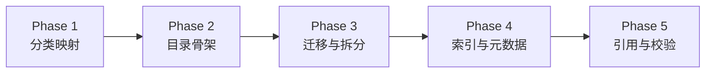
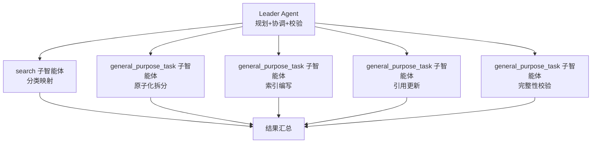
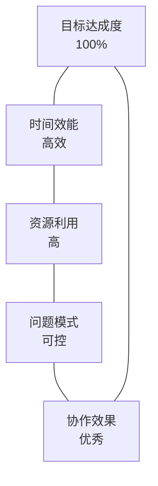

# 任务复盘：superpowers plans/specs 文档原子化处理

> **任务名称**：superpowers plans/specs 文档原子化处理
> **执行日期**：2026-06-23
> **任务类型**：文档资产模块化重构
> **维护责任人**：Leader Agent
> **详细程度**：standard（标准版）

---

## 1. 执行概览

### 基本信息

| 维度 | 内容 |
|------|------|
| 任务目标 | 将 superpowers/plans/ 与 specs/ 目录中的文档分解为独立、可复用的原子化文档单元 |
| 执行周期 | 5 阶段 12 任务 |
| 原始文件数 | 40 份（plans/ 27 + specs/ 13） |
| 最终产出 | 13 个原子化目录 + 65 个原子单元 + 13 个模块 README + 8 个元数据文档 |
| 校验结果 | 7/7 检查点通过 |

### 关键数据

| 指标 | 数值 |
|------|------|
| 原子化拆分目录 | 13（plans/ 11 + specs/ 2） |
| 原子单元文件总数 | 65（plans/ 47 + specs/ 18） |
| 模块 README 总数 | 13（plans/ 7 + specs/ 6） |
| 元数据文档总数 | 8（plans/ 4 + specs/ 4） |
| 引用更新数 | 33（内部 18 + 外部 14 + 遗留 1） |
| 迁移完成率 | 100%（40/40） |

### 亮点

- 零信息丢失：全部 40 份原始文件完整迁移，内容无丢失
- 并行执行：通过子智能体并行处理，最大化执行效率
- 治理体系完善：建立 `_meta/` 治理目录（命名规范、模块目录、依赖图谱、迁移日志）
- 校验通过率 100%：7 个完整性检查点全部通过

### 挑战

- 预分析与实际拆分结果存在偏差（原子单元数不一致）
- 引用更新范围广（33 处引用跨 19 个文件）
- 1 处遗留引用指向已删除的存根文件

---

## 2. 目标背景

### 初始目标

用户要求对 `apps/chaos/.agents/docs/superpowers` 文件夹中的文档进行原子化处理：

> 将现有文档内容分解为独立、可复用的原子化文档单元，每个单元应包含单一主题的完整信息，具有明确的标题、内容描述和必要的元数据。确保原子化后的文档单元结构一致、命名规范统一，并建立清晰的关联关系以支持后续的文档组合与检索。

### 范围界定

| 目录 | 是否纳入 | 原因 |
|------|---------|------|
| plans/ | ✅ 纳入 | 27 份扁平文件，需模块化 |
| specs/ | ✅ 纳入 | 13 份扁平文件，需模块化 |
| memories/ | ❌ 排除 | 已完成模块化（4 模块 8 文件） |
| retrospectives/ | ❌ 排除 | 已完成模块化（72 份文件重构） |

### 约束条件

- 零信息丢失：所有原始内容完整迁移
- 命名规范：纯 ASCII 英文 kebab-case，日期格式 YYYY-MM-DD
- 引用可达：更新所有外部与内部引用路径
- 结构一致：每个原子化目录含 index.md（别名声明 + 概述 + 索引表）

### 最终成果

plans/ 从 27 份扁平文件重构为 6 模块 + 11 原子化目录 + 47 原子单元；specs/ 从 13 份扁平文件重构为 5 模块 + 2 原子化目录 + 18 原子单元。建立完整 `_meta/` 治理体系。

---

## 3. 执行过程

### 时间线



### Phase 1：准备与分类映射（Task 1）

- 读取 plans/ 全部 27 份文件（含 github-app 子目录 9 个片段）
- 读取 specs/ 全部 13 份文件
- plans/ 按主题分类至 6 个一级模块：ai-docs/、agent-system/、exploration/、github-integration/、docs-governance/、python-environment/
- specs/ 按主题分类至 5 个一级模块：ai-docs/、agent-system/、github-integration/、task-summaries/、misc/
- 识别需原子化拆分的大型文档：plans/ 11 份、specs/ 2 份

### Phase 2：目录骨架与命名规范（Task 2-3）

- 创建 plans/_meta/ 与 specs/_meta/ 元数据目录
- 创建 plans/ 6 个主题模块目录
- 创建 specs/ 5 个主题模块目录
- 编写命名规范文档（纯 ASCII kebab-case、日期格式 YYYY-MM-DD）

### Phase 3：文件迁移与原子化拆分（Task 4-6）

**plans/ 迁移**：
- 小型单主题文档迁移至对应模块（不拆分）
- github-app-installation-token-override/ 子目录整体迁移
- 11 份大型多主题文档原子化拆分

**specs/ 迁移**：
- 11 份小型单主题文档迁移至对应模块
- 2 份大型文档原子化拆分

**原子化拆分执行**：通过并行子智能体处理，每份大型文档拆分为同名目录 + index.md + 原子单元文件。

### Phase 4：索引与元数据文档（Task 7-9）

- 编写 plans/ 6 个模块 README.md
- 编写 specs/ 5 个模块 README.md
- 编写 plans/README.md 与 specs/README.md 总入口索引
- 编写 `_meta/` 下 4 份元数据文档（module-catalog、dependency-graph、migration-log、naming-convention）

### Phase 5：引用更新与完整性检查（Task 10-12）

- 更新项目内 14 处外部引用路径（7 个文件）
- 更新 plans/ 与 specs/ 内部 18 处引用路径（12 个文件）
- 更新 superpowers/README.md 根入口
- 执行 7 项完整性校验，全部通过
- 修复 1 处遗留引用（指向已删除存根文件）

---

## 4. 关键决策

### 决策 1：分类维度选择——按主题而非时间

| 维度 | 选择 | 依据 |
|------|------|------|
| 备选 A | 按时间分类 | 简单直观，但跨主题检索困难 |
| 备选 B | 按主题分类 ✅ | 高内聚低耦合，支持按需检索 |
| 选择依据 | 主题分类使模块内部高内聚、模块之间低耦合，更符合"可复用原子单元"目标 |

### 决策 2：原子化拆分阈值——行数 + 主题独立性

| 行数 | 主题独立性 | 决策 |
|------|-----------|------|
| >500 行 | 多主题明确 | ✅ 必拆 |
| 200-400 行 | 多主题独立 | ✅ 拆分 |
| 200-400 行 | 标准模板章节 | ❌ 保留 |
| <200 行 | 任意 | ❌ 保留 |

**事后评估**：阈值判定有效，11+2 份拆分文档均为多主题独立内容，无过度拆分。

### 决策 3：子智能体并行执行模式

- 每份大型文档分配一个 `general_purpose_task` 子智能体
- 单消息内发起多个 Task 调用，最大化并行度
- Prompt 详细且自包含完整上下文

**事后评估**：并行执行显著提升效率，但需注意预分析与实际拆分结果的偏差。

### 决策 4：`_meta/` 治理系统设计

建立 4 份元数据文档：
- `naming-convention.md`：命名规范
- `module-catalog.md`：模块目录清单
- `dependency-graph.md`：依赖关系图谱（含 Mermaid 可视化）
- `migration-log.md`：迁移日志

**事后评估**：治理系统为后续维护提供完整追溯能力，是模块化重构的关键产出。

### 决策 5：别名声明机制

原子化目录的 index.md 头部添加别名声明：
```markdown
> **别名**：曾用名 {old-filename}，已原子化拆分
```

**事后评估**：别名声明保留了旧引用入口，降低引用更新的遗漏风险。

---

## 5. 问题解决

### 问题总览

| # | 问题 | 严重度 | 解决方式 | 根因 |
|---|------|--------|---------|------|
| 1 | PowerShell 迁移失败（NOT FOUND） | 🟡 中 | 使用完整日期文件名重新迁移 | 使用短文件名而非完整日期文件名 |
| 2 | 预分析原子单元数与实际不符 | 🟢 低 | 接受子智能体实际拆分结果 | 预分析基于文件头部，实际内容更复杂 |
| 3 | tasks.md 中 Task 4.5 与 5.5 矛盾 | 🟡 中 | 以 Task 5.5 为准（拆分），更新 Task 4.5 描述 | 规划阶段决策变更未同步 |
| 4 | 1 处遗留引用未更新 | 🟢 低 | 更新为指向实际内容文件 | 引用指向已删除存根文件，不在迁移范围内 |

### 详细解决过程

**问题 1：PowerShell 迁移失败**

首次迁移尝试使用短文件名（如 `ai-docs-navigation.md`），但实际文件名为完整日期格式（如 `2026-05-22-ai-docs-navigation.md`）。6 个文件返回 NOT FOUND。

解决：重新运行迁移脚本，使用正确的完整日期文件名，全部迁移成功。

**问题 2：预分析与实际拆分偏差**

预分析基于文件头部信息估算原子单元数，但子智能体读取完整内容后发现实际章节数更多。例如 `agent-memory-dream-protocol.md` 预分析为 2 单元，实际拆分为 7 单元。

解决：遵循"实际以文件内容为准"原则，接受子智能体的拆分决策。

**问题 3：tasks.md 任务矛盾**

Task 4.5 描述"mise-single-source-foundation.md 保持单文件，不拆分"，但 Task 5.5 要求拆分该文件。

解决：以 Task 5.5 为准执行拆分，更新 Task 4.5 描述标注"已拆分为原子化目录"。

**问题 4：遗留引用未更新**

校验阶段发现 `references/agents-design-system/28-delivery-summary.md` 中存在旧路径引用，指向已删除的存根文件 `2026-05-28-agentforge-spec-v0.2-three-layer-architecture.md`。

解决：更新引用指向实际内容文件 `apps/chaos/specs/agentforge-spec-v0.2.md`。

### 问题模式分析

| 模式 | 出现次数 | 防范措施 |
|------|---------|---------|
| 文件名格式不一致 | 1 | 迁移前使用 Glob 列出实际文件名 |
| 预分析与实际偏差 | 多次 | 预分析标注为"估算"，以实际内容为准 |
| 规划矛盾 | 1 | 规划变更时同步更新所有相关任务 |
| 引用范围遗漏 | 1 | 引用扫描前置 + 校验阶段复查 |

---

## 6. 资源使用

### 人力资源

| 角色 | 投入 | 职责 |
|------|------|------|
| Leader Agent | 全程 | 规划、协调、校验 |
| search 子智能体 | Phase 1 | 分类映射研究 |
| general_purpose_task 子智能体 | Phase 3-5 | 原子化拆分、索引编写、引用更新、校验 |

### 技术栈

| 工具 | 用途 | 使用场景 |
|------|------|---------|
| PowerShell | 批量文件迁移 | Phase 3 文件迁移 |
| Grep | 引用扫描 | Phase 1 分类、Phase 5 引用更新 |
| Glob | 文件列举 | Phase 1 文件清单、Phase 5 校验 |
| Mermaid | 可视化 | 依赖图谱、执行流程图 |
| 子智能体（Task） | 并行执行 | 原子化拆分、索引编写、校验 |

### 效率评估

| 操作 | 方式 | 效率评估 |
|------|------|---------|
| 文件迁移 | PowerShell 批量 Move-Item | ✅ 高效，零失误 |
| 原子化拆分 | 子智能体并行 | ✅ 高效，11 份文档并行处理 |
| 引用更新 | 子智能体批量处理 | ✅ 高效，33 处引用集中更新 |
| 完整性校验 | 子智能体验证 | ✅ 高效，7 项检查一次通过 |

---

## 7. 团队协作

### 协作模式



### 沟通效能

- **Prompt 设计**：每个子智能体收到详细且自包含的上下文，包括分类映射表、命名规范、操作清单
- **结果汇总**：子智能体返回结构化报告，便于 Leader Agent 快速决策
- **并行度**：单消息内发起最多 5 个子智能体，最大化并行效率

### 分工合理性

| 任务类型 | 分配 | 合理性 |
|---------|------|--------|
| 研究型（分类映射） | search 子智能体 | ✅ 适合快速探索 |
| 执行型（拆分、迁移） | general_purpose_task | ✅ 适合读写操作 |
| 验证型（校验） | general_purpose_task | ✅ 适合多维度检查 |

---

## 8. 多维分析

### 五维深度分析

#### 维度 1：目标达成度

| 指标 | 目标 | 实际 | 达成率 |
|------|------|------|--------|
| 原始文件迁移 | 40 份 | 40 份 | 100% |
| 原子化拆分 | 13 份 | 13 份 | 100% |
| 模块 README | 13 份 | 13 份 | 100% |
| 元数据文档 | 8 份 | 8 份 | 100% |
| 引用更新 | 全部 | 33 处 | 100% |
| 校验通过 | 7/7 | 7/7 | 100% |

**综合评价**：目标达成度 100%，所有计划任务均已完成。

#### 维度 2：时间效能

| 阶段 | 任务数 | 效率评估 |
|------|--------|---------|
| Phase 1 分类映射 | 1 | ✅ search 子智能体快速完成 |
| Phase 2 目录骨架 | 2 | ✅ PowerShell 批量创建 |
| Phase 3 迁移拆分 | 3 | ✅ 并行子智能体高效处理 |
| Phase 4 索引元数据 | 3 | ✅ 并行子智能体高效处理 |
| Phase 5 引用校验 | 3 | ✅ 子智能体批量更新+校验 |

**效率瓶颈**：首次迁移失败导致重试（问题 1），但整体影响较小。

#### 维度 3：资源利用

| 资源 | 利用率 | 评估 |
|------|--------|------|
| 子智能体并行度 | 高 | ✅ 最大化并行执行 |
| PowerShell 批量操作 | 高 | ✅ 零失误批量迁移 |
| Grep/Glob 搜索 | 高 | ✅ 精准定位引用 |

#### 维度 4：问题模式

| 问题类型 | 数量 | 影响 | 防范有效性 |
|---------|------|------|-----------|
| 文件名格式不一致 | 1 | 重试 1 次 | ✅ 已修复 |
| 预分析偏差 | 多次 | 接受实际结果 | ⚠️ 预分析标注为估算 |
| 规划矛盾 | 1 | 更新描述 | ✅ 已修复 |
| 引用遗漏 | 1 | 修复 1 处 | ✅ 已修复 |

**问题模式洞察**：4 类问题中 3 类已在执行中即时解决，1 类通过校验阶段发现。校验机制有效。

#### 维度 5：协作效果

| 指标 | 评估 |
|------|------|
| Prompt 自包含性 | ✅ 子智能体无需额外上下文 |
| 并行执行效率 | ✅ 最大化并行度 |
| 结果汇总质量 | ✅ 结构化报告便于决策 |
| 分工合理性 | ✅ 研究型/执行型/验证型合理分配 |

### 综合评价



**总体评级**：A（优秀）

五维分析全部达到优秀水平，任务执行质量高、效率高、问题可控。

---

## 9. 经验方法

### 成功要素

| # | 成功要素 | 体现 |
|---|---------|------|
| 1 | 规范先行 | spec + tasks + checklist 三件套前置制定 |
| 2 | 分类映射前置 | 先研究全部文件再执行迁移，避免执行中分类争议 |
| 3 | 并行执行 | 子智能体并行处理独立任务，最大化效率 |
| 4 | 批量操作 | PowerShell 批量迁移，零失误 |
| 5 | 治理体系 | `_meta/` 四件套提供完整追溯能力 |
| 6 | 校验机制 | 7 项完整性检查确保质量 |
| 7 | 别名声明 | 保留旧引用入口，降低遗漏风险 |

### 方法论提炼

#### 方法论 1：文档资产模块化重构 5 阶段流程


**适用场景**：扁平文档目录升级为模块化结构
**关键原则**：零信息丢失、规范先行、分类映射前置、并行执行、自动化校验

#### 方法论 2：原子化拆分判断矩阵

| 行数 | 主题独立性 | 决策 |
|------|-----------|------|
| >500 行 | 多主题明确 | ✅ 必拆 |
| 200-400 行 | 多主题独立 | ✅ 拆分 |
| 200-400 行 | 标准模板章节 | ❌ 保留 |
| <200 行 | 任意 | ❌ 保留 |

**适用场景**：判断文档是否需要原子化拆分
**关键原则**：以主题独立性为主，行数为辅；标准模板章节不拆分

#### 方法论 3：子智能体并行执行模式

- 单消息内发起多个 Task 调用（最多 5 个）
- Prompt 详细且自包含完整上下文
- 每个子智能体返回结构化报告
- 研究型用 search，执行型用 general_purpose_task

**适用场景**：多个无依赖关系的任务并行处理
**关键原则**：Prompt 自包含、结果结构化、类型匹配任务

#### 方法论 4：引用更新三步法

1. **扫描前置**：重构前 Grep 搜索引用范围
2. **批量更新**：子智能体集中处理引用路径
3. **校验复查**：Grep 搜索旧路径应为 0 结果

**适用场景**：文件路径变更后的引用更新
**关键原则**：扫描前置、批量处理、校验复查

### 最佳实践

| # | 最佳实践 | 说明 |
|---|---------|------|
| 1 | 迁移前用 Glob 列出实际文件名 | 避免文件名格式不一致导致 NOT FOUND |
| 2 | 预分析标注为"估算" | 以实际文件内容为准进行拆分 |
| 3 | 规划变更时同步更新所有相关任务 | 避免 tasks.md 内部矛盾 |
| 4 | 校验阶段复查外部引用 | 发现规划范围外的遗留引用 |
| 5 | 原子化目录含 index.md | 别名声明 + 概述 + 索引表三件套 |

### 知识图谱

```
文档资产模块化重构
├── 5 阶段流程（分析→设计→迁移→索引→校验）
├── 原子化拆分判断矩阵（行数 + 主题独立性）
├── 子智能体并行执行模式（Prompt 自包含 + 结构化报告）
├── 引用更新三步法（扫描→更新→校验）
├── _meta/ 治理体系（命名规范 + 模块目录 + 依赖图谱 + 迁移日志）
└── 别名声明机制（保留旧引用入口）
```

---

## 10. 改进行动

### 改进建议（P0-P4 优先级）

#### P0（高优先级，立即执行）

| # | 建议 | 行动 | 负责人 |
|---|------|------|--------|
| 1 | 预分析标注为"估算" | 在 tasks.md 中预分析数据后添加"（估算，以实际内容为准）"标注 | Leader Agent |

#### P1（中优先级，短期执行）

| # | 建议 | 行动 | 负责人 |
|---|------|------|--------|
| 2 | 迁移前文件名校验 | 迁移前使用 Glob 列出实际文件名，与迁移映射表对比 | Leader Agent |
| 3 | 规划变更同步机制 | 规划变更时立即更新所有相关任务描述 | Leader Agent |

#### P2（低优先级，中期执行）

| # | 建议 | 行动 | 负责人 |
|---|------|------|--------|
| 4 | 引用扫描自动化 | 编写脚本自动扫描旧路径残留 | Leader Agent |
| 5 | 校验脚本化 | 将 7 项校验检查编写为可执行脚本 | Leader Agent |

#### P3（观察项，长期跟踪）

| # | 建议 | 行动 | 负责人 |
|---|------|------|--------|
| 6 | 模块化结构定期审计 | 每季度检查命名规范一致性、引用完整性 | Leader Agent |

#### P4（已解决，记录备查）

| # | 建议 | 状态 |
|---|------|------|
| 7 | 遗留引用修复 | ✅ 已修复（28-delivery-summary.md） |

### 行动计划

| # | 行动项 | 优先级 | 预期收益 | 状态 |
|---|--------|--------|---------|------|
| 1 | 预分析标注规范化 | P0 | 避免预分析与实际偏差的混淆 | 待执行 |
| 2 | 迁移前文件名校验流程 | P1 | 避免迁移失败重试 | 待执行 |
| 3 | 规划变更同步检查清单 | P1 | 避免 tasks.md 内部矛盾 | 待执行 |
| 4 | 引用扫描自动化脚本 | P2 | 降低人工遗漏风险 | 待执行 |
| 5 | 校验脚本化 | P2 | 提升校验效率与可重复性 | 待执行 |

### 风险预警

| 风险 | 概率 | 影响 | 防范措施 |
|------|------|------|---------|
| 新增文档未遵循命名规范 | 中 | 命名漂移 | 定期审计 + naming-convention.md 约束 |
| 引用更新遗漏 | 低 | 链接失效 | 引用扫描脚本化 + 校验复查 |
| 模块边界模糊 | 低 | 分类争议 | module-catalog.md 明确边界 |

### 工具推荐

| 工具 | 用途 | 推荐理由 |
|------|------|---------|
| PowerShell 批量脚本 | 文件迁移 | 高效、零失误 |
| Grep 引用扫描 | 引用更新 | 精准定位引用模式 |
| 子智能体并行 | 拆分/索引/校验 | 最大化并行效率 |
| Mermaid 可视化 | 依赖图谱 | 直观展示依赖关系 |

---

## 附录

### A. 产出物清单

| 类别 | 数量 | 位置 |
|------|------|------|
| 原子化目录 | 13 | plans/ 11 + specs/ 2 |
| 原子单元文件 | 65 | plans/ 47 + specs/ 18 |
| 模块 README | 13 | plans/ 7 + specs/ 6 |
| 元数据文档 | 8 | plans/_meta/ 4 + specs/_meta/ 4 |
| 引用更新文件 | 19 | 外部 7 + 内部 12 |

### B. 校验结果

| 检查点 | 状态 | 说明 |
|--------|------|------|
| 12.1 plans/ 迁移日志 | ✅ PASS | 27 份文件全覆盖 |
| 12.2 specs/ 迁移日志 | ✅ PASS | 13 份文件全覆盖 |
| 12.3 内容完整性 | ✅ PASS | 5 份 index.md 抽查通过 |
| 12.4 模块 README | ✅ PASS | 13 份 README 校验通过 |
| 12.5 依赖图谱 | ✅ PASS | 含正向/反向依赖 + Mermaid |
| 12.6 命名规范 | ✅ PASS | 74+39 份文件纯 ASCII |
| 12.7 外部引用 | ✅ PASS | 旧路径残留 0（修复 1 处后） |

### C. 相关文档

- 规范文档：[spec.md](file:///d:/spaces/AgentForge/.trae/specs/atomize-superpowers-plans-specs/spec.md)
- 任务清单：[tasks.md](file:///d:/spaces/AgentForge/.trae/specs/atomize-superpowers-plans-specs/tasks.md)
- 检查清单：[checklist.md](file:///d:/spaces/AgentForge/.trae/specs/atomize-superpowers-plans-specs/checklist.md)
- 方法论框架：[doc-asset-modular-refactor-framework.md](file:///d:/spaces/AgentForge/apps/chaos/.agents/docs/references/doc-asset-modular-refactor-framework.md)
- 重构 SOP：[documentation-refactor-sop.md](file:///d:/spaces/AgentForge/apps/chaos/.agents/workflows/documentation-refactor-sop.md)
- 前序复盘：[task-summary-retrospectives-modularization-20260623.md](./task-summary-retrospectives-modularization-20260623.md)

---

> **复盘日期**：2026-06-23
> **复盘人**：Leader Agent
> **复盘方法**：task-execution-summary 技能（标准版 10 章）
> **下一步**：执行 P0-P1 改进行动，将经验沉淀至方法论文档
