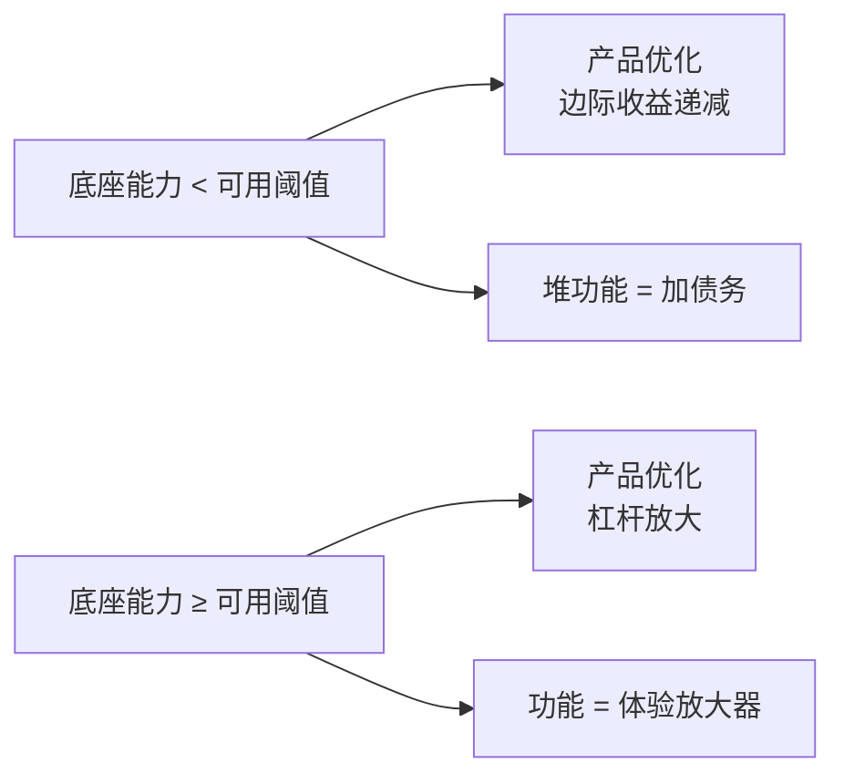
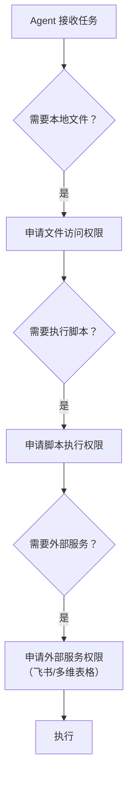
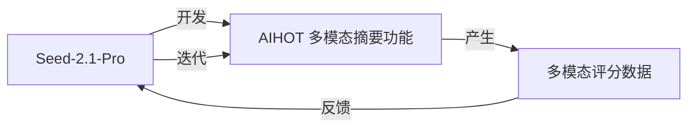

# 深度洞察与知识萃取 — 豆包 Seed-2.1 FORCE 大会

> **归档说明**：本文的 5 条萃取知识（K-01~K-05）已去场景化归档至 [`docs/topics/ai-product-insights.md`](../../../../../../../../docs/topics/ai-product-insights.md)。本文件保留完整场景分析、6 条深度洞察与因果链图，作为溯源产物。  
> **来源**：[`doubao-seed-2.1-article-extract-20260624.md`](sources/doubao-seed-2.1-article-extract-20260624.md)（微信公众号文章原文提取）  
> **方法**：事实层 → 模式层 → 萃取层（筛选与净化）  
> **关联**：本文超越 [`task-summary-force-conf-recap-20260624.md`](task-summary-force-conf-recap-20260624.md) 的 4 条基础洞察，向下挖掘因果链与可迁移模式

---

## 一、洞察层：从事实到模式

[`task-summary-force-conf-recap-20260624.md`](task-summary-force-conf-recap-20260624.md) 已提炼 4 条基础洞察（模型就是一切 / 多模态护城河 / Agent 办公战场 / 价格上下文短板）。本文继续追问"为什么"，挖掘原文未显式表达但可推断的深层模式。

### 洞察 05：底座杠杆 > 产品优化

> 原文："产品团队搞半年的交互优化、流程重构，在现在，我觉得可能不如底座模型在 Agent 能力上提升个 20% 来得实在。"

**因果链**：豆包办公模式从 Seed 2.0 Pro 换成 Seed-2.1-Pro 后体验"明显变化"——这不是产品团队功劳，而是底座升级的杠杆效应。

**模式提炼**：AI 产品的投入产出比存在一个临界点——当底座能力不足时，产品层的任何优化都是边际收益递减；一旦底座跨越"可用"门槛，产品优化才重新产生杠杆。这解释了为何 2025 年大量 AI 产品"做了一堆功能但体验拉胯"——底座不够，产品白费。

**反例验证**：DeepSeek V4 Pro / GLM-5.2 Coding 强但无多模态——长板够长但水桶漏水，在真实业务场景受限。说明"底座杠杆"不是单点能力，而是**能力完整性**。

### 洞察 06：水桶模型胜出法则

> 原文："一个非常综合的水桶级模型……他强就强在，水桶。"

**表层事实**：Seed-2.1-Pro Coding 不如 Claude，但综合能力强。  
**深层模式**：在**真实业务场景**（而非 benchmark），水桶模型胜过长板模型。

| 维度 | 长板模型（DeepSeek/GLM） | 水桶模型（Seed-2.1-Pro） |
|------|------------------------|------------------------|
| 单项能力 | Coding TOP | Coding 中上 |
| 多模态 | ❌ 缺失 | ✅ 视觉 TOP |
| Agent | ⚠️ 未验证 | ✅ 大幅进化 |
| 真实业务覆盖 | 受限（只能处理文本） | 完整（文档/图表/视频+代码） |

**业务佐证**：作者 AIHOT 案例——纯文本模型评分丢失图片/视频信息，导致"质量很高的播客视频"被精选系统过滤。多模态不是加分项，而是**信息保真度**的必要条件。

### 洞察 07：Agent 权限的三角设计

> 原文：豆包办公模式执行任务时，依次申请"文件访问权限 + 脚本执行权限 + 飞书文档编辑权限"。

**表层事实**：Agent 会分级申请权限。  
**深层模式**：Agent 进入企业市场的关键不是能力，而是**权限治理**。豆包展示的权限设计模式：

**三角难题**：权限 / 安全 / 准确性三者互相制约——权限越少越安全但能力越弱，权限越多越强但风险越高。豆包的解法是**分级申请 + 人工授权**，把决策权交还用户。这是 Agent 从"玩具"到"工具"的关键设计。

### 洞察 08：模型自我演化的雏形

> 原文："我直接把 Claude Code 里面的模型，用 CC switch 换成了 Seed-2.1-Pro，让他自己来开发自己。"

**表层事实**：作者用 Seed-2.1-Pro 在 Claude Code 里开发 AIHOT 的多模态摘要功能。  
**深层模式**：这是**Agent 自我演化**的雏形——模型用于开发依赖该模型的功能。作者把"我想让 AIHOT 支持多模态评分"这段话直接当 Prompt，模型自己设计对抗性审查方案、风险应对、图片缓存流程。

**飞轮效应**：

模型开发的功能反过来产生数据喂养模型——这是产品层的"自我演化"闭环。虽然当前仍是人主导，但模式已现。

### 洞察 09：多模态的信息保真原则

> 原文："因为丢失了多模态的信息，特别是这个评分，有的时候是不公平的。"

**因果链**：纯文本模型对含图/视频内容的评分**系统性失真**——不是"评分不准"，而是"信息输入就不完整"。这是多模态的业务价值本质：**信息保真**，而非"多一个能力"。

**可迁移原则**：任何涉及内容理解/评分/摘要的系统，若输入包含多模态信息而模型只处理文本，则输出**必然失真**。失真方向可预测——多模态丰富的内容（小红书/B站/播客）会被系统性低估。

### 洞察 10：价格与上下文的竞争终局

> 原文："¥6/¥30 每百万 token……相比国内 DeepSeek 这种直接干到个位数级别的爹，感觉还是有优化空间。上下文还是卡在了 256k。"

**深层模式**：国产模型的竞争已从"能力追赶"转向"成本 + 长上下文"的工程优化。这是**追赶的最后两公里**——能力追平后，谁先解决成本和长上下文，谁就占据规模化应用市场。

| 维度 | Seed-2.1-Pro | DeepSeek | 海外模型 |
|------|-------------|----------|---------|
| 能力 | 水桶级 | Coding 长板 | 综合领先 |
| 价格 | ¥6/¥30 | 个位数 | 贵 |
| 上下文 | 256k | — | 1M 主流 |
| 定位 | 中高端 | 性价比 | 高端 |

---

## 二、萃取层：可迁移知识

从原文萃取 5 条可迁移模式，按 [`extraction-methodology.md`](../../../docs/topics/extraction-methodology.md) 的"筛选与净化"原则——剥离具体场景，保留可迁移内核。

### 萃取 K-01：AI 产品杠杆法则

> **当底座能力低于"可用阈值"时，产品优化边际收益递减；底座跨越阈值后，产品优化才重新产生杠杆。**

- **适用场景**：AI 产品投入决策、功能优先级排序
- **反模式**：底座不足时堆功能（加债务不加价值）
- **决策依据**：先评估底座是否跨越可用阈值，再决定产品投入

### 萃取 K-02：水桶胜出法则

> **在真实业务场景（非 benchmark），能力完整的水桶模型胜过单项长板的模型。**

- **适用场景**：模型选型、技术栈评估
- **关键维度**：能力完整性 > 单项峰值
- **业务验证**：多模态缺失导致信息保真度下降，直接影响业务输出质量

### 萃取 K-03：Agent 权限分级设计模式

> **Agent 执行任务时，应按需分级申请权限（文件/脚本/外部服务），把授权决策交还用户。**

- **适用场景**：Agent 产品设计、企业市场准入
- **设计原则**：最小权限 + 分级申请 + 人工授权
- **三角约束**：权限 / 安全 / 准确性互相制约，需显式权衡

### 萃取 K-04：多模态信息保真原则

> **内容理解/评分/摘要系统若输入含多模态信息而模型只处理文本，输出必然失真——多模态丰富的内容被系统性低估。**

- **适用场景**：内容评分系统、摘要系统、信息流过滤
- **设计原则**：输入信息保真度决定输出质量上限
- **失真预测**：多图/视频内容会被系统性低估

### 萃取 K-05：Agent 自我演化飞轮

> **模型用于开发依赖该模型的功能，功能产生的数据反哺模型——形成产品层自我演化闭环。**

- **适用场景**：AI 产品飞轮设计、数据闭环构建
- **关键要素**：模型 → 功能 → 数据 → 模型
- **当前阶段**：人主导的半自动演化，未来趋向自动化

---

## 三、与上一轮规则候选的关联

本文的洞察与 [`docs/topics/content-extraction-rule-candidates.md`](../../../../../../../../docs/topics/content-extraction-rule-candidates.md) 的三条规则候选形成印证关系：

| 规则候选 | 本文关联 | 印证状态 |
|---------|---------|---------|
| R-01 技能自包含校验 | 无直接关联（不同任务域） | 维持 1/3 |
| R-02 平台适配器 | 萃取 K-04 佐证：信息保真度是系统设计原则 | 频率仍 1/3，但普适性增强 |
| R-03 洞察浓度指标 | 本文本身即"洞察浓度"实践——超越事实层挖掘因果链 | 频率 2/3（本次 + 上次复盘） |

**R-03 进展**：本次"洞察+萃取"任务是对 R-03 候选的第二次印证——主动超越"5 分钟完成"的速度指标，追求洞察密度。若再累积 1 次同类实践，R-03 即可提 PR 上升为正式规则。

---

## 四、萃取净化记录

按 [`extraction-methodology.md`](../../../docs/topics/extraction-methodology.md) §1.2，萃取过程应"天然完成筛选与净化"。本文的净化记录：

| 被过滤内容 | 过滤原因 |
|-----------|---------|
| 作者个人 AIHOT 项目细节 | 个人色彩，非可迁移知识 |
| 具体价格数字（¥6/¥30） | 时效性强，易过时 |
| Claude Code / CC switch 操作细节 | 工具特定，非模式 |
| 发票汇总的具体操作步骤 | 场景特定，已抽象为 K-03 权限模式 |
| PPT 生成的视觉效果评价 | 主观判断，非可迁移 |

**保留内核**：杠杆法则、水桶法则、权限设计、信息保真、演化飞轮——这 5 条剥离了场景与个人色彩，可跨项目迁移。

---

## 参见

- 原文提取：[`doubao-seed-2.1-article-extract-20260624.md`](sources/doubao-seed-2.1-article-extract-20260624.md)
- 执行复盘：[`task-summary-force-conf-recap-20260624.md`](task-summary-force-conf-recap-20260624.md)（4 条基础洞察 + 工作流复盘）
- 规则候选：[`docs/topics/content-extraction-rule-candidates.md`](../../../../../../../../docs/topics/content-extraction-rule-candidates.md)
- 萃取方法论：[`docs/topics/extraction-methodology.md`](../../../../../../../../docs/topics/extraction-methodology.md)
