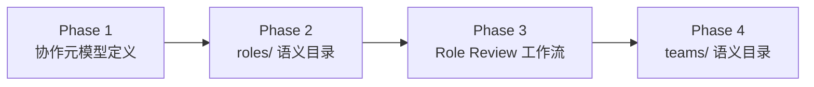

# 第 1 章 · 执行概览

### 1.1 基本信息

| 维度 | 内容 |
|---|---|
| **任务主题** | 为 AgentForge 项目添加"多 team、多角色、多智能体协作"的概念支持 |
| **最终成果** | 三层落地：协作元模型 + roles/ 语义目录 + Team 审查工作流 + teams/ 语义目录 |
| **执行方式** | 用户主导 brainstorming 选项选择，AI 负责设计输出与实施 |

### 1.2 关键数据

| 指标 | 数值 |
|---|---|
| 总对话轮次 | ~30 轮 |
| Brainstorming 选项收敛 | 11 次选择 |
| 设计 Spec 产出 | 3 份 |
| 实现 Plan 产出 | 2 份 |
| 新建文件 | 19 个 |
| 修改文件 | 8 个（含多轮迭代修改） |
| Git 提交 | 13 个 |
| 协作元模型核心实体 | 15 个（5 大领域） |
| 角色实例 | 4 个（覆盖全部 5 领域） |
| Team 实例 | 1 个（core-governance） |
| 工作流 | 1 条（Role Review 四道门禁） |

### 1.3 四大阶段概览

| 阶段 | 核心产出 | 产物数 | 状态 |
|---|---|---|---|
| Phase 1: 协作元模型 | 双层结构、5 域 15 实体、参考页、导航 | 5 文件 | ✅ 完成 |
| Phase 2: roles/ 目录 | 4 个 Role 实例、README、导航更新 | 6 文件 | ✅ 完成 |
| Phase 3: Role Review 工作流 | 工作流主文档、提案模板、4 份试运行审查记录 | 7 文件 | ✅ 完成 |
| Phase 4: teams/ 目录 | Team 实例、Team 提案模板、审查扩展、导航更新 | 8 文件 | ✅ 完成 |

### 1.4 亮点

- **自指验证设计**：首条工作流让 4 个已有角色互相审查，验证元模型自身的一致性，设计好看且可落地
- **渐进式演进策略**：不一次性铺开全部目录，roles/ → teams/ → agents/ 逐批试点，每次试点都建立在上一批稳定语义之上
- **内生审查机制**：Role Review 工作流可审查 Role 和 Team 两类实体，四道门禁覆盖组织/执行/语义/合规四个维度

### 1.5 挑战

- 元模型"从零到一"的概念收敛经历 6 轮 brainstorming，每次都在缩小设计空间
- 多文件一致性维护：AGENTS.md ↔ .agents/README.md ↔ 元模型参考页三处需同步更新
