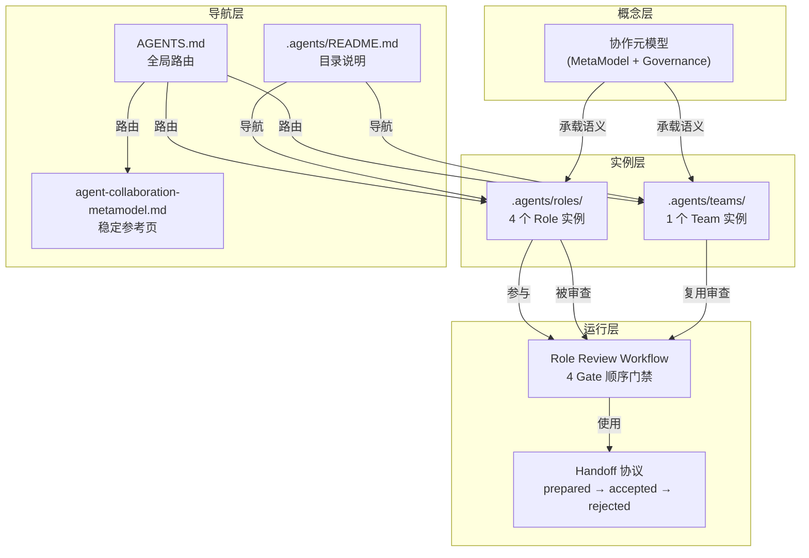

# 第 9 章 · 经验与方法

### 9.1 成功要素

#### 方法论 1：渐进式语义收敛 (Progressive Semantic Convergence)

**模式**：每次 brainstorming 给出 2-4 个标签化的选项，用户通过编号选择。每轮选择缩小设计空间，直到唯一方案。

**适用场景**：从模糊高层诉求（"添加多 team 多角色协作"）到具体设计方案（"双层结构 + 5 域 15 实体"）的概念收敛。

**关键原则**：
- 每次选项必须互斥且覆盖完整可能性空间
- 选项有标签（如"完整元模型"）和说明（解释含义和取舍），不要求用户自行理解
- 多轮连续收敛，不跳跃

**成功案例**：Phase 1 的 6 轮 brainstorming（框架策略→表达优先序→关系重点→输出形态→模型规模→架构模式）最终收敛为双层结构。

#### 方法论 2：三段式审批链 (Three-Stage Approval Chain)

**模式**：设计方案呈现在三个阶段分别获得用户认可后才进入实施——
1. 核心方案（框架、门禁模型、字段）
2. 细节方案（提案模板、试运行计划）
3. 完整方案（产物清单、命名、非目标）

**适用场景**：复杂设计任务，涉及多个层面的决策。

**关键原则**：
- 每个阶段只关注一个层面的问题，避免一次性呈现过多信息
- 阶段之间有依赖关系，有序推进
- 每阶段认可后固化，不再回头修改

**成功案例**：Phase 3 的工作流设计经过三段式审批，实施零返工。

#### 方法论 3：自指验证 (Self-Referential Validation)

**模式**：设计的体系被自身定义的实体和流程所验证。本案例中，元模型定义的角色负责按照元模型定义的约束审查角色提案。

**适用场景**：自洽性要求高的体系设计（元模型、协议、框架）。

**关键原则**：
- 如果体系设计出来却用不上，说明设计有问题
- 自指验证可以发现"只说不练"的设计空洞
- 验证结果本身就是对体系正确性的证据

**成功案例**：4 个角色互相审查，4 Gate 全部通过，验证了元模型约束的可操作性。

#### 方法论 4：改动清单前置 (Change Manifest Upfront)

**模式**：在实施前列出所有需要创建/修改的文件和具体修改内容，实施时并行执行，完成后统一验收。

**适用场景**：涉及多个文件的同步修改。

**关键原则**：
- 清单在方案审批阶段就确定，不边做边加
- 并行执行（同时修改多个文件）提高效率
- 验收用自动化工具（grep）检查遗漏

**成功案例**：Phase 4 的 8 个操作（4 创建 + 4 修改）一次性并行完成，无遗漏。

### 9.2 核心设计原则

#### 原则 1：治理层与定义层分离

MetaModel Layer 定义"是什么"，Governance Layer 定义"怎么做"。两者分离使得：
- 元模型定义不绑定具体实现，可跨项目迁移
- 治理约束可以在不改变元模型的情况下独立演进

#### 原则 2：强约束精炼，弱约束裁剪

强约束（5 条）是体系不可妥协的核心契约，数量少、无例外。
弱约束（4 条）是"默认建议"，由具体项目根据上下文裁剪。

这个设计避免了"过度约束导致体系臃肿"和"约束不足导致体系无用"的两个极端。

#### 原则 3：声明式实例，不替代运行时

Role/Team 文件是声明式语义实例（定义职责模板、绑定关系），不是运行时执行日志或操作手册。这保证了：
- 实例文件轻量、稳定、低频变更
- 实例层和运行层的职责清晰分离

### 9.3 反模式警示

| 反模式 | 避免方式 |
|---|---|
| 一次性铺开所有目录 | 渐进式试点，roles/ → teams/ → agents/，每批建立在上一批稳定语义上 |
| 设计好用不上 | 自指验证（dogfooding），让设计成果先审查自己 |
| 概念过度工程化 | 首版限定 15 个实体，不做"大而全"；Workflow/Memory 等复杂实体首版只给语义壳 |
| 多文件同步遗留 | 改动清单前置 + 并行执行 + 自动验收，三步骤闭环 |

### 9.4 知识图谱

