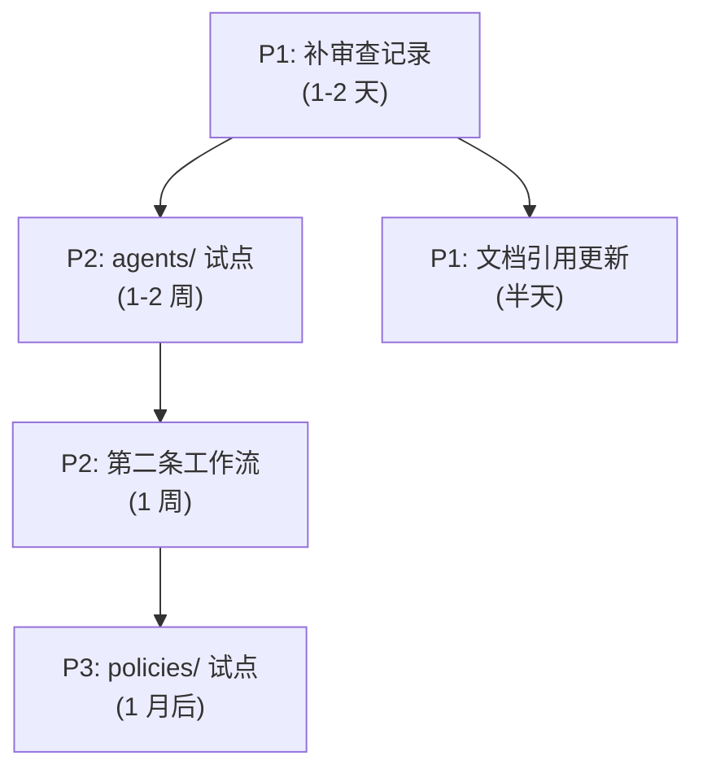

# 第 10 章 · 改进与行动

### 10.1 改进建议 (按优先级)

#### P0 — 立即执行

无。当前全部交付物已验收通过，无阻塞项。

#### P1 — 短期建议 (1-2 周内)

| # | 建议 | 说明 |
|---|---|---|
| P1-1 | 补充 `teams/` 的试运行审查记录 | Phase 4 创建了 Team 实例和审查扩展标准，但未像 Phase 3 那样产出 Gate 1-4 的试运行审查记录。建议补上 4 份 gate-0x-team.md 审查记录。 |
| P1-2 | 在 `roles/README.md` 中更新审查流程引用 | 当前 roles/README.md 的"审查流程"段引向 role-review.md，但未提及 Team 审查扩展。建议补充 teams/ 提案审查入口。 |
| P1-3 | 评估 `workflows/role-review.md` 文档长度 | 新增第 9 节后文档接近 200 行，门禁标准出现两次（Role 原版 + Team 适配）。如后续继续扩展（如 Policy 审查），建议拆分为独立文档。 |

#### P2 — 中期建议 (1 个月内)

| # | 建议 | 说明 |
|---|---|---|
| P2-1 | `.agents/agents/` 试点 | 按演进规划，roles/ ✅ → teams/ ✅ → agents/ 是下一批试点。Agent 实例需要绑定 Role、声明技能、定义协作偏好。 |
| P2-2 | 第二条协作工作流 | 候选场景：每日站会（跨角色状态同步）、任务分发（Mission→Task 分派）、知识审计（Memory/Context/Skill 完整性检查）。 |
| P2-3 | 配置层实例化语法 | 当前实例以 Markdown 声明式文件承载。如果未来需要自动化解析，可定义 YAML/TOML 实例化协议，让 AgentForge 运行时能直接加载 Team/Role 配置。 |

#### P3 — 长期建议

| # | 建议 | 说明 |
|---|---|---|
| P3-1 | `.agents/policies/` 试点 | Policy 和 Permission 在 Governance 域中定义为实体，但尚未有实例目录。需要等 agents/ 稳定后引入。 |
| P3-2 | 跨 Team 协作实战 | 当前 core-governance 是单 Team 模式。当引入第二个 Team 时，需要实际演练 Cross-Team Policy 中声明的 Handoff 协议。 |
| P3-3 | 元模型 v2 演进 | 当前 15 个实体是首版收敛结果。随着更多工作流和实例的落地，可能会发现新的实体需求或现有实体的字段调整。 |

### 10.2 行动计划

### 10.3 风险预警

| 风险 | 概率 | 影响 | 缓解措施 |
|---|---|---|---|
| `role-review.md` 文档膨胀 | Medium | 可维护性下降 | 当增加第三次扩展时强制拆分 |
| 元模型实体不足 | Low | 新概念无处安放 | 首版已预留弱约束机制，新实体可追加 |
| 多入口导航不一致 | Low | AI/用户路由混乱 | 每次改动后执行三处一致性 grep 检查 |
| 审查记录与实例脱节 | Low | 审查结论失去追溯 | 每次新实例引入强制产出审查记录 |

### 10.4 建议工具

| 工具 | 用途 |
|---|---|
| `rg` 一致性检查脚本 | 定期 grep AGENTS.md / .agents/README.md / metamodel.md 的链接对齐 |
| Mermaid Live Editor | 离线验证流程图的语法正确性 |
| `git log --oneline .agents/` | 快速查看语义目录的变更历史 |
