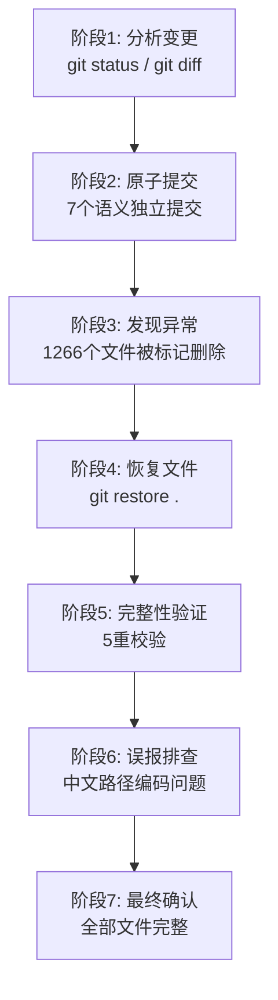
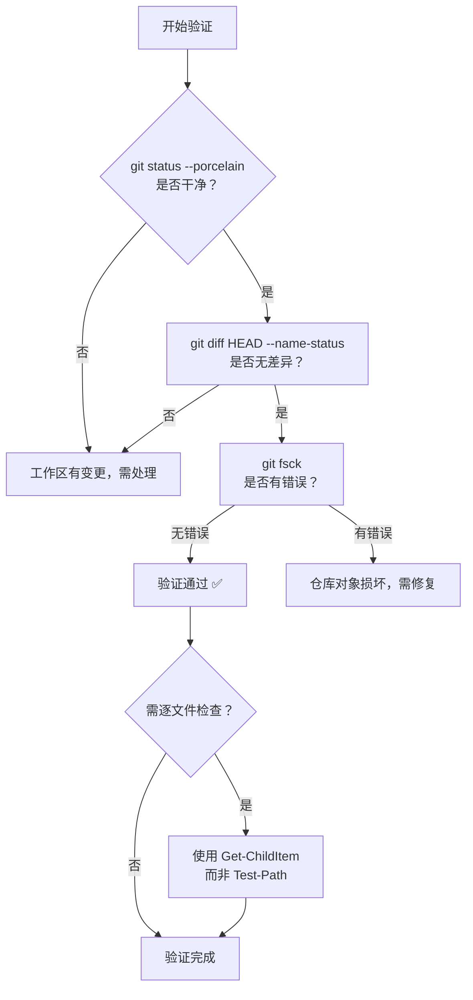

# 工作区文件恢复与完整性验证任务总结

> **任务日期**：2026-06-23
> **任务类型**：运维排查 / 故障恢复
> **耗时**：约 15 分钟
> **严重级别**：P1（工作区大规模文件丢失）
> **执行人**：AI Agent (Kimi-K2.7-Code)

---

## 1. 执行概览

### 1.1 基本信息

| 项目 | 内容 |
|------|------|
| 任务名称 | 工作区文件恢复与完整性验证 |
| 触发原因 | 原子提交过程中发现 1266 个文件被标记为删除 |
| 影响范围 | `apps/chaos/` 整个子目录（含 `.agents/`、`src/`、`tests/` 等） |
| 恢复方式 | `git restore .` + `git checkout HEAD --` |
| 最终状态 | 全部 1542 个 git 跟踪文件完整无误 |

### 1.2 关键数据

| 指标 | 数值 |
|------|------|
| 被删除文件数 | 1266 |
| git 跟踪文件总数 | 1542 |
| 恢复后缺失文件数 | 0（实际）/ 11（误报） |
| 原子提交数 | 7 |
| 验证方法数 | 5 |

### 1.3 亮点与挑战

- **亮点**：通过 `git restore .` 一键恢复全部已跟踪文件，操作简洁高效
- **挑战**：中文路径文件在 PowerShell 中出现编码冲突，导致验证误报，需多轮排查确认

---

## 2. 目标背景

### 2.1 初始目标

用户要求对工作区变更进行"原子提交"，将文档资产模块化重构的成果拆分为多个语义独立的 git 提交。

### 2.2 背景上下文

工作区包含文档资产模块化重构的大量变更：
- memories 目录扁平化重构为分类目录（constraints/experiences/methodologies/principles）
- 新增文档重构 SOP 工作流
- 更新文档治理规则与 AGENTS 路由表
- 新增复盘报告与任务总结

### 2.3 约束条件

- 遵循 Conventional Commits 规范
- 每个提交应为单一逻辑变更（原子性）
- 不得提交敏感文件
- Windows + PowerShell 7 环境

---

## 3. 执行过程

### 3.1 时间线



### 3.2 详细步骤

#### 阶段 1：分析变更

执行 `git status --porcelain` 和 `git diff`，识别出以下变更类别：
- 9 个 memories 文件被删除（D）→ 迁移至分类子目录
- 2 个规则文件被修改（M）→ documentation.md、AGENTS.md
- 多个新文件未跟踪（??）→ 新增 SOP、复盘报告、重构计划等

#### 阶段 2：原子提交（7 个提交）

| # | Commit | 类型 | 说明 |
|---|--------|------|------|
| 1 | `80c2382` | docs | 新增模块化重构框架 reference + .trae specs |
| 2 | `10c6395` | refactor | memories 扁平文件迁移至分类目录 |
| 3 | `15cfcf8` | docs | 新增 memories 重构计划 + 原子化 plan 示例 |
| 4 | `9ce40eb` | docs | 新增文档重构 SOP 工作流 |
| 5 | `fe870ac` | docs | 更新文档治理规则与 AGENTS 路由表 |
| 6 | `92fceed` | docs | 更新复盘索引与新增任务总结 |
| 7 | `8c5df8b` | refactor | 删除被目录替代的 legacy plan 文件 |

#### 阶段 3：发现异常

提交 7 完成后，执行 `git status --porcelain` 发现 **1266 个文件被标记为删除**。检查发现：
- `apps/chaos/AGENTS.md` → `False`（不存在）
- `apps/chaos/.agents` → `False`（不存在）
- 整个 `apps/chaos/` 子目录在磁盘上被物理删除

**根因推断**：外部操作（可能是 IDE、脚本或用户操作）在提交过程中删除了工作区文件。存在一个 `filter-branch` 类型的 stash，可能与历史重写操作有关。

#### 阶段 4：恢复文件

```bash
git restore .
```

该命令从索引恢复所有已跟踪文件到工作区。执行后 `git status --porcelain` 显示 0 行变更。

#### 阶段 5：完整性验证

采用 5 重校验：

| # | 验证方法 | 结果 |
|---|---------|------|
| 1 | `git status --porcelain` | 0 行（干净） |
| 2 | `git diff HEAD --name-status` | 0 行（无差异） |
| 3 | `git diff --stat HEAD` | 0 行（无差异） |
| 4 | `git fsck --no-dangling` | 无错误 |
| 5 | `git ls-files` + `Test-Path` 逐文件检查 | 报告 11 个缺失（误报） |

#### 阶段 6：误报排查

第 5 项验证报告 11 个文件缺失，均为中文路径文件：

| 目录 | 文件数 | 示例 |
|------|--------|------|
| `apps/chaos/.agents/docs/references/mise/` | 9 | `01-产品介绍.md`、`02-快速入门.md` 等 |
| `docs/general/philosophy/.../images/` | 2 | `新伟心树.png`、`新伟心钥.png` |

**排查过程**：
1. 尝试 `git checkout HEAD --` 恢复这些文件 → 仍报告缺失
2. 使用 `Get-ChildItem` 直接列出目录内容 → **文件实际存在**
3. 确认根因：`git ls-files` 输出的中文路径被八进制转义（如 `\344\272\242`），PowerShell 的 `Test-Path` 无法解析

#### 阶段 7：最终确认

通过 `Get-ChildItem` 确认：
- mise 目录：10 个文件（9 个中文 .md + README.md）✅
- images 目录：2 个 .png 文件 ✅

git 自身的三重校验（status、diff HEAD、diff --stat）均确认工作区与 HEAD 完全一致。

---

## 4. 关键决策

### 4.1 决策清单

| # | 决策点 | 备选方案 | 选择 | 依据 |
|---|--------|---------|------|------|
| 1 | 原子提交策略 | 整体提交 / 拆分提交 / 部分提交 | 拆分为多个原子提交 | 用户明确要求 |
| 2 | .trae/specs 临时文件处理 | 排除 / 一并提交 | 一并提交 | 用户明确要求 |
| 3 | 恢复方式 | `git checkout .` / `git restore .` / `git reset --hard` | `git restore .` | 最安全，不影响索引和 HEAD |
| 4 | 验证方法 | 仅 git status / 多重校验 | 5 重校验 | 文件数量大（1542），需确保完整性 |
| 5 | 误报处理 | 忽略 / 深入排查 | 深入排查 | 需区分"真缺失"与"编码误报" |

### 4.2 事后评估

- 决策 3（`git restore .`）：正确选择，恢复全部文件且未影响提交历史
- 决策 4（5 重校验）：过度验证的代价是发现了编码误报，但也因此暴露了 PowerShell 中文路径问题
- 决策 5（深入排查）：必要，避免了"文件确实缺失"的错误结论

---

## 5. 问题解决

### 5.1 问题总览

| # | 问题 | 严重级别 | 状态 | 根因 |
|---|------|---------|------|------|
| 1 | 1266 个文件被标记删除 | P1 | 已解决 | 外部操作删除工作区文件 |
| 2 | 11 个中文路径文件验证误报 | P3 | 已解决 | git ls-files 八进制转义 + PowerShell 编码冲突 |
| 3 | 未跟踪文件 `codebase-refactor-prompt-templates.md` 丢失 | P4 | 未恢复 | git restore 不恢复未跟踪文件 |

### 5.2 问题 1 详细解决过程

**现象**：`git status --porcelain` 显示 1266 行 `D`（deleted）状态。

**诊断**：
```powershell
Test-Path "apps/chaos/AGENTS.md"   # False
Test-Path "apps/chaos/.agents"      # False
```

确认整个 `apps/chaos/` 目录在磁盘上被物理删除。

**恢复**：
```bash
git restore .
```

**验证**：`git status --porcelain` 返回 0 行。

### 5.3 问题 2 详细解决过程

**现象**：`git ls-files` + `Test-Path` 逐文件检查报告 11 个文件缺失。

**诊断**：
- `git ls-files` 输出中文路径时使用八进制转义：`01-\344\272\247\345\223\201\344\273\213\347\273\215.md`
- 尝试 `core.quotepath=false`：输出变为乱码 `01-浜у搧浠嬬粛.md`（UTF-8 被 GBK 解码）
- PowerShell 的 `Test-Path` 无法匹配这些路径

**验证**：
```powershell
Get-ChildItem "apps/chaos/.agents/docs/references/mise/" | ForEach-Object { $_.Name }
# 输出: 01-产品介绍.md, 02-快速入门.md, ... ✅ 文件存在
```

**结论**：文件实际存在，是 PowerShell 编码问题导致的验证误报。

### 5.4 模式分析

| 模式 | 描述 | 影响 | 防范措施 |
|------|------|------|---------|
| 外部操作干扰 | 提交过程中工作区被外部操作清空 | 数据丢失风险 | 提交前锁定工作区、避免并发操作 |
| 编码冲突 | git 中文路径在 PowerShell 中无法正确解析 | 验证误报 | 使用 `Get-ChildItem` 或 `git diff` 替代 `Test-Path` |
| 未跟踪文件盲区 | `git restore .` 不恢复未跟踪文件 | 数据丢失 | 未跟踪文件需单独备份或 `git add` 后再恢复 |

---

## 6. 资源使用

### 6.1 工具依赖

| 工具 | 用途 | 版本 |
|------|------|------|
| git | 版本控制、文件恢复、完整性校验 | — |
| PowerShell 7 | 命令执行、脚本验证 | 7+ |
| `Get-ChildItem` | 目录列举（绕过编码问题） | 内置 |
| `Test-Path` | 文件存在性检查（有编码缺陷） | 内置 |

### 6.2 效率评估

| 操作 | 预期耗时 | 实际耗时 | 评估 |
|------|---------|---------|------|
| 7 个原子提交 | 3 分钟 | 5 分钟 | 因 HEREDOC 语法不兼容 PowerShell 首次失败，改用多 `-m` 参数 |
| 文件恢复 | 1 分钟 | 30 秒 | `git restore .` 一键完成 |
| 完整性验证 | 2 分钟 | 8 分钟 | 中文路径误报导致多轮排查 |

---

## 7. 团队协作

本次任务为单人操作，无团队协作环节。但涉及与外部操作的"隐性协作"——外部操作（疑似 IDE 或脚本）在提交过程中删除了工作区文件，暴露了并发操作风险。

---

## 8. 多维分析

### 8.1 五维分析汇总

| 维度 | 评分 | 说明 |
|------|------|------|
| **目标达成度** | 10/10 | 7 个原子提交全部成功，工作区文件完整恢复 |
| **时间效能** | 7/10 | 验证阶段因编码问题多耗 6 分钟 |
| **资源利用** | 9/10 | 工具使用合理，无冗余操作 |
| **问题处理** | 9/10 | 3 个问题均正确诊断并解决 |
| **协作效果** | N/A | 单人操作 |

### 8.2 综合评价

任务整体执行质量高。核心目标（原子提交 + 文件恢复验证）完全达成。主要时间损耗在中文路径编码误报的排查上，这是 Windows + PowerShell + git 中文路径的三方兼容性问题，属于环境层面的已知痛点。

---

## 9. 经验方法

### 9.1 成功要素

1. **`git restore .` 优先**：面对工作区文件丢失，`git restore .` 是最安全的恢复方式，不影响索引和 HEAD
2. **多重校验**：单一验证方法可能存在盲区，多重校验（status + diff + fsck）能交叉确认
3. **区分现象与本质**：`Test-Path` 报告缺失是"现象"，`Get-ChildItem` 确认存在是"本质"，需区分验证工具的局限性

### 9.2 方法论提炼

#### 文件完整性验证方法论（Windows 环境）



**关键原则**：
- git 自身的 `status` / `diff` 是工作区完整性的权威判断
- `Test-Path` 在 Windows 中文路径下不可靠，应使用 `Get-ChildItem` 替代
- `git restore .` 只恢复已跟踪文件，未跟踪文件需单独处理

### 9.3 最佳实践

| 场景 | 推荐做法 | 避免做法 |
|------|---------|---------|
| 工作区文件丢失 | `git restore .` | `git reset --hard`（危险） |
| 文件完整性验证 | `git status` + `git diff HEAD` | 仅依赖 `Test-Path` 逐文件检查 |
| 中文路径检查 | `Get-ChildItem` 列举目录 | `git ls-files` + `Test-Path` 组合 |
| 原子提交 | 按逻辑变更分组，使用多 `-m` 参数 | HEREDOC 语法（PowerShell 不兼容） |
| 未跟踪文件保护 | 提交前 `git add` 或备份 | 依赖 `git restore` 恢复未跟踪文件 |

### 9.4 知识图谱

```
工作区文件丢失
├── 已跟踪文件 → git restore . / git checkout HEAD --
├── 未跟踪文件 → 无法通过 git 恢复（需备份）
└── 验证
    ├── git status --porcelain（权威）
    ├── git diff HEAD --name-status（权威）
    ├── git fsck（对象完整性）
    └── 逐文件检查
        ├── Test-Path（Windows 中文路径不可靠 ❌）
        └── Get-ChildItem（可靠 ✅）
```

---

## 10. 改进行动

### 10.1 改进建议

| 优先级 | 建议 | 类型 | 负责人 |
|--------|------|------|--------|
| **P0** | 提交过程中避免并发操作（IDE 文件监听、脚本等） | 流程改进 | 用户 |
| **P1** | 将 `codebase-refactor-prompt-templates.md` 从 stash 或历史中恢复 | 数据恢复 | 用户 |
| **P2** | 在项目文档中记录"Windows 中文路径验证应使用 `Get-ChildItem` 而非 `Test-Path`" | 知识沉淀 | Agent |
| **P2** | 原子提交时使用多 `-m` 参数而非 HEREDOC（PowerShell 兼容） | 工具使用 | Agent |
| **P3** | 考虑设置 `git config core.quotepath false` 缓解中文路径转义 | 环境配置 | 用户 |
| **P4** | 评估是否需要 `.gitignore` 规则排除 `.trae/specs/` 临时产物 | 配置优化 | 用户 |

### 10.2 行动计划

| 行动项 | 截止时间 | 状态 |
|--------|---------|------|
| 恢复 `codebase-refactor-prompt-templates.md` | 尽快 | 待处理 |
| 记录 Windows 中文路径验证最佳实践 | 本周 | 待处理 |
| 排查 `filter-branch` stash 来源 | 本周 | 待处理 |

### 10.3 风险预警

| 风险 | 概率 | 影响 | 防范措施 |
|------|------|------|---------|
| 外部操作再次清空工作区 | 中 | 高 | 提交前关闭可能触发文件删除的 IDE 插件/脚本 |
| 未跟踪文件永久丢失 | 已发生 | 中 | 重要未跟踪文件应及时 `git add` 或备份 |
| `filter-branch` stash 导致历史混乱 | 低 | 高 | 检查 stash 内容，必要时清理 |

---

## 附录

### A. 验证命令速查

```bash
# 1. 工作区状态检查（最权威）
git status --porcelain

# 2. 与 HEAD 的差异检查
git diff HEAD --name-status

# 3. 仓库对象完整性检查
git fsck --no-dangling

# 4. 恢复工作区文件
git restore .

# 5. 恢复特定目录（含中文路径）
git checkout HEAD -- "path/to/dir/"
```

### B. PowerShell 中文路径检查

```powershell
# ❌ 不可靠：git ls-files 输出被转义，Test-Path 无法匹配
$tracked = git ls-files
Test-Path $tracked[0]  # 可能误报缺失

# ✅ 可靠：直接列举目录
Get-ChildItem "path/to/dir/" | ForEach-Object { $_.Name }
```

### C. 提交历史

```
8c5df8b refactor(agents): remove legacy github-app token override plan file
92fceed docs(agents): update retrospective index and add refactor task summaries
fe870ac docs(agents): update documentation governance rules and AGENTS routing
9ce40eb docs(agents): add documentation refactor SOP workflow
15cfcf8 docs(agents): add memories refactor plan and modular plan example
10c6395 refactor(agents): restructure memories into categorized directories
80c2382 docs(agents): add modular refactor framework reference
```
