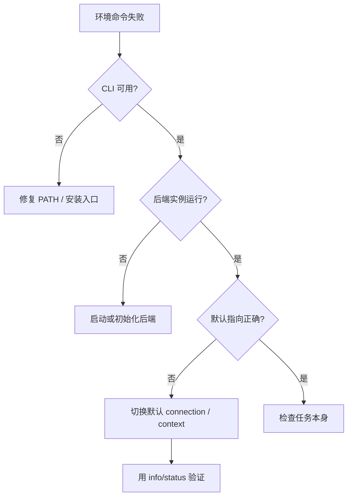
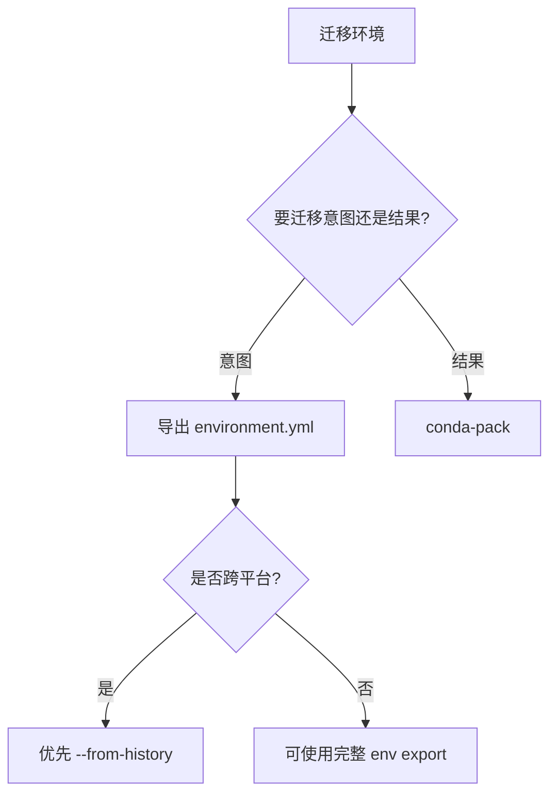

# 环境入口与后端指向排障复盘

| 字段 | 值 |
|---|---|
| 任务名称 | environment-backend-pointer-troubleshooting |
| 任务类型 | 环境排障 / Podman Windows 连接修复 / Conda 迁移知识说明 |
| 执行日期 | 2026-06-15 |
| 归档类型 | 复盘 + 洞察 + 二阶洞察 |
| 关联文件 | `apps/chaos/containers/miniconda/Containerfile` |

---

## 1. 基本信息

本次会话围绕两个环境类问题展开：

1. Windows 下 Podman 执行镜像构建时无法连接 socket。
2. Conda 环境如何迁移到其他电脑。

表层任务分别是“启动 Podman 环境”和“说明 Conda 迁移方法”，但底层共性都是：**环境问题不能只看命令是否存在，还要看命令背后的运行实例与默认指向是否正确**。

---

## 2. 执行概览

### 2.1 Podman 排障结果

用户在 `apps/chaos/containers/miniconda/Containerfile` 所在目录执行构建命令时遇到：

```text
Cannot connect to Podman
unable to connect to Podman socket
failed to connect: dial tcp 127.0.0.1:53802
```

实际排查发现：

- `podman --version` 可用，说明 CLI 入口存在。
- `podman-machine-default` 已存在，`podman machine init` 返回 `VM already exists`。
- `podman-machine-default` 已运行，`podman machine start` 返回 `already running`。
- 真正根因是默认 connection 指向 `podman-machine-big`，其端口 `53802` 不可用。
- 通过 `podman system connection default podman-machine-default` 切换默认连接后，`podman info` 成功。

### 2.2 Conda 迁移说明结果

给出的迁移路径包括：

| 目标 | 方法 |
|---|---|
| 跨机器可复现 | `conda env export --from-history > environment.yml` |
| 完整复制已有环境 | `conda-pack` |
| 主要依赖来自 pip | `pip freeze > requirements.txt` |

---

## 3. 问题与风险

| 问题 | 级别 | 根因 | 处理方式 |
|---|---|---|---|
| Podman socket 连接失败 | P1 | 默认 connection 指向已停止或不可达 machine | 切换默认 connection 到正在运行的 machine |
| `podman machine init/start` 返回非零退出码 | P2 | VM 已存在或已运行，不代表失败需要重建 | 解释为状态信息，继续检查 connection |
| Conda 迁移方案容易混淆 | P3 | “可复现重建”和“原样搬运”目标不同 | 按目标选择 `environment.yml` 或 `conda-pack` |

---

## 4. 一阶洞察

### 4.1 运行不等于可达

Podman machine 显示 running，只说明某个后端实例正在运行；Podman CLI 是否能工作，还取决于当前默认 connection 是否指向这个 running 实例。

### 4.2 init/start 不是连接错误的充分修复

遇到 `Cannot connect to Podman` 时，重复执行 `podman machine init` 或 `podman machine start` 只能覆盖“未创建/未启动”场景。若问题是默认 connection 错位，这两个命令不会修复根因。

### 4.3 Conda 迁移的关键不是“导出全部”，而是“导出意图”

默认 `conda env export` 会包含较多平台和构建细节；跨机器迁移时，`--from-history` 更接近“用户真正声明过的依赖意图”。

---

## 5. 洞察的洞察（二阶洞察）

### 5.1 环境排障的本质是三段式一致性检查

环境类问题可抽象为三段：


对应检查：

| 层级 | 典型检查 | 本次案例 |
|---|---|---|
| 命令入口 | CLI 是否可用 | `podman --version` 成功 |
| 运行实例 | 后端是否存在并运行 | `podman-machine-default` running |
| 默认指向 | CLI 是否指向正确实例 | 默认 connection 错指 `podman-machine-big` |
| 实际任务 | 构建/运行是否执行 | `podman info` 成功后才可构建 |

**二阶结论**：环境问题不是“工具有没有装”的二元问题，而是入口、实例、指向三者是否一致的问题。

### 5.2 状态命令要按依赖链排序

更稳的排障顺序不是直接重建环境，而是沿依赖链自左向右验证：

```powershell
podman --version
podman machine list
podman system connection list
podman info
```

这样可以避免把“指向错误”误处理成“机器未启动”或“配置文件错误”。

### 5.3 迁移也是一种指向问题

Conda 迁移表面是“把环境搬走”，本质是“把依赖解析指向另一个机器的求解器”。

- `environment.yml`：迁移依赖声明，让目标机器重新求解。
- `conda-pack`：迁移已求解结果，尽量不让目标机器重新解释。
- `pip freeze`：迁移 pip 层锁定结果，适合依赖边界较简单的环境。

**二阶结论**：迁移前先判断要迁移的是“意图”还是“结果”。

---

## 6. 可复用方法论

### 6.1 环境后端指向排障模板



### 6.2 迁移方案选择模板



---

## 7. 经验教训

### 成功要素

- 没有将 Podman 构建错误误判为 `Containerfile` 内容错误。
- 在 `init/start` 已无效后继续检查 `system connection list`。
- 用 `podman info` 作为最终验证，而不是只看 `machine start` 输出。
- Conda 迁移回答中区分了重建环境与打包环境。

### 可改进点

- 初始 Podman 排障建议应更早包含 `podman system connection list`。
- Conda 迁移建议应优先给出 `conda env export --from-history`，降低跨平台冲突概率。

---

## 8. 行动项

| # | 行动项 | 优先级 | 责任对象 | 触发条件 | 验收方式 |
|---|---|---|---|---|---|
| A1 | Podman Windows 文档补充“默认 connection 错位”排障段 | P1 | AI | 再次遇到 socket 连接失败 | 文档包含 `system connection default` 修复命令 |
| A2 | Python/Conda reference 增加环境迁移决策说明 | P2 | AI | 需要长期沉淀 Conda 迁移知识 | reference 中可检索到 `conda-pack` 与 `--from-history` |
| A3 | 环境排障时固定按“入口—实例—指向—任务”顺序验证 | P2 | AI | 任意 CLI/backend 类环境问题 | 复盘中可追踪每层证据 |

---

## 9. 规则候选标记

| 候选经验 | 触发次数 | 准入维度评估 | 建议动作 |
|---|---|---|---|
| 环境排障先验证“命令入口—运行实例—默认指向”三段一致性 | 第 1 次明确抽象 | 频率□ 普适☑ 可执行☑ 无害☑ 可验证☑ | 记录，待 ≥2 个案例后标记候选 |
| Conda 迁移前先区分“依赖意图”和“已求解结果” | 第 1 次明确抽象 | 频率□ 普适☑ 可执行☑ 无害☑ 可验证☑ | 记录 |

---

## 10. 归档结论

本次经验应沉淀为两个层次：

1. **具体工具层**：Podman Windows connection 指向错误排障，追加到 Podman reference。
2. **通用方法层**：环境问题按“入口—实例—指向—任务”四段排查，保留在本复盘中，待更多案例验证后再上升为规则候选。
