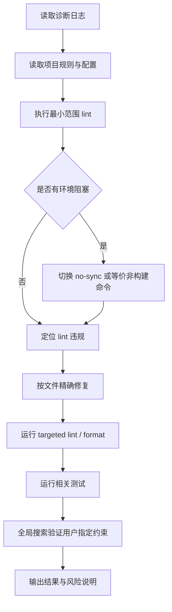

# 9. 经验总结

## 9.1 成功实践

1. **先读规则再改代码**
   - 通过读取 `AGENTS.md`、Python 规则和 `pyproject.toml`，避免使用错误命令或不符合项目规范的修复方式。

2. **遇到环境锁冲突时快速切换验证方式**
   - `uv run --no-sync` 避免了 `.pdm-build` 锁阻塞。

3. **控制修改范围**
   - 没有格式化无关历史文件，降低了 diff 噪声。

4. **针对用户反馈进行全局验证**
   - 用户要求"全部移除"后，使用全局搜索确认没有遗漏。

5. **lint 与测试结合验证**
   - Ruff 解决静态规范问题，pytest 验证关键业务路径没有破坏。

## 9.2 可复用方法论

类似任务可采用以下流程：

