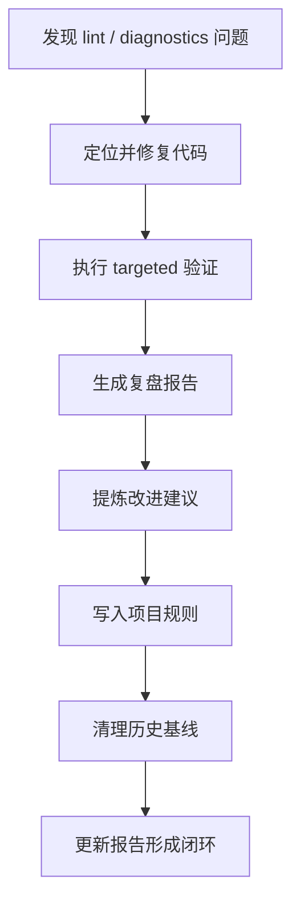

# 12. 洞察报告

## 12.1 核心洞察一：lint 修复不是单纯"消红"，而是项目约束显性化

本次任务表面上是修复 Ruff diagnostics，但实际暴露的是项目约束未完全显性化的问题：

- Python 3.13+ 的版本策略已有事实要求，但注解策略尚未文档化。
- `uv run --no-sync` 是解决本地构建锁阻塞的有效路径，但原先没有固化为规则。
- targeted check 是大型仓库中必要的验证降级方式，但原先缺少统一口径。

因此，真正的治理价值不只是让 lint 通过，而是把"这次靠经验解决的问题"转化为"下次可直接遵循的规则"。

## 12.2 核心洞察二：Python 3.13+ 适配的关键风险在注解求值时机

移除 `from __future__ import annotations` 后，类型注解会更直接地暴露运行时求值问题。典型风险包括：

- 类体内自引用尚未定义完成的类名。
- 为规避前向引用使用字符串注解，但又与 Ruff 的现代化规则冲突。
- 为通过 lint 使用 `Any`，但牺牲类型精度。

因此，Python 3.13+ 适配不应只检查语法是否通过，还应明确注解策略：何时使用 `Self`、何时避免自引用、何时允许 `Any`。

## 12.3 核心洞察三：全量验证与 targeted 验证需要分层，而不是互相替代

全量验证适合作为最终质量门禁，但在存在历史问题、构建缓存或本地文件锁时，强行要求全量通过可能阻塞当前任务。targeted check 的价值在于：

- 快速验证本次变更直接影响范围。
- 将历史遗留问题与当前任务风险隔离。
- 让修复过程保持小步、可解释、可回滚。

最佳策略不是"只跑全量"或"只跑 targeted"，而是：优先全量；全量阻塞时说明原因并降级 targeted；必要时再单独发起基线清理任务。

## 12.4 核心洞察四：复盘报告应从记录结果升级为驱动改进

本报告第 10 章最初是改进建议，随后被逐项执行并同步为完成状态。这说明复盘报告不应只是任务结束后的静态文档，而可以成为后续治理工作的行动清单。

有效复盘应具备三层价值：

1. **事实记录**：做了什么、改了哪里、如何验证。
2. **经验沉淀**：为什么这样做、遇到什么模式化问题。
3. **行动闭环**：哪些建议已执行、哪些风险仍需跟踪。

## 12.5 风险洞察

当前仍需关注以下风险：

- `ClassVar[list[Any]]` 解决了 lint 与运行时求值冲突，但类型精度较弱，未来若引入严格类型检查，应重新评估。
- `python.md` 中的验证命令以 FlowKit 测试为示例，若后续 Python 子模块增多，需要补充更多包级测试入口。
- 二次执行改动尚未提交，若长时间滞留工作区，可能与后续任务混合造成提交边界不清。
- `.temp` 下报告通常不一定纳入版本管理，需要确认该报告是否仅作为本地交付物，还是需要归档到项目文档体系。

## 12.6 管理洞察

本次任务展示了一个从"问题修复"到"规则建设"的正向循环：

该循环的关键不是一次性解决所有问题，而是确保每次问题处理都能留下可复用的规则、命令和判断标准。
