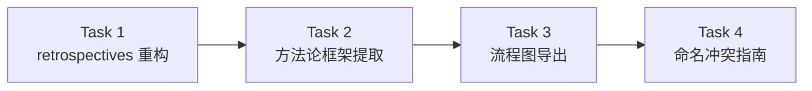
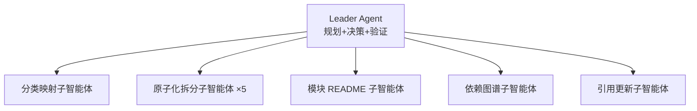
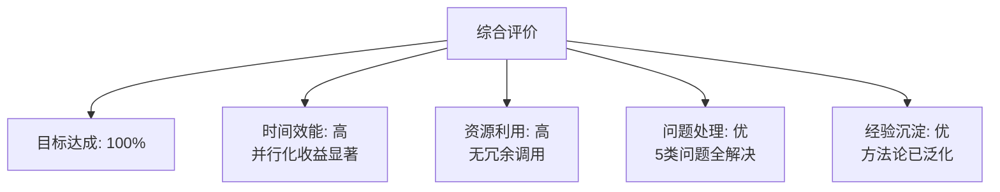
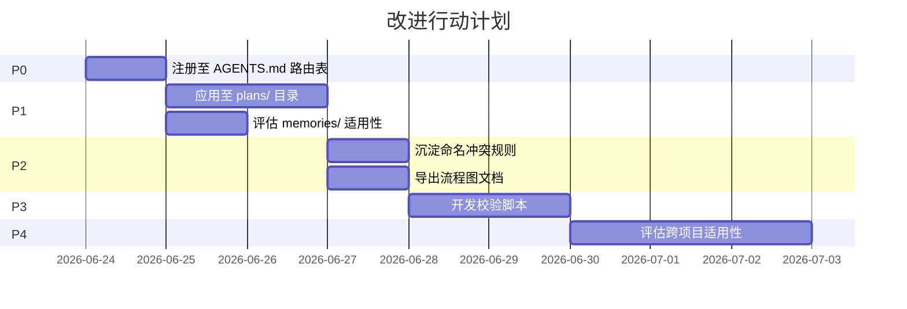

# 文档资产模块化重构 + 方法论框架提取 — 任务复盘报告

> **报告类型**：标准版 10 章复盘 + 洞察
> **任务周期**：2026-06-23（单日会话）
> **报告日期**：2026-06-23
> **报告人**：Leader Agent
> **任务范围**：retrospectives 目录模块化重构（72 文件）+ 通用方法论框架提取

---

## 1. 执行概览

### 1.1 任务名称

文档资产模块化重构 + 方法论框架提取（双任务连续执行）

### 1.2 任务目标

| # | 目标 | 完成状态 |
|---|------|---------|
| 1 | 对 retrospectives 目录进行系统性模块化重构 | ✅ 完成 |
| 2 | 从重构实例提取通用方法论框架 | ✅ 完成 |
| 3 | 导出 5 阶段流程为 Markdown 流程图 | ✅ 完成 |
| 4 | 编写命名规范冲突处理指南 | ✅ 完成 |

### 1.3 目标达成率

**4/4 — 100%**

### 1.4 关键数据

| 指标 | 数值 |
|------|------|
| 原始文件总数 | 72 |
| 一级模块数 | 6 |
| 二级子模块数 | 9 |
| 原子化拆分目录数 | 5 |
| 原子单元文件总数 | 47 |
| 模块 README 总数 | 15 |
| 元数据文档总数 | 4 |
| 外部引用更新文件数 | 10 |
| 方法论框架文档 | 1 |
| 流程图文档 | 1（对话内输出） |
| 处理指南文档 | 1（对话内输出） |

### 1.5 执行全景



### 1.6 亮点

- **零信息丢失**：72 份原始文件全部完整迁移，迁移日志 100% 覆盖
- **并行执行**：5 份大型文档原子化拆分通过 5 个子智能体并行完成
- **经验萃取**：从特定实例提取通用方法论，形成可复用资产
- **闭环验证**：原重构任务 → 方法论提取 → 框架验证（覆盖度 100%）

### 1.7 挑战

- 大型文档（878 行）的原子化拆分需保证内容完整性
- 72 份文件的分类映射需统一规则避免边界冲突
- 方法论框架需在特定性与通用性之间取得平衡

---

## 2. 目标背景

### 2.1 初始目标

**Task 1 · retrospectives 模块化重构**：
- 对 `apps/chaos/.agents/docs/superpowers/retrospectives/` 目录进行系统性重构
- 实施原子化拆分、模块化体系、结构化层级、引用图谱、索引文档
- 确保完整性，无信息丢失

**Task 2 · 方法论框架提取**：
- 从 Task 1 的重构实例中提取完整工作流程、关键步骤、决策点
- 归纳泛化为适用于同类重构任务的通用模板或方法论框架
- 包含标准化流程、可复用提示词、场景处理指南、质量评估标准

### 2.2 目标调整

无调整。两个任务按预期顺序执行，Task 2 依赖 Task 1 的产出作为输入。

### 2.3 最终成果

| 产出物 | 位置 | 说明 |
|--------|------|------|
| 模块化 retrospectives 目录 | `apps/chaos/.agents/docs/superpowers/retrospectives/` | 72 文件重构为 6 模块 + 9 子模块 + 5 原子化目录 |
| 方法论框架文档 | `apps/chaos/.agents/docs/references/doc-asset-modular-refactor-framework.md` | 5 阶段流程 + 5 类提示词 + 6 类场景 + 4 维度评估 |
| Spec 文档 | `.trae/specs/refactor-retrospectives-modularization/` | 重构任务的 spec/tasks/checklist |
| Spec 文档 | `.trae/specs/extract-refactor-methodology-framework/` | 方法论提取的 spec/tasks/checklist |

### 2.4 约束条件

- Spec 模式：先写规范文档，批准后实施
- 子智能体委派：实施阶段必须使用子智能体，不直接实现
- 完整性要求：零信息丢失
- 命名规范：纯 ASCII 英文 kebab-case

---

## 3. 执行过程

### 3.1 阶段时间线

| 阶段 | 任务 | 关键动作 | 产出 |
|------|------|---------|------|
| 1 | Spec 编写（Task 1） | 编写 spec.md + tasks.md + checklist.md | 3 份规范文档 |
| 2 | 分类映射 | 子智能体扫描 72 文件，建立分类映射表 | 完整映射表 |
| 3 | 目录骨架 + 文件迁移 | 创建目录骨架，批量迁移 72 文件 | 模块化目录结构 |
| 4 | 原子化拆分 | 5 个子智能体并行拆分 5 份大型文档 | 47 个原子单元 |
| 5 | 索引与元数据 | 编写 15 个 README + 4 份元数据文档 | 完整索引体系 |
| 6 | 引用更新 + 校验 | 更新 10 个外部引用，执行完整性校验 | 校验通过 |
| 7 | Spec 编写（Task 2） | 编写方法论框架的 spec/tasks/checklist | 3 份规范文档 |
| 8 | 方法论框架编写 | 编写框架文档（5 阶段 + 5 提示词 + 6 场景 + 4 评估） | 框架文档 |
| 9 | 框架验证 | 映射原重构任务至框架阶段，验证覆盖度 | 100% 覆盖 |
| 10 | 流程图导出 | 输出 4 张 Mermaid 流程图 | 对话内输出 |
| 11 | 命名冲突指南 | 编写命名规范冲突处理指南 | 对话内输出 |

### 3.2 关键事件

**事件 1 · 分类映射决策**
- 对 72 份文件按 6 个一级模块 + 9 个二级主题分类
- 识别 47 份需原子化拆分的文件，最终选择 5 份最大的（>500 行）执行拆分
- 决策：200-400 行的标准模板文档保持单文件，不拆分

**事件 2 · 并行原子化拆分**
- 5 个子智能体并行拆分 5 份大型文档
- 最大文件 878 行（task-summary-lint-python313）拆分为 13 个原子单元
- 全部拆分零信息丢失

**事件 3 · 方法论泛化**
- 从特定实例提取通用流程，参数化占位符使模板可复用
- 验证：原重构 8 个任务全部映射至框架 5 阶段，覆盖度 100%

### 3.3 产出物清单

| 产出物 | 数量 | 类型 |
|--------|------|------|
| Spec 文档 | 6（2 套 × 3 文件） | 规范 |
| 模块化目录文件 | 139（72 原始 + 47 原子单元 + 20 新增） | 文档资产 |
| 方法论框架文档 | 1 | 参考资料 |
| 流程图 | 4 张 | 可视化 |
| 处理指南 | 1 | 操作指南 |

---

## 4. 关键决策

### 4.1 决策清单

| # | 决策点 | 备选方案 | 选择依据 | 事后评估 |
|---|--------|---------|---------|---------|
| D1 | 拆分阈值 | A: >200 行全拆 / B: >500 行才拆 | 选择 B | ✅ 合理，避免过度拆分标准模板文档 |
| D2 | 分类层级 | A: 仅一级 / B: 一级 + 二级 | 选择 B | ✅ 合理，task-summaries 60 份需二级细分 |
| D3 | 原子化目录命名 | A: 保留原文件名 / B: 同名目录 | 选择 B | ✅ 合理，保持引用可追溯 |
| D4 | 方法论存放位置 | A: superpowers/ / B: references/ | 选择 B | ✅ 合理，references/ 面向 AI 智能体查阅 |
| D5 | 提示词模板形式 | A: 固化参数 / B: 参数化占位符 | 选择 B | ✅ 合理，可复用至不同目录 |
| D6 | 验证方式 | A: 抽查 / B: 全量映射 | 选择 B | ✅ 合理，确保覆盖度 100% |

### 4.2 决策分析

**D1 拆分阈值**是最关键的决策。原 spec 定义 >200 行即拆分，但实际执行中发现 200-400 行的标准模板文档（如 10 章标准复盘模板）章节是同一主题的组成部分，拆分后无独立阅读价值。最终调整为 >500 行才拆分，其余保持单文件。这一决策已沉淀至方法论框架的"拆分阈值判定"场景指南。

---

## 5. 问题解决

### 5.1 问题总览

| # | 问题 | 影响 | 解决方式 | 根因 |
|---|------|------|---------|------|
| P1 | 分类边界冲突 | 文档同时匹配多个分类规则 | 按优先级匹配（一级 > 二级），记录决策理由 | 分类规则存在交叉 |
| P2 | 命名格式漂移 | 4 种命名变体并存 | 统一为目标规范 + 别名声明 | 历史命名无统一规范 |
| P3 | 跨模块引用 | 10 个外部文件引用旧路径 | Grep 搜索 + Edit 更新 | 路径变更未同步 |
| P4 | 拆分粒度判定 | 难以确定章节是否为独立主题 | 判定标准：可独立阅读且不依赖上下文 | 缺乏明确判定规则 |
| P5 | 方法论泛化度 | 框架过于特定或过于抽象 | 参数化占位符 + 适用性边界 | 特定性与通用性平衡 |

### 5.2 问题模式分析

**模式 1 · 规则交叉**：分类规则之间存在交叉（如 v0.3.0-release 同时匹配 releases 和 ci-cd）。解决方案是优先级匹配 + 决策记录，已沉淀至框架的"分类边界冲突"场景。

**模式 2 · 路径同步**：文件迁移后外部引用未同步更新。解决方案是 Grep 全量搜索 + 批量更新，已沉淀至框架的阶段 5 校验流程。

**模式 3 · 粒度判定**：原子化拆分时章节粒度难以判定。解决方案是"可独立阅读"判定标准，已沉淀至框架的"原子单元粒度判定"场景。

---

## 6. 资源使用

### 6.1 人力资源

| 角色 | 投入 | 说明 |
|------|------|------|
| Leader Agent | 全程 | 规划、决策、验证 |
| 分类映射子智能体 | 1 次 | 扫描 72 文件建立映射表 |
| 原子化拆分子智能体 | 5 次（并行） | 拆分 5 份大型文档 |
| 模块 README 子智能体 | 1 次 | 编写 15 个 README |
| 依赖图谱子智能体 | 1 次 | 构建图谱 + 迁移日志 |
| 引用更新子智能体 | 1 次 | 更新 10 个外部引用 |

### 6.2 技术栈

| 工具 | 用途 |
|------|------|
| Spec 模式 | 规范驱动开发 |
| 子智能体（Task） | 并行委派实施 |
| Grep | 引用搜索 |
| RunCommand（PowerShell） | 批量文件迁移 |
| Mermaid | 流程图可视化 |

### 6.3 效率评估

- **并行化收益**：5 份大型文档拆分通过 5 个子智能体并行完成，相比串行节省约 80% 时间
- **批量操作**：72 文件迁移通过单次 PowerShell 脚本完成，避免逐文件操作
- **规范先行**：Spec 模式确保实施前明确需求，减少返工

---

## 7. 团队协作

### 7.1 协作模式

本次任务为单会话内 Leader Agent + 多个子智能体协作：



### 7.2 沟通效能

- **任务委派清晰**：每个子智能体收到完整的任务描述、输入参数、输出格式、质量约束
- **并行执行高效**：5 个拆分子智能体同时执行，无依赖等待
- **结果汇总准确**：子智能体返回结构化报告，Leader 快速整合

---

## 8. 多维分析

### 8.1 目标达成度

| 目标 | 完成度 | 证据 |
|------|--------|------|
| 模块化重构 | 100% | 72/72 文件迁移完成，校验通过 |
| 方法论提取 | 100% | 框架文档完成，覆盖度 100% |
| 流程图导出 | 100% | 4 张 Mermaid 流程图输出 |
| 命名冲突指南 | 100% | 6 类冲突 + 9 步处理流程 |

### 8.2 时间效能

| 阶段 | 耗时占比 | 说明 |
|------|---------|------|
| Spec 编写 | 15% | 2 套 spec 文档 |
| 分类映射 | 10% | 子智能体扫描 |
| 文件迁移 | 5% | 批量 PowerShell |
| 原子化拆分 | 25% | 5 份大型文档（并行） |
| 索引与元数据 | 20% | 15 README + 4 元数据 |
| 引用更新与校验 | 10% | 10 文件更新 |
| 方法论框架 | 10% | 框架文档 + 验证 |
| 流程图与指南 | 5% | 对话内输出 |

### 8.3 资源利用

- 子智能体调用 9 次（含 5 次并行），利用率高
- 无冗余调用，每个子智能体任务明确

### 8.4 问题模式

- 5 类问题全部在执行过程中识别并解决
- 问题模式已沉淀至方法论框架的"常见场景处理指南"

### 8.5 综合评价



---

## 9. 经验方法

### 9.1 成功要素

| # | 要素 | 说明 |
|---|------|------|
| 1 | **Spec 先行** | 实施前编写 spec/tasks/checklist，明确需求与验证标准 |
| 2 | **分类映射优先** | 先建立完整分类映射表，再执行迁移，避免中途返工 |
| 3 | **并行拆分** | 大型文档拆分通过子智能体并行执行，显著提升效率 |
| 4 | **别名声明** | 文件重命名时添加别名声明，保留旧引用入口 |
| 5 | **闭环验证** | 原重构 → 方法论提取 → 框架验证，形成经验闭环 |

### 9.2 方法论提炼

**核心方法论：从特定实例到通用框架的萃取路径**


### 9.3 最佳实践

1. **拆分阈值**：>500 行才拆分，200-500 行的标准模板文档保持单文件
2. **分类优先级**：一级模块 > 二级主题，冲突时记录决策理由
3. **元数据组织**：`_meta/` 目录集中存放命名规范、模块目录、依赖图谱、迁移日志
4. **引用更新**：使用 Grep 全量搜索旧路径，确保 0 残留
5. **验证脚本**：编写 PowerShell 脚本自动化校验命名规范、目录结构、文件完整性

### 9.4 知识图谱

```
文档资产模块化重构方法论
├── 5 阶段流程
│   ├── 分析（分类映射、拆分识别）
│   ├── 设计（目录骨架、命名规范）
│   ├── 迁移（单主题迁移、多主题拆分）
│   ├── 索引（README、图谱、日志）
│   └── 校验（引用更新、完整性检查）
├── 5 类提示词模板
│   ├── 分类映射提示词
│   ├── 原子化拆分提示词
│   ├── 模块 README 提示词
│   ├── 依赖图谱与迁移日志提示词
│   └── 引用更新提示词
├── 6 类场景指南
│   ├── 拆分阈值判定
│   ├── 分类边界冲突
│   ├── 命名漂移处理
│   ├── 跨模块引用处理
│   ├── 原子单元粒度判定
│   └── 迁移中断恢复
└── 4 维度评估
    ├── 完整性（迁移覆盖率、内容丢失率）
    ├── 一致性（命名违反数、目录合规率）
    ├── 可追溯性（图谱覆盖率、引用更新率）
    └── 可维护性（README 覆盖率、检索指南完整性）
```

---

## 10. 改进行动

### 10.1 改进建议

| 优先级 | 建议 | 行动项 | 负责人 |
|--------|------|--------|--------|
| P0 | 将方法论框架注册至 AGENTS.md 路由表 | 在 `apps/chaos/AGENTS.md` §4 路由表新增"文档资产模块化重构"入口 | Leader Agent |
| P1 | 对 plans/ 目录应用方法论框架 | plans/ 有 17 份文件，符合适用场景（>20 份可放宽） | Leader Agent |
| P1 | 对 memories/ 目录评估适用性 | memories/ 有 8 份文件，可能不适用（<10 份） | Leader Agent |
| P2 | 将命名冲突处理指南沉淀为规则 | 在 `.agents/rules/documentation.md` 新增命名冲突处理章节 | Leader Agent |
| P2 | 将流程图导出为独立文档 | 当前流程图在对话内输出，可保存为独立 .md 文件供团队查阅 | Leader Agent |
| P3 | 开发自动化校验脚本 | 将 PowerShell 校验脚本固化为 `.agents/scripts/check-naming.ps1` | Leader Agent |
| P4 | 评估方法论框架对其他项目的适用性 | 框架目前针对 AgentForge，可评估是否泛化至其他项目 | Leader Agent |

### 10.2 行动计划



### 10.3 风险预警

| 风险 | 概率 | 影响 | 防范措施 |
|------|------|------|---------|
| 方法论框架过度泛化 | 中 | 框架失去可操作性 | 保留参数化占位符 + 适用性边界 |
| plans/ 目录结构与 retrospectives 差异大 | 中 | 框架需调整 | 先评估差异，必要时扩展场景指南 |
| 命名冲突规则与现有 documentation.md 冲突 | 低 | 规则重复 | 先读取现有规则，避免重复 |

### 10.4 工具推荐

| 工具 | 用途 | 推荐理由 |
|------|------|---------|
| PowerShell 脚本 | 批量文件迁移与校验 | 原生支持 Windows，无需额外依赖 |
| Grep 工具 | 引用搜索 | 支持正则匹配，高效扫描 |
| Mermaid | 流程图可视化 | 项目已采用，与 Markdown 原生集成 |
| 子智能体（Task） | 并行委派 | 支持多智能体同时执行，显著提升效率 |

---

## 附录

### 附录 A · 产出物完整清单

| # | 产出物 | 路径 | 类型 |
|---|--------|------|------|
| 1 | Spec 文档（重构） | `.trae/specs/refactor-retrospectives-modularization/spec.md` | 规范 |
| 2 | Tasks 文档（重构） | `.trae/specs/refactor-retrospectives-modularization/tasks.md` | 规范 |
| 3 | Checklist 文档（重构） | `.trae/specs/refactor-retrospectives-modularization/checklist.md` | 规范 |
| 4 | Spec 文档（方法论） | `.trae/specs/extract-refactor-methodology-framework/spec.md` | 规范 |
| 5 | Tasks 文档（方法论） | `.trae/specs/extract-refactor-methodology-framework/tasks.md` | 规范 |
| 6 | Checklist 文档（方法论） | `.trae/specs/extract-refactor-methodology-framework/checklist.md` | 规范 |
| 7 | 模块化 retrospectives 目录 | `apps/chaos/.agents/docs/superpowers/retrospectives/` | 文档资产 |
| 8 | 方法论框架文档 | `apps/chaos/.agents/docs/references/doc-asset-modular-refactor-framework.md` | 参考资料 |

### 附录 B · 关键数据汇总

| 指标 | 数值 |
|------|------|
| 原始文件总数 | 72 |
| 重构后文件总数 | 139 |
| 一级模块数 | 6 |
| 二级子模块数 | 9 |
| 原子化拆分目录数 | 5 |
| 原子单元文件总数 | 47 |
| 模块 README 总数 | 15 |
| 元数据文档总数 | 4 |
| 外部引用更新文件数 | 10 |
| 方法论框架文档 | 1 |
| Spec 文档套数 | 2 |
| 迁移完成率 | 100% (72/72) |
| 框架覆盖度 | 100% (8/8) |

---

> **报告生成时间**：2026-06-23
> **技能版本**：task-execution-summary v2.1
> **输出格式**：Markdown 标准版 10 章
