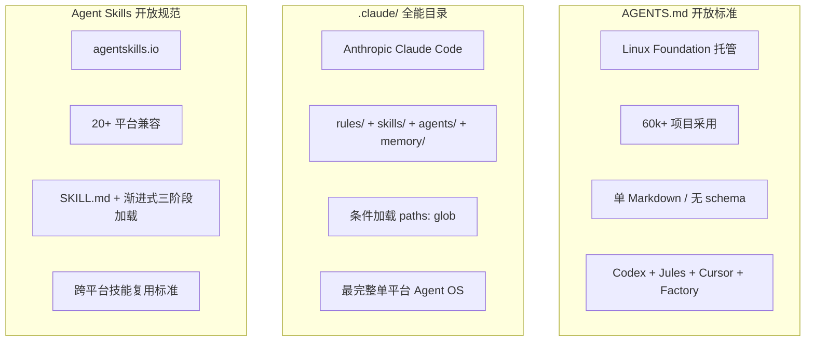
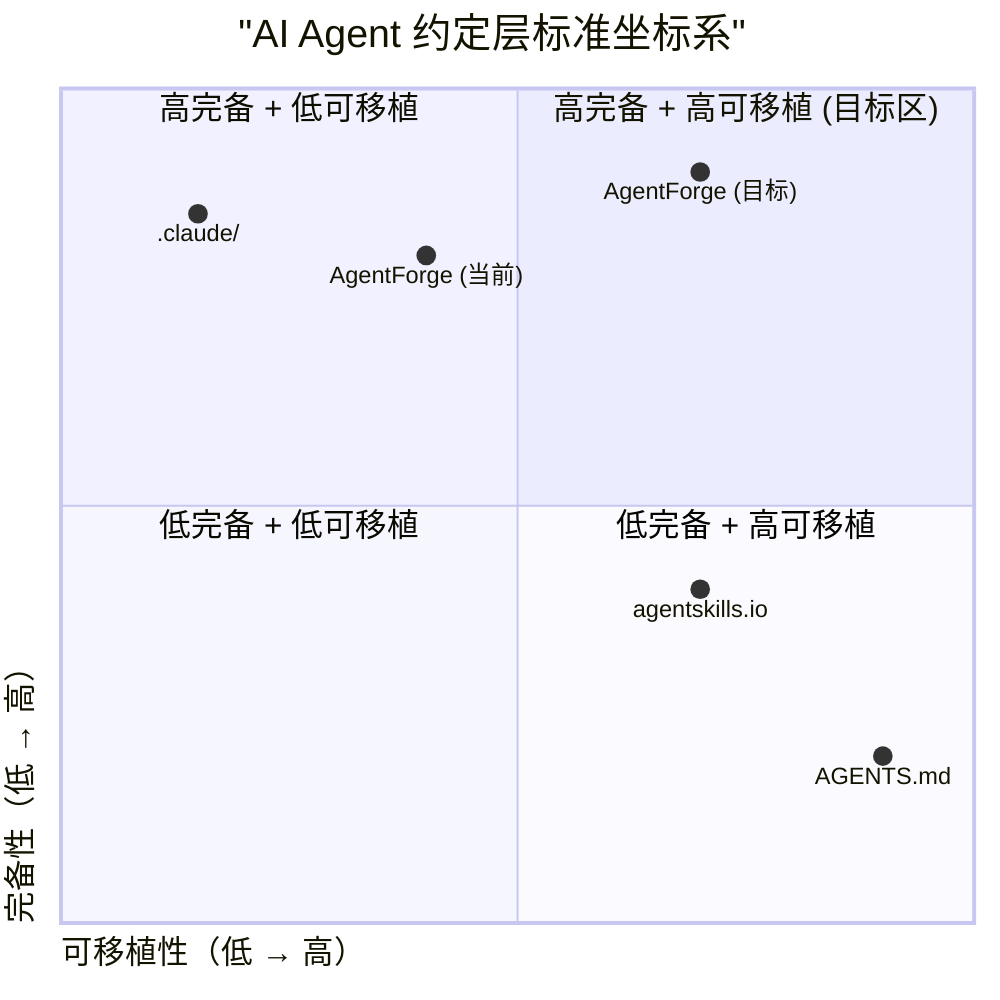
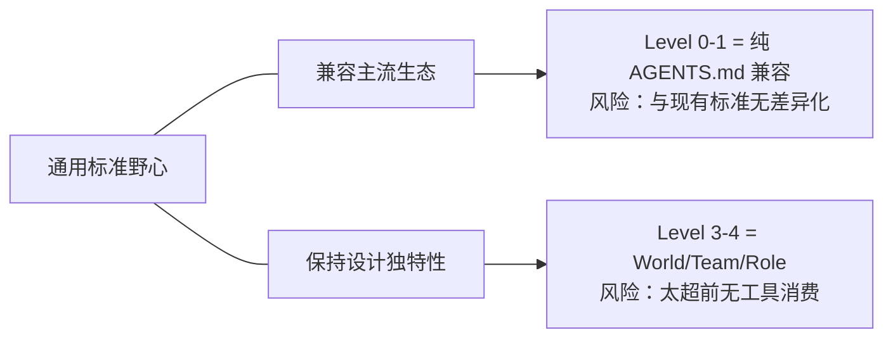

# 任务执行总结：AGENTS.md + .agents/ 行业对标与设计定位探索

> 报告版本：standard（标准版 10 章）
> 任务窗口：2026-05-28 单次会话探索
> 报告生成：task-execution-summary v2.4
> 触发起点：对 AgentForge 在主流 AI Agent 生态中定位的战略性审视

---

## 1. 执行概览

| 字段 | 内容 |
|---|---|
| 任务名称 | AGENTS.md + .agents/ 主流设计格局对标分析 |
| 任务类型 | research（行业研究 / 战略定位 / 标准对齐分析） |
| 起止时间 | 2026-05-28 单次会话 |
| 主要产出 | ① 行业三大流派格局图；② 上下文路由结构化演进方案；③ Skills 跨平台对齐差距分析；④ P0-P2 行动路线图；⑤ 本归档报告 |
| 关键决策 | 确认 AgentForge 定位为"全栈约定层标准"（比 AGENTS.md 更完备、比 .claude/ 更开放、比 agentskills.io 更全栈） |
| 哲学锚点 | 大道至简 ｜ 渐进式复杂度 ｜ Level 0-4 阶梯式采纳 |
| 完成度 | 分析阶段 100%（待转化为规范修订与工具链实现） |

### 亮点
- **首次将 AgentForge 体系放入行业坐标系中系统对比**：识别共识层、差异化资产、互操作缺口。
- **发现路径变量不兼容是跨平台最致命障碍**：比结构差异更影响 Skills 实际跑通。
- **渐进式模型的战略价值得到验证**：Level 0-4 恰好回应"标准化悖论"。

### 挑战
- 协作元模型（Team/Role）目前无外部消费方，属于纯超前设计储备。
- World 概念在主流生态中无对标，是最大差异化但也最难被直接采纳的部分。

---

## 2. 目标背景

### 2.1 初始目标
系统性审视 AgentForge 的 AGENTS.md + .agents/ 设计体系在当今 AI Agent 主流生态中的定位。

### 2.2 目标演进
| 阶段 | 目标 | 演进动因 |
|---|---|---|
| 起始 | 了解 AGENTS.md 在行业中的主流设计模式 | 用户发起设计讨论 |
| 深入 1 | 上下文路由表的结构化演进方向 | 识别到路由是 AgentForge 独特设计但存在机械化瓶颈 |
| 深入 2 | Skills 跨平台对齐差距与兼容策略 | 战略目标"通用标准"要求互操作性 |
| 收束 | 全面复盘 + 行动路线图 | 从分析转向可执行策略 |

---

## 3. 行业格局分析

### 3.1 三大流派



### 3.2 各流派核心特征对比

| 维度 | AGENTS.md 标准 | .claude/ 体系 | agentskills.io | **AgentForge** |
|---|---|---|---|---|
| 定位 | 指令层（给 Agent 的 README） | 单平台 Agent OS | 跨平台技能层 | **全栈约定层标准** |
| 复杂度 | 最低（纯 Markdown） | 最高（结构化目录 + 配置） | 中等（SKILL.md + 目录） | 渐进式（Level 0-4） |
| 可移植性 | 最高 | 最低（平台锁定） | 高（20+ 平台） | 中（Level 0-1 兼容主流） |
| 协作模型 | 无 | subagents（单层） | 无 | Team/Role/Agent 元模型 |
| 世界概念 | 无 | 无 | 无 | world.toml 多端协同容器 |
| 条件加载 | 无（全量注入） | paths: glob（文件级） | description 触发（语义级） | intent-based 路由表（任务意图级） |

### 3.3 AgentForge 在坐标系中的位置



---

## 4. 议题深入分析

### 4.1 上下文路由结构化

#### 现状
AGENTS.md 中的 Markdown 表格充当"路由表"，按任务意图导引 Agent 加载对应 `.agents/rules/` 规范：

```markdown
| 任务类型 | 必读入口 |
|---|---|
| Python 开发、依赖管理 | .agents/rules/python.md |
| 文档新增、归档、迁移 | .agents/rules/documentation.md |
```

#### 与主流对比

| 方案 | 路由维度 | 触发机制 | 优势 | 局限 |
|---|---|---|---|---|
| Claude Code `paths:` | 文件路径 glob | 当匹配文件进入 context | 机械可靠 | 无法按任务意图路由 |
| agentskills.io `description` | 自然语言描述 | 语义匹配 | 灵活 | 过度/不足触发风险 |
| **AgentForge 路由表** | 任务意图 | Agent NLP 理解 | 语义最丰富 | 不可程序化验证 |

#### 提出的三条演进路径

**方向 A：TOML/YAML 机器可解析路由表**
```toml
[[route]]
triggers = ["python", "dependency", "uv", "venv"]
targets = ["rules/python.md"]
priority = 5
```

**方向 B：Rule 文件自带 triggers frontmatter**
```yaml
---
triggers:
  - intent: ["python", "dependency", "uv"]
  - file_pattern: ["**/*.py", "pyproject.toml"]
---
```

**方向 C（推荐）：Hybrid——AGENTS.md 人类视图 + registry.toml 机器路由**

利用已有 `registry.toml` 基础设施，扩展承载机器可解析的路由索引。AGENTS.md 表格作为人类友好视图，registry.toml 作为真相源，可用脚本检查两者一致性。

#### 深层设计问题
- **路由消费方**：当前是 Agent 自觉加载 vs 未来可由框架自动注入
- **粒度叠加**：intent-based + file-based + phase-based 三维可组合
- **与 World State 结合**：session 处于 `coding` 阶段 → 自动加载编码规则

### 4.2 Skills 跨平台对齐

#### 对齐程度总结

| 维度 | 对齐程度 | 详情 |
|---|---|---|
| 目录 + SKILL.md 结构 | **完美对齐** | folder/ + SKILL.md 完全一致 |
| YAML frontmatter | **对齐 + 超集** | name/description 对齐；version/homepage/metadata 为扩展 |
| 渐进式加载概念 | **对齐** | 三阶段（metadata → body → resources）一致 |
| 辅助目录 | **对齐** | scripts/、references/ 一致；schemas/ 为 AgentForge 特有 |
| `{baseDir}` 路径变量 | **不兼容** | Claude Code 用 `${CLAUDE_SKILL_DIR}`，Codex 用另一套 |
| 必填章节 | **更严格** | 标准：2 字段；AgentForge：7 章节强制 |
| 验证体系 | **超前** | .validate-config.toml + validate_skill_md.py 为 AgentForge 独有 |

#### 互操作性实测推演

将 `zhihu-global-search/` 放入 Claude Code `.claude/skills/`：
- **能工作**：name + description 触发正常，`/global-search` 可调用
- **部分失效**：`{baseDir}` 路径变量不被识别，scripts/ 执行失败
- **无害冗余**：version、metadata.openclaw 被忽略

#### 最致命障碍

**路径变量语法不统一**——直接影响 scripts 能否执行，比文档结构差异更阻碍实际跨平台复用。

---

## 5. 战略张力与定位决策

### 5.1 核心悖论



### 5.2 渐进式模型的战略回应

Spec v0.1 的 Level 0-4 恰好解决悖论：

| Level | 内容 | 兼容性 | 差异化 |
|---|---|---|---|
| 0 | 纯 AGENTS.md（Codex 格式） | 100% 兼容主流 | 零差异 |
| 1 | AGENTS.md + .agents/rules/ | 高（类 .claude/rules/） | 低 |
| 2 | + skills/ + workflows/ | 高（Skills 标准对齐） | 中 |
| 3 | + world.toml + registry | 中（概念独创） | 高 |
| 4 | + roles/ + teams/ + kernel/ | 低（无外部对标） | 最高 |

**策略**：让项目从 Level 0 零成本起步，自然升级到感受到价值的层级。Level 3-4 的独创性是长期护城河。

### 5.3 AgentForge 独有资产（护城河）

1. **World（世界容器）**：唯一一个将"任务运行时状态"作为一等公民的方案
2. **协作元模型（Team/Role/Agent）**：为多 Agent 协作预设了治理结构
3. **Intent-based 路由**：比 file glob 和 description match 更高抽象层
4. **哲学内核**：Ψ=Ψ(Ψ) 和道家设计原则提供独特的设计决策框架

---

## 6. 可执行的下一步行动

### P0（阻塞跨平台复用）

| 行动项 | 产出 | 验收标准 |
|---|---|---|
| 路径变量适配层 | `skill-export.py` 脚本 | `{baseDir}` ↔ `${CLAUDE_SKILL_DIR}` ↔ Codex 格式自动转换 |
| Spec v0.1 公开评审 | 在 AGENTS.md 社区/agentskills.io 提交 RFC | 获得至少 3 个外部反馈 |

### P1（提升内部一致性与外部门槛）

| 行动项 | 产出 | 验收标准 |
|---|---|---|
| registry.toml 承载机器路由 | routes section 定义 + 一致性验证脚本 | AGENTS.md 表格与 registry 可自动对账 |
| Skills 必填章节降级 | 规则修改为"2 必填 + 5 推荐" | validate_skill_md.py 支持 strict/relaxed 两种模式 |
| tests/ → evals/ 命名统一 | 迁移或添加别名 | 与 agentskills.io 标准 evals/ 目录一致 |

### P2（差异化资产落地）

| 行动项 | 产出 | 验收标准 |
|---|---|---|
| World 协议参考实现 | CLI 工具演示 session lifecycle | `world session start/status/end` 可执行 |
| 协作元模型 Consumer 原型 | 简单多 Agent 调度器 | 消费 roles/ + teams/ 分配任务 |
| 上下文路由 + World State 联动 | PoC 验证 state-aware routing | session 阶段自动加载对应规则 |

---

## 7. 信息源与参考

| 来源 | 内容 | 关键洞察 |
|---|---|---|
| [agents.md](https://agents.md/) | AGENTS.md 开放标准官网 | Linux Foundation 托管、60k+ 项目、跨 20+ Agent 平台 |
| [AI Hero 完整指南](https://www.aihero.dev/a-complete-guide-to-agents-md) | AGENTS.md 最佳实践 | "指令预算"概念、渐进式披露、monorepo 嵌套策略 |
| [Claude Code .claude/ 目录文档](https://code.claude.com/docs/en/claude-directory) | .claude/ 完整文件树 | rules/skills/agents/memory 四层、paths: 条件加载 |
| [Agent Skills 101](https://blog.serghei.pl/posts/agent-skills-101/) | SKILL.md 开发实战指南 | 渐进式加载三阶段、description 触发机制、跨平台策略 |
| [arXiv 2602.11988](https://arxiv.org/pdf/2602.11988) | 仓库级上下文文件对 Coding Agent 的影响研究 | 学术验证 AGENTS.md/CLAUDE.md 有效性 |

---

## 8. 关键技术发现

### 8.1 AGENTS.md 标准的设计哲学
- **无 schema、无必填字段**——纯自由格式 Markdown
- **嵌套覆盖**——最近的 AGENTS.md 优先，用户 prompt 覆盖一切
- **自动执行**——Agent 会尝试执行文件中列出的命令并修复失败

### 8.2 Claude Code 的渐进式加载机制
- **rules/ 条件加载**：通过 `paths:` frontmatter 实现文件类型级别的按需加载
- **Skills 三阶段**：metadata (always) → body (on activation) → resources (on demand)
- **Subagent 隔离**：独立 context window + 工具白名单 + 持久记忆

### 8.3 agentskills.io 的 description 触发设计
- description 不是文档而是**触发器**——告诉 Agent "何时"用，而非"如何"做
- 过度描述 workflow 会导致 Agent 跳过加载 body（已节省 tokens 的理性行为）
- 负触发器（"Do NOT use for..."）防止过度激活

---

## 9. 风险与开放问题

| 风险/问题 | 影响 | 缓解策略 |
|---|---|---|
| "又一个标准"问题——已有 AGENTS.md + agentskills.io，AgentForge 如何避免碎片化 | 社区采纳意愿降低 | Level 0 保持 100% 兼容，差异化在高 Level 体现 |
| 协作元模型无 Consumer | Team/Role 定义沦为"死文档" | P2 原型实现 + 与 World Session 联动 |
| 路径变量无统一标准 | Skills 跨平台可移植性受阻 | P0 适配层 + 推动 agentskills.io 社区讨论标准化 |
| 必填章节过严 | 外部贡献者门槛高 | P1 降级为 strict/relaxed 双模式 |
| World 概念过于超前 | 无外部工具可消费、难以社区传播 | P2 参考实现 + 与 Codex/Jules 团队沟通可能性 |

---

## 10. 元认知与过程反思

### 10.1 本次探索的核心价值
**首次将 AgentForge 的设计放入行业坐标系**——之前体系可能更多是"自然演化"出来的（从实际需求逐步丰富），但通过系统对比可以更清晰回答三个问题：
- 共识层在哪里——Skills 格式、渐进式加载、目录约定
- 超前的部分是什么——World、协作元模型、intent-based routing
- 互操作缺口是什么——路径变量、必填章节刚性、注册表机制

### 10.2 方法论收获
- **标准化定位分析需要"坐标系思维"**：不是问"我们好不好"，而是问"我们在哪里、要去哪里"
- **兼容性分析的正确粒度**：不是笼统说"对齐/不对齐"，而是逐字段、逐机制对比
- **战略悖论的设计解法**：渐进式复杂度模型是"极端兼容"与"极端独创"之间的最优策略

### 10.3 后续建议
1. 本报告可作为 Spec v0.1 修订的输入——特别是 Skills 章节和路由机制章节
2. P0 行动项建议在下个 sprint 优先排入
3. 考虑将行业对比图纳入项目 README 或官网，帮助新用户理解定位
