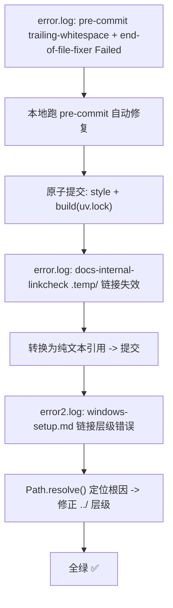

# CI Lint 与文档链接校验修复复盘报告

## 1. 执行概览

### 1.1 任务名称

CI `lint` job 连续失败修复：pre-commit 格式违规 + 文档内部相对链接失效。

### 1.2 任务目标

根据 `.temp/error.log` 和 `.temp/error2.log` 中的 CI 诊断信息，逐轮修复所有阻塞项，使 `mise run lint` 全绿。

### 1.3 最终结果

| 指标 | 最终值 |
|------|--------|
| 修复提交数 | 4（3 类问题） |
| pre-commit hooks | 9/9 Passed |
| 文档链接校验 | 410+ 条全部有效 |
| 新增技术债 | 无 |

---

## 2. 基本信息

| 字段 | 值 |
|------|-----|
| 复盘对象 | CI `lint` job（`mise run lint`） |
| 诊断日志 | `.temp/error.log`（2 轮）、`.temp/error2.log`（1 轮） |
| 执行日期 | 2026-06-09 |
| 涉及模块 | `.trae/specs/`、`docs/`、`apps/chaos/.agents/`、`apps/chaos/uv.lock`、`apps/chaos/CMakeLists.txt` |
| 分析工具 | pre-commit、`check_doc_links.py`、Python `Path.resolve()` |

---

## 3. 执行过程

### 3.1 事件时间线



### 3.2 各阶段详情

#### 阶段 1：pre-commit 格式修复（error.log 第 309-338 行）

**失败 hook**：
- `trim trailing whitespace` → 3 个 .md 文件含行尾空白
- `fix end of files` → 5 个文件缺末尾换行

**修复方式**：在 `apps/chaos/` 下执行 `uv run pre-commit run --all-files`，让 hook 自动修改文件。

**拆分逻辑**：
- 提交 1（`ee8d3f2`）：8 个被 pre-commit 自动修复的文件
- 提交 2（`9b3d956`）：`uv.lock` 依赖元数据变更（`packaging 降级 + greenlet 新增平台 wheel`）

#### 阶段 2：.temp/ 链接失效（error.log 第 332-370 行）

**失败点**：`docs/topics/container-build-insights.md` 引用 `.temp/Containerfile.miniconda` 和 `.temp/build-miniconda-image.md`。

**根因**：`.temp/` 是中间产物目录，不进入 Git 仓库，CI 环境自然不存在这些文件。

**修复**：转为纯文本引用 `\`文件名\`（临时产物：\`.temp/...\`）`，保留信息完整性但不依赖文件系统。

#### 阶段 3：相对路径层级错误（error2.log 第 392-393 行）

**失败点**：`.agents/docs/references/podman/windows-setup.md` 第 252 行 `../../rules/containerization.md`。

**排查过程**：
1. `git ls-files` 确认 `containerization.md` 已跟踪且存在 → 排除"文件未提交"
2. 本地复现：`uv run python .agents/scripts/check_doc_links.py --root . --files CHANGELOG.md --dirs .agents/docs .agents/rules` → 同样报错
3. Python 模拟解析：
```python
from pathlib import Path
root = Path('.').resolve()
source = root / '.agents/docs/references/podman/windows-setup.md'
resolved = (source.parent / '../../rules/containerization.md').resolve()
# -> .agents/docs/rules/containerization.md  ❌ 目标不存在
# 正确应为 .agents/rules/containerization.md → 需 ../../../rules/
```
4. 修复：`../../rules/containerization.md` → `../../../rules/containerization.md`

**启示**：目录层级为 `docs/references/podman/` 时，`../../` 只能到 `docs/`，需 `../../../` 才能到达 `.agents/rules/`。目视检查层级的可靠性低于工具验证。

---

## 4. 问题与风险

| # | 问题 | 级别 | 根因 | 影响 |
|---|------|------|------|------|
| P1 | pre-commit 运行目录错误 | - | 仓库根目录无 `.pre-commit-config.yaml`，必须进入 `apps/chaos/` 执行 | 首次运行报 `InvalidConfigError`，增加排查成本 |
| P2 | 文档引用 `.temp/` 临时产物 | P1 | 违反 `document-boundaries.md` 的中间产物边界约定 | CI 失效链接 |
| P3 | `../../` 相对路径层级错误 | P2 | 无自动化校验，依赖目视检查 | CI 失效链接 |

---

## 5. 经验教训

### 5.1 成功要素

1. **逐轮修复策略**：每次只处理 CI 日志中当前暴露的问题，不乱碰无关文件。
2. **原子提交**：格式修复与依赖变更分离，回滚和追溯成本低。
3. **Python `Path.resolve()` 快速验证**：第 3 轮排查时，用一行脚本替代人工数层级，30 秒定位根因。

### 5.2 失败教训

1. **`.temp/` 引用未在本地检查**：`container-build-insights.md` 的失效链接在本地同样不存在，但被 CI 才暴露。说明 `docs-internal-linkcheck` 没有作为本地 pre-push hook。
2. **相对路径层级容易出错**：在深层目录中，`../` 的层级数靠人工数容易出错，应优先用 `Path.resolve()` 验证。

### 5.3 可复用方法论

| 方法 | 适用场景 | 步骤 |
|------|---------|------|
| CI 日志逐轮修复 | 多轮 CI 失败 | 1) 只看当前日志的报错行 2) 本地复现 3) 修复 + 验证 4) 等待新一轮 CI |
| `Path.resolve()` 链接验证 | 失效链接排查 | `python -c "from pathlib import Path; print((Path('source.md').parent / 'link.md').resolve())"` |

---

## 6. 后续行动项

| # | 行动项 | 优先级 | 责任对象 | 触发条件 | 验收方式 |
|---|--------|--------|---------|---------|---------|
| A1 | 将 `docs-internal-linkcheck` 加入 pre-push hook | P2 | 人类 | 下次 CI 优化迭代 | `git push` 前自动触发校验 |

---

## 7. 规则候选标记

| 候选经验 | 触发次数 | 准入维度评估 | 建议动作 |
|---------|---------|------------|---------|
| 文档不得引用 `.temp/` 临时产物 | 第 2 次（本轮 + 历史 `lint-python313` 任务） | 频率✓ 普适✓ 可执行✓ 无害✓ 可验证✓ | **标记候选**——建议移入 `docs/topics/` 或直接补充到 `document-boundaries.md` 的反例清单 |
| 相对路径层级应使用 `Path.resolve()` 验证而非目视检查 | 首次 | 频率✗ 普适✓ 可执行✓ 无害✓ 可验证✓ | **记录**——暂留在本复盘，待再次出现后标记候选 |
