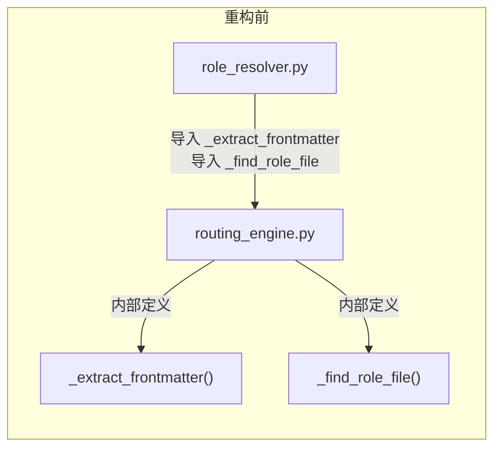
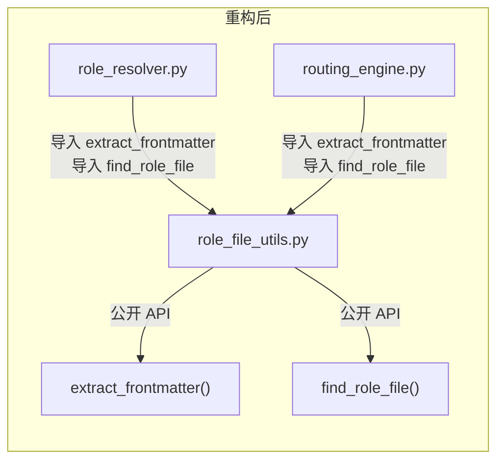

# 任务执行总结：跨模块私有函数导入重构

> **任务名称**：role_resolver ↔ routing_engine 模块解耦重构
> **执行日期**：2026-04-17
> **执行周期**：~15 分钟
> **重构类型**：Normal Refactoring（影响级别 1，成本 0）

---

## 一、执行概览

| 指标 | 数值 | 评价 |
|------|------|------|
| 目标达成率 | 100% | ✅ 优秀 |
| 涉及文件数 | 3（1 新建 + 2 修改） | 影响范围可控 |
| 遇到问题数 | 0 | 无故障 |
| 代码诊断结果 | 0 diagnostic | 干净 |
| 回归验证 | 全部通过 | 导入 + 逻辑均正常 |

### 核心成果

> 将 `routing_engine.py` 中被 `role_resolver.py` 跨模块引用的两个私有函数（`_extract_frontmatter`、`_find_role_file`）提取到独立的公共工具模块 `role_file_utils.py`，同时升级为公共 API，消除了模块间的隐式耦合。

### 亮点

1. **精准定位**：问题描述准确，两个函数的职责归属清晰（既非路由引擎核心逻辑，也非角色解析器专属）
2. **最小改动**：仅新建 1 个文件、修改 2 个文件，函数逻辑一行未变
3. **零缺陷交付**：一次通过全部验证，无 diagnostic、无 lint 错误

---

## 二、问题背景

重构前的模块依赖关系：



`role_resolver.py` 第 17 行：

```python
from taolib.cli._world_engines.routing_engine import _extract_frontmatter, _find_role_file
```

- Python 中 `_` 前缀函数是模块内部实现细节
- `routing_engine.py` 在 `__all__` 中泄露了 `_find_role_file`，违反封装约定
- 两个函数的语义（frontmatter 解析、角色文件查找）与路由引擎的核心职责无直接关系

---

## 三、执行过程

### 阶段一：问题确认与分析（~5 分钟）

| 步骤 | 操作 | 发现 |
|------|------|------|
| 1 | 读取 `role_resolver.py` 头部 | 确认第 17 行存在违规导入 |
| 2 | 读取 `routing_engine.py` 完整内容 | 确认两个私有函数的定义位置和 `__all__` 泄露 |
| 3 | 全局搜索 `_extract_frontmatter\|_find_role_file` | 仅 2 个文件共 8 处引用，影响面极小 |
| 4 | 检查 `__init__.py` | 无需修改导出 |

### 阶段二：代码执行（~5 分钟）

| # | 操作 | 文件 | 说明 |
|---|------|------|------|
| 1 | 新建 | `role_file_utils.py` | `_extract_frontmatter` → `extract_frontmatter`、`_find_role_file` → `find_role_file`，去掉 `_` 前缀 |
| 2 | 修改 | `routing_engine.py` | 移除两个私有函数定义（42 行），改为 `from role_file_utils import ...`，清理 `__all__` |
| 3 | 修改 | `role_resolver.py` | 导入源改为 `role_file_utils`，调用点 `_find_role_file` → `find_role_file`、`_extract_frontmatter` → `extract_frontmatter` |

### 阶段三：验证（~5 分钟）

| 验证项 | 方法 | 结果 |
|--------|------|------|
| diagnostics | VS Code 诊断检查 | 0 错误 |
| 跨文件引用 | grep 搜索 `_extract_frontmatter\|_find_role_file` | 0 残留 |
| 导入链 | 动态 import 三个模块的全部公共 API | 通过 |
| 函数逻辑 | 临时测试脚本覆盖正常路径 + 边界 case | 全部通过 |

---

## 四、重构后的依赖关系



两条依赖边都是**显式的、符合约定的公共 API 导入**。

---

## 五、洞察与经验总结

### 问题信号识别

**"跨模块导入 `_` 前缀函数"** 是一个高信噪比的重构信号，它意味着：

1. 共享逻辑被放在了错误的位置（归属方不清晰）
2. 存在未被发现的公共工具函数（应该被提取但尚未提取）
3. 模块间的职责边界需要重新审视

### 方法论：私有函数提取三步法

**适用场景**：发现跨模块引用 `_` 前缀函数时

```
Step 1: 确认私有函数的语义归属
  - 被引用方是否是该函数的"自然归属"？
  - 该函数是否与所在模块的核心职责一致？

Step 2: 评估影响面
  - 搜索所有引用点
  - 判断是否有其他模块也有类似需求

Step 3: 选择策略
  - 如果函数高内聚于原模块 → 改为公共 API，更新 __all__
  - 如果函数是共享工具 → 提取到独立模块
  - 如果有语义相近的其他函数 → 一起提取
```

### 什么是好的模块依赖

| 特征 | 重构前 | 重构后 |
|------|--------|--------|
| 导入方式 | `from X import _private` | `from shared import public` |
| 依赖可见性 | 隐式（突破封装边界） | 显式（公共 API 导入） |
| 职责分离 | 路由引擎混杂文件查找逻辑 | 工具函数独立成模块 |
| `__all__` 干净度 | 包含 `_find_role_file` | 只含真正的公共类/函数 |

---

## 六、改进建议

### ✅ 保持的做法

1. **重构前生成评估报告**：先分析问题、评估收益、规划回归范围，再动手执行
2. **全局搜索确认影响面**：避免遗漏其他调用方
3. **分步验证**：每步确认 diagnostics 干净后再进行下一步

### ⚠️ 后续关注

1. **`__all__` 审查**：本次发现 `routing_engine.py` 的 `__all__` 包含了私有函数 `_find_role_file`，建议排查 `_world_engines/` 下其他模块是否有类似泄露
2. **`_parse_markdown_body` 内部的 frontmatter 跳过逻辑**：`role_resolver.py` 第 137-142 行重复了 frontmatter 边界识别逻辑，可考虑复用 `extract_frontmatter` 的结果来跳过 frontmatter 部分，减少逻辑重复

---

## 附录：变更文件清单

| 文件 | 操作 | 行数变化 |
|------|------|---------|
| `role_file_utils.py` | 新建 | +57 |
| `routing_engine.py` | 修改 | -42（移除函数）+1（新导入）-1（`__all__` 清理） |
| `role_resolver.py` | 修改 | 1 行改导入源 + 2 行改调用 |

---

> **结论**：本次重构是典型的"低成本、高收益"操作——改动极小（仅迁移函数位置，逻辑完全未变），但显著提升了模块设计的规范性和可维护性。重构后的依赖关系清晰透明，符合 Python 社区最佳实践。
