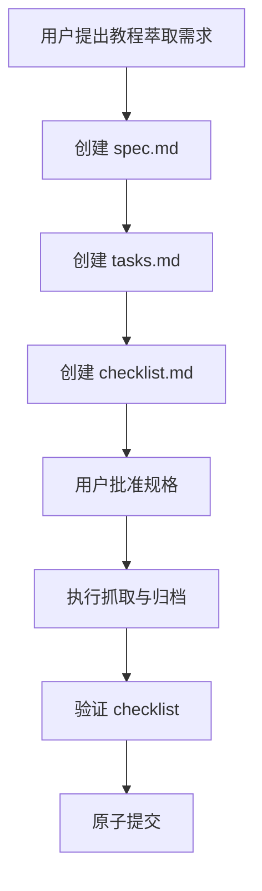
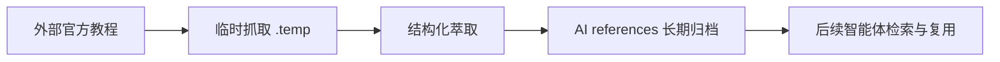
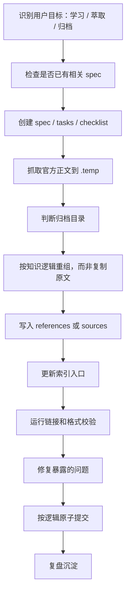

# 任务复盘：DeepAgents Overview 教程萃取与归档

## 1. 任务背景

本次任务目标是仔细学习 LangChain DeepAgents 官方 overview 页面，并将其中教程类知识系统性萃取为项目内可长期查阅、可复用的知识资产。

官方来源：<https://docs.langchain.com/oss/python/deepagents/overview>

任务要求强调：

- 完整准确理解页面内容。
- 提炼核心知识点、操作步骤、关键概念和实践案例。
- 按知识逻辑结构分类整理。
- 存储到项目中合适位置，便于后续查阅和使用。

---

## 2. 最终成果

### 2.1 新增知识资产

```text
apps/chaos/.agents/docs/references/deepagents/overview.md
```

该文档将官方 overview 页面整理为中文教程型参考资料，主要覆盖：

- Deep Agents 的定位。
- 为什么需要 Deep Agents。
- DeepAgents 与普通 agent 的差异。
- 创建 agent 的基本方式。
- planning tool、subagents、filesystem、detailed prompt 四个核心能力。
- 典型适用场景。
- 实践案例与工程启示。
- 与 AgentForge 知识体系的映射关系。

### 2.2 更新索引入口

```text
apps/chaos/.agents/docs/references/README.md
```

在 AI 参考资料索引中补充 DeepAgents 入口，使后续智能体可从 references 导航发现该资料。

### 2.3 规格与验收记录

```text
.trae/specs/extract-deepagents-overview-tutorial/spec.md
.trae/specs/extract-deepagents-overview-tutorial/tasks.md
.trae/specs/extract-deepagents-overview-tutorial/checklist.md
```

本次任务采用 spec-driven 流程：



---

## 3. 执行过程

### 3.1 规格阶段

先检查 `.trae/specs/` 下是否已有匹配任务。已有 Hello-Agents 教程萃取规格，但与本次 DeepAgents overview 页面不匹配，因此创建新规格：

```text
.trae/specs/extract-deepagents-overview-tutorial/
```

规格明确了四类新增要求：

| 要求 | 内容 |
|---|---|
| 页面内容获取 | 获取官方 DeepAgents overview 正文内容 |
| 教程知识结构化萃取 | 提炼概念、步骤、示例和案例 |
| 长期归档位置合规 | 放入合适的 AI 知识库参考目录 |
| 来源与引用合规 | 保留官方来源，不引用临时产物 |

### 3.2 实施阶段

实施时完成了以下动作：

1. 抓取官方页面正文内容。
2. 将临时抓取内容放入 `.temp/`，仅作为中间产物。
3. 判断该内容属于面向 AI 智能体的外部技术参考资料。
4. 归档到：

   ```text
   apps/chaos/.agents/docs/references/deepagents/overview.md
   ```

5. 更新 references 索引。
6. 对照 checklist 逐项验证。

### 3.3 验证阶段

本次验证包含：

```bash
mise run docs-internal-linkcheck
mise run lint
mise run test
```

验证结果：

| 命令 | 结果 | 说明 |
|---|---|---|
| `mise run docs-internal-linkcheck` | 通过 | 修复既有失效链接后，`docs/` 与 `.agents/` 内链全部有效 |
| `mise run lint` | 通过 | lint 自动修复了一批 Markdown 格式问题，复跑通过 |
| `mise run test` | 未通过 | 失败原因是当前依赖安装环境问题，不是本次文档变更导致 |

`mise run test` 的环境问题包括：

- `uv sync` 安装 `accessible-pygments==0.0.5` 时 wheel 元数据缺失。
- Sphinx 环境中缺少 `sphinx_rtd_theme`。

---

## 4. 过程中发现并修复的问题

### 4.1 既有文档内链失败

初次运行 `docs-internal-linkcheck` 时，失败来自仓库既有链接问题，而不是本次 DeepAgents 新增文档。

修复范围包括：

```text
docs/tech/resource-curation-guide.md
docs/topics/rule-lifecycle.md
apps/chaos/.agents/rules/project-independence.md
apps/chaos/.agents/docs/sources/hello-agents/07-building-your-agent-framework.md
apps/chaos/.agents/docs/sources/hello-agents/10-agent-communication-protocols.md
```

问题类型包括：

- 模板代码块中的占位 Markdown 链接被误判为真实链接。
- 指向不存在文档的相对路径。
- 示例中的动态调用语法被链接检查正则误判。

### 4.2 lint 自动格式化带来额外改动

`mise run lint` 首次执行时自动修复了多份 Markdown 文件的格式问题，主要是尾随空白、文件末尾格式等。

这些改动被单独拆为格式化提交，避免与知识萃取和链接修复混在一起。

---

## 5. 原子提交

本次最终拆分为 4 个原子提交：

```bash
e7613ce docs(deepagents): extract overview tutorial knowledge
6ec7539 fix(docs): repair internal linkcheck failures
ddbdda3 style(docs): normalize markdown formatting
ea5a60f docs(memory): capture external knowledge ingestion principle
```

提交拆分逻辑：

| 提交 | 类型 | 原子性说明 |
|---|---|---|
| `docs(deepagents)` | 知识资产新增 | 只承载 DeepAgents 教程萃取、索引与规格记录 |
| `fix(docs)` | 文档修复 | 只承载内链检查失败修复 |
| `style(docs)` | 格式化 | 只承载 lint 自动格式化产生的 Markdown 改动 |
| `docs(memory)` | 经验沉淀 | 只承载外部知识入库原则记忆 |

最终 `git status --short` 为空，说明提交后工作区干净。

---

## 6. 做得好的地方

### 6.1 开放式学习任务被工程化

用户需求本质是“学习并整理一个外部教程页面”。通过 spec、tasks、checklist 三件套，任务被转化为可执行、可验收、可追溯的工程流程。

这避免了两个常见问题：

- 只生成一次性摘要，缺少长期归档价值。
- 没有验收标准，难以判断是否完整准确。

### 6.2 归档位置符合知识生命周期

DeepAgents overview 不是源码实现，也不是面向普通用户的产品文档，而是面向 AI 智能体和开发协作的技术参考资料。

因此归档到：

```text
apps/chaos/.agents/docs/references/deepagents/overview.md
```

这个位置符合其生命周期：



### 6.3 验证暴露了隐藏债务

虽然本次新增文档本身没有造成内链失败，但完整验证暴露了仓库既有失效链接与误报点。

这类问题如果不修复，会导致后续每次文档任务都被同样问题阻塞。顺手修复后，文档校验基线被恢复，后续任务收益更高。

### 6.4 原子提交边界清晰

将知识萃取、内链修复、格式化和经验沉淀拆成不同提交，降低了后续审查、回滚和 cherry-pick 的成本。

---

## 7. 可改进点

### 7.1 实施子任务不应产生未经请求的长期记忆文件

过程中生成了外部知识入库原则记忆文件：

```text
apps/chaos/.agents/docs/superpowers/memories/2026-06-02-external-knowledge-ingestion-principle.md
```

用户随后明确要求保留该文件，因此最终提交是合理的。但从流程上看，长期记忆文件属于额外产物，后续应遵循：

- 如果用户只要求完成具体任务，默认不额外创建经验文档。
- 如果确实需要沉淀经验，应先确认是否归档为长期记忆。
- 临时思考材料优先进入 `.temp/`。

### 7.2 工具触发需要更精确

任务中出现了 AI/LLM 相关内容，因此触发了 LLM 配置检查。但本次只是阅读和整理 DeepAgents 文档，并不需要调用 OpenAI 等模型 API。

后续可改进为：

- 只有要在项目中实现 LLM 调用、配置模型供应商或运行依赖 API key 的功能时，才将 LLM 配置作为阻塞前置。
- 单纯文档阅读与知识萃取不应被 API key 配置阻塞。

### 7.3 自动格式化影响范围需要提前隔离

`lint` 自动格式化会影响与本次任务无直接关系的 Markdown 文件。虽然最终通过原子提交隔离了这些变更，但更理想的流程是：

1. 先运行只检查模式。
2. 判断自动修复范围。
3. 如需自动修复，单独形成 style 提交。

---

## 8. 可复用流程

后续处理“外部教程页面学习与归档”类任务，可复用以下流程：



推荐萃取文档结构：

```text
# 教程 / 技术名

## 来源与定位
## 一句话总结
## 适用场景
## 核心概念
## 操作步骤
## 示例代码解读
## 实践案例
## 常见误区
## 与本项目的映射
## 后续阅读路径
## Search Keywords
## Trigger Phrases
```

---

## 9. 对 AgentForge 的长期价值

本次任务的价值不只是新增一篇 DeepAgents 笔记，而是进一步验证了 AgentForge 的外部知识吸收路径：

```text
外部权威资料
→ 临时抓取
→ 结构化萃取
→ AI 知识库归档
→ 索引接入
→ 校验闭环
→ 原子提交
→ 复盘沉淀
```

这种路径让外部知识从“一次性阅读材料”转化为“项目内部可检索、可复用、可演化的知识资产”。

对于 AgentForge 来说，DeepAgents overview 的归档也补充了深度智能体工程化方向的参考材料，可用于后续理解：

- 复杂任务 agent 的能力拆解。
- planning、subagent、filesystem、prompt 之间的协作关系。
- 如何把外部框架经验映射到 AgentForge 自身的规则、技能和知识库体系。

---

## 10. 总体评价

本次任务完成质量较高，达成了用户提出的“仔细学习、系统性萃取、分类整理、项目归档、便于后续查阅”的目标。

最终成果具备：

- 来源明确。
- 结构清晰。
- 归档合规。
- 索引可达。
- 校验通过。
- 提交原子化。
- 经验可复用。

后续同类任务可直接复用本次流程，并特别注意控制额外长期产物和自动格式化影响范围。
