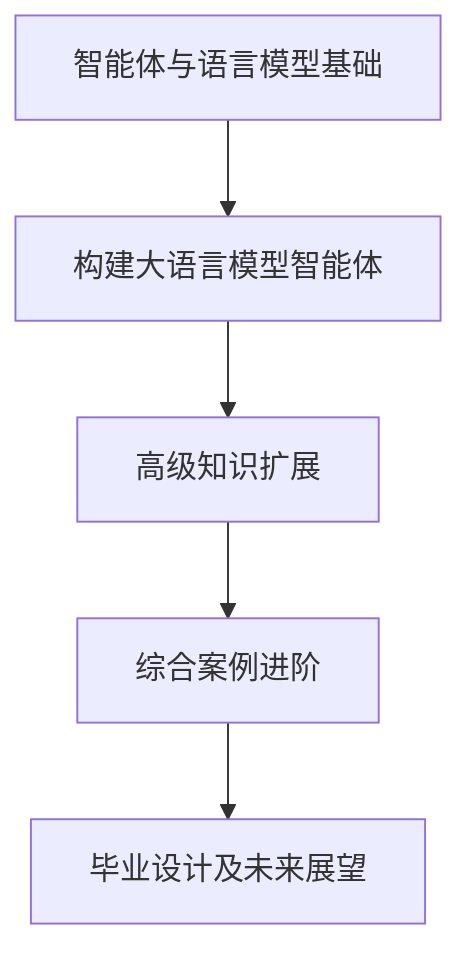
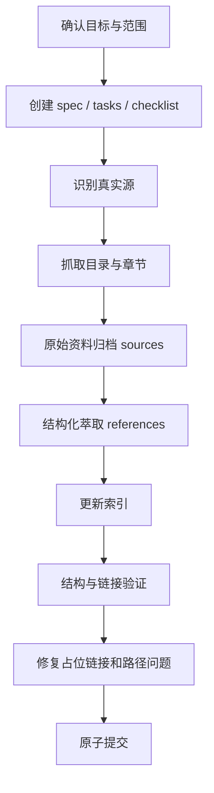

# 任务执行总结：Hello-Agents 教程知识萃取与原子提交

> 报告版本：standard
> 任务窗口：2026-06-02 单次会话
> 报告生成：任务复盘导出
> 触发起点：用户要求系统学习并萃取 Hello-Agents 教程全部内容

---

## 1. 执行概览

| 字段 | 内容 |
|---|---|
| 任务名称 | Hello-Agents 教程知识萃取与归档 |
| 任务类型 | documentation / knowledge-extraction / spec-driven task |
| 外部来源 | <https://hello-agents.datawhale.cc/#/>、<https://github.com/datawhalechina/hello-agents> |
| 主要产出 | Hello-Agents 原始资料归档、结构化萃取页、索引更新、spec 过程文件、原子提交 |
| 归档位置 | `.agents/docs/sources/hello-agents/`、`.agents/docs/references/projects/hello-agents/` |
| 最终提交 | `4b8fc31 docs(agents): extract hello-agents tutorial knowledge` |
| 完成度 | 100% |

### 亮点

- 将开放式“学习网页教程”转化为可执行、可验证的 spec 驱动任务。
- 没有停留在网页摘要，而是形成了面向 AgentForge 的长期知识资产。
- 同时保留原始资料追溯入口与稳定精炼页，便于后续按需读取。
- 验证阶段发现并修复了外部教程原文中的占位链接问题。
- 最终以一个自洽的原子提交收束，未混入无关变更。

### 挑战

- 外部教程入口是网页镜像，但真实源更适合追溯 GitHub 仓库文档。
- 原始教程体量较大，全量归档带来较大的新增行数。
- 原文中的示例链接、占位链接会触发项目链接检查，需要做最小化清洗。

---

## 2. 目标背景

### 2.1 初始目标

用户要求仔细学习 `https://hello-agents.datawhale.cc/#/` 页面全部内容，对教程类知识进行系统性萃取，并提炼：

- 核心知识点
- 操作步骤
- 关键概念
- 实践案例
- 逻辑分类结构
- 后续查阅入口

### 2.2 目标演进

| 阶段 | 目标 | 演进动因 |
|---|---|---|
| Spec 阶段 | 明确抓取、萃取、归档与验证要求 | 用户使用 `/spec` 发起任务，需要先建立实施规格 |
| 实施阶段 1 | 抓取 README 与教程结构 | 先识别入口和章节目录 |
| 实施阶段 2 | 补全前言与第 1-16 章原文 | 用户要求“全部内容”，需要完整覆盖章节 |
| 萃取阶段 | 编写稳定参考页 | 将外部教程转换为 AgentForge 可复用知识 |
| 验证阶段 | 运行结构、链接与 lint 检查 | 确保归档内容满足项目质量门槛 |
| 收束阶段 | 原子提交 | 用户要求“原子提交” |

---

## 3. 交付物清单

### 3.1 Spec 过程文件

- `.trae/specs/extract-hello-agents-tutorial/spec.md`
- `.trae/specs/extract-hello-agents-tutorial/tasks.md`
- `.trae/specs/extract-hello-agents-tutorial/checklist.md`

这组文件记录了需求、任务拆分和验收状态，使任务从开放式探索变成可追踪流程。

### 3.2 原始资料归档

目录：`.agents/docs/sources/hello-agents/`

包含：

- `github-readme.md`
- `00-preface.md`
- `01-introduction-to-agents.md`
- `02-history-of-agents.md`
- `03-fundamentals-of-large-language-models.md`
- `04-classic-agent-paradigms.md`
- `05-low-code-agent-platforms.md`
- `06-framework-development-practice.md`
- `07-building-your-agent-framework.md`
- `08-memory-and-retrieval.md`
- `09-context-engineering.md`
- `10-agent-communication-protocols.md`
- `11-agentic-rl.md`
- `12-agent-performance-evaluation.md`
- `13-intelligent-travel-assistant.md`
- `14-automated-deep-research-agent.md`
- `15-building-cyber-town.md`
- `16-graduation-project.md`
- `chapters-manifest.json`

### 3.3 稳定萃取页

- `.agents/docs/references/projects/hello-agents/index.md`

核心结构包括：

- 定位
- 学习路径
- 课程结构萃取
- 已抓取章节索引
- 核心概念萃取
- 从零构建 Agent 的步骤模型
- 智能体范式萃取
- 上下文工程萃取
- 通信协议萃取
- 评估体系萃取
- 案例萃取
- 与 AgentForge Spec v0.2 的映射
- AgentForge 使用建议
- Search Keywords
- Trigger Phrases

### 3.4 索引更新

- `.agents/docs/references/projects/index.md`
- `.agents/docs/references/README.md`
- `.agents/docs/sources/README.md`

---

## 4. 知识萃取结果

### 4.1 Hello-Agents 的核心定位

Hello-Agents 是 Datawhale 社区的系统性智能体学习教程，目标是帮助学习者从大语言模型使用者转变为智能体系统构建者。

教程区分两类 Agent 构建路线：

| 路线 | 代表 | 核心特征 |
|---|---|---|
| 软件工程类 Agent | Dify、Coze、n8n | 流程驱动的软件开发，LLM 作为数据处理后端 |
| AI Native Agent | 自研 Agent 框架、多智能体应用 | 以 AI 推理、工具调用、记忆、协议和评估为中心构建 |

### 4.2 课程学习路径



### 4.3 可迁移到 AgentForge 的核心知识

| 主题 | 萃取内容 | AgentForge 可用方向 |
|---|---|---|
| Agent 定义 | 感知、决策、行动、反馈循环 | 明确运行时实体边界 |
| Agent Loop | 观察、思考、行动、反馈 | 任务执行器与工具调用闭环 |
| Tool System | 外部能力统一封装 | 工具注册、工具说明、错误恢复 |
| Memory / RAG | 外部知识和历史状态按需召回 | 长期记忆、知识库、检索回流 |
| Context Engineering | 工程化管理上下文输入 | 上下文节省、路由、压缩摘要 |
| Communication Protocol | MCP、A2A、ANP | Team/Role/Agent 协作协议参考 |
| Evaluation System | 基准、指标、LLM Judge | 任务验证和智能体评估闭环 |
| Multi-Agent Application | 多角色协作与仿真 | 世界运行时、角色编排、场景卡 |

### 4.4 实践案例

| 案例 | 能力组合 | 可复用模式 |
|---|---|---|
| 智能旅行助手 | 偏好理解、工具查询、行程规划 | 个性化规划 Agent |
| 自动化深度研究智能体 | 问题拆解、资料检索、证据整理、报告生成 | Research → Evidence → Report |
| 赛博小镇 | 多角色设定、互动规则、状态演化 | Multi-Agent Simulation |
| 毕业设计 | 工具、记忆、协议、评估综合应用 | 端到端多智能体应用交付 |

---

## 5. 验证与质量控制

### 5.1 已执行验证

在 `apps/chaos` 下执行并通过：

```bash
uv run ruff check .
mise run docs-structure-check
uv run python .agents/scripts/check_doc_links.py --root . --files .agents/docs/references/projects/hello-agents/index.md .agents/docs/sources/hello-agents/16-graduation-project.md --dirs
```

### 5.2 发现的问题

验证过程中发现 Hello-Agents 原始章节中存在无效或占位性质的 Markdown 链接，例如：

- 示例用户名链接
- 百度网盘占位链接
- Google Drive 占位链接
- Demo Video 占位链接
- GitHub 示例仓库地址

这些内容如果直接进入项目长期归档，会被链接检查识别为失效链接。

### 5.3 修复策略

采用最小化清洗：

- 保留教程语义。
- 将无效 Markdown 链接改为普通文本占位说明。
- 不改动无关文件。
- 重新运行目标链接检查。

---

## 6. 原子提交

最终提交：

```bash
4b8fc31 docs(agents): extract hello-agents tutorial knowledge
```

提交类型判断：

| 维度 | 判断 |
|---|---|
| type | `docs` |
| scope | `agents` |
| 原子性 | 单一逻辑变更：新增 Hello-Agents 教程知识资产 |
| 是否包含无关改动 | 否 |
| 工作区状态 | 提交后无未提交变更 |

---

## 7. 做得好的地方

### 7.1 任务工程化

开放式学习任务被转换为 spec、tasks、checklist 三件套，使任务具备明确边界和验收标准。

### 7.2 知识分层清晰

```text
.agents/docs/sources/hello-agents/              原始资料与追溯
.agents/docs/references/projects/hello-agents/  稳定萃取与复用入口
```

这种分层降低了后续智能体检索成本：默认先读精炼页，必要时再追溯原文。

### 7.3 萃取质量高于摘要

输出内容不是网页搬运，而是重新组织为：

- 概念表
- 步骤模型
- 范式表
- 协议映射
- 评估闭环
- 案例模式
- AgentForge 使用建议

### 7.4 验证闭环有效

链接检查发现了原文占位链接问题，避免后续文档校验反复失败。

---

## 8. 可改进点

### 8.1 初始抓取应直接追溯真实源

首次实现偏向抓取入口页和 README，后续才补全章节。类似任务中，如果网页是 GitHub Pages 镜像，应优先识别 GitHub 仓库作为真实源。

### 8.2 外部 Markdown 归档应增加清洗清单

建议后续形成固定清洗步骤：

- 检查占位链接。
- 检查本地绝对路径。
- 检查示例 URL。
- 检查无效 Markdown 链接。
- 检查是否包含个人用户名路径。

### 8.3 大体量原文归档需提前评估

本次因用户要求“全部内容”“完整准确”，全量归档合理。但后续类似任务可以根据需求选择：

- 只归档 manifest + 精炼页。
- 归档章节摘要。
- 归档完整原文。
- 只保留官方永久链接。

---

## 9. 可复用流程

后续处理外部教程知识萃取任务时，可复用以下流程：



推荐萃取文档结构：

```text
# 项目名

## 定位
## 学习路径
## 课程结构
## 已抓取章节索引
## 核心概念萃取
## 操作 / 构建步骤
## 关键范式
## 实践案例
## 与本项目的映射
## 使用建议
## Search Keywords
## Trigger Phrases
```

---

## 10. 总体评价

本任务完成质量较高。最终成果完成了从外部教程到项目知识系统的转换：

```text
外部教程内容
→ 原始资料归档
→ 结构化知识萃取
→ 项目索引接入
→ 验证通过
→ 原子提交
```

该任务的长期价值在于：Hello-Agents 不再只是一个外部链接，而成为 AgentForge 内部可检索、可追溯、可复用的智能体教程知识资产。
