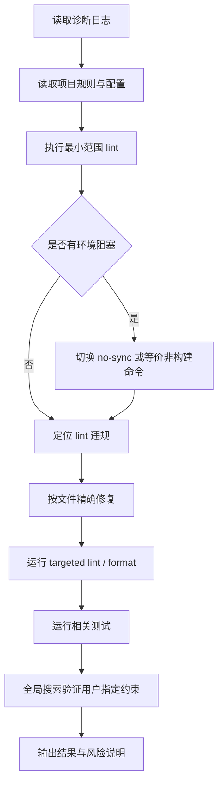
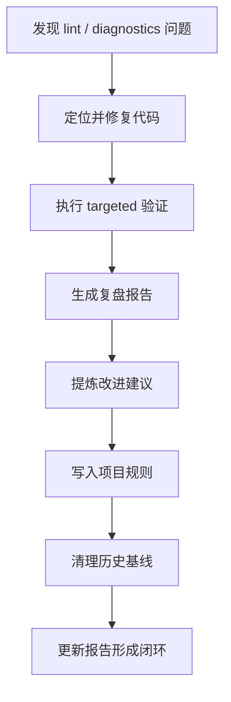

# AgentForge / apps-chaos lint 修复与 Python 3.13+ 适配复盘报告

## 1. 执行概览

### 1.1 任务名称

`apps/chaos` lint 诊断修复、FlowKit 相关代码规范化，以及 `podman_win.py` Python 3.13+ 适配。

### 1.2 任务目标

本次任务围绕 `d:\spaces\AgentForge\.temp\error.log` 中 `#problems_and_diagnostics` 报告的问题展开，目标包括：

1. 精准定位 lint / diagnostics 指向的项目代码行。
2. 分析 lint 错误触发原因。
3. 编写符合项目规范的修复代码。
4. 重新执行 lint / format / test 验证。
5. 确保修复不引入新的语法错误、逻辑问题或 lint 违规。
6. 根据用户后续反馈，将 `podman_win.py` 文档运行环境调整为 Python 3.13+。
7. 全项目移除 `from __future__ import annotations`，匹配 Python 3.13+ 项目要求。

### 1.3 最终结果

任务已完成。主要成果如下：

- 修复了 `apps/chaos` 中与 FlowKit 相关的 Ruff lint 问题。
- 修复了上下文管理器缺失类型注解问题。
- 修复了测试文件中未使用变量问题。
- 修复了列表拼接风格、导入排序、空白行格式、未使用 `noqa` 等问题。
- 将 `podman_win.py` 运行环境说明从 Python 3.10+ 更新为 Python 3.13+。
- 全量移除了 `apps/chaos` 下 Python 文件中的 `from __future__ import annotations`。
- 对关键变更执行了 lint、format 和测试验证。

### 1.4 验证结论

已完成的关键验证：

```powershell
uv run --no-sync ruff check src/taolib/flowkit/podman_win.py
uv run --no-sync ruff format --check src/taolib/flowkit/podman_win.py
```

结果：

```text
All checks passed!
1 file already formatted
```

全局搜索验证：

```regex
^from __future__ import annotations$
```

结果：

```text
No matches found
```

测试验证：

```powershell
uv run --no-sync pytest tests/flowkit/test_flowkit.py
```

结果：

```text
20 passed in 0.84s
```

---

## 2. 目标背景

### 2.1 初始背景

用户要求针对 `d:\spaces\AgentForge\.temp\error.log` 中 `#problems_and_diagnostics` 报告的问题进行修复。该日志反映 `apps/chaos` 项目中存在 Ruff lint、格式化和 Python 版本目标相关问题。

### 2.2 项目约束

本次工作遵循以下约束：

- 工作目录：`d:\spaces\AgentForge\apps\chaos`
- Python 项目命令优先使用 `uv`
- 遵循项目内 `AGENTS.md` 与 `.agents/rules/python.md` 规则
- 尽量只修改与 diagnostics 和用户明确反馈相关的文件
- 不主动格式化或重构无关文件
- 不提交 Git commit，除非用户明确要求

### 2.3 后续需求调整

初始 lint 修复完成后，用户提出两项追加要求：

1. 将 `podman_win.py` 中运行环境说明改为 Python 3.13+。
2. 移除 `from __future__ import annotations`。

随后用户进一步明确：

> `from __future__ import annotations 要全部移除，以匹配python3.13+`

因此任务范围从单文件修复扩展为：确保 `apps/chaos` 下 Python 文件中不再存在该 future import。

---

## 3. 执行过程

### 3.1 阶段一：读取诊断来源与项目规则

首先检查了：

- `d:\spaces\AgentForge\.temp\error.log`
- `d:\spaces\AgentForge\AGENTS.md`
- `d:\spaces\AgentForge\apps\chaos\AGENTS.md`
- `d:\spaces\AgentForge\apps\chaos\.agents\rules\python.md`
- `d:\spaces\AgentForge\apps\chaos\pyproject.toml`
- `d:\spaces\AgentForge\apps\chaos\mise.toml`

目的：确认 diagnostics 来源、项目命令规范、Python / Ruff 配置和目标版本。

### 3.2 阶段二：首次执行 lint 并处理环境阻塞

初次执行：

```powershell
uv run ruff check .
```

遇到构建同步阻塞：

```text
PermissionError: [WinError 32] 另一个程序正在使用此文件，进程无法访问。:
'D:\spaces\AgentForge\apps\chaos\.pdm-build'
```

判断原因：`uv run` 触发了包同步 / 构建，而 `.pdm-build` 被其他进程占用。

处理方式：改用不触发同步构建的命令：

```powershell
uv run --no-sync ruff check .
```

该方式成功进入 Ruff 检查阶段。

### 3.3 阶段三：修复 Ruff 报告问题

针对 lint 输出逐项修复：

- 缺失返回类型注解
- 上下文管理器退出参数缺失类型注解
- 未使用变量
- 可变类属性缺失 `ClassVar`
- 列表拼接风格问题
- import 排序问题
- 空白行包含尾随空格
- 未使用 `noqa` 指令

### 3.4 阶段四：针对变更文件执行格式化

由于全局 `ruff format --check .` 会报告部分无关文件格式问题，因此没有扩大修改范围，而是只对本次相关文件执行针对性格式化。

重点处理了：

- FlowKit 相关源码文件
- FlowKit 测试文件
- 用户明确要求的 `podman_win.py`

### 3.5 阶段五：执行测试验证

针对 FlowKit 测试执行：

```powershell
uv run --no-sync pytest tests/flowkit/test_flowkit.py
```

结果：

```text
20 passed in 0.84s
```

### 3.6 阶段六：处理 Python 3.13+ 追加反馈

用户指出：

- `podman_win.py` 运行环境应改为 Python 3.13+。
- `from __future__ import annotations` 应去除。

修复内容：

- 将文档说明更新为：

```python
运行环境: Windows + Python 3.13+ + podman>=5.8.0 + OpenSSH
```

- 移除：

```python
from __future__ import annotations
```

### 3.7 阶段七：全量移除 future annotations

用户进一步要求全部移除后，执行全局搜索验证：

```regex
^from __future__ import annotations$
```

最终确认：

```text
No matches found
```

---

## 4. 关键修改清单

### 4.1 `podman_win.py`

文件：`d:\spaces\AgentForge\apps\chaos\src\taolib\flowkit\podman_win.py`

主要修改：

1. 运行环境说明从 Python 3.10+ 改为 Python 3.13+。
2. 移除 `from __future__ import annotations`。
3. 调整 `SSHTunnel._instances` 类型注解，避免在移除 future annotations 后出现类体内前向引用问题。

最终关键片段：

```python
import atexit
import json
import socket
import subprocess
import time
from typing import Any, ClassVar
```

```python
class SSHTunnel:
    """通过 SSH 建立 TCP → podman socket 的隧道."""

    _instances: ClassVar[list[Any]] = []
```

### 4.2 `podman_context.py`

文件：`d:\spaces\AgentForge\apps\chaos\src\taolib\flowkit\podman_context.py`

主要修改：

- 引入 `TracebackType`
- 为 `__exit__` 和 `__aexit__` 添加完整类型注解

修复后签名：

```python
def __exit__(
    self,
    exc_type: type[BaseException] | None,
    exc_val: BaseException | None,
    exc_tb: TracebackType | None,
) -> bool:
```

```python
async def __aexit__(
    self,
    exc_type: type[BaseException] | None,
    exc_val: BaseException | None,
    exc_tb: TracebackType | None,
) -> bool:
```

### 4.3 `container.py`

文件：`d:\spaces\AgentForge\apps\chaos\src\taolib\flowkit\container.py`

主要修改：

- 将列表拼接改为 unpacking 风格。
- 删除未使用变量 `now`。

修复方向：

```python
args = [
    "run",
    "-d",
    "--name",
    name,
    "-w",
    self.config.workdir,
    *self._volume_args(),
    *self._env_args(),
    self.config.image,
    "sleep",
    "infinity",
]
```

### 4.4 `build_workflow.py`

文件：`d:\spaces\AgentForge\apps\chaos\examples\flowkit\build_workflow.py`

主要修改：

- 为示例函数补充返回类型注解：

```python
def example_build_workflow() -> bool:
def example_container_config() -> None:
def example_nuitka_configs() -> None:
```

### 4.5 `test_flowkit.py`

文件：`d:\spaces\AgentForge\apps\chaos\tests\flowkit\test_flowkit.py`

主要修改：

- 将未使用变量改为下划线前缀，满足 Ruff 对 unused unpacked variable 的要求：

```python
success, _message = verify_checksum_file(checksum_path)
success, _errors = ArtifactManifest.verify(manifest_path)
```

### 4.6 `__init__.py`、`artifacts.py`、`models.py`

相关文件：

- `d:\spaces\AgentForge\apps\chaos\src\taolib\flowkit\__init__.py`
- `d:\spaces\AgentForge\apps\chaos\src\taolib\flowkit\artifacts.py`
- `d:\spaces\AgentForge\apps\chaos\src\taolib\flowkit\models.py`

主要处理：

- import 排序
- 删除无效 `noqa`
- 清理空白行尾随空格
- 执行 Ruff 格式化

---

## 5. 关键决策复盘

### 5.1 使用 `uv run --no-sync`

#### 问题

直接运行 `uv run ruff check .` 时触发 `.pdm-build` 文件锁错误。

#### 决策

改用：

```powershell
uv run --no-sync ruff check .
```

#### 原因

该命令可以跳过包同步 / 构建流程，直接使用当前环境运行 Ruff，避免 `.pdm-build` 锁冲突。

#### 结果

成功继续 lint 修复流程。

### 5.2 不全量格式化无关文件

#### 问题

全局格式检查发现部分 `.agents/scripts` 和其他测试文件存在历史格式问题。

#### 决策

只格式化与本次 diagnostics 和实际修改相关的文件。

#### 原因

用户目标是修复当前 diagnostics，不应扩大修改范围，避免引入无关 diff。

#### 结果

保持变更聚焦，降低回归风险。

### 5.3 移除 future annotations 后使用 `ClassVar[list[Any]]`

#### 问题

`SSHTunnel` 类内部定义：

```python
_instances: ClassVar[list[SSHTunnel]] = []
```

在没有 `from __future__ import annotations` 的情况下，类体内无法直接引用尚未完成定义的 `SSHTunnel`。

尝试使用字符串前向引用：

```python
_instances: ClassVar[list["SSHTunnel"]] = []
```

但 Ruff 在 Python 3.13+ 目标下报告 `UP037`，要求移除引号。

#### 决策

改为：

```python
_instances: ClassVar[list[Any]] = []
```

#### 原因

- 避免类体内前向引用运行时求值问题。
- 满足 Ruff 规则。
- `_instances` 是内部清理注册表，实际只存放 `SSHTunnel` 实例，运行逻辑不受影响。

#### 结果

`podman_win.py` 单文件 lint 与 format 均通过。

---

## 6. 问题与解决过程

### 6.1 `.pdm-build` 文件锁

#### 表现

```text
PermissionError: [WinError 32]
```

#### 根因

`uv run` 触发构建同步，构建目录被其他进程占用。

#### 解决

使用 `--no-sync` 跳过同步。

#### 经验

在仅运行 lint / test 且无需重新解析依赖时，`uv run --no-sync` 是更稳妥的验证方式。

### 6.2 Ruff 格式检查涉及无关文件

#### 表现

全局 `ruff format --check .` 报告多个无关文件需要格式化。

#### 根因

项目中存在历史格式漂移，不完全由本次修改导致。

#### 解决

只对本次相关文件执行 targeted format。

#### 经验

修复类任务应避免扩大变更范围；全局检查可以用于发现问题，但实际修改应与用户请求保持一致。

### 6.3 移除 future annotations 与类型注解冲突

#### 表现

移除 future import 后，类体内自引用类型注解需要重新处理。

#### 根因

没有 postponed annotations 后，注解会在定义时求值；类名此时尚不可用。

#### 解决

将 `_instances` 注解调整为 `ClassVar[list[Any]]`。

#### 经验

Python 3.13+ 并不意味着所有前向引用都可以无条件裸写；需要结合实际求值时机和 lint 规则处理。

### 6.4 并行读写导致观察结果不一致

#### 表现

一次读取结果仍显示 `from __future__ import annotations`，但编辑操作已报告移除。

#### 根因

读写时序导致观察结果暂时不一致。

#### 解决

重新顺序读取、精确替换，并用全局 grep 最终确认。

#### 经验

涉及“全量移除”类要求时，最终应以搜索验证结果为准，而不是单次读取结果。

---

## 7. 验证记录

### 7.1 Ruff lint 验证

关键文件验证：

```powershell
uv run --no-sync ruff check src/taolib/flowkit/podman_win.py
```

结果：

```text
All checks passed!
```

### 7.2 Ruff format 验证

```powershell
uv run --no-sync ruff format --check src/taolib/flowkit/podman_win.py
```

结果：

```text
1 file already formatted
```

### 7.3 单元测试验证

```powershell
uv run --no-sync pytest tests/flowkit/test_flowkit.py
```

结果：

```text
20 passed in 0.84s
```

### 7.4 全局 future import 搜索验证

搜索目标：

```regex
^from __future__ import annotations$
```

范围：

```text
d:\spaces\AgentForge\apps\chaos/**/*.py
```

结果：

```text
No matches found
```

---

## 8. 影响范围分析

### 8.1 直接影响文件

本次涉及的主要文件：

- `apps/chaos/src/taolib/flowkit/podman_win.py`
- `apps/chaos/src/taolib/flowkit/podman_context.py`
- `apps/chaos/src/taolib/flowkit/container.py`
- `apps/chaos/src/taolib/flowkit/__init__.py`
- `apps/chaos/src/taolib/flowkit/artifacts.py`
- `apps/chaos/src/taolib/flowkit/models.py`
- `apps/chaos/examples/flowkit/build_workflow.py`
- `apps/chaos/tests/flowkit/test_flowkit.py`

### 8.2 运行逻辑影响

整体运行逻辑影响较低：

- 多数修改是类型注解、格式化、lint 风格修复。
- `container.py` 的 list 构造方式等价替换。
- 测试文件变量改名不改变断言逻辑。
- `podman_win.py` 的 `_instances` 注解变更不影响运行时列表行为。

### 8.3 风险点

主要风险点：

1. `_instances: ClassVar[list[Any]]` 类型精度低于 `list[SSHTunnel]`。
2. 全局 `ruff format --check .` 仍可能报告无关历史文件格式问题。
3. 如果项目未来要求严格类型检查，`Any` 可能需要更精细的替代方案。

---

## 9. 经验总结

### 9.1 成功实践

1. **先读规则再改代码**
   - 通过读取 `AGENTS.md`、Python 规则和 `pyproject.toml`，避免使用错误命令或不符合项目规范的修复方式。

2. **遇到环境锁冲突时快速切换验证方式**
   - `uv run --no-sync` 避免了 `.pdm-build` 锁阻塞。

3. **控制修改范围**
   - 没有格式化无关历史文件，降低了 diff 噪声。

4. **针对用户反馈进行全局验证**
   - 用户要求“全部移除”后，使用全局搜索确认没有遗漏。

5. **lint 与测试结合验证**
   - Ruff 解决静态规范问题，pytest 验证关键业务路径没有破坏。

### 9.2 可复用方法论

类似任务可采用以下流程：



---

## 10. 改进建议与后续行动

### 10.1 已完成 P0：记录项目标准验证命令

已在 `apps/chaos/.agents/rules/python.md` 中补充标准验证命令：

```powershell
uv run --no-sync ruff check .
uv run --no-sync ruff format --check .
uv run --no-sync pytest tests/flowkit/test_flowkit.py
```

落地价值：减少后续任务中反复探索验证命令的成本，并统一 Python 相关修改后的验证入口。

### 10.2 已完成 P1：统一处理历史格式问题

已单独执行“格式化基线清理”，只格式化以下历史格式漂移文件，未混入功能修复：

- `.agents/scripts/check_env.py`
- `.agents/scripts/check_py_syntax.py`
- `.agents/scripts/validate_roles.py`
- `tests/test_validate_roles.py`

执行命令：

```powershell
uv run --no-sync ruff format .agents/scripts/check_env.py .agents/scripts/check_py_syntax.py .agents/scripts/validate_roles.py tests/test_validate_roles.py
```

验证命令与结果：

```powershell
uv run --no-sync ruff format --check .agents/scripts/check_env.py .agents/scripts/check_py_syntax.py .agents/scripts/validate_roles.py tests/test_validate_roles.py
uv run --no-sync ruff check .agents/scripts/check_env.py .agents/scripts/check_py_syntax.py .agents/scripts/validate_roles.py tests/test_validate_roles.py
```

```text
4 files already formatted
All checks passed!
```

### 10.3 已完成 P1：明确 Python 3.13+ 注解策略

已在 `apps/chaos/.agents/rules/python.md` 中补充 Python 3.13+ 注解策略：

- 项目代码不使用 `from __future__ import annotations`。
- 默认不使用字符串形式的类型注解；如 Ruff 可提供自动修复，应遵循 Ruff 的注解现代化建议。
- 类体内避免直接使用尚未完成定义的类名进行自引用注解。
- 返回当前实例类型时优先使用 `typing.Self`。
- 仅在类型无法稳定表达、外部库类型不可用，或为避免运行时前向引用求值问题时使用 `Any`；使用范围应尽量收敛到内部实现细节。

### 10.4 已完成 P2：增加 targeted check 分层指引

已在 `apps/chaos/.agents/rules/python.md` 中补充 targeted check 分层指引，区分以下验证粒度：

- 全量检查命令
- 单包 / 单目录检查命令
- 单文件检查命令
- 跳过同步 / 构建的快速测试命令

新增示例：

```powershell
# 全量检查
uv run --no-sync ruff check .
uv run --no-sync ruff format --check .

# 单包 / 单目录检查
uv run --no-sync ruff check src/taolib/flowkit tests/flowkit
uv run --no-sync ruff format --check src/taolib/flowkit tests/flowkit

# 单文件检查
uv run --no-sync ruff check src/taolib/flowkit/podman_win.py
uv run --no-sync ruff format --check src/taolib/flowkit/podman_win.py

# 跳过同步 / 构建的快速测试
uv run --no-sync pytest tests/flowkit/test_flowkit.py
```

执行原则：优先选择全量检查；当全量检查受本地文件锁、构建缓存或无关历史问题阻塞时，降级到单包、单目录或单文件检查，并在结果中明确说明降级原因。

---

## 11. 二次执行复盘

### 11.1 二次执行背景

在初始 lint 修复、Python 3.13+ 适配和原子提交完成后，继续根据本报告第 10 章建议执行了治理类后续行动。该阶段的重点不再是单点 bug 修复，而是将本次任务中暴露出的流程经验沉淀为项目规则，并清理已知历史格式漂移。

### 11.2 二次执行范围

本阶段执行内容包括：

1. 将标准验证命令写入 `apps/chaos/.agents/rules/python.md`。
2. 单独清理 4 个历史格式漂移文件。
3. 明确 Python 3.13+ 注解策略。
4. 增加 targeted check 分层指引。
5. 同步更新本复盘报告，使报告从“建议清单”升级为“执行闭环记录”。

### 11.3 二次执行涉及文件

当前二次执行阶段涉及以下文件：

- `apps/chaos/.agents/rules/python.md`
- `apps/chaos/.agents/scripts/check_env.py`
- `apps/chaos/.agents/scripts/check_py_syntax.py`
- `apps/chaos/.agents/scripts/validate_roles.py`
- `apps/chaos/tests/test_validate_roles.py`
- `.temp/task-summary-lint-python313-20260609.md`

其中，`python.md` 承载规则沉淀；4 个 Python 文件承载格式基线清理；本报告承载复盘同步。

### 11.4 二次执行验证

针对历史格式清理文件已完成 targeted 验证：

```powershell
uv run --no-sync ruff format --check .agents/scripts/check_env.py .agents/scripts/check_py_syntax.py .agents/scripts/validate_roles.py tests/test_validate_roles.py
uv run --no-sync ruff check .agents/scripts/check_env.py .agents/scripts/check_py_syntax.py .agents/scripts/validate_roles.py tests/test_validate_roles.py
```

结果：

```text
4 files already formatted
All checks passed!
```

### 11.5 二次执行状态

二次执行阶段中可追踪的治理改动已按语义拆分为原子提交：

- `6d313bf docs(python): document validation and annotation rules`
  - 提交内容：Python 标准验证命令、Python 3.13+ 注解策略、targeted check 分层指引。
- `cf9e82b style(python): format validation scripts and tests`
  - 提交内容：4 个历史格式漂移文件的 Ruff 格式化基线清理。

本报告已允许从 `.temp` 归档到项目文档体系，归档路径为：

```text
apps/chaos/.agents/docs/superpowers/retrospectives/task-summary-lint-python313-20260609.md
```

该归档使“规则沉淀、格式基线清理、报告同步”形成可追踪闭环。

---

## 12. 洞察报告

### 12.1 核心洞察一：lint 修复不是单纯“消红”，而是项目约束显性化

本次任务表面上是修复 Ruff diagnostics，但实际暴露的是项目约束未完全显性化的问题：

- Python 3.13+ 的版本策略已有事实要求，但注解策略尚未文档化。
- `uv run --no-sync` 是解决本地构建锁阻塞的有效路径，但原先没有固化为规则。
- targeted check 是大型仓库中必要的验证降级方式，但原先缺少统一口径。

因此，真正的治理价值不只是让 lint 通过，而是把“这次靠经验解决的问题”转化为“下次可直接遵循的规则”。

### 12.2 核心洞察二：Python 3.13+ 适配的关键风险在注解求值时机

移除 `from __future__ import annotations` 后，类型注解会更直接地暴露运行时求值问题。典型风险包括：

- 类体内自引用尚未定义完成的类名。
- 为规避前向引用使用字符串注解，但又与 Ruff 的现代化规则冲突。
- 为通过 lint 使用 `Any`，但牺牲类型精度。

因此，Python 3.13+ 适配不应只检查语法是否通过，还应明确注解策略：何时使用 `Self`、何时避免自引用、何时允许 `Any`。

### 12.3 核心洞察三：全量验证与 targeted 验证需要分层，而不是互相替代

全量验证适合作为最终质量门禁，但在存在历史问题、构建缓存或本地文件锁时，强行要求全量通过可能阻塞当前任务。targeted check 的价值在于：

- 快速验证本次变更直接影响范围。
- 将历史遗留问题与当前任务风险隔离。
- 让修复过程保持小步、可解释、可回滚。

最佳策略不是“只跑全量”或“只跑 targeted”，而是：优先全量；全量阻塞时说明原因并降级 targeted；必要时再单独发起基线清理任务。

### 12.4 核心洞察四：复盘报告应从记录结果升级为驱动改进

本报告第 10 章最初是改进建议，随后被逐项执行并同步为完成状态。这说明复盘报告不应只是任务结束后的静态文档，而可以成为后续治理工作的行动清单。

有效复盘应具备三层价值：

1. **事实记录**：做了什么、改了哪里、如何验证。
2. **经验沉淀**：为什么这样做、遇到什么模式化问题。
3. **行动闭环**：哪些建议已执行、哪些风险仍需跟踪。

### 12.5 风险洞察

当前仍需关注以下风险：

- `ClassVar[list[Any]]` 解决了 lint 与运行时求值冲突，但类型精度较弱，未来若引入严格类型检查，应重新评估。
- `python.md` 中的验证命令以 FlowKit 测试为示例，若后续 Python 子模块增多，需要补充更多包级测试入口。
- 二次执行改动尚未提交，若长时间滞留工作区，可能与后续任务混合造成提交边界不清。
- `.temp` 下报告通常不一定纳入版本管理，需要确认该报告是否仅作为本地交付物，还是需要归档到项目文档体系。

### 12.6 管理洞察

本次任务展示了一个从“问题修复”到“规则建设”的正向循环：



该循环的关键不是一次性解决所有问题，而是确保每次问题处理都能留下可复用的规则、命令和判断标准。

---

## 13. 最新最终结论

本次任务已从初始 lint 修复扩展为一次完整的 Python 3.13+ 适配与项目规则治理闭环：

- `podman_win.py` 已匹配 Python 3.13+ 文档要求。
- `from __future__ import annotations` 已从 `apps/chaos` Python 文件中全部移除。
- FlowKit 相关源码与测试已通过 targeted lint / format / pytest 验证。
- 已完成一次 FlowKit 修复原子提交：`4d26383 fix(flowkit): resolve ruff diagnostics for Python 3.13`。
- 已将标准验证命令、Python 3.13+ 注解策略、targeted check 分层指引写入 `apps/chaos/.agents/rules/python.md`。
- 已单独清理 4 个历史格式漂移文件，并通过 targeted format / lint 验证。
- 本报告已同步更新为包含执行闭环与洞察报告的版本。
- 二次执行阶段的规则沉淀与格式基线清理已完成原子提交。
- 本报告已归档到项目文档体系，便于后续查阅与复用。

后续建议：如需将更多 `.temp` 交付物长期保留，应优先迁移到项目已有文档目录，再通过 Git 纳入版本管理。