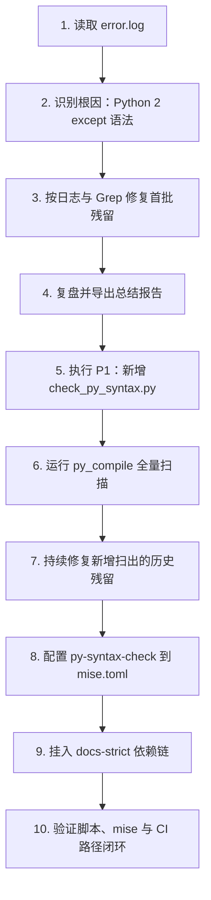

# 任务执行总结报告：Python 2 异常语法修复、Ruff 策略澄清与 CI 语法门禁落地

**报告编号**: `task-summary-py2-syntax-fix-20260609-v4`  
**任务名称**: Python 2 异常语法修复、Ruff `UP024` 状态核验与 P1 CI 语法检查落地  
**执行日期**: 2026-06-09  
**详细程度**: 标准版 (standard)  

---

## 1. 执行概览

| 维度 | 内容 |
|------|------|
| **任务来源** | 用户提供日志文件 `.temp/error.log`，要求排查 GitHub Actions CI 失败、复盘并落实后续改进行动 |
| **直接根因** | 多个 Python 文件残留 Python 2 风格 `except A, B:` 语法，在 Python 3.13 下触发 `SyntaxError: multiple exception types must be parenthesized` |
| **治理问题** | 首轮修复偏向按日志命中点补漏，缺少全仓语法级验收；同时一度将 `UP024` 误判为“未启用”，实际是已被 `"UP"` 规则组选中 |
| **最终处置** | 全量修复历史残留、核验 Ruff 策略、补充 Python 语法预编译脚本，并将其接入 `docs-strict` CI 入口 |
| **验证方式** | CI 日志分析 + Grep 扫描 + `py_compile` 全量检查 + `mise run py-syntax-check` 验证 + 诊断检查 |
| **最终状态** | ✅ 历史残留已清零；✅ `UP024` 状态已澄清；✅ P1 已落地到 `mise`/CI 路径；✅ `714/714` Python 文件语法通过 |

**关键数据**：

| 指标 | 数值 |
|------|------|
| 修复语法残留文件数 | 18 |
| 新增自动化检查脚本 | 1 |
| 调整任务配置文件数 | 1 |
| 全量语法检查通过数 | 714/714 |
| 主要验证命令 | `python .agents/scripts/check_py_syntax.py`、`mise run py-syntax-check` |
| 结果闭环 | 根因修复 + 复盘导出 + P1 落地 |

**亮点**：
- 从单个 CI 报错扩展为全仓历史残留清理，避免只修表层症状
- 新增语法预编译脚本，补上 Grep 与常规 lint 之间的校验空档
- 通过 `docs-strict` 依赖链接入，复用现有 CI 入口而不引入重复步骤

**挑战**：
- 同一文件中存在多个同类残留，容易在首轮补丁中漏改
- 规则组式配置容易造成“规则未启用”和“规则已启用但不自动修复”的认知混淆

---

## 2. 目标背景

### 初始目标
分析 `.temp/error.log` 中的 CI 构建失败原因并修复。

### 中途扩展目标
- 对已完成的故障修复进行复盘并导出报告
- 根据复盘报告执行 P1：在 CI 路径中增加 Python 语法检查步骤

### CI 失败上下文
- **仓库**: `xinetzone/tao`
- **运行环境**: Ubuntu 24.04, Python 3.13.13
- **失败表现**: 多处脚本在导入阶段即因 Python 2 多异常捕获语法报 `SyntaxError`
- **当前 CI 入口**: `apps/chaos` 下 `mise run docs-strict`

### 最终成果
- 修复 18 个文件中的 Python 2 多异常捕获残留
- 澄清 Ruff `UP024` 已被 `"UP"` 规则组选中，问题不在“未启用”
- 新增 `check_py_syntax.py` 作为语法级预编译检查脚本
- 在 `mise.toml` 中新增 `py-syntax-check` 并挂入 `docs-strict` 依赖链
- 验证默认脚本入口、`mise` 任务入口和 CI 入口均可覆盖该检查

---

## 3. 执行过程



| 阶段 | 动作 | 产出 |
|------|------|------|
| **诊断** | 读取 CI 日志，定位 `multiple exception types must be parenthesized` | 确认问题类型不是运行时错误，而是 Python 语法不兼容 |
| **首轮修复** | 按日志命中点与 Grep 结果修复脚本 | 清除一批直接暴露的问题文件 |
| **复盘** | 导出 `.temp` 报告并抽取 P1 改进行动 | 明确“在 CI 中增加 Python 语法检查” |
| **P1 开发** | 新增 `.agents/scripts/check_py_syntax.py` | 获得可复用的全仓语法预编译检查入口 |
| **全量扫描** | 多次运行 `python .agents/scripts/check_py_syntax.py --root .` | 持续发现并修复此前未被日志直接暴露的残留 |
| **配置接入** | 在 `mise.toml` 新增 `py-syntax-check`，并让 `docs-strict` 依赖它 | 让现有 CI 入口自动继承语法门禁 |
| **最终验证** | 运行 `python .agents/scripts/check_py_syntax.py` 与 `mise run py-syntax-check` | 得到 `714/714` 通过，确认 P1 完成 |

### 本轮确认修复的代表性文件

| 文件 | 状态 |
|------|------|
| `apps/chaos/.agents/scripts/check_docs_structure.py` | ✅ 已修复 |
| `apps/chaos/.agents/scripts/validate_roles.py` | ✅ 已修复 |
| `apps/chaos/.agents/scripts/check_doc_links.py` | ✅ 已修复 |
| `apps/chaos/.agents/scripts/validate_routes.py` | ✅ 已修复 |
| `apps/chaos/.agents/scripts/skill-export.py` | ✅ 已修复 |
| `apps/chaos/.agents/scripts/check_python_deprecations.py` | ✅ 已修复 |
| `apps/chaos/.agents/scripts/check_world_hierarchy.py` | ✅ 已修复 |
| `apps/chaos/.agents/scripts/check_python_compat.py` | ✅ 已修复 |
| `apps/chaos/.agents/scripts/validate_json_schema.py` | ✅ 已修复 |
| `apps/chaos/.agents/skills/skill-creator/eval-viewer/generate_review.py` | ✅ 已修复 |
| `apps/chaos/.agents/skills/skill-creator/scripts/aggregate_benchmark.py` | ✅ 已修复 |
| `apps/chaos/.agents/skills/zhihu-global-search/scripts/global-search.py` | ✅ 已修复 |
| `apps/chaos/.agents/skills/zhihu-hot-list/scripts/hot-list.py` | ✅ 已修复 |
| `apps/chaos/.agents/skills/zhihu-search/scripts/zhihu-search.py` | ✅ 已修复 |
| `apps/chaos/.agents/skills/zhihu-zhida/scripts/zhida.py` | ✅ 已修复 |
| `apps/chaos/src/taolib/cli/_world_engines/role_resolver.py` | ✅ 已修复 |
| `apps/chaos/src/taolib/cli/_world_engines/registry_index.py` | ✅ 已修复 |
| `apps/chaos/src/taolib/cli/_world_engines/registry_cache.py` | ✅ 已修复 |

---

## 4. 关键决策

| 决策 | 备选方案 | 选择理由 | 事后评估 |
|------|---------|---------|---------|
| **先从日志定位，再扩展为全仓检查** | A. 只修日志命中点 / B. 建立全量验收机制 | 日志只能暴露已执行路径，不能代表仓库真实剩余风险 | ✅ 正确，后续确实扫出更多历史残留 |
| **新增独立语法检查脚本** | A. 继续依赖 Grep / B. 用 `py_compile` 做语法级检查 | Grep 适合找线索，不适合作为最终验收；`py_compile` 更接近解释器真相 | ✅ 正确，抓出了多个未被正则完全覆盖的问题 |
| **P1 接入 `docs-strict` 依赖链** | A. 单独改 `pages.yml` / B. 挂到 `docs-strict` | 复用现有 CI 入口，可覆盖所有调用 `docs-strict` 的路径，且避免重复执行 | ✅ 正确，Pages workflow 已通过 `mise run docs-strict` 间接接入 |
| **先核验 Ruff 现状再下治理结论** | A. 直接宣称要启用 `UP024` / B. 先确认规则组覆盖关系 | 避免基于误判提出无效改动 | ✅ 正确，最终结论更准确 |

---

## 5. 问题解决

### 问题总览

| # | 问题 | 严重性 | 状态 |
|---|------|--------|------|
| P1 | Python 2 风格 `except A, B:` 导致 CI 在 Python 3.13 下直接报 `SyntaxError` | 🔴 Critical | ✅ 已修复 |
| P2 | 首轮修复只覆盖了日志直接暴露的文件，仍有历史残留未被发现 | 🔴 Critical | ✅ 已通过全仓预编译扫描清除 |
| P3 | 对 Ruff `UP024` 状态一度判断不完整 | 🟡 Medium | ✅ 已澄清为“规则已在 `UP` 中启用” |
| P4 | CI 缺少独立的 Python 语法门禁 | Critical | ✅ 已通过 `py-syntax-check` + `docs-strict` 落地 |

### 根因分析

**技术根因**：仓库内长期残留 Python 2 多异常捕获写法，Python 3.13 对该语法不再兼容，因此在脚本导入或执行前即失败。

**流程根因**：早期修复更像“按报错补点”，缺少一次解释器级别的全仓验收，导致部分文件虽然不在当前 CI 执行路径上，仍继续携带同类问题。

**认知根因**：对 Ruff 的治理建议最初没有先核验规则组覆盖关系，险些把“已启用但不自动修复”的策略误写成“尚未启用”。

### 典型修复模式

```python
# 修复前
except AttributeError, ValueError:

# 修复后
except (AttributeError, ValueError):
```

---

## 6. 资源使用

| 类别 | 详情 |
|------|------|
| **技术栈** | Python 3.13, `py_compile`, `mise`, Grep, Ruff, pre-commit |
| **核心输入** | `.temp/error.log`、现有脚本文件、`mise.toml`、Pages workflow |
| **新增资产** | `apps/chaos/.agents/scripts/check_py_syntax.py` |
| **关键配置变更** | `apps/chaos/mise.toml` 新增 `py-syntax-check`，并挂入 `docs-strict` 依赖 |
| **验证路径** | 脚本直跑、`mise` 任务、`docs-strict` 间接 CI 入口 |

**资源利用率评估**：较高。任务从日志排障扩展到门禁建设，但复用了现有 `mise`/CI 架构，没有额外引入新的工具链复杂度。

---

## 7. 团队协作

本次为单人故障排查与治理补强任务，不涉及多人分工；但其产出直接服务于后续维护者，降低重复排障成本。

---

## 8. 多维分析

### 目标达成度：⭐⭐⭐⭐⭐ (100%)

| 目标 | 达成情况 |
|------|---------|
| 定位 CI 失败根因 | ✅ 完成 |
| 修复历史残留语法错误 | ✅ 完成 |
| 复盘并导出报告 | ✅ 完成 |
| 执行 P1 并接入 CI 路径 | ✅ 完成 |
| 验证脚本与配置可运行 | ✅ 完成 |

### 时间效能：⭐⭐⭐⭐⭐

先解决直接故障，再通过复盘驱动治理补强，路径清晰，没有无效返工。

### 问题模式分析

**问题模式 1：同文件多处残留易漏改**  
`generate_review.py` 在执行 P1 时被连续扫出多处旧语法，说明“一个文件修过一次”不等于“该文件所有同类问题都已清空”。

**问题模式 2：日志驱动修复天然不完整**  
CI 日志只暴露当前执行路径，不能替代全仓级语法验收。

**问题模式 3：规则治理要区分检测与自动修复**  
规则是否启用、是否会自动修复、是否适合进 CI，是三个不同层次的问题，不能混为一谈。

### 综合评价

这次任务从一次具体故障，演进成一次“代码修复 + 规则澄清 + 门禁建设”的完整闭环，质量明显高于只把当前报错消掉的止血式处理。

---

## 9. 经验方法

### 方法论提炼

1. **先看解释器真相，再看工具提示**：语法错误最终以解释器为准，lint/Grep 只是辅助发现手段。
2. **修复后必须有全量验收**：对兼容性问题，局部修复之后应立即做一次全仓扫描或预编译检查。
3. **治理动作优先接入统一入口**：优先挂到 `mise` 这类统一任务入口，而不是散落到单个 workflow 中。
4. **先核验事实，再给治理建议**：尤其是规则配置类问题，先确认“未启用/已启用/仅未自动修复”分别是什么状态。

### 可复用工具链

```bash
# 发现疑似 Python 2 多异常捕获语法
rg "except\s+\S+\s*,\s*\S+" --glob "*.py" -n

# 运行全仓语法预编译检查
python .agents/scripts/check_py_syntax.py

# 通过统一任务入口执行语法检查
mise run py-syntax-check
```

---

## 10. 改进行动

| 优先级 | 建议 | 状态 | 行动 |
|--------|------|------|------|
| **P1** | 在 CI 中增加 Python 语法检查步骤 | ✅ 已完成 | 已新增 `py-syntax-check`，并挂入 `docs-strict` 依赖链 |
| **P2** | 完善 `check_py_syntax.py` 的 `--files` 选择性检查能力 | 🟡 待办 | 当前参数已预留但未实现过滤逻辑，可在后续按需补齐 |
| **P3** | 为 Python 兼容性问题补充更系统的静态治理策略 | 🟡 待办 | 继续评估 Ruff `UP` 系列规则与人工触发的 `--unsafe-fixes` 使用边界 |
| **P4** | 将“全仓语法验收”纳入后续批量修复 SOP | 🟡 待办 | 任何兼容性批修后，都补一轮 `py_compile` 级别验收 |

### 风险预警

- **风险**：未来新增脚本可能再次引入 Python 版本兼容性语法问题，而普通代码审查未必能稳定识别
- **防范**：继续保留 `py-syntax-check` 在 CI 路径中的门禁地位，并在批量改动后优先执行该任务

---

*报告生成时间: 2026-06-09*
*最终更新状态: 已同步至 P1 落地完成后的真实结果*
*生成引擎: task-execution-summary v2.1*
