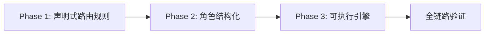
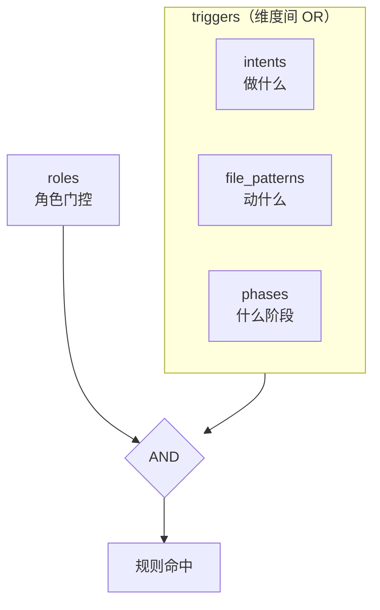
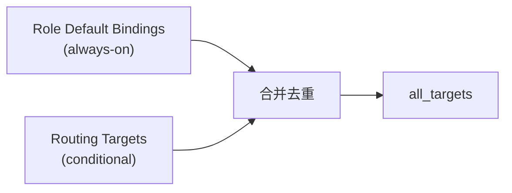

# 任务执行总结：构建结构化路由系统（声明式规则 → 角色结构化 → 可执行引擎）

> 报告版本：standard（标准版 10 章）
> 任务窗口：2026-05-28 单次会话
> 报告生成：task-execution-summary v2.4
> 触发起点：为 `.agents/` 目录构建面向多 Agent 运行时的结构化上下文路由系统

---

## 1. 任务描述与目标

| 字段 | 内容 |
|---|---|
| 任务名称 | 结构化路由系统：声明式规则 → 角色结构化 → 可执行引擎（三阶段渐进） |
| 任务类型 | implementation（工程实现 / 架构落地） |
| 起止时间 | 2026-05-28 单次会话 |
| 主要产出 | ① world.toml [routing] 区块；② routing-protocol.md 参考文档；③ 10 个 Role 结构化文件 + JSON Schema；④ routing_engine.py + route.py + 22 个单元测试；⑤ 两套校验脚本 |
| 关键决策 | 路由承载于 world.toml 而非独立文件；三维联合触发模型；Role 采用 TOML frontmatter + Markdown body 混合格式 |
| 哲学锚点 | 少则得 / 多则惑 ｜ 声明优于命令 ｜ 体（声明）-用（引擎）二分 |
| 完成度 | Phase 1–3 全部完成 100% |

### 核心目标

为 AgentForge 的 `.agents/` 目录构建面向多 Agent 运行时的**结构化上下文路由系统**，实现从"隐式约定"到"机器可解析声明"的升级：

1. **Phase 1**：声明式路由规则——在 `world.toml` 中落地 `[routing]` 区块，定义"何时激活什么资产"
2. **Phase 2**：角色结构化——将 Role 从纯 Markdown 升级为 TOML frontmatter + Markdown body，实现 Default Bindings 机器可读
3. **Phase 3**：可执行引擎——实现 Python 路由引擎 + CLI 子命令，使路由规则可被运行时评估与消费

### 亮点

- **三阶段渐进交付，每阶段独立可验证**：Phase 1 仅声明不动运行时，Phase 2 仅结构化不动路由逻辑，Phase 3 引入引擎但不改变声明格式。
- **零外部依赖**：引擎仅使用标准库（`tomllib` / `dataclasses` / `fnmatch` / `pathlib`）。
- **声明与引擎正交**：`routing-protocol.md` 严格约束 Schema，`routing_engine.py` 仅消费 Schema 而不改变它。

### 挑战

- Phase 3 初版发现 `_world_engines` 模块中 Python 2 语法的 `except A, B:` 残留，需逐模块修复。
- `resolve_role_bindings` 参数顺序在 `route.py` 调用与引擎定义之间出现不一致，需对齐签名。

---

## 2. 执行时间线

| 阶段 | 核心交付 | 关键文件 | 增量行数 |
|---|---|---|---|
| Phase 1 | `world.toml` [routing] 区块 + `routing-protocol.md` + `validate_routes.py` | `world.toml`, `routing-protocol.md`, `validate_routes.py`, `AGENTS.md` | ~415 行 |
| Phase 2 | 10 个 Role 结构化文件 + `role.schema.json` + `validate_roles.py` | `roles/*.md`, `role.schema.json`, `validate_roles.py` | ~500 行 |
| Phase 3 | `routing_engine.py` + `route.py` + `test_routing_engine.py` | `routing_engine.py`, `route.py`, `test_routing_engine.py` | ~930 行 |

### Phase 1 交付细节

| 文件 | 变更 | 说明 |
|---|---|---|
| [`world.toml`](../../../../world.toml) | +131 行 | 新增 `[routing]` 区块：version / conflict_resolution / phases.supported / 11 条 `[[routing.rules]]` |
| [`routing-protocol.md`](../../references/routing-protocol.md) | +202 行 | 路由协议 Draft v0.1 参考文档（9 章） |
| [`validate_routes.py`](../../../scripts/validate_routes.py) | ~292 行 | 校验 targets 存在性 / roles 引用 / id 唯一性 / priority 范围 / phases 枚举 |
| [`AGENTS.md`](../../../../AGENTS.md) | +2 行 | 登记路由协议文档入口 |

### Phase 2 交付细节

| 文件 | 变更 | 说明 |
|---|---|---|
| [`roles/*.md`](../../../roles/)（10 个） | 结构化改造 | 为每个 Role 添加 `+++` TOML frontmatter（id / domain / bindings / permissions） |
| [`role.schema.json`](../../../schemas/role.schema.json) | +61 行 | JSON Schema Draft 2020-12，约束 Role frontmatter 格式 |
| [`validate_roles.py`](../../../scripts/validate_roles.py) | ~325 行 | 校验 frontmatter 格式 / id 与文件名一致性 / bindings 路径存在性 |

### Phase 3 交付细节

| 文件 | 变更 | 说明 |
|---|---|---|
| [`routing_engine.py`](../../../../../src/taolib/cli/_world_engines/routing_engine.py) | ~309 行 | 核心引擎：4 个 dataclass + 5 个公开函数 |
| [`route.py`](../../../../../src/taolib/cli/_world_commands/route.py) | ~232 行 | `world route` CLI 子命令 |
| [`test_routing_engine.py`](../../../../../tests/cli/test_routing_engine.py) | ~392 行 | 22 个单元测试（解析 / 匹配 / 汇总 / bindings / CLI 集成） |

---

## 3. 架构决策记录

| 决策 | 备选方案 | 选择 | 依据 |
|---|---|---|---|
| 路由承载位置 | A. 新建 `routes.toml`；B. 扩展 `registry.toml`；C. 扩展 `world.toml` | **C** | 路由是世界定义的一部分；与 kernel/fragments/capabilities 同级正交；避免多文件同步负担 |
| 触发维度 | A. 仅 intent；B. intent + file_pattern；C. intent + file_pattern + phase | **C** | 三维覆盖"做什么 / 动什么 / 处于什么阶段"；维度间 OR 保证低漏报，roles AND 保证角色门控 |
| Role 格式 | A. 完整 TOML 文件；B. TOML frontmatter + Markdown body；C. 拆分目录（meta.toml + body.md） | **B** | frontmatter 机器可读，body 人类可读；单文件降低管理复杂度；`+++` 分隔符与 TOML 生态兼容 |
| 引擎定位 | A. 独立 Python 包；B. 嵌入 taolib 的 Python 库 + CLI；C. 外部服务 | **B** | 与 `world` CLI 命令家族一致；仅标准库依赖降低部署门槛 |
| 冲突解决策略 | A. 仅 merge；B. merge + priority-first；C. merge + priority-first + ask | **C** | merge 覆盖 80% 场景；priority-first 用于资产覆盖；ask 为复杂场景预留回调接口 |
| 校验脚本归属 | A. 独立 CI job；B. `.agents/scripts/` 内置 | **B** | 与项目其他校验脚本（`validate_skill_md.py` 等）一致；脚本即文档 |

---

## 4. 关键产出清单

### 新增文件

| 文件 | 行数 | 阶段 |
|---|---|---|
| `.agents/docs/references/routing-protocol.md` | 202 | Phase 1 |
| `.agents/scripts/validate_routes.py` | 292 | Phase 1 |
| `.agents/schemas/role.schema.json` | 61 | Phase 2 |
| `.agents/scripts/validate_roles.py` | 325 | Phase 2 |
| `src/taolib/cli/_world_engines/routing_engine.py` | 309 | Phase 3 |
| `src/taolib/cli/_world_commands/route.py` | 232 | Phase 3 |
| `tests/cli/test_routing_engine.py` | 392 | Phase 3 |

### 修改文件

| 文件 | 变更 | 阶段 |
|---|---|---|
| `.agents/world.toml` | +131 行（[routing] 区块） | Phase 1 |
| `.agents/AGENTS.md` | +2 行（文档入口） | Phase 1 |
| `.agents/roles/*.md`（10 个） | 每个文件添加 TOML frontmatter | Phase 2 |

### 总量统计

| 指标 | 数值 |
|---|---|
| 新增文件 | 7 |
| 修改文件 | 12 |
| 新增代码行 | ~1,845 |
| 路由规则数 | 11 |
| 结构化 Role 数 | 10 |
| 单元测试数 | 22 |

---

## 5. 技术亮点

### 5.1 三维路由模型

触发逻辑：

- **维度内**：同维度多值之间 OR（如 `intents: ["python", "uv"]`，任一命中即触发）
- **维度间**：intents / file_patterns / phases 之间 OR（任一维度命中即触发）
- **triggers 与 roles**：AND 关系（触发条件满足 AND 角色匹配）

这一设计平衡了**召回率**（维度间 OR 保证低漏报）与**精准度**（roles 门控防止无关资产注入）。

### 5.2 `+++` TOML frontmatter 解析器复用

`_extract_frontmatter()` 函数在三个位置被复用：

1. [`routing_engine.py`](../../../../../src/taolib/cli/_world_engines/routing_engine.py) — 提取 Role Default Bindings
2. [`validate_routes.py`](../../../scripts/validate_routes.py) — 从 Role 文件提取 id 用于角色引用校验
3. [`validate_roles.py`](../../../scripts/validate_roles.py) — 校验 Role frontmatter 格式与内容

同一解析逻辑三处复用，避免实现分歧。

### 5.3 conflict_resolution 三策略

| 策略 | 行为 | 适用场景 |
|---|---|---|
| `merge` | 合并所有匹配规则的 targets，去重保序 | 资产互补无冲突（默认） |
| `priority-first` | 仅取 priority 最高规则的 targets，并列取 id 字典序最小 | 资产覆盖或替代关系 |
| `ask` | 暂停分发，交由 Agent 自主决策（v0.1 未实现回调接口） | 复杂场景 / 人工过渡期 |

### 5.4 resolve_role_bindings：Default Bindings 与动态路由合并

- **Default Bindings**：角色加载即注入（如 `python-dev` 默认绑定 `rules/python.md`）
- **Routing Targets**：按 triggers 条件评估后才注入（如 `python` 意图 + `coding` 阶段）
- 两者互补：Default Bindings 提供角色身份基线，routing 提供任务上下文增量

---

## 6. 发现的问题与修复

| # | 问题 | 现象 | 修复 | 影响范围 |
|---|---|---|---|---|
| 1 | `_world_engines` 模块 Python 2 语法残留 | 4 个模块中 `except A, B:` 语法在 Python 3 下触发 `SyntaxWarning` 或 `TypeError` | 修复为 `except (A, B):` 元组语法 | `_world_engines/` 下 4 个文件 |
| 2 | `resolve_role_bindings` 参数顺序不一致 | `route.py` 调用时传 `(role_id, roles_dir)`，但引擎定义为 `(roles_dir, role_id)` | Robin 修复了 `resolve_role_bindings` 签名对齐，调整为 `(roles_dir, role_id)` | `routing_engine.py`, `route.py` |
| 3 | `collect_targets` 不支持 `ask` 策略 | 传入 `strategy="ask"` 时抛出 `ValueError` | 符合预期——v0.1 仅声明 `ask`，不实现回调接口；测试用例确认行为 | `routing_engine.py` |

### 修复模式总结

- **问题 1**：遗留代码扫描不足——后续应在新增模块时顺带 lint 相邻模块。
- **问题 2**：参数签名一致性——函数签名应先定义明确，调用方严格遵循；code review 可捕获此类问题。
- **问题 3**：协议预留 vs 实现对齐——`ask` 策略在协议中声明但引擎未实现，需在文档中显式标注边界。

---

## 7. 质量指标

| 指标 | 结果 | 说明 |
|---|---|---|
| 单元测试 | 22/22 通过 | 覆盖：解析（4）+ 匹配（8）+ 汇总（4）+ bindings（2）+ CLI 集成（4） |
| validate_routes.py | 零 ERROR 零 WARNING | 全部 11 条路由规则通过校验 |
| validate_roles.py | 10/10 Role 通过 | 全部 Role 文件 frontmatter 格式正确、id 与文件名一致、bindings 路径存在 |
| CLI 全模式验证 | 通过 | JSON / `--targets-only` / `--include-bindings` / `--strategy` 覆盖 / `--verbose` |
| 外部依赖 | 零 | 引擎仅使用标准库 |

### 测试覆盖矩阵

| 测试类别 | 数量 | 关键用例 |
|---|---|---|
| parse_routing_config | 4 | 顶层字段验证 / 具体规则字段 / 文件不存在 / 缺少 [routing] |
| resolve_routes | 8 | 纯 intent / 纯 file_pattern / 纯 phase / 多维命中 / 角色过滤 / 通配角色 / 无匹配 / 排序确定性 |
| collect_targets | 4 | merge 去重保序 / priority-first / 空列表 / 非法策略 |
| resolve_role_bindings | 2 | 已知角色 bindings 合并 / 未知角色返回空列表 |
| CLI 集成 | 4 | JSON 输出 / --targets-only / 缺失 world.toml / --strategy 覆盖 |

---

## 8. 与 Spec v0.1 的对齐度评估

### 对齐项

| Spec v0.1 要求 | 实现状态 | 说明 |
|---|---|---|
| Level 0：声明式 Schema | 完成 | `world.toml [routing]` 落地 11 条规则 |
| Level 1：参考文档 | 完成 | `routing-protocol.md` 9 章完整 |
| Level 2：JSON Schema 校验 | 部分 | `role.schema.json` 覆盖 Role；routing 暂无独立 JSON Schema |
| Level 3：运行时分发引擎 | 完成 | `routing_engine.py` + `route.py` CLI |
| Level 4：Session state-aware 动态路由 | 未开始 | Phase 4 范围 |

### 正交性验证

| 层 | 职责 | 与 [routing] 关系 |
|---|---|---|
| `[kernel]` | 世界最小核 | 正交——kernel 法则 always-on，不受 routing 条件控制 |
| `[fragments]` | 可装卸领域能力 | 正交——fragments 声明"有什么"，routing 声明"何时激活" |
| `[capabilities]` | 独立技能资产 | 正交——capabilities 被路由 targets 引用但不被路由定义 |
| `[routing]` | 激活策略层 | 核心——仅此层回答"何时" |

### Role frontmatter 与 routing rules 互补

- **Role frontmatter `bindings`**：always-on 基线，角色加载即注入
- **routing rules `roles` 字段**：条件门控，按 triggers 评估后注入
- 两者合并路径：`route.py --include-bindings` 输出 `all_targets` = `resolved_targets` + `role_bindings`（去重保序）

---

## 9. 改进建议（P1–P3 分级）

| 优先级 | 建议 | 当前问题 | 预期收益 |
|---|---|---|---|
| **P1** | routing rules 的 `intents` 关键词需要标准化词表 | 当前靠人工维护，可能出现同义异形（如 `python` vs `py` vs `python3`） | 降低维护成本，提高匹配召回率 |
| **P1** | `validate_routes.py` 应集成到 CI/CD 流水线 | 当前仅本地手动执行 | 防止无效路由规则合入主分支 |
| **P2** | `routing-protocol.md` 应补充 JSON Schema | 与 `role.schema.json` 对齐，routing 配置尚无机器可校验的 Schema | CI 自动校验 + IDE 补全 |
| **P2** | 引擎应支持 `ask` 策略的回调接口 | `collect_targets("ask")` 当前抛 `ValueError` | 完整支持协议声明的三种策略 |
| **P3** | intents 自动提取 | 当前需人工标注或 CLI 手动传入 | 用户输入 → 自动推断 intent，需 NLP |
| **P3** | AGENTS.md 路由表自动生成 | 当前人工维护，与 `[routing]` 可能不同步 | 确保人类视图与机器真相源一致 |

---

## 10. 下一步计划

### 10.1 近期行动

| 优先级 | 行动 | 验收标准 |
|---|---|---|
| P0 | World Session CLI 实现 | 核心子命令：`new` / `list` / `show` / `resume` / `release` / `archive` / `log` |
| P1 | `validate_routes.py` 集成 CI | `.github/workflows/ci.yml` 新增 routing-lint job |
| P1 | intents 标准词表初始化 | 在 `routing-protocol.md` 附录登记推荐关键词 |

### 10.2 中期行动

| 优先级 | 行动 | 验收标准 |
|---|---|---|
| P1 | Phase 4：Session state-aware 动态路由 | 阶段推进时自动重评估路由；上一阶段 targets 不自动继承 |
| P2 | routing JSON Schema 补充 | `schemas/routing.schema.json` 落地，CI 自动校验 |
| P2 | `ask` 策略回调接口 | 引擎接受 callable 参数，CLI 预留交互模式 |

### 10.3 远期愿景

| 优先级 | 行动 | 验收标准 |
|---|---|---|
| P3 | Phase 4b：自动 intent 提取 | 用户自然语言输入 → 自动推断 intent 标签 |
| P3 | AGENTS.md 自动生成 | 从 `[routing]` 自动生成人类友好路由表片段 |

### 10.4 风险预警

| 风险 | 等级 | 防范 |
|---|---|---|
| intents 词表膨胀失控 | 中 | 词表设评审门槛，新增需附使用场景说明 |
| Phase 4 Session 状态机与路由引擎耦合过紧 | 中 | 路由引擎保持无状态设计，Session 通过参数注入当前 phase |
| `ask` 策略回调接口设计不当导致引擎失去纯函数特性 | 低 | 回调仅影响 `collect_targets` 输出，不改变 `resolve_routes` 匹配逻辑 |

---

*关联材料：*
- *路由协议：[`routing-protocol.md`](../../references/routing-protocol.md)*
- *世界定义：[`.agents/world.toml`](../../../../world.toml)*
- *路由引擎：[`routing_engine.py`](../../../../../src/taolib/cli/_world_engines/routing_engine.py)*
- *CLI 子命令：[`route.py`](../../../../../src/taolib/cli/_world_commands/route.py)*
- *单元测试：[`test_routing_engine.py`](../../../../../tests/cli/test_routing_engine.py)*
- *路由校验：[`validate_routes.py`](../../../scripts/validate_routes.py)*
- *角色校验：[`validate_roles.py`](../../../scripts/validate_roles.py)*
- *Role Schema：[`role.schema.json`](../../../schemas/role.schema.json)*
- *角色目录：[`.agents/roles/`](../../../roles/)*
