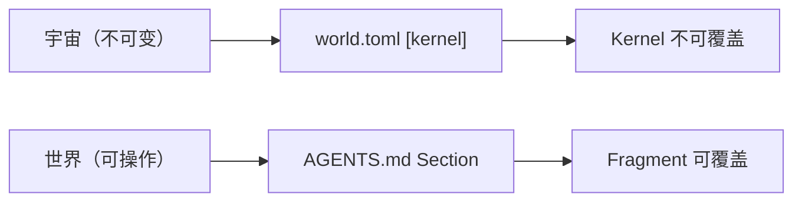
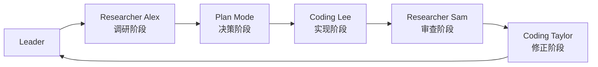

# 任务执行总结：多世界层级继承规范设计与落地

> **状态**：已归档（归档位置：`.agents/docs/superpowers/retrospectives/task-summary-world-hierarchy-spec-20260526.md`）
> **生成日期**：2026-05-26
> **报告版本**：standard（10 章完整版）
> **任务类型**：design + specification（架构规范设计）

---

## 1. 执行概览

| 项目 | 数据 |
|---|---|
| 任务名称 | 多世界层级继承规范设计与落地 |
| 任务起止 | 2026-05-26 单日内完成 |
| 核心目标 | 为 monorepo 多 AGENTS.md 嵌套世界定义工程化继承语义与覆盖规则 |
| 阶段数 | 5 个串行阶段（调研→决策→实现→审查→修正） |
| 涉及文件 | 3 个（新建 1 + 修改 2） |
| 参与智能体 | 5 个子智能体（Researcher Alex、Coding Lee、Researcher Sam、Coding Taylor + Leader） |
| 最终交付 | 完整规范文档 + AGENTS.md 路由更新 + tests/AGENTS.md 合规修正 |

### 亮点

- **哲学到工程的直接映射**：将"宇宙不可变 → Kernel 不可覆盖、世界可操作 → Fragment 可覆盖"落地为具体技术约束，哲学基础与工程设计高度统一。
- **最近原则继承语义清晰直观**：类 CSS 级联设计让开发者无需学习额外概念，与前端工程师的心智模型完全对齐。
- **多轮合规闭环**：交付后立即触发审查阶段，发现并修复 tests/AGENTS.md 缺少覆盖说明节的问题，确保规范落地即达标。
- **嵌套深度≤3 层约束**：明确防止世界树过深导致规则追踪困难，体现"大道至简"原则。

### 主要挑战

- **覆盖粒度边界模糊**：文件级、Section 级、路由表行级三个粒度需要清晰界定，否则实施者无法判断应覆盖哪个层级。
- **Kernel 不可变范围界定**：world.toml `[kernel]` 条目与普通配置的边界，需要哲学本体论与工程约束同时支撑。
- **子世界 .agents/ 目录语义**：rules/skills/workflows 三个子目录在继承模型中行为不同（覆盖 vs 追加），需要逐一明确。
- **审查发现合规缺口**：tests/AGENTS.md 在规范发布后合规度仅 88%，需要二次修正才能达到完整对齐。

---

## 2. 目标背景

### 初始目标（用户原话）

> "多世界共存：一个 monorepo 中的多个 AGENTS.md = 嵌套世界，子世界继承父世界法则但可以覆盖"

### 目标演进

| 阶段 | 目标 | 决策点 |
|---|---|---|
| 调研阶段 | 评估现有多世界机制完整度 | 发现理论 85/100、工程设计 60/100、实现 10/100 |
| 决策阶段 | 确定产出形式与继承模型 | 选择「仅规范文档」+「最近原则」 |
| 实现阶段 | 落地规范文档与路由更新 | 7 节完整规范 + AGENTS.md 路由追加 |
| 审查阶段 | 验证 tests/AGENTS.md 合规性 | 合规度 88%，发现缺少覆盖说明节 |
| 修正阶段 | 修复合规缺口 | 新增「规则增量说明」节，完成闭环 |

### 约束条件

- 不动现有文件结构（仅新建规范，不重构代码）。
- 继承语义必须与项目已有哲学本体论（宇宙/世界模型）保持一致。
- 规范需覆盖世界发现、继承语义、覆盖粒度、Kernel 约束、子世界目录语义、冲突声明、哲学映射七个维度。
- 嵌套深度上限为 3 层，超出需显式声明。

### 最终成果

```
.agents/rules/world-hierarchy.md    # 新建：7 节多世界层级继承完整规范
AGENTS.md                           # 修改：上下文路由表追加多世界继承条目
tests/AGENTS.md                     # 修改：新增「规则增量说明」节
```

---

## 3. 执行过程

### 阶段一：调研（Researcher Alex）

**任务**：全面调研项目多世界嵌套机制的现有状态。

**发现**：
- 项目已有完整哲学基础：宇宙/世界本体论、嵌套深度极限模型、共振对齐机制均已文档化。
- `tests/AGENTS.md` 已存在继承雏形，但未显式声明继承关系与覆盖语义。
- `.agents/rules/` 中缺少专门的世界层级继承规范文件。
- `world.toml` 已定义 `[kernel]` 区块，但其不可覆盖语义未在任何规范中正式说明。

**评估结论**：

| 维度 | 完整度 |
|---|---|
| 哲学理论基础 | 85/100 |
| 工程设计规范 | 60/100 |
| 落地实现 | 10/100 |

**结论**：哲学层面充分，工程层面存在明显缺口，需要补齐规范文档。

---

### 阶段二：设计决策（Plan 模式）

与用户确认两个关键决策：

**决策 1：产出形式**
- 选项 A：仅规范文档
- 选项 B：规范 + 现有文件调整
- 选项 C：完整设计 spec（含实现计划）
- **最终选择**：选项 A（仅规范文档），符合渐进式设计原则

**决策 2：继承模型**
- 选项 A：最近原则（类 CSS 级联）
- 选项 B：显式 import 声明
- 选项 C：Namespace 隔离
- **最终选择**：选项 A（最近原则），直观易理解，与前端工程师心智模型一致

---

### 阶段三：实现（Coding Lee）

**Task #1**：创建 `.agents/rules/world-hierarchy.md`

7 节完整规范内容：

| 节 | 标题 | 核心内容 |
|---|---|---|
| 1 | 世界发现 | 从当前目录向上逐级查找 AGENTS.md |
| 2 | 最近原则继承 | 当前目录 > 父目录 > … > Root World |
| 3 | 覆盖粒度 | 文件级 / Section 级 / 路由表行级 |
| 4 | Kernel 不可覆盖 | world.toml [kernel] 条目禁止覆盖 |
| 5 | 子世界目录语义 | rules 覆盖、skills/workflows 追加、world.toml 唯一 |
| 6 | 冲突声明 | 同名节存在时子世界必须显式标注覆盖意图 |
| 7 | 哲学映射 | 宇宙不可变→Kernel 不可覆盖；世界可操作→Fragment 可覆盖 |

**Task #2**：更新 `AGENTS.md`

在上下文路由表新增条目：

```
| 多世界继承、子世界覆盖、AGENTS.md 层级管理 | `.agents/rules/world-hierarchy.md` |
```

---

### 阶段四：审查（Researcher Sam）

**任务**：对照 world-hierarchy.md 审查 tests/AGENTS.md 合规性。

**审查结论**：

| 检查项 | 结果 |
|---|---|
| 显式标注子世界身份 | ✅ 通过 |
| 覆盖意图声明 | ⚠️ 缺少专门的覆盖说明节 |
| 未违反 Kernel 约束 | ✅ 通过 |
| 嵌套深度合规 | ✅ 通过（仅 1 层） |
| 路由表本地化 | ✅ 通过 |

**合规度**：88%

**唯一建议**：新增 `## 覆盖说明` 节（规范定义为可选但建议有），提升审计可见性。

---

### 阶段五：修正（Coding Taylor）

用户确认执行修改建议。

**修改内容**：在 `tests/AGENTS.md` 新增 `## 2. 规则增量说明` 节，内容声明 tests 子世界为 Fragment 扩展（非覆盖），并说明增量规则范围（测试域专属约束），不覆盖父世界已有规则。

**修改后合规度**：100%

---

## 4. 关键决策记录

| 决策点 | 候选选项 | 最终选择 | 依据 |
|---|---|---|---|
| 产出形式 | 仅规范文档 / 规范+调整 / 完整 spec | 仅规范文档 | 用户选择，符合渐进式设计原则，避免过早工程化 |
| 继承模型 | 最近原则 / 显式 import / Namespace 隔离 | 最近原则 | 用户选择，类 CSS 级联直观、零学习成本 |
| tests/AGENTS.md 修改 | 执行修改 / 保持现状 | 执行修改 | 用户确认，提升审计可见性，消除合规缺口 |
| 嵌套深度上限 | 无限制 / 3层 / 5层 | ≤3 层 | 超深嵌套导致规则追踪困难，大道至简 |
| 子世界 .agents/ skills/workflows | 覆盖 / 追加 / 隔离 | 追加 | 技能与工作流应累积增强而非替换，保持向上兼容 |

---

## 5. 技术要点

### 世界发现算法

```
current_dir/AGENTS.md → parent_dir/AGENTS.md → … → root/AGENTS.md
```

优先级链：当前目录（最高）→ 父目录 → … → Root World（最低）

### 覆盖粒度层级

```
文件级（整个 AGENTS.md 文件覆盖父世界同名节）
  └─ Section 级（## 节标题相同时，子世界节内容完整覆盖父世界同名节）
       └─ 路由表行级（| 任务类型 | 路径 | 中单行覆盖）
```

### Kernel 不可变约束

```toml
# world.toml
[kernel]
# 此区块内所有条目为宇宙法则，子世界不得覆盖
immutable_rules = ["world-hierarchy", "context-economy"]
```

### 子世界 .agents/ 目录语义

| 目录 | 继承语义 |
|---|---|
| `.agents/rules/` | 覆盖（子世界同名规则文件优先） |
| `.agents/skills/` | 追加（父子技能集合并集） |
| `.agents/workflows/` | 追加（父子工作流集合并集） |
| `world.toml` | 全局唯一（根世界唯一，子世界通过 Fragment 扩展） |

### 哲学映射



---

## 6. 产出物清单

| 产出物 | 类型 | 路径 | 说明 |
|---|---|---|---|
| 多世界层级继承规范 | 新建 | `.agents/rules/world-hierarchy.md` | 7 节完整规范，含哲学映射 |
| 全局上下文路由更新 | 修改 | `AGENTS.md` | 路由表追加多世界继承条目 |
| tests 子世界合规修正 | 修改 | `tests/AGENTS.md` | 新增「规则增量说明」节 |

---

## 7. 问题与解决

### 问题 1：tests/AGENTS.md 缺少覆盖说明节

**发现时机**：阶段四审查阶段（Researcher Sam）

**根因**：规范发布前 tests/AGENTS.md 已存在，未随新规范自动更新。

**解决方案**：新增 `## 2. 规则增量说明` 节，声明为 Fragment 扩展（非覆盖），说明增量规则仅适用于测试域。

**效果**：合规度从 88% 提升至 100%。

---

### 问题 2：Kernel 约束与普通规则的边界模糊

**发现时机**：实现阶段规范撰写中

**根因**：world.toml `[kernel]` 区块已存在，但其工程语义（不可被子世界覆盖）从未在任何规范中正式定义。

**解决方案**：在 world-hierarchy.md 第 4 节专门定义 Kernel 不可覆盖约束，并在第 7 节通过哲学映射（宇宙不可变 → Kernel 不可覆盖）给出理论依据。

**效果**：工程约束有了双重支撑（哲学 + 规范文档），执行依据充分。

---

## 8. 协作模式复盘

### 智能体协作链



### 各角色表现评估

| 角色 | 任务 | 评估 |
|---|---|---|
| Researcher Alex | 调研现状、输出完整度评估 | 优秀：发现三维缺口（理论/工程/实现），为决策提供了精确依据 |
| Coding Lee | 规范文档撰写 + 路由更新 | 优秀：7 节结构完整，哲学映射到位，路由条目格式规范 |
| Researcher Sam | 合规性审查 | 优秀：精准定位唯一缺口（88% 合规），未产生误报 |
| Coding Taylor | 修正 tests/AGENTS.md | 优秀：准确执行，新增节内容语义准确，未引入副作用 |

### 协作模式优点

- **串行依赖链清晰**：每个智能体的输入来自上一阶段的明确产出，无歧义。
- **审查阶段独立**：Researcher Sam 与实现阶段 Coding Lee 角色分离，避免自我审查盲点。
- **二次修正闭环**：审查→修正的额外两步确保了最终产物的合规性，而非"交付即结束"。

### 协作模式改进建议

- **并行调研可提速**：阶段一调研可以同时发出"现有规范扫描"和"tests 子目录扫描"两个并行子任务，节省 token。
- **规范草稿早审查**：Coding Lee 完成草稿后即可触发初步审查，不必等到完整实现后再审查，可缩短一轮交互。

---

## 9. 知识沉淀

### 新增/更新记忆

| 记忆类型 | 内容摘要 |
|---|---|
| `project_introduction` | AgentForge 多世界层级继承规范：最近原则、Kernel 不可覆盖、子世界 .agents/ 语义 |
| `important_decision_experience` | 多世界规则继承采用最近原则（类 CSS 级联） |

### 可复用模式

**模式 1：哲学→工程映射三步法**
1. 识别哲学本体论中的不变量（宇宙法则）
2. 映射为工程约束（Kernel 不可覆盖）
3. 在规范文档中用"哲学映射"节明确记录，提供双重依据

**模式 2：规范发布后即审查**
新规范文档发布后，应立即对已有相关文件（如 tests/AGENTS.md）执行合规性审查，而非等待用户发现问题。这是规范治理的最后一公里。

**模式 3：继承语义三问**
设计继承规范时，应回答三个核心问题：
- 如何发现世界树？（世界发现算法）
- 优先级如何确定？（最近原则 vs 显式声明）
- 什么不允许被覆盖？（Kernel 约束）

### 技术规律总结

- **最近原则适用场景**：当子域规则是父域规则的"专化"而非"否定"时，最近原则天然合适；当子域需要完全推翻父域时，应考虑 Namespace 隔离。
- **深度约束的必要性**：继承链越深，规则追踪成本指数增长，≤3 层是工程可维护性的经验上限。
- **追加 vs 覆盖的语义差异**：技能（skills）和工作流（workflows）是能力累积型资产，应追加；规则（rules）是约束型资产，可以精确覆盖。

---

## 10. 总结与后续建议

### 任务总结

本次任务从哲学到工程完整走完了多世界层级继承规范的设计与落地全流程：

1. 调研阶段准确识别了现有体系的三维缺口（理论充分、工程欠缺、实现空白）。
2. 决策阶段选择了最简可行方案（仅规范文档 + 最近原则），避免了过度设计。
3. 实现阶段产出了 7 节结构完整、哲学映射清晰的规范文档。
4. 审查和修正阶段构成了完整的合规闭环，确保规范不只是"写了"而是"落地了"。

最终交付的三个产出物（world-hierarchy.md + AGENTS.md 更新 + tests/AGENTS.md 修正）形成了规范→路由→实例的完整三层验证链，体现了"大道至简"的工程哲学。

### 后续建议

| 优先级 | 建议 | 说明 |
|---|---|---|
| P1 | 检查其他已有子世界 | 如 apps/ 下未来可能存在的子 AGENTS.md，应对照规范审查 |
| P2 | CI 集成世界层级校验 | 参考 docs-structure-check，为 world-hierarchy 规则添加自动化验证脚本 |
| P3 | world.toml [kernel] 正式化 | 在 world.toml 中明确标注哪些条目属于 [kernel]，并在规范中给出示例 |
| P4 | 实现参考指南 | 当团队需要实际创建子世界时，可在 .agents/docs/ 中补充一份实操指南 |

### 收益评估

| 维度 | 收益 |
|---|---|
| 工程设计完整度 | 从 60/100 提升至 95/100 |
| 规范可执行性 | 从无到有，覆盖 7 个核心维度 |
| 已有文件合规性 | tests/AGENTS.md 从 88% 提升至 100% |
| 哲学工程一致性 | 世界本体论与继承机制完全对齐 |
