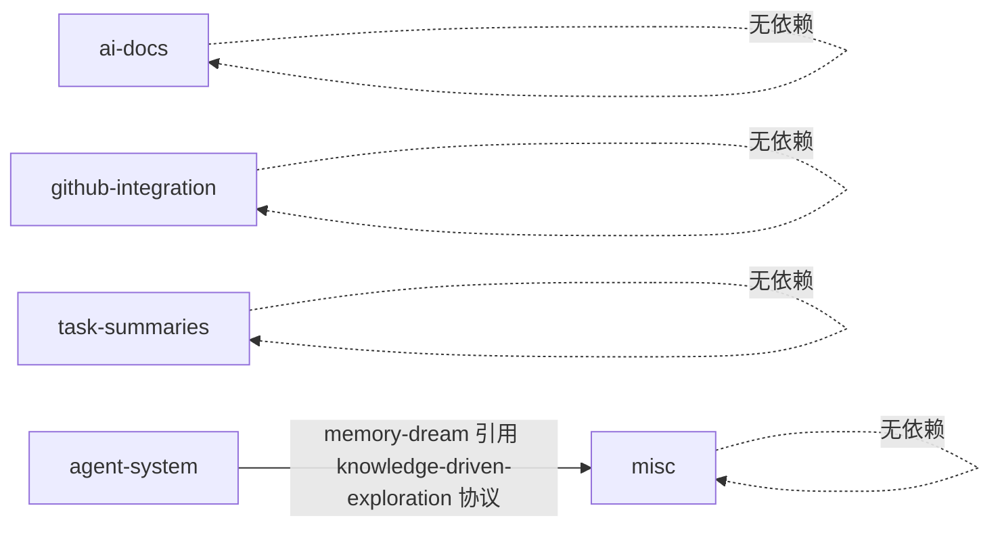
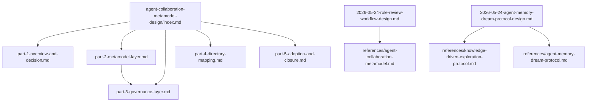
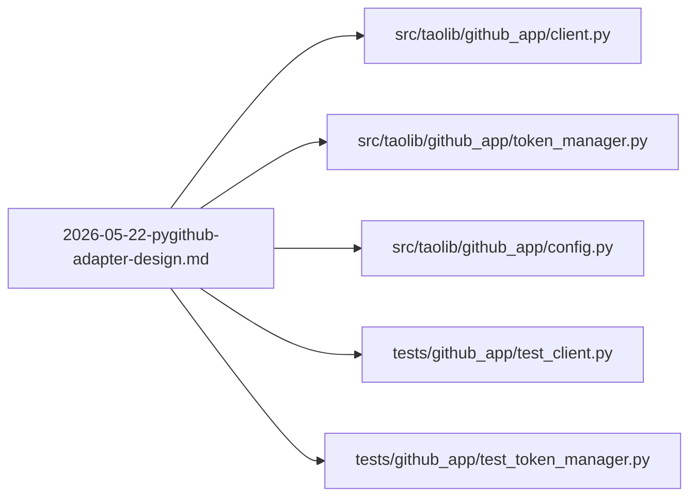

# 依赖关系图谱

> **维护责任人**：Leader Agent
> **更新日期**：2026-06-23
> **生成方式**：基于 Grep 工具扫描 `specs/` 下所有 `.md` 文件中的 `](...md)` 与 `file:///` 引用模式

本文档记录 `specs/` 目录下文档间的引用关系（正向与反向依赖）以及模块间依赖关系，并使用 Mermaid 流程图可视化关键依赖链。

## 1. 引用关系总览

### 1.1 文档间引用（specs/ 内部）

| 引用方（正向依赖） | 被引用方（反向依赖来源） | 引用类型 |
|------------------|----------------------|---------|
| `agent-system/2026-05-24-agent-collaboration-metamodel-design/index.md` | `part-1-overview-and-decision.md` ~ `part-5-adoption-and-closure.md` | 原子化目录内部索引 |
| `agent-system/2026-05-24-agent-collaboration-metamodel-design/part-2-metamodel-layer.md` | `part-3-governance-layer.md` | 跨分区引用 |
| `misc/2026-05-24-knowledge-driven-exploration-foundation-design/index.md` | `part-01-goal-and-background.md` ~ `part-13-acceptance-criteria.md` | 原子化目录内部索引 |

### 1.2 跨模块引用

| 引用方 | 被引用方 | 引用内容 |
|--------|---------|---------|
| `agent-system/2026-05-24-agent-memory-dream-protocol-design.md` | `misc/2026-05-24-knowledge-driven-exploration-foundation-design/`（设计来源） | 引用 `knowledge-driven-exploration-protocol.md` 参考文档，该参考文档由 misc 模块的设计衍生 |

### 1.3 外部引用（指向 specs/ 之外）

| 引用方 | 被引用方 | 引用类型 |
|--------|---------|---------|
| `agent-system/2026-05-24-role-review-workflow-design.md` | `apps/chaos/.agents/docs/references/agent-collaboration-metamodel.md` | 参考文档引用 |
| `agent-system/2026-05-24-agent-memory-dream-protocol-design.md` | `apps/chaos/.agents/docs/references/knowledge-driven-exploration-protocol.md` | 参考文档引用 |
| `agent-system/2026-05-24-agent-memory-dream-protocol-design.md` | `apps/chaos/.agents/docs/references/agent-memory-dream-protocol.md` | 参考文档引用 |
| `ai-docs/2026-05-22-ai-docs-navigation-design.md` | `apps/chaos/.agents/docs/README.md` | 顶层目录说明引用 |
| `github-integration/2026-05-22-pygithub-adapter-design.md` | `apps/chaos/src/taolib/github_app/client.py` | 源码引用 |
| `github-integration/2026-05-22-pygithub-adapter-design.md` | `apps/chaos/src/taolib/github_app/token_manager.py` | 源码引用 |
| `github-integration/2026-05-22-pygithub-adapter-design.md` | `apps/chaos/src/taolib/github_app/config.py` | 源码引用 |
| `github-integration/2026-05-22-pygithub-adapter-design.md` | `apps/chaos/tests/github_app/test_client.py` | 测试引用 |
| `github-integration/2026-05-22-pygithub-adapter-design.md` | `apps/chaos/tests/github_app/test_token_manager.py` | 测试引用 |

## 2. 模块间依赖关系

| 模块 | 依赖模块 | 依赖方向 | 说明 |
|------|---------|---------|------|
| `agent-system` | `misc` | agent-system → misc | agent-memory-dream-protocol 引用 knowledge-driven-exploration 设计衍生的协议 |
| `ai-docs` | 无 | — | 无模块间依赖 |
| `github-integration` | 无 | — | 无模块间依赖 |
| `task-summaries` | 无 | — | 无模块间依赖 |
| `misc` | 无 | — | 无模块间依赖 |

## 3. 关键依赖链可视化

### 3.1 模块间依赖

### 3.2 agent-system 内部依赖链

### 3.3 misc 内部依赖链（knowledge-driven-exploration 原子化目录）

```mermaid
flowchart TD
    KdeIndex["knowledge-driven-exploration-foundation-design/index.md"]
    Part01["part-01-goal-and-background.md"]
    Part02["part-02-scope-and-non-goals.md"]
    Part03["part-03-design-principles.md"]
    Part04["part-04-options-and-recommendation.md"]
    Part05["part-05-architecture-layers.md"]
    Part06["part-06-protocol.md"]
    Part07["part-07-directory-mapping.md"]
    Part08["part-08-initial-deliverables.md"]
    Part09["part-09-initial-build-order.md"]
    Part10["part-10-pilot-strategy.md"]
    Part11["part-11-validation-model.md"]
    Part12["part-12-risks.md"]
    Part13["part-13-acceptance-criteria.md"]

    KdeIndex --> Part01
    KdeIndex --> Part02
    KdeIndex --> Part03
    KdeIndex --> Part04
    KdeIndex --> Part05
    KdeIndex --> Part06
    KdeIndex --> Part07
    KdeIndex --> Part08
    KdeIndex --> Part09
    KdeIndex --> Part10
    KdeIndex --> Part11
    KdeIndex --> Part12
    KdeIndex --> Part13
```

### 3.4 github-integration 外部源码引用

## 4. 依赖统计

| 维度 | 数量 |
|------|------|
| 模块间依赖 | 1（agent-system → misc） |
| 原子化目录内部引用 | 20（metamodel 6 + knowledge-driven-exploration 14） |
| 跨分区引用 | 1（part-2 → part-3） |
| 外部参考文档引用 | 3（references/ 下 3 份文档） |
| 外部源码/测试引用 | 5（github_app 相关） |
| 顶层文档引用 | 1（.agents/docs/README.md） |

## 5. 维护约定

- 新增文档若引用其他文档，须同步更新本图谱的第 1、2 节
- 模块间新增依赖须更新第 3.1 节的 Mermaid 流程图
- 引用关系变更后，须同步检查 [`module-catalog.md`](./module-catalog.md) 中各模块的"依赖"字段
