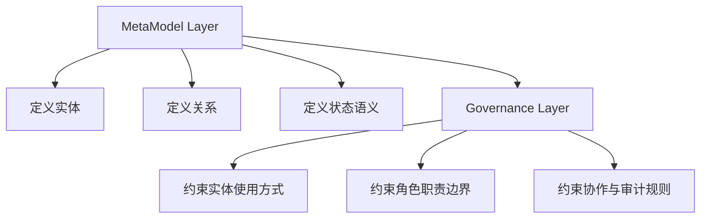
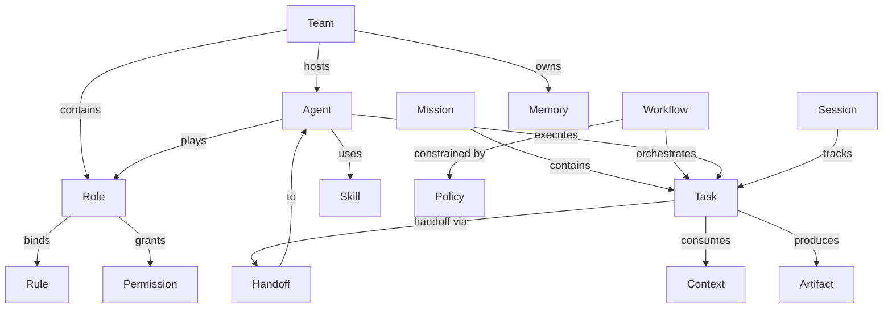

# 元模型层（MetaModel Layer）

> 本单元涵盖原文件的 Architecture Layers、Domains、Core Entities、Relationship Model 章节，定义协作语义内核中的实体、关系、状态语义与边界语义。

## Architecture Layers

推荐将协作语义内核分为两层：

1. `MetaModel Layer`
2. `Governance Layer`

对应关系如下：

- `MetaModel Layer`：定义实体、关系、状态语义与边界语义
- `Governance Layer`：定义约束、职责边界、推荐路径、禁止事项和审计要求

主图如下：

### MetaModel Layer

该层回答以下问题：

- 世界里有哪些实体
- 实体之间允许建立什么关系
- 各类状态对象的最小语义是什么
- 概念之间的边界如何区分

例如：

- `Team` 是治理边界，不是聊天群组
- `Role` 是职责模板，不是权限集合的别名
- `Agent` 是执行主体，不等于某个具体模型实例
- `Workflow` 是协作协议，不是脚本文件路径
- `Memory` 是长期可复用知识，不等于上下文窗口
- `Context` 是任务执行时的工作集

### Governance Layer

该层回答以下问题：

- 哪些关系是必须的
- 哪些路径是推荐的
- 哪些行为是禁止的
- 关键动作如何被追踪与审计

例如：

- `Agent` 必须通过 `Role` 进入规范性协作体系
- 跨 team 协作推荐通过显式 `Handoff`
- 高权限能力不能绕开角色与规则体系直接使用
- 关键任务应记录角色来源、交接链路、产物归档与规则依据

> **说明**：`Governance Layer` 的约束与状态语义部分见独立单元 [part-3-governance-layer.md](part-3-governance-layer.md)。

## Domains

推荐将第一版元模型划分为 5 个领域：

1. `Organization`
2. `Execution`
3. `Knowledge`
4. `Governance`
5. `Runtime State`

### Organization

- 负责组织边界、成员关系与职责模板
- 核心实体：`Team`、`Role`、`Agent`

### Execution

- 负责目标容器、任务分派、流程编排与交接语义
- 核心实体：`Mission`、`Task`、`Workflow`、`Handoff`

### Knowledge

- 负责规则、能力、记忆、上下文和产物等知识与能力资产
- 核心实体：`Memory`、`Context`、`Rule`、`Skill`、`Artifact`

### Governance

- 负责权限、策略、约束与治理边界
- 核心实体：`Policy`、`Permission`

### Runtime State

- 负责运行态会话与最小状态壳
- 核心实体：`Session`

## Core Entities

首版收敛为 15 个核心实体：

- `Team`
- `Role`
- `Agent`
- `Mission`
- `Task`
- `Workflow`
- `Handoff`
- `Memory`
- `Context`
- `Rule`
- `Skill`
- `Artifact`
- `Policy`
- `Permission`
- `Session`

推荐说明如下：

- `Mission` 表示一个可分解的协作目标，可承载多个 `Task`
- `Task` 是最小可分派工作单元
- `Workflow` 是任务协作协议，不等于任务本身
- `Handoff` 是显式交接对象，不应隐藏在流程描述文字中
- `Memory / Context / Rule / Skill / Artifact` 共同构成知识与能力层
- `Policy / Permission` 用于将治理规则从领域对象中分离
- `Session` 是运行时最小状态壳，为后续事件流和快照保留接口

## Relationship Model

推荐将关系分为 4 类：

- 归属关系
- 扮演关系
- 执行关系
- 挂载关系

主图如下：

### Organization Relations

- `Team contains Role`
- `Team hosts Agent`
- `Agent plays Role`

说明：

- 一个 `Agent` 可以扮演多个 `Role`
- 在单个 `Session` 中，建议为一个 `Agent` 指定主角色

### Execution Relations

- `Mission contains Task`
- `Workflow orchestrates Task`
- `Agent executes Task`
- `Task handoff via Handoff`

说明：

- `Workflow` 不是 `Task` 的父容器，而是围绕任务的协作协议
- `Review` 首版不作为一级实体，先作为 `Task` 或 `Workflow` 的动作语义存在

### Knowledge Relations

- `Rule` 可以绑定到 `Team`、`Role`、`Workflow`
- `Skill` 可以绑定到 `Role`、`Agent`
- `Memory` 可以属于 `Team`、`Agent`、`Mission`
- `Context` 是任务执行时被消费的知识切片
- `Artifact` 是任务输出物，也是知识回流和审计输入
