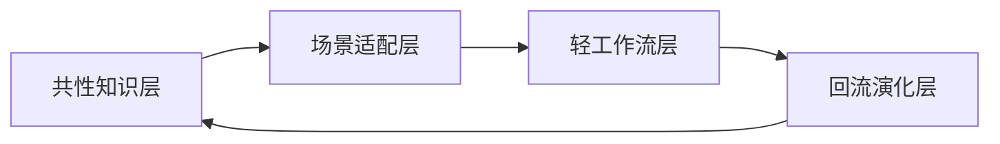

# Architecture Layers

推荐将探索型能力底座分为 4 层：

1. `共性知识层`
2. `场景适配层`
3. `轻工作流层`
4. `回流演化层`

对应关系如下：

- `共性知识层`：定义跨场景通用资产与字段，是单一事实来源
- `场景适配层`：把共性知识映射为比赛、应用、技能生态三类轻量视图
- `轻工作流层`：负责推进探索动作，但不抢占长期知识的归属
- `回流演化层`：把一次探索中的偏差、经验与复用结论反向更新到底座

推荐主图如下：

### Layer Responsibilities

#### 共性知识层

- 作用：统一承载所有探索共用的标准资产
- 典型内容：场景卡、spec、plan、验证记录、retrospective、术语与验收口径
- 约束：必须保持字段稳定，禁止为单一场景随意扩充模板复杂度

#### 场景适配层

- 作用：在不复制体系的前提下，为不同探索对象提供轻量差异视图
- 比赛型重点：时间盒、演示亮点、评审价值、快速闭环
- 应用型重点：用户价值、能力边界、阶段演进、稳定接口
- 技能生态型重点：触发条件、输入输出契约、评测口径、插件化边界

#### 轻工作流层

- 作用：串联“立项 -> 设计 -> 计划 -> 验证 -> 复盘”这些动作
- 典型产物：阶段状态、待办、阻塞项、阶段记录、下一步动作
- 约束：首版只保持最薄的一层编排，不提前做重型自动化

#### 回流演化层

- 作用：把一次探索真正转化为底座增长
- 典型动作：修订模板、补充场景目录、更新参考页、调整规范与验收口径
- 约束：复盘必须回答“哪些经验值得进入共性层”
