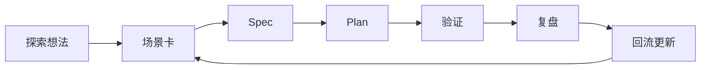

# Protocol

统一探索协议定义为：

> 任何探索动作，都必须从结构化输入进入，并产出可回流的结构化结果。

### Standard Inputs

- 探索动机
- 场景描述
- 目标约束
- 成功标准
- 已有参考

### Standard Outputs

- 场景卡
- 设计 spec
- 执行计划
- 验证记录
- 复盘文档

### Unified Flow

推荐将所有探索动作固定为以下流转路径：

### Gate Rules

- 没有场景卡，不进入 spec
- 没有 spec，不进入正式计划
- 没有验证，不判定探索完成
- 没有复盘回流，不算底座能力增长
