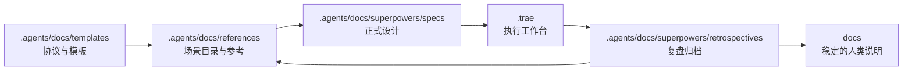

# Directory Mapping

推荐直接复用仓库现有目录体系，不新建平行目录：

- `探索入口`：`.agents/docs/references/` 与 `.agents/docs/templates/`
- `设计档案`：`.agents/docs/superpowers/specs/`
- `执行工作台`：`.trae/`
- `复盘档案`：`.agents/docs/superpowers/retrospectives/`
- `人类说明`：`docs/`

对应职责如下：

- `.agents/docs/templates/`：存放统一探索协议模板、场景卡模板、spec 母模板、复盘模板
- `.agents/docs/references/`：存放场景目录、术语表、分类规则与参考页
- `.agents/docs/superpowers/specs/`：存放正式设计稿与长期方案母本
- `.trae/`：存放执行期计划、任务拆解、临时分析与阶段记录
- `.agents/docs/superpowers/retrospectives/`：存放复盘与经验回流
- `docs/`：仅在某项成果对人类开发者已稳定有效时，才同步为长期说明

推荐目录流转图如下：

