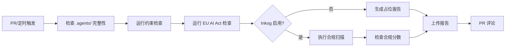

# EU AI Act 合规工作流部署文档

> **版本**: 1.1.0
> **最后更新**: 2026-06-21
> **适用项目**: 需要符合 EU AI Act (2024/1689) 合规要求的 AI 项目

---

## 一、概述

### 1.1 目标

本文档提供 EU AI Act 合规检查工作流的完整部署指南，帮助团队：

- 快速建立 AI 治理声明基础设施
- 自动化合规检查流程
- 生成可审计的合规证据链
- 确保检查脚本的正确性和可靠性

### 1.2 合规分层架构

```
┌─────────────────────────────────────────────────────────────┐
│                    EU AI Act 合规闭环                        │
├─────────────────────────────┬───────────────────────────────┤
│   治理声明层 (AgentForge)    │   校验扫描层 (Inkog)          │
├─────────────────────────────┼───────────────────────────────┤
│  • AGENTS.md 项目指令        │  • 声明 vs 代码交叉验证       │
│  • constraints.toml 约束声明  │  • Art 12/14/15 自动映射      │
│  • 角色定义与权限控制         │  • 合规分数计算               │
├─────────────────────────────┼───────────────────────────────┤
│  零成本、纯 Markdown/TOML    │  需安装 Inkog CLI             │
└─────────────────────────────┴───────────────────────────────┘
```

### 1.3 EU AI Act 三条款映射

| 条款 | 要求 | 本工作流覆盖 |
|------|------|-------------|
| **Art 12** | 技术文档与记录留存 | AGENTS.md + specs/ + Git 历史 |
| **Art 14** | 透明度与人工监督 | constraints.toml + 角色定义 |
| **Art 15** | 准确性与稳健性 | 质量门禁 + 合规扫描 |

---

## 二、前置条件

### 2.1 环境要求

| 依赖 | 版本要求 | 用途 |
|------|---------|------|
| Python | ≥ 3.11 | 运行检查脚本 |
| uv | 最新版 | Python 包管理 |
| Git | ≥ 2.0 | 版本控制与证据链 |
| GitHub Actions | - | CI/CD 自动化 |
| Inkog CLI (可选) | 最新版 | 完整合规扫描 |
| pytest | ≥ 9.0 | 单元测试 |

### 2.2 项目结构要求

```
project/
├── AGENTS.md                    ← 合规声明主文档
├── .agents/
│   ├── constraints.toml         ← 约束定义
│   ├── rules/                   ← 领域规则
│   ├── roles/                   ← 角色定义
│   └── scripts/                 ← 检查脚本
├── specs/                       ← 技术规范
├── tests/                       ← 单元测试
│   └── test_compliance_checks.py
└── .github/workflows/
    └── eu-ai-act-compliance.yml ← CI 工作流
```

---

## 三、文件清单

### 3.1 模板文件

| 文件 | 位置 | 用途 |
|------|------|------|
| `eu-ai-act-agents-md-template.md` | `.agents/docs/templates/` | AGENTS.md 合规声明模板 |
| `eu-ai-act-constraints-template.toml` | `.agents/docs/templates/` | 约束定义模板 |
| `eu-ai-act-role-template.toml` | `.agents/docs/templates/` | 角色定义模板 |
| `eu-ai-act-compliance-workflow-template.yml` | `.agents/docs/templates/` | CI 工作流模板 |

### 3.2 检查脚本

| 脚本 | 用途 |
|------|------|
| `check_constraints.py` | 验证 constraints.toml 约束合规性 |
| `check_eu_ai_act.py` | EU AI Act 三条款合规检查 |
| `simulate_compliance_workflow.py` | 本地模拟工作流执行 |

### 3.3 测试文件

| 文件 | 用途 |
|------|------|
| `test_compliance_checks.py` | 合规检查脚本单元测试 |

---

## 四、部署步骤

### 4.1 Step 1: 创建 AGENTS.md

```bash
# 复制模板到项目根目录
cp .agents/docs/templates/eu-ai-act-agents-md-template.md ./AGENTS.md

# 编辑文件，填写项目信息
# - 项目名称
# - AI 系统类型
# - 目标用户
# - AI 使用场景
```

**必填字段**:

- 项目身份信息
- AI 使用场景与风险等级
- EU AI Act 三条款合规声明
- 高风险操作清单

### 4.2 Step 2: 创建 constraints.toml

```bash
# 复制模板到 .agents/ 目录
cp .agents/docs/templates/eu-ai-act-constraints-template.toml ./.agents/constraints.toml

# 编辑文件，定义约束
```

**关键配置项**:

```toml
# 强约束 - 不可违反
[constraints.strong]
agent_requires_role = true
high_risk_requires_approval = true
no_plaintext_sensitive_data = true

# 高风险操作定义
[high_risk_operations]
production_deploy = { risk_level = "high", approval_count = 2, approvers = ["tech-lead", "security"] }
```

### 4.3 Step 3: 创建角色定义

```bash
# 创建角色目录
mkdir -p .agents/roles

# 复制角色模板
cp .agents/docs/templates/eu-ai-act-role-template.toml ./.agents/roles/ai-operator.toml

# 根据团队需求定义角色
```

**角色自主级别**:

| 级别 | 说明 | 适用场景 |
|------|------|---------|
| `suggestion` | 仅建议，需人工确认 | 日常 AI 操作 |
| `execution` | 可执行，但需记录 | 已审批的流程 |
| `approval` | 可批准，具有决策权 | 管理角色 |

### 4.4 Step 4: 配置 CI 工作流

```bash
# 创建工作流目录
mkdir -p .github/workflows

# 复制工作流模板
cp .agents/docs/templates/eu-ai-act-compliance-workflow-template.yml ./.github/workflows/eu-ai-act-compliance.yml
```

**工作流触发条件**:

- Pull Request (修改 `.agents/` 或代码文件)
- 每周定期扫描 (周一 08:00 UTC)
- 手动触发

### 4.5 Step 5: 启用 Inkog 扫描 (可选)

编辑 `.github/workflows/eu-ai-act-compliance.yml`，取消以下注释：

```yaml
# 取消注释以启用 Inkog 扫描
- name: Install Inkog CLI
  run: npm install -g @inkog/cli

- name: Run Inkog compliance scan
  run: inkog verify . --policy eu-ai-act --output json > compliance-report.json
```

---

## 五、本地测试

### 5.1 运行模拟器

```bash
# 进入项目目录
cd your-project

# 运行本地模拟
uv run .agents/scripts/simulate_compliance_workflow.py
```

### 5.2 预期输出

```
╔════════════════════════════════════════════════════════════╗
║     EU AI Act 合规检查工作流 - 本地模拟器                  ║
╚════════════════════════════════════════════════════════════╝

ℹ️  初始化模拟环境...
[ENV] GITHUB_REPOSITORY=owner/repo
[ENV] COMPLIANCE_THRESHOLD=90

============================================================
📁 Step 1: 验证 .agents/ 目录完整性
============================================================

✅ .agents/ 目录存在
ℹ️  脚本文件: ...

============================================================
🔧 Step 2: 运行合规检查脚本
============================================================

✅ 约束检查 通过
⚠️  EU AI Act 合规检查 发现问题

============================================================
📋 检查摘要
============================================================

📊 检查结果:
  ✅ 约束检查: 通过
  ❌ EU AI Act 合规检查: 失败
  ⏭️ Inkog 扫描: 跳过
```

### 5.3 检查产物

```bash
# 查看合规报告
cat compliance-report.json | jq '.'

# 预期内容
{
  "metadata": {
    "timestamp": "2026-06-21T16:15:10Z",
    "repository": "owner/repo",
    ...
  },
  "checks": {
    "check_constraints": { "status": "passed", ... },
    "check_eu_ai_act": { "status": "failed", ... },
    "inkog_scan": { "status": "skipped", ... }
  },
  "governance_score": 0,
  "threshold": 90
}
```

---

## 六、单元测试

### 6.1 测试覆盖范围

| 测试类 | 测试数 | 覆盖内容 |
|--------|--------|---------|
| `TestFindAgentsDir` | 5 | 目录查找、子目录查找、边界条件、最大深度 |
| `TestCheckConstraints` | 10 | 有效配置、缺失文件、无效语法、强/弱/并行约束、Role 绑定、world.toml 引用 |
| `TestComplianceReport` | 7 | 添加检查项、分数计算（完美/警告/失败/跳过/空） |
| `TestCheckArticle12` | 5 | 审计启用/禁用、保留期限（足够/不足/未设置/跳过） |
| `TestCheckArticle14` | 6 | 高风险操作定义、Agent Role 绑定、Task Mission 归属 |
| `TestCheckArticle15` | 4 | 输入净化、速率限制 |
| `TestLoadConstraints` | 3 | 加载有效/缺失/无效文件 |
| `TestCheckEuAiActCompliance` | 3 | 完整检查、缺失文件、最小配置 |
| `TestComplianceCheckDisplay` | 5 | 状态显示、严重级别显示 |
| `TestIntegration` | 1 | 端到端测试 |

**总计**: 49 个测试用例

### 6.2 运行测试

```bash
# 运行所有测试
uv run pytest tests/test_compliance_checks.py -v

# 运行带覆盖率
uv run pytest tests/test_compliance_checks.py -v --cov=.agents/scripts

# 运行特定测试类
uv run pytest tests/test_compliance_checks.py::TestCheckArticle12 -v

# 运行特定测试
uv run pytest tests/test_compliance_checks.py::TestCheckArticle12::test_audit_enabled -v
```

### 6.3 预期测试结果

```
============================= test session starts =============================
platform win32 -- Python 3.14.0, pytest-9.0.3
collected 49 items

tests/test_compliance_checks.py::TestFindAgentsDir::test_find_agents_dir_exists PASSED
tests/test_compliance_checks.py::TestFindAgentsDir::test_find_agents_dir_from_subdirectory PASSED
tests/test_compliance_checks.py::TestFindAgentsDir::test_find_agents_dir_not_found SKIPPED
tests/test_compliance_checks.py::TestFindAgentsDir::test_find_agents_dir_boundary PASSED
tests/test_compliance_checks.py::TestFindAgentsDir::test_find_agents_dir_max_depth PASSED
...
tests/test_compliance_checks.py::TestIntegration::test_end_to_end_compliance_check PASSED

======================== 48 passed, 1 skipped in 0.21s ========================
```

### 6.4 测试结果解读

| 结果 | 含义 | 处理建议 |
|------|------|---------|
| `passed` | 测试通过 | 无需处理 |
| `failed` | 测试失败 | 检查错误信息，修复代码或配置 |
| `skipped` | 测试跳过 | 检查跳过原因，通常是环境限制 |

### 6.5 关键测试场景

#### 场景 1: 约束配置验证

```python
def test_valid_constraints(self, temp_project, valid_constraints_content):
    """测试有效的约束配置。"""
    # 验证所有强约束、弱约束、并行约束都正确配置
    # 预期: error_count == 0, errors == []
```

#### 场景 2: EU AI Act 条款检查

```python
def test_audit_enabled(self):
    """测试审计已启用 - Art 12。"""
    strong = {"audit_all_actions": True, "audit_retention_days": 365}
    checks = check_article_12(strong)
    # 预期: checks[0].status == STATUS_PASS
```

#### 场景 3: 合规分数计算

```python
def test_compliance_score_perfect(self):
    """测试完美合规分数。"""
    report = ComplianceReport()
    for _ in range(5):
        report.add_check(ComplianceCheck(..., status=STATUS_PASS))
    # 预期: report.get_compliance_score() == 100
```

---

## 七、CI/CD 集成

### 7.1 GitHub Actions 配置

工作流自动执行以下步骤：



### 7.2 合规分数阈值

默认阈值为 90 分，可通过环境变量调整：

```yaml
env:
  COMPLIANCE_THRESHOLD: 90  # 调整为适合项目的值
```

### 7.3 产物保留

| 产物 | 保留天数 | 用途 |
|------|---------|------|
| `compliance-report.json` | 90 | 合规证据 |
| `constraints-check.log` | 90 | 检查日志 |
| `eu-ai-act-check.log` | 90 | EU AI Act 检查日志 |
| `trivy-results.sarif` | 90 | 安全扫描结果 |

### 7.4 CI 中集成测试

在 CI 工作流中添加测试步骤：

```yaml
# .github/workflows/eu-ai-act-compliance.yml

jobs:
  test:
    runs-on: ubuntu-latest
    steps:
      - uses: actions/checkout@v4
      - uses: actions/setup-python@v5
        with:
          python-version: '3.11'
      - uses: astral-sh/setup-uv@v4

      - name: Run compliance tests
        run: uv run pytest tests/test_compliance_checks.py -v

      - name: Upload test results
        if: always()
        uses: actions/upload-artifact@v4
        with:
          name: test-results
          path: .pytest_cache/
```

---

## 八、故障排查

### 8.1 常见问题

#### 问题 1: Windows 编码错误

**症状**:
```
UnicodeEncodeError: 'gbk' codec can't encode character '\u2705'
```

**解决方案**:
脚本已内置 UTF-8 编码支持。如仍有问题，确保终端支持 UTF-8：

```powershell
# PowerShell
[Console]::OutputEncoding = [System.Text.Encoding]::UTF8
```

#### 问题 2: 脚本不存在

**症状**:
```
⚠️ check_constraints.py 脚本不存在
```

**解决方案**:
确保 `.agents/scripts/` 目录包含所需脚本：

```bash
ls .agents/scripts/
# 应包含: check_constraints.py, check_eu_ai_act.py
```

#### 问题 3: 合规分数过低

**症状**:
```
合规分数: 41/100
风险等级: [HIGH] 高风险
```

**解决方案**:
根据检查报告修复问题：

1. 启用审计功能 (`audit_all_actions = true`)
2. 定义高风险操作清单
3. 启用输入净化
4. 设置速率限制

#### 问题 4: 测试失败

**症状**:
```
FAILED tests/test_compliance_checks.py::TestCheckConstraints::test_valid_constraints
```

**解决方案**:

1. 检查测试错误信息
2. 确认 constraints.toml 配置正确
3. 确认 .agents/ 目录结构完整
4. 运行 `--tb=long` 获取详细错误信息

```bash
uv run pytest tests/test_compliance_checks.py -v --tb=long
```

### 8.2 日志分析

检查步骤输出：

| 退出码 | 含义 | 处理建议 |
|--------|------|---------|
| 0 | 通过 | 无需处理 |
| 1 | 发现问题 | 查看日志，修复问题 |
| -1 | 脚本不存在或执行失败 | 检查脚本路径和依赖 |

---

## 九、合规证据包

### 9.1 证据清单

| 证据 | 格式 | 更新频率 | 条款映射 |
|------|------|---------|---------|
| AGENTS.md | Git 历史 | 每次修改 | Art 12 |
| constraints.toml | Git 历史 | 每次修改 | Art 14/15 |
| 合规扫描报告 | JSON/PDF | 每次 PR | Art 12/15 |
| 测试报告 | JUnit XML | 每次 PR | Art 15 |
| 审批日志 | 审计系统 | 实时 | Art 14 |
| 例外处理记录 | Markdown | 按需 | Art 14 |

### 9.2 审计追溯

```bash
# 查看 AGENTS.md 变更历史
git log --follow AGENTS.md

# 查看 constraints.toml 变更历史
git log --follow .agents/constraints.toml

# 导出合规报告
gh run download --name compliance-report

# 导出测试报告
gh run download --name test-results
```

---

## 十、进阶配置

### 10.1 自定义检查规则

在 `.agents/rules/` 创建自定义规则：

```markdown
# .agents/rules/compliance.md

## 自定义合规规则

- 所有 API 调用必须记录日志
- 敏感数据处理必须脱敏
- 第三方集成必须安全审计
```

### 10.2 多环境配置

```yaml
# .github/workflows/eu-ai-act-compliance.yml

jobs:
  compliance-scan:
    strategy:
      matrix:
        environment: [development, staging, production]
    steps:
      - name: Run check for ${{ matrix.environment }}
        run: uv run .agents/scripts/check_eu_ai_act.py --env ${{ matrix.environment }}
```

### 10.3 通知集成

```yaml
# 添加 Slack 通知
- name: Notify on failure
  if: failure()
  uses: slackapi/slack-github-action@v1
  with:
    channel-id: 'compliance-alerts'
    slack-message: 'EU AI Act 合规检查失败，请查看: ${{ github.server_url }}/${{ github.repository }}/actions/runs/${{ github.run_id }}'
```

---

## 十一、参考资源

### 11.1 内部文档

- [AGENTS.md 实施路线图](../../docs/tech/agents-md-implementation-roadmap.md)
- [竞品分析](../../docs/tech/agentforge-competitive-analysis-2026.md)
- [约束定义规范](../rules/constraints.md)

### 11.2 外部资源

- [EU AI Act 全文](https://eur-lex.europa.eu/legal-content/EN/TXT/?uri=CELEX:32024R1689)
- [AGENTS.md 开放标准](https://github.com/anthropics/agents-md)
- [Inkog 官方文档](https://inkog.dev/docs)

### 11.3 关键时间点

| 日期 | 事件 |
|------|------|
| 2024.08.01 | EU AI Act 发布 |
| 2025.08.02 | 禁止条款生效 |
| 2026.08.02 | 全面生效，违规罚款最高 €1,500万或全球营收 3% |

---

## 附录 A: 快速检查清单

部署前确认：

- [ ] AGENTS.md 已创建并填写完整
- [ ] constraints.toml 已配置约束和高风险操作
- [ ] 角色定义已创建
- [ ] CI 工作流已配置
- [ ] 本地模拟测试通过
- [ ] 单元测试全部通过 (`uv run pytest tests/test_compliance_checks.py -v`)
- [ ] 团队已培训合规流程

---

## 附录 B: 测试用例速查

### B.1 约束检查测试

| 测试 | 验证内容 |
|------|---------|
| `test_valid_constraints` | 有效配置通过 |
| `test_missing_constraints_file` | 缺失文件产生警告 |
| `test_invalid_toml_syntax` | 无效语法产生错误 |
| `test_missing_strong_constraints` | 缺少强约束产生错误 |
| `test_disabled_strong_constraint` | 禁用强约束产生错误 |
| `test_missing_weak_constraints` | 缺少弱约束产生警告 |
| `test_role_binding_missing_rule` | Role 绑定缺失规则产生错误 |

### B.2 EU AI Act 测试

| 测试 | 验证内容 |
|------|---------|
| `test_audit_enabled` | Art 12: 审计启用 |
| `test_audit_disabled` | Art 12: 审计未启用 |
| `test_high_risk_actions_defined` | Art 14: 高风险操作定义 |
| `test_input_sanitization_enabled` | Art 15: 输入净化启用 |
| `test_rate_limit_set` | Art 15: 速率限制设置 |

### B.3 合规分数测试

| 测试 | 预期分数 |
|------|---------|
| `test_compliance_score_perfect` | 100 |
| `test_compliance_score_with_warnings` | 75 |
| `test_compliance_score_with_failures` | 50 |
| `test_compliance_score_with_skips` | 100 (跳过不计) |

---

## 附录 C: 变更日志

| 日期 | 版本 | 变更内容 |
|------|------|---------|
| 2026-06-21 | 1.1.0 | 添加单元测试章节，完善测试覆盖说明 |
| 2026-06-21 | 1.0.0 | 初始版本，基于测试结果完善 |
